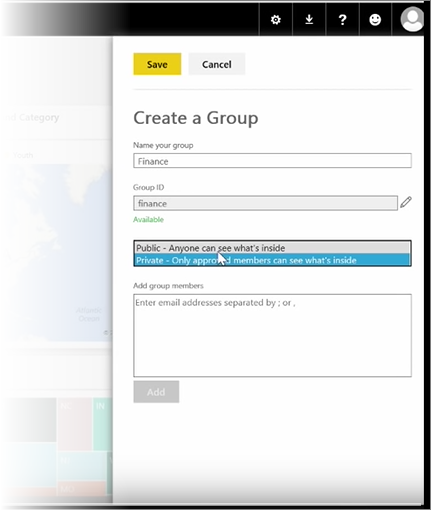
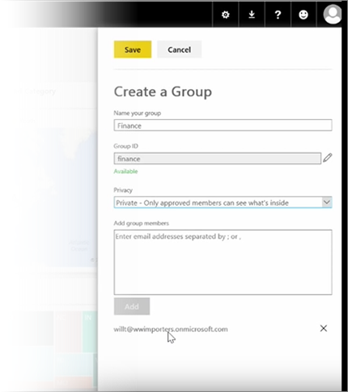

In this lesson, we start by creating a *group*. A **group** defines a set of users who have access to specific dashboards, reports, and data.

Groups in Power BI are based on groups in Office 365, so if you've been using Office 365 groups to manage your group's email, calendar, and documents, you'll see that Power BI offers the same features, and more. When you create a group in Power BI, you're actually creating an Office 365 group.

This module uses the scenario of setting up a new finance group. We'll show how to set up the group, share dashboards, reports, and datasets into the group, and add members who'll have access to the items in the group.

I start here in My Workspace. These are the dashboards, reports, and datasets that I've created or that someone shared with me.

If I expand My Workspace, I can select **Create a group**.

Here I can give it a name. We're using the scenario or a finance group, so I'll call it Finance. Power BI makes sure the name doesn't exist on the domain.

I can set the privacy level by deciding whether anyone in my organization can see the contents of the group, or only its members.

I type email addresses, security groups, and distribution lists here. I select **Add** to make them members of the group, and save the group.

On to the next lesson!

