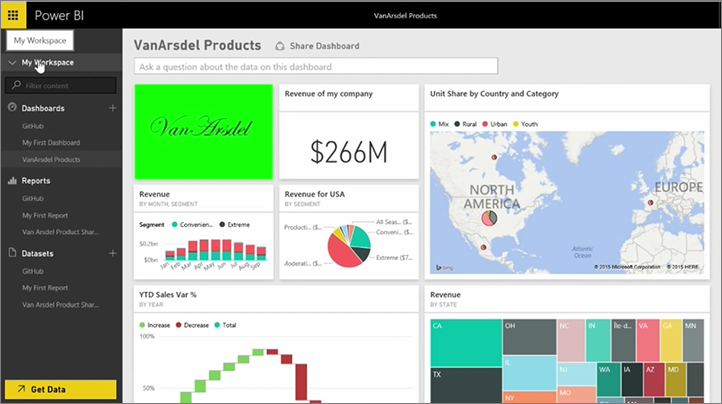
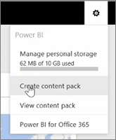
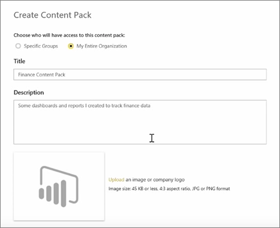
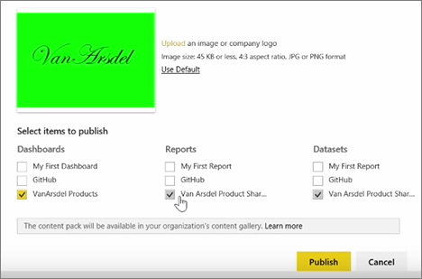

In this lesson, we create a *content pack* with existing artifacts we already have in Power BI, and then share those with colleagues. 

In **My Workspace** I have a dashboard, the report underneath, and the dataset. I want to share them as a package with people in my organization, so they can reuse them.

When I select the **Settings** icon (the gear in the top-right of the service), I can see how much storage I've used, and I can create a content pack.

In the dialog that appears, I can choose whether to distribute it to specific people or groups, and also give it a title. It's also a good idea to provide a detailed description in the **Description** box, to people browsing for a content pack to know what it contains or what it provides.

On the bottom of the dialog, I have an opportunity to upload an image for the content pack, and then the most important step: I select the dashboard I want to include in the content pack, and when I do so, Power BI automatically selects the report and dataset that are used in the dashboard. I cannot unselect the report or dataset, because the dashboard I want to include in the content pack requires them.

I could also select other dashboards, reports, and datasets, but I won't now.

When I publish, the content pack is added to the organization's content gallery.

On to the next lesson!

