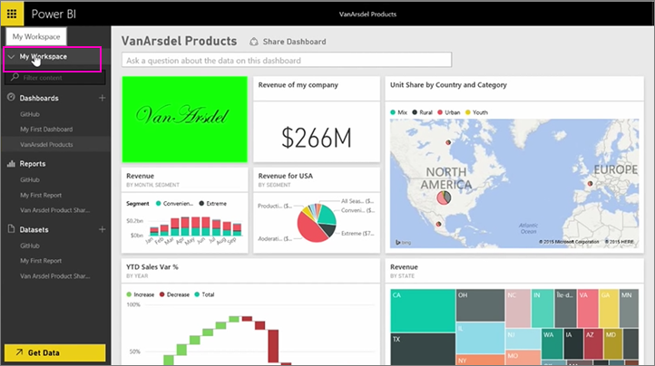
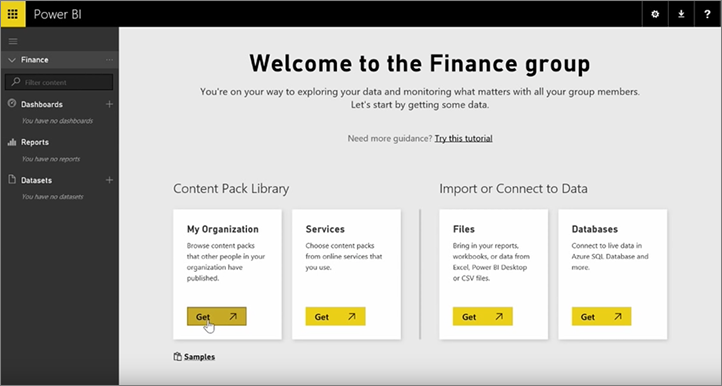
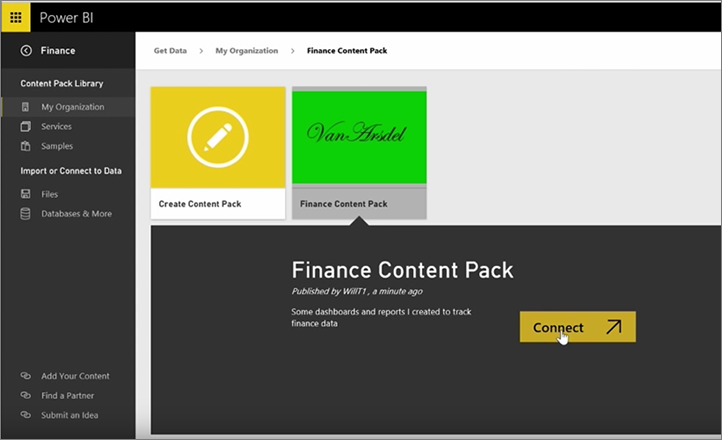
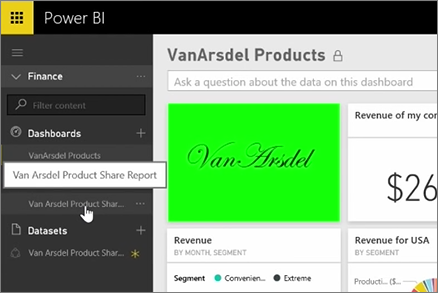
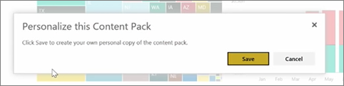
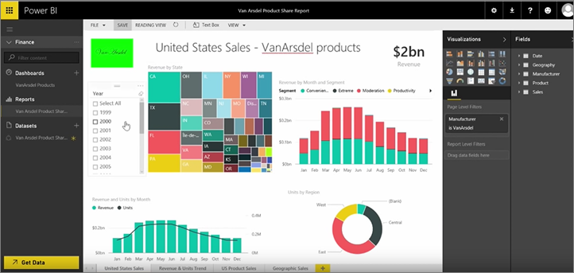

In previous lessons, we already created a content pack and a group. In this lesson, we're going to create an instance of the content pack for everyone in the group.

I start in My Workspace, ...

... and switch back to the Finance group I created in the earlier lesson.

The group doesn't have any dashboards, reports, or datasets yet. I'm going to use the content pack I created. I browse content packs from my organization rather than those from third-party services.

I find the content pack I created a minute ago. I see why it's important to give it a good title, description, and image, so people can find it. I connect to it.

Power BI imports the dashboards, reports, and datasets that are in the content pack.

When I select the dataset, Power BI asks if I want to personalize the content pack.

I'm creating a copy of the content pack that I can make changes to, and disconnecting it from the published version of the content pack. If the content pack creator makes changes to the published version, I won't automatically get those updates.

But I can edit the dashboard, the report, and even the dataset, if I want.

So content packs are a simple way to reuse content created by other people in your organization.

On to the next lesson!

