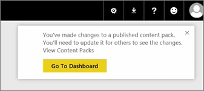
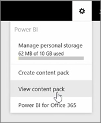
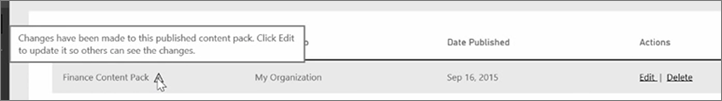

In this lesson, we're going to edit the original content pack we created previously, and see how that updates the other people who've connected to it.

I'm back in My Workspace, editing my original dashboard.

Anytime I make any change to the dashboard, I get this reminder that I've changed something that I've shared with others in a content pack, and prompting me to update the shared version.

I go back to the settings icon and select **View content pack** to see the content packs I've already published.

I see the content pack I made. This little icon tells me I've changed something in the content pack, and I need to edit the content pack so others can see my changes.

When I select **Edit**, I'm back at the screen where I can edit the title and description, but this time it has an **Update** button, so I select that.

Power BI takes those changes and publishes the updated content pack to the content pack gallery.

Anybody who has connected to my content pack gets a message that the content pack has changed, and asks if they want to accept the changes or keep the older version.

So as the content pack owner, you can manage the versions that your colleagues are using.

