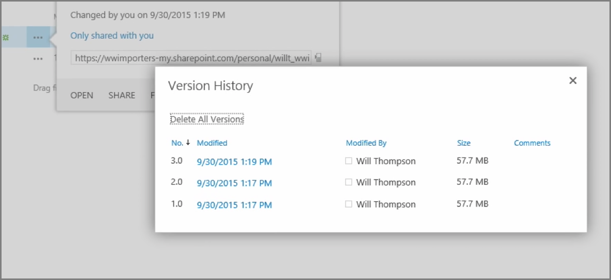
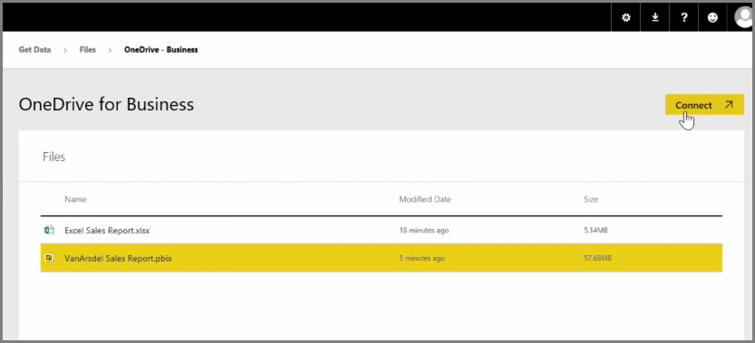
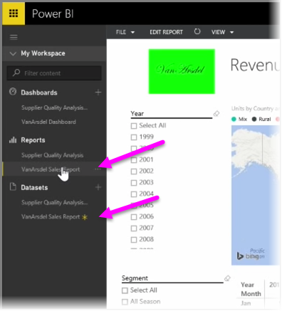

In an earlier article we reviewed creating groups to help your organization manage and collaborate on content that's in Power BI. You can also use your Power BI / Office365 groups to collaborate and share by using **OneDrive for Business**.

Using OneDrive for Business as a source for your Power BI content gives you access to a number of helpful tools, such as version history. You can also share your files with an Office365 group from within OneDrive for Business to give access and allow many people to work on the same Power BI or Excel files.

To connect to a PBIX (Power BI Desktop) file on OneDrive for Business, sign in to the Power BI service and select **Get Data**. Choose **Files** under Import or Connect to Data, and then select **OneDrive - Business**. Highlight the desired file, and select **Connect**.

Your content appears in the left-hand side navigation bar.

Now, any changes made to the file on **OneDrive for Business** will be automatically reflected in the Power BI environment as well, and recorded in the version history.

