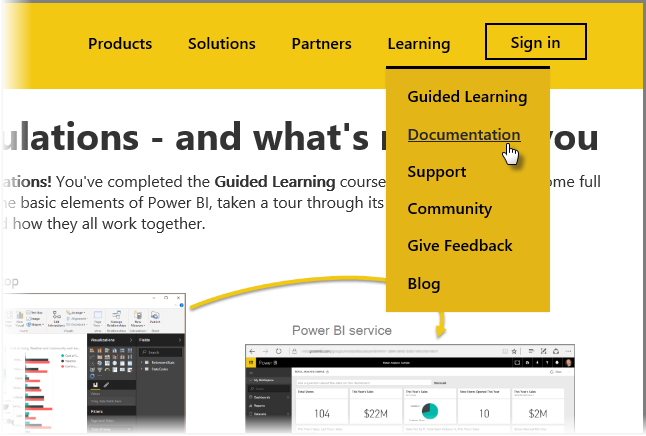

You did it! **Congratulations!** You've completed the **Guided Learning** course for Power BI. You've come full circle from learning the basic elements of Power BI, taken a tour through its software features and elements, and learned how they all work together.

This is the last section (and the final topic, unless you want to learn DAX) in the course, so if you went through all of these sections in order, take a moment to pat yourself on the back. Good job! You're now well versed in all these **important concepts**:

* What [Power BI is](../gettingstarted.yml?tutorial-step=1)
* The [building blocks](../gettingstarted.yml?tutorial-step=3) of Power BI
* [Getting](../gettingdata.yml?tutorial-step=3) and [modeling](../modeling.yml?tutorial-step=1) data
* [Visualizations](../visualizations.yml?tutorial-step=1)
* [Exploring data](../exploringdata.yml?tutorial-step=1) in the Power BI service
* Using [Excel and Power BI](../powerbiandexcel.yml?tutorial-step=1) together
* And [publishing and sharing](../publishingandsharing.yml?tutorial-step=1) your work

That's a lot of knowledge, and now that you have all this in your head, you're ready to go put it to use! Here are some **links to downloads** or to get your browser **connected to the Power BI service**:

* You can always [get the latest Power BI Desktop](https://powerbi.microsoft.com/desktop)
* Heading to the [Power BI service](https://powerbi.microsoft.com/) is easy
* Getting [mobile apps for Power BI](https://powerbi.microsoft.com/mobile/) is a tap away

There's more **help and reference** content available, too. Just go to the top of this page, and select **Learning > Documentation** to see our extensive set of Power BI reference content.

We hope you've enjoyed your journey through this **Power BI Guided Learning** experience. Best of luck to you, and may your Power BI visuals always be immersive and compelling.

## One more section for DAX users
Still want more? Interested in using **DAX (Data Analysis Expressions)** to create, filter, or use custom columns and tables in Power BI? There's one more section targeted at people inclined to do some code work in Power BI, and it's called **Introduction to DAX**. Take a look if you're interested - it uses the same friendly approach as the rest of Guided Learning.

