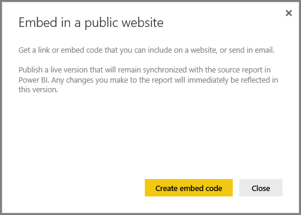
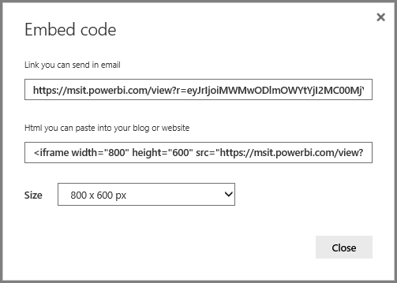
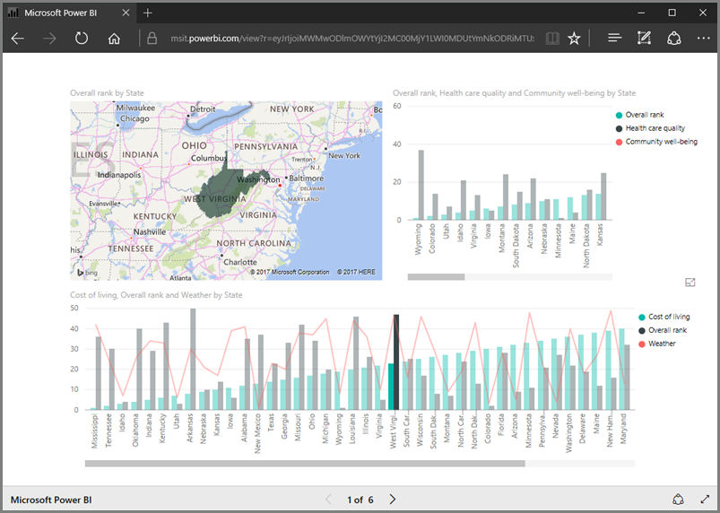
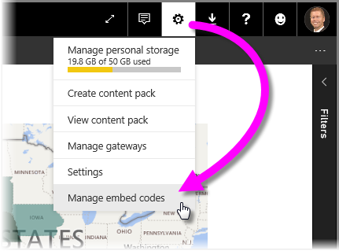
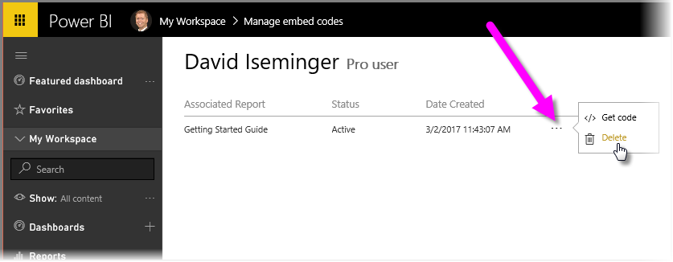

In this lesson, we learn how to share a Power BI report on a web page, or share it through email, in just a few simple steps. This feature of Power BI is often referred to as **Publish to web**, and it's easy to use and to manage.

In Power BI, select the report you want to share, so it's displayed on the canvas. Then from the menu, select **File > Publish to web**.

From there, you see a dialog that explains you'll get an *embed code* that lets you include the report on a website or in mail.

When you select **Create embed code**, Power BI presents another dialog, telling you again that you're about to share your data with everyone on the Internet. Make sure that's okay!

Power BI presents a dialog with two links:

* A link you can share in email, which show the report as a web page
* HTML code (a link plus within an iframe) so you can embed the report directly into a web page

For the HTML link, you can choose from predefined sizes for the embedded report, or you can modify the iframe code yourself and customize its size.

You can simply paste the email link into a browser, and see your report as a web. You can interact with that web page just as you would if you were viewing the report in Power BI. The following images shows a **Publish to web** page, when its link was copied directly from that dialog into a browser:

You can also embed that iframe link into a blog post or website, or into Sway, too.

Want to delete an embed code you created? No problem. In Power BI, select the **gear** icon in the upper right corner, then select **Manage embed codes**.

The Power BI workspace shows the embed codes you've created (in the image below, there's just one). When you click the ellipses, you can then select to get the code for the embed code, or delete the embed code entirely.

And that's all there is to publishing your Power BI report to the web, and sharing it with the world. It's easy!

