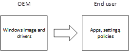
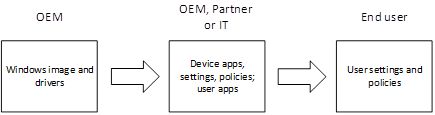
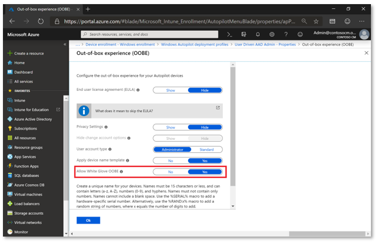
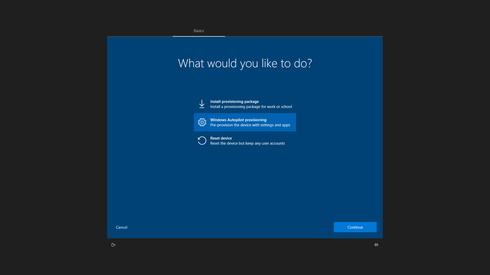
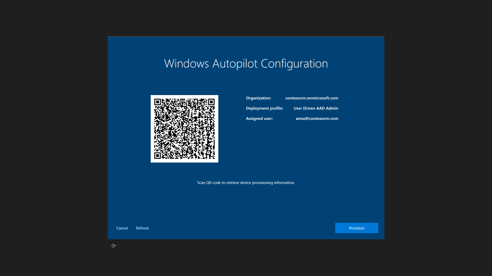
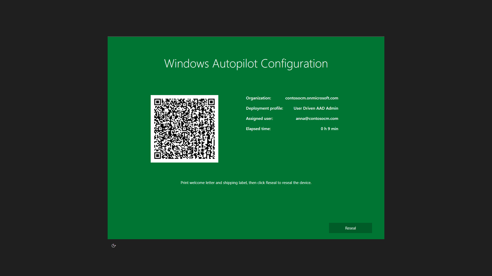

# Windows Autopilot for white glove deployment

**Applies to: Windows 10, version 1903** 

Windows Autopilot enables organizations to easily provision new devices - leveraging the preinstalled OEM image and drivers with a simple process that can be performed by the end user to help get their device business-ready.

 

Windows Autopilot can also provide a <I>white glove</I> service that enables partners or IT staff to pre-provision a Windows 10 PC so that it is fully configured and business-ready. From the end user’s perspective, the Windows Autopilot user-driven experience is unchanged, but getting their device to a fully provisioned state is faster.

With **Windows Autopilot for white glove deployment**, the provisioning process is split. The time-consuming portions are performed by IT, partners, or OEMs. The end user simply completes a few necessary settings and polices and then they can begin using their device.

 

Enabled with Microsoft Intune in Windows 10, version 1903 and later, white glove deployment capabilities build on top of existing Windows Autopilot [user-driven scenarios](user-driven.md), supporting both the user-driven [Azure AD join](user-driven-aad.md) and [Hybrid Azure AD](user-driven-hybrid.md) join scenarios.

## Prerequisites

In addition to [Windows Autopilot requirements](windows-autopilot-requirements.md), Windows Autopilot for white glove deployment adds the following:

- Windows 10, version 1903 or later is required.
- An Intune subscription.
- Physical devices that support TPM 2.0 and device attestation; virtual machines are not supported.  The white glove provisioning process leverages Windows Autopilot self-deploying capabilities, hence the TPM 2.0 requirements.
- Physical devices with Ethernet connectivity; Wi-fi connectivity is not supported due to the requirement to choose a language, locale, and keyboard to make that Wi-fi connection; doing that in a pre-provisioning process could prevent the user from choosing their own language, locale, and keyboard when they receive the device.

>[!IMPORTANT]
>Because the OEM or vendor performs the white glove process, this <u>doesn’t require access to an end-user's on-prem domain infrastructure</u>. This is unlike a typical hybrid Azure AD-joined scenario because rebooting the device is postponed. The device is resealed prior to the time when connectivity to a domain controller is expected, and the domain network is contacted when the device is unboxed on-prem by the end-user.

## Preparation

Devices slated for white glove provisioning are registered for Autopilot via the normal registration process. 

To be ready to try out Windows Autopilot for white glove deployment, ensure that you can first successfully use existing Windows Autopilot user-driven scenarios:

- User-driven Azure AD join.  Devices can be deployed using Windows Autopilot and joined to an Azure Active Directory tenant.
- User-driven with Hybrid Azure AD join.  Devices can be deployed using Windows Autopilot and joined to an on-premises Active Directory domain, then registered with Azure Active Directory to enable the Hybrid Azure AD join features.

If these scenarios cannot be completed, Windows Autopilot for white glove deployment will also not succeed since it builds on top of these scenarios.

To enable white glove deployment, an additional Autopilot profile setting must be configured by the customer or IT Admin via their Intune account, prior to beginning the white glove process in the provisioning service facility:

 

The Windows Autopilot for white glove deployment pre-provisioning process will apply all device-targeted policies from Intune.  That includes certificates, security templates, settings, apps, and more – anything targeting the device.  Additionally, any apps (Win32 or LOB) that are configured to install in the device context and targeted to the user that has been pre-assigned to the Autopilot device will also be installed.  

>[!NOTE]
>Other user-targeted policies will not apply until the user signs into the device.  To verify these behaviors, be sure to create appropriate apps and policies targeted to devices and users.

## Scenarios

Windows Autopilot for white glove deployment supports two distinct scenarios:
- User-driven deployments with Azure AD Join.  The device will be joined to an Azure AD tenant.
- User-driven deployments with Hybrid Azure AD Join.  The device will be joined to an on-premises Active Directory domain, and separately registered with Azure AD.
Each of these scenarios consists of two parts, a technician flow and a user flow.  At a high level, these parts are the same for Azure AD Join and Hybrid Azure AD join; differences are primarily seen by the end user in the authentication steps.

### Technican flow

After the customer or IT Admin has targeted all the apps and settings they want for their devices through Intune, the white glove technician can begin the white glove process.  The technician could be a member of the IT staff, a services partner, or an OEM – each organization can decide who should perform these activities. Regardless of the scenario, the process to be performed by the technician is the same:
- Boot the device (running Windows 10 Pro, Enterprise, or Education SKUs, version 1903 or later).
- From the first OOBE screen (which could be a language selection or locale selection screen), do not click **Next**.  Instead, press the Windows key five times to view an additional options dialog.  From that screen, choose the **Windows Autopilot provisioning** option and then click **Continue**.

  

- On the **Windows Autopilot Configuration** screen, information will be displayed about the device:
    - The Autopilot profile assigned to the device.
    - The organization name for the device.
    - The user assigned to the device (if there is one).
    - A QR code containing a unique identifier for the device, useful to look up the device in Intune to make any configuration changes needed (e.g. assigning a user, adding the device to any additional groups needed for app or policy targeting).
    - **Note**: The QR codes can be scanned using a companion app, which will also configure the device to specify who it belongs to.  An [open-source sample of the companion app](https://github.com/Microsoft/WindowsAutopilotCompanion) that integrates with Intune via the Graph API has been published to GitHub by the Autopilot team.
- Validate the information displayed.  If any changes are needed, make these and then click **Refresh** to re-download the updated Autopilot profile details.

  

- Click **Provision** to begin the provisioning process.

If the pre-provisioning process completes successfully:
- A green status screen will be displayed with information about the device, including the same details presented previously (e.g. Autopilot profile, organization name, assigned user, QR code), as well as the elapsed time for the pre-provisioning steps.
 
- Click **Reseal** to shut the device down.  At that point, the device can be shipped to the end user.

If the pre-provisioning process fails:
- A red status screen will be displayed with information about the device, including the same details presented previously (e.g. Autopilot profile, organization name, assigned user, QR code), as well as the elapsed time for the pre-provisioning steps.
- Diagnostic logs can be gathered from the device, and then it can be reset to start the process over again.

### User flow

If the pre-provisioning process completed successfully and the device was resealed, it can be delivered to the end user to complete the normal Windows Autopilot user-driven process.  They will perform a standard set of steps:

- Power on the device.
- Select the appropriate language, locale, and keyboard layout.
- Connect to a network (if using Wi-Fi).  If using Hybrid Azure AD Join, there must be connectivity to a domain controller; if using Azure AD Join, internet connectivity is required.
- On the branded sign-on screen, enter the user’s Azure Active Directory credentials.
- If using Hybrid Azure AD Join, the device will reboot; after the reboot, enter the user’s Active Directory credentials.
- Additional policies and apps will be delivered to the device, as tracked by the Enrollment Status Page (ESP).  Once complete, the user will be able to access the desktop.

## Related topics

[White glove video](https://youtu.be/nE5XSOBV0rI)
