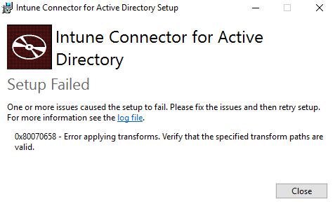

# Windows Autopilot requirements

**Applies to: Windows 10**

Windows Autopilot depends on specific capabilities available in Windows 10, Azure Active Directory, and MDM services such as Microsoft Intune.  In order to use Windows Autopilot and leverage these capabilities, some requirements must be met.

- Windows 10 version 1703 (semi-annual channel) or higher is required. 
- The following editions are supported:
    -   Windows 10 Pro
    -   Windows 10 Pro Education
    -   Windows 10 Pro for Workstations
    -   Windows 10 Enterprise
    -   Windows 10 Education
    -   Windows 10 Enterprise 2019 LTSC
    
 - If you're using Autopilot for Surface devices, note that only the following Surface devices support Autopilot:
    - Surface Go
    - Surface Go with LTE Advanced
    - Surface Pro (5th gen) 
    - Surface Pro with LTE Advanced (5th gen) 
    - Surface Pro 6
    - Surface Laptop (1st gen)
    - Surface Laptop 2
    - Surface Studio (1st gen)
    - Surface Studio 2
    - Surface Book 2

## Networking requirements

Windows Autopilot depends on a variety of internet-based services; access to these services must be provided for Autopilot to function properly. In the simplest case, enabling proper functionality can be achieved by ensuring the following:

-   Ensure DNS name resolution for internet DNS names
-   Allow access to all hosts via port 80 (HTTP), 443 (HTTPS), and 123 (UDP/NTP)

In environments that have more restrictive internet access, or for those that require authentication before internet access can be obtained, additional configuration may be required to whitelist access to the needed services. For additional details about each of these services and their specific requirements, review the following details:

-   **Windows Autopilot Deployment Service (and Windows Activation).**  After a network connection is in place, each Windows 10 device will contact the Windows Autopilot Deployment Service.  With Windows 10 builds 18204 and above, the following URLs are used:

    -   https://ztd.dds.microsoft.com
    -   https://cs.dds.microsoft.com
    
    For all supported Windows 10 releases, Windows Autopilot also uses Windows Activation services. See the following link for details:

    -   <https://support.microsoft.com/help/921471/windows-activation-or-validation-fails-with-error-code-0x8004fe33>

-   **Azure Active Directory.**  User credentials are validated by Azure Active Directory, then the device may also be joined to Azure Active Directory. See the following link for more information:

    -   <https://support.office.com/en-us/article/Office-365-URLs-and-IP-address-ranges-8548a211-3fe7-47cb-abb1-355ea5aa88a2>

-   **Intune.**  Once authenticated, Azure Active Directory will trigger the enrollment of the device into the Intune MDM service. See the following link for details:

    -   <https://docs.microsoft.com/intune/network-bandwidth-use> (Network communication requirements section)

-   **Windows Update.**  During the OOBE process, as well as after the Windows 10 OS is fully configured, the Windows Update service is leveraged to retrieve needed updates.

    -   <https://support.microsoft.com/help/818018/how-to-solve-connection-problems-concerning-windows-update-or-microsof>

    -   NOTE:  If Windows Update is inaccessible, the AutoPilot process will still continue.

-   **Delivery Optimization.**  When downloading Windows Updates, Microsoft Store apps and app updates, Office Updates and Intune Win32 Apps, the Delivery Optimization service is contacted to enable peer-to-peer sharing of content so that only a few devices need to download it from the internet.

    -   <https://docs.microsoft.com/windows/deployment/update/waas-delivery-optimization>

    -   NOTE: If Delivery Optimization Service is inaccessible, the AutoPilot process will still continue with Delivery Optimization downloads from the cloud (without peer-to-peer).

-   **Network Time Protocol (NTP) Sync.**  When a Windows device starts up, it will talk to a network time server to ensure that the time on the device is accurate.

    -   Ensure that UDP port 123 to time.windows.com is accessible.

-   **Domain Name Services (DNS).**  To resolve DNS names for all services, the device communicates with a DNS server, typically provided via DHCP.  This DNS server must be able to resolve internet names.

-   **Diagnostics data.**  To enable Windows Analytics and related diagnostics capabilities, see the following documentation:

    -   <https://docs.microsoft.com/windows/configuration/configure-windows-diagnostic-data-in-your-organization>

    -   NOTE: If diagnostic data cannot be sent, the Autopilot process will still continue.

-   **Network Connection Status Indicator (NCSI).**  Windows must be able to tell that the device is able to access the internet.

    -   <https://docs.microsoft.com/windows/configuration/manage-windows-endpoints-version-1709> (Network Connection Status Indicator section, [www.msftconnecttest.com](http://www.msftconnecttest.com) must be resolvable via DNS and accessible via HTTP)

-   **Windows Notification Services (WNS).**  This service is used to enable Windows to receive notifications from apps and services.

    -   <https://docs.microsoft.com/windows/configuration/manage-windows-endpoints-version-1709> (Microsoft store section)

    -   NOTE: If the WNS services are not available, the Autopilot process will still continue.

-   **Microsoft Store, Microsoft Store for Business.**  Apps in the Microsoft Store can be pushed to the device, triggered via Intune (MDM).  App updates and additional apps may also be needed when the user first logs in.

    -   <https://docs.microsoft.com/microsoft-store/prerequisites-microsoft-store-for-business> (also includes Azure AD and Windows Notification Services)

    -   NOTE: If the Microsoft Store is not accessible, the AutoPilot process will still continue.

-   **Office 365.**  As part of the Intune device configuration, installation of Office 365 ProPlus may be required.

    -   <https://support.office.com/en-us/article/Office-365-URLs-and-IP-address-ranges-8548a211-3fe7-47cb-abb1-355ea5aa88a2> (includes all Office services, DNS names, IP addresses; includes Azure AD and other services that may overlap with those listed above)

-   **Certificate revocation lists (CRLs).**  Some of these services will also need to check certificate revocation lists (CRLs) for certificates used in the services.  A full list of these is documented in the Office documentation at <https://support.office.com/en-us/article/Office-365-URLs-and-IP-address-ranges-8548a211-3fe7-47cb-abb1-355ea5aa88a2#bkmk_crl> and <https://aka.ms/o365chains>.

## Licensing requirements

Windows Autopilot depends on specific capabilities available in Windows 10 and Azure Active Directory; it also requires an MDM service such as Microsoft Intune. These capabilities can be obtained through various editions and subscription programs:

-   To provide needed Azure Active Directory (automatic MDM enrollment and company branding features) and MDM functionality, one of the following is required:
    -   [Microsoft 365 Business subscriptions](https://www.microsoft.com/en-us/microsoft-365/business)
    -   [Microsoft 365 F1 subscriptions](https://www.microsoft.com/en-us/microsoft-365/enterprise/firstline)
    -   [Microsoft 365 Academic A1, A3, or A5 subscriptions](https://www.microsoft.com/en-us/education/buy-license/microsoft365/default.aspx)
    -   [Microsoft 365 Enterprise E3 or E5 subscriptions](https://www.microsoft.com/en-us/microsoft-365/enterprise), which include all Windows 10, Office 365, and EM+S features (Azure AD and Intune)
    -   [Enterprise Mobility + Security E3 or E5 subscriptions](https://www.microsoft.com/en-us/cloud-platform/enterprise-mobility-security), which include all needed Azure AD and Intune features
    -   [Intune for Education subscriptions](https://docs.microsoft.com/en-us/intune-education/what-is-intune-for-education), which include all needed Azure AD and Intune features
    -   [Azure Active Directory Premium P1 or P2](https://azure.microsoft.com/en-us/services/active-directory/) and [Microsoft Intune subscriptions](https://www.microsoft.com/en-us/cloud-platform/microsoft-intune) (or an alternative MDM service)

Additionally, the following are also recommended (but not required):
-   [Office 365 ProPlus](https://www.microsoft.com/en-us/p/office-365-proplus/CFQ7TTC0K8R0), which can be deployed easily via Intune (or other MDM services)
-   [Windows Subscription Activation](https://docs.microsoft.com/windows/deployment/windows-10-enterprise-subscription-activation), to automatically step up devices from Windows 10 Pro to Windows 10 Enterprise

## Configuration requirements

Before Windows Autopilot can be used, some configuration tasks are required to support the common Autopilot scenarios.  

-   Configure Azure Active Directory automatic enrollment.  For Microsoft Intune, see [Enable Windows 10 automatic enrollment](https://docs.microsoft.com/intune/windows-enroll#enable-windows-10-automatic-enrollment) for details.  If using a different MDM service, contact the vendor for the specific URLs or configuration needed for those services.
-   Configure Azure Active Directory custom branding.  In order to display an organization-specific logon page during the Autopilot process, Azure Active Directory needs to be configured with the images and text that should be displayed.  See [Quickstart: Add company branding to your sign-in page in Azure AD](https://docs.microsoft.com/azure/active-directory/fundamentals/customize-branding) for more details.  Note that the "square logo" and "sign-in page text" are the key elements for Autopilot, as well as the Azure Active Directory tenant name (configured separately in the Azure AD tenant properties).
-   Enable [Windows Subscription Activation](https://docs.microsoft.com/windows/deployment/windows-10-enterprise-subscription-activation) if desired, in order to automatically step up from Windows 10 Pro to Windows 10 Enterprise.

Specific scenarios will then have additional requirements.  Generally, there are two specific tasks:

-   Device registration.  Devices need to be added to Windows Autopilot to support most Windows Autopilot scenarios.  See [Adding devices to Windows Autopilot](add-devices.md) for more details.
-   Profile configuration.  Once devices have been added to Windows Autopilot, a profile of settings needs to be applied to each device.  See [Configure Autopilot profiles](profiles.md) for details.  Note that Microsoft Intune can automate this profile assignment; see [Create an AutoPilot device group](https://docs.microsoft.com/intune/enrollment-autopilot#create-an-autopilot-device-group) and [Assign an AutoPilot deployment profile to a device group](https://docs.microsoft.com/intune/enrollment-autopilot#assign-an-autopilot-deployment-profile-to-a-device-group) for more information.

See [Windows Autopilot Scenarios](windows-autopilot-scenarios.md) for additional details.

For a walkthrough for some of these and related steps, see this video:
 
<iframe width="560" height="315" src="https://www.youtube-nocookie.com/embed/KYVptkpsOqs" frameborder="0" allow="autoplay; encrypted-media" allowfullscreen></iframe> 

- For details about specific configuration requirements to enable user-driven Hybrid Azure Active Directory join for Windows Autopilot, see [Intune Connector (preview) language requirements](intune-connector.md). This requirement is a temporary workaround, and will be removed in the next release of Intune Connector. 

There are no additional hardware requirements to use Windows 10 Autopilot, beyond the [requirements to run Windows 10](https://www.microsoft.com/windows/windows-10-specifications).

## Intune Connector (preview) language requirements

**Applies to: Windows 10**

Microsoft has released a [preview for Intune connector for Active Directory](https://docs.microsoft.com/intune/windows-autopilot-hybrid) that enables user-driven [Hybrid Azure Active Directory join](user-driven-hybrid.md) for Windows Autopilot.

In this preview version of the Intune Connector, you might receive an error message indicating a setup failure with the following error code and message:

**0x80070658 - Error applying transforms. Verify that the specified transform paths are valid.**

An [example](#example) of the error message is displayed at the bottom of this topic. 

This error can be resolved by ensuring that the member server where Intune Connector is running has one of the following language packs installed and configured to be the default keyboard layout:

|  |  |  |  |  |  |  |  |  |  |  | 
| --- | --- | --- | --- | --- | --- | --- | --- | --- | --- | --- |
| en-US | cs-CZ | da-DK | de-DE | el-GR | es-ES | fi-FI | fr-FR | hu-HU | it-IT | ja-JP |
| ko-KR | nb-NO | nl-NL | pl-PL | pt-BR | ro-RO | ru-RU | sv-SE | tr-TR | zh-CN | zh-TW |

>[!NOTE]
>After installing the Intune Connector, you can restore the keyboard layout to its previous settings. 
>This solution is a workaround and will be fully resolved in a future release of the Intune Connector.

To change the default keyboard layout:

1. Click **Settings > Time & language > Region and language** 
2. Select one of the languages listed above and choose **Set as default**.

If the language you need isn't listed, you can add additional languages by selecting **Add a language**.

### Example

The following is an example of the error message that can be displayed if one of the listed languages is not used during setup:

## Related topics

[Configure Autopilot deployment](configure-autopilot.md)
