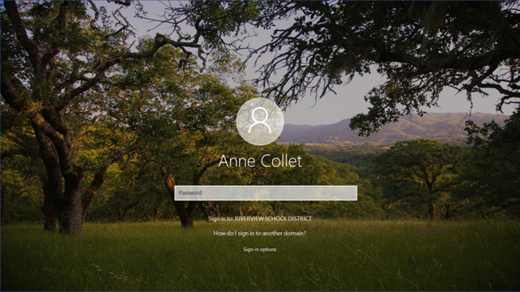
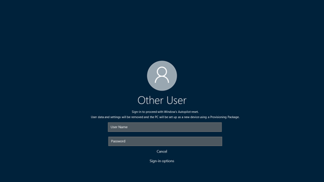

# Reset devices with local Windows Autopilot Reset 

**Applies to: Windows 10, version 1709 and above

The Intune Service Administrator role is required to perform this task.  Learn more about how to [Assign Azure Active Directory roles](https://docs.microsoft.com/azure/active-directory/fundamentals/active-directory-users-assign-role-azure-portal).

IT admins can perform a local Windows Autopilot Reset to quickly remove personal files, apps, and settings, and reset Windows 10 devices from the lock screen any time and apply original settings and management enrollment (Azure Active Directory and device management) so the devices are ready to use. With a local Autopilot Reset, devices are returned to a fully configured or known IT-approved state.

To enable local Autopilot Reset in Windows 10:

1. [Enable the policy for the feature](#enable-local-windows-autopilot-reset)
2. [Trigger a reset for each device](#trigger-local-windows-autopilot-reset)

## Enable local Windows Autopilot Reset

To enable a local Windows Autopilot Reset, the **DisableAutomaticReDeploymentCredentials** policy must be configured. This policy is documented in the [Policy CSP](https://docs.microsoft.com/windows/client-management/mdm/policy-csp-credentialproviders), **CredentialProviders/DisableAutomaticReDeploymentCredentials**. By default, local Windows Autopilot is disabled. This ensures that a local Autopilot Reset is not triggered by accident.

You can set the policy using one of these methods:

- MDM provider

    - When using Intune, you can create a new device configuration profile, specifying "Windows 10 or later" for the platform, "Device restrictions" for the profile type, and "General" for the settings category.  The **Automatic Redeployment** setting should be set to **Allow**.  Deploy this setting to all devices where a local reset should be permitted.
    - If you're using an MDM provider other than Intune, check your MDM provider documentation on how to set this policy. 

- Windows Configuration Designer

    You can [use Windows Configuration Designer](https://docs.microsoft.com/windows/configuration/provisioning-packages/provisioning-create-package) to set the **Runtime settings > Policies > CredentialProviders > DisableAutomaticReDeploymentCredentials** setting to 0 and then create a provisioning package.

- Set up School PCs app

    The latest release of the Set up School PCs app supports enabling local Windows Autopilot Reset.

## Trigger local Windows Autopilot Reset

Performing a local Windows Autopilot Reset is a two-step process: trigger it and then authenticate. Once you've done these two steps, you can let the process execute and once it is done, the device is again ready for use. 

**To trigger a local Autopilot Reset**

1. From the Windows device lock screen, enter the keystroke: **CTRL +  + R**. 

    

    This will open up a custom login screen for the local Autopilot Reset. The screen serves two purposes:
    1. Confirm/verify that the end user has the right to trigger Local Autopilot Reset
    2. Notify the user in case a provisioning package, created using Windows Configuration Designer, will be used as part of the process.

    

2. Sign in with the admin account credentials. If you created a provisioning package, plug in the USB drive and trigger the local Autopilot Reset.

    Once the local Autopilot Reset is triggered, the reset process starts. Once provisioning is complete, the device is again ready for use.
