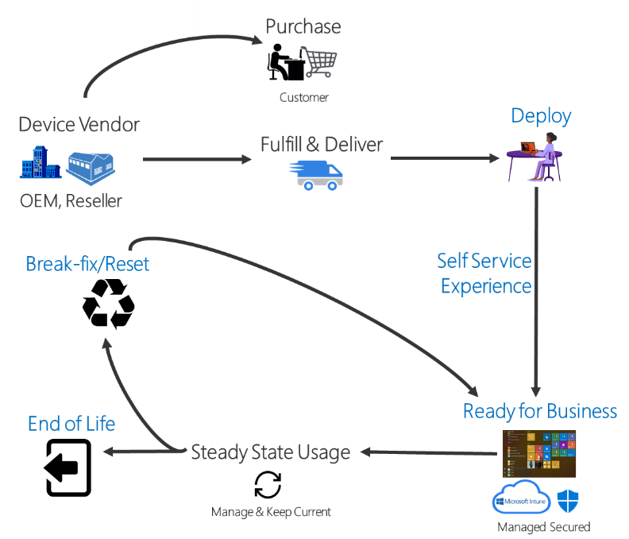

# Overview of Windows Autopilot

**Applies to**

-   Windows 10

Windows Autopilot is a collection of technologies used to set up and pre-configure new devices, getting them ready for productive use. You can also use Windows Autopilot to reset, repurpose and recover devices. 
This solution enables an IT department to achieve the above with little to no infrastructure to manage, with a process that's easy and simple.

Windows Autopilot is designed to simplify all parts of the lifecycle of Windows devices, for both IT and end users, from initial deployment through the eventual end of life. Leveraging cloud-based services, it can reduce the overall costs for deploying, managing, and retiring devices by reducing the amount of time that IT needs to spend on these processes and the amount of infrastructure that they need to maintain, while ensuring ease of use for all types of end users.

When initially deploying new Windows devices, Windows Autopilot leverages the OEM-optimized version of Windows 10 that is preinstalled on the device, saving organizations the effort of having to maintain custom images as well as drivers for every model of device being used. Instead of re-imaging the device, that existing Windows 10 installation can be transformed into a “business-ready” state, applying settings and policies, installing apps, and even changing the edition of Windows 10 being used (e.g. from Windows 10 Pro to Windows 10 Enterprise, to support advanced features).

Once deployed, Windows 10 devices can be managed by tools such as Microsoft Intune, Windows Update for Business, System Center Configuration Manager, and other similar tools. Windows Autopilot can help with device re-purposing scenarios, leveraging Windows Autopilot Reset to quickly prepare a device for a new user, as well as in break/fix scenarios to enable a device to quickly be brought back to a business-ready state.

## Windows Autopilot walkthrough

The following video shows the process of setting up Windows Autopilot:

 

<iframe width="560" height="315" src="https://www.youtube.com/embed/4K4hC5NchbE" frameborder="0" allow="accelerometer; autoplay; encrypted-media; gyroscope; picture-in-picture" allowfullscreen></iframe>

## Benefits of Windows Autopilot

Traditionally, IT pros spend a lot of time building and customizing images that will later be deployed to devices. Windows Autopilot introduces a new approach.

From the user's perspective, it only takes a few simple operations to make their device ready to use.

From the IT pro's perspective, the only interaction required from the end user is to connect to a network and to verify their credentials. Everything past that is automated.

## Requirements

Windows 10 version 1703 or higher is required to use Windows Autopilot. The following editions are supported:
- Pro
- Pro Education
- Pro for Workstations
- Enterprise
- Education

See [Windows Autopilot requirements](windows-autopilot-requirements.md) for detailed information on configuration, network, and licensing requirements.

## Windows Autopilot Scenarios

Windows Autopilot enables you to pre-register devices to your organization so that they will be fully configured with no additional intervention required by the user.

Windows Autopilot enables you to:
* Automatically join devices to Azure Active Directory (Azure AD) or Active Directory (via Hybrid Azure AD Join).  See [Introduction to device management in Azure Active Directory](https://docs.microsoft.com/azure/active-directory/device-management-introduction) for more information about the differences between these two join options.
* Auto-enroll devices into MDM services, such as Microsoft Intune ([*Requires an Azure AD Premium subscription*](windows-autopilot-requirements-configuration.md)).
* Restrict the Administrator account creation.
* Create and auto-assign devices to configuration groups based on a device's profile.
* Customize OOBE content specific to the organization.

See [Windows Autopilot scenarios](https://docs.microsoft.com/en-us/windows/deployment/windows-autopilot/windows-autopilot-scenarios) for more information about scenarios for using Windows Autopilot.

## Related topics

[Enroll Windows devices in Intune by using Windows Autopilot](https://docs.microsoft.com/en-us/intune/enrollment-autopilot)
