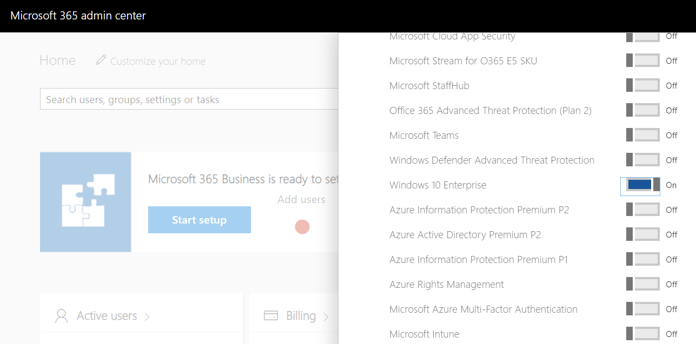
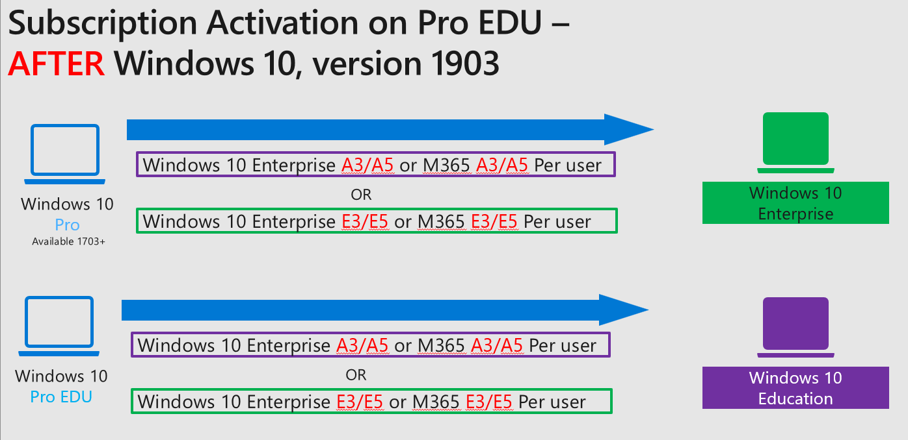

# Windows subscription activation

The subscription activation feature enables you to update from Windows Pro edition to Enterprise or Education editions. You can use this feature if you're subscribed to Windows Enterprise E3 or E5 licenses. Subscription activation also supports updating from Windows Pro Education edition to Education edition.

If you have devices that are licensed for earlier versions of Windows Professional, Microsoft 365 Business Premium provides an upgrade to Windows Pro edition. Windows Pro edition is the prerequisite for deploying [Windows Business](/microsoft-365/business-premium/microsoft-365-business-faqs?view=o365-worldwide#what-is-windows-for-business).

The subscription activation feature eliminates the need to manually deploy Enterprise or Education edition images on each target device, then later:

- Standing up on-premises key management services such as KMS or MAK based activation.
- Entering Generic Volume License Keys (GVLKs).
- Rebooting client devices.

This article covers the following information:

- [Subscription activation](#subscription-activation-for-enterprise): An introduction to subscription activation for Windows Enterprise.
- [Subscription activation for Education](#subscription-activation-for-education): Information about subscription activation for Windows Education.
- [Inherited activation](#inherited-activation): Allow virtual machines to inherit activation state from their Windows client host.
- [The evolution of deployment](#the-evolution-of-deployment): A short history of Windows deployment.
- [Requirements](#requirements): Prerequisites to use the Windows subscription activation model.
- [Benefits](#benefits): Advantages of subscription-based licensing.
- [How it works](#how-it-works): A summary of the subscription-based licensing option.
- [Virtual Desktop Access (VDA)](#virtual-desktop-access-vda): How to enable Windows subscription activation for VMs in the cloud.

For more information on how to deploy Enterprise licenses, see [Deploy Windows Enterprise licenses](deploy-enterprise-licenses.md).

> [!NOTE]
>
> Organizations that use the Subscription Activation feature to enable users to upgrade from one version of Windows to another and use Conditional Access policies to control access need to exclude one of the following cloud apps from their Conditional Access policies using **Select Excluded Cloud Apps**:
>
> - [Universal Store Service APIs and Web Application, AppID 45a330b1-b1ec-4cc1-9161-9f03992aa49f](/troubleshoot/azure/active-directory/verify-first-party-apps-sign-in#application-ids-of-commonly-used-microsoft-applications).
> - [Windows Store for Business, AppID 45a330b1-b1ec-4cc1-9161-9f03992aa49f](/troubleshoot/azure/active-directory/verify-first-party-apps-sign-in#application-ids-of-commonly-used-microsoft-applications).
>
> Although the app ID is the same in both instances, the name of the cloud app will depend on the tenant.
>
> For more information about configuring exclusions in Conditional Access policies, see [Application exclusions](/azure/active-directory/conditional-access/howto-conditional-access-policy-all-users-mfa#application-exclusions).

## Subscription activation for Enterprise

Windows Enterprise E3 and E5 are available as online services via subscription. You can deploy Windows Enterprise in your organization without keys and reboots.

- Devices with a current Windows Pro edition license can be seamlessly upgraded to Windows Enterprise.
- Product key-based Windows Enterprise software licenses can be transitioned to Windows Enterprise subscriptions.

Organizations that have an enterprise agreement can also benefit from the service, using traditional Active Directory-joined devices. In this scenario, the Active Directory user that signs in on their device must be synchronized with Microsoft Entra ID using [Microsoft Entra Connect Sync](/azure/active-directory/hybrid/how-to-connect-sync-whatis).

> [!NOTE]
>
> Subscription activation is available for qualifying devices running currently supported versions of Windows. You can't use subscription activation to upgrade to a newer version of Windows.

## Subscription activation for Education

Subscription activation for Education works the same as the Enterprise edition. However, in order to use subscription activation for Education, you must have a device running Windows Pro Education and an active subscription plan with an Enterprise license. For more information, see the [requirements](#windows-education-requirements) section.

## Inherited activation

Inherited activation allows Windows virtual machines to inherit activation state from their Windows client host. When a user with a Windows E3/E5 or A3/A5 license assigned creates a new Windows virtual machine (VM) using a Windows host, the VM inherits the activation state from a host machine. This behavior is independent of whether the user signs on with a local account or uses a Microsoft Entra account on a VM.

To support inherited activation, both the host computer and the VM must be running a currently supported version of Windows. The hypervisor platform must also be Windows Hyper-V.

## The evolution of deployment

The following list illustrates the evolution of deploying Windows client with each release:

- **Windows 7** required you to redeploy the operating system using a full wipe-and-load process if you wanted to change from Windows 7 Professional to Windows 10 Enterprise.

- **Windows 8.1** added support for a Windows 8.1 Pro to Windows 8.1 Enterprise in-place upgrade. This process was considered a "repair upgrade", because the OS version was the same before and after. This upgrade was a lot easier than wipe-and-load, but it was still time-consuming.

- **Windows 10, version 1507** added the ability to install a new product key using a provisioning package or using MDM to change the SKU. This process required a reboot, which would install the new OS components, and took several minutes to complete. However, it was a lot quicker than in-place upgrade.

- **Windows 10, version 1607** made a large leap forward. You could just change the product key and the edition instantly changed from Windows 10 Pro to Windows 10 Enterprise. In addition to provisioning packages and MDM, you can inject a key using slmgr.vbs, which injects the key into WMI. It became trivial to do this process using a command line.

- **Windows 10, version 1703** made this update from Windows 10 Pro to Windows 10 Enterprise automatic for devices that subscribed to Windows 10 Enterprise E3 or E5 via the CSP program.

- **Windows 10, version 1709** added support for Windows 10 subscription activation, similar to the CSP support but for large enterprises. This feature enabled the use of Microsoft Entra ID for assigning licenses to users. When users sign in to a device joined to Active Directory or Microsoft Entra ID, it automatically steps up from Windows 10 Pro to Windows 10 Enterprise.

- **Windows 10, version 1803** updated Windows 10 subscription activation to enable pulling activation keys directly from firmware for devices that support firmware-embedded keys. It was no longer necessary to run a script to activate Windows 10 Pro before activating Enterprise. For virtual machines and hosts running Windows 10, version 1803, [inherited activation](#inherited-activation) was also enabled.

- **Windows 10, version 1903** updated Windows 10 subscription activation to enable update from Windows 10 Pro Education to Windows 10 Education for devices with a qualifying Windows 10 or Microsoft 365 subscription.

- **Windows 11, version 21H2** updated subscription activation to work on both Windows 10 and Windows 11 devices.

    > [!IMPORTANT]
    >
    > Subscription activation doesn't update a device to a newer version of Windows. Only the edition is updated.

## Requirements

### Windows Enterprise requirements

> [!NOTE]
>
> The following requirements don't apply to general Windows client activation on Azure. Azure activation requires a connection to Azure KMS only. It supports workgroup, hybrid, and Microsoft Entra joined VMs. In most scenarios, activation of Azure VMs happens automatically. For more information, see [Understanding Azure KMS endpoints for Windows product activation of Azure virtual machines](/troubleshoot/azure/virtual-machines/troubleshoot-activation-problems).

> [!IMPORTANT]
>
> As of October 1, 2022, subscription activation is available for *commercial* and *GCC* tenants. It's currently not available on GCC High or DoD tenants.<!-- 6783128 --> For more information, see [Enable subscription activation with an existing EA](deploy-enterprise-licenses.md#enable-subscription-activation-with-an-existing-ea).

For Microsoft customers with Enterprise Agreements (EA) or Microsoft Products & Services Agreements (MPSA), you must have the following requirements:

- A supported version of Windows Pro or Enterprise edition installed on the devices to be upgraded.
- Microsoft Entra available for identity management.
- Devices must be Microsoft Entra joined or Microsoft Entra hybrid joined. Workgroup-joined or Microsoft Entra registered devices aren't supported.

For Microsoft customers that don't have EA or MPSA, you can get Windows Enterprise E3/E5 or A3/A5 licenses through a cloud solution provider (CSP). Identity management and device requirements are the same when you use CSP to manage licenses. For more information about getting Windows Enterprise E3 through your CSP, see [Windows Enterprise E3 in CSP](windows-10-enterprise-e3-overview.md).

### Windows Education requirements

- A supported version of Windows Pro Education installed on the devices to be upgraded.
- A device with a Windows Pro Education digital license. You can confirm this information in **Settings > Update & Security > Activation**.
- The Education tenant must have an active subscription to Microsoft 365 with a Windows Enterprise license, or a Windows Enterprise or Education subscription.
- Devices must be Microsoft Entra joined or Microsoft Entra hybrid joined. Workgroup-joined or Microsoft Entra registered devices aren't supported.

> [!IMPORTANT]
>
> If Windows 10 Pro is converted to Windows 10 Pro Education by [using benefits available in Store for Education](/education/windows/change-to-pro-education#change-using-microsoft-store-for-education), then the feature will not work. You will need to re-image the device using a Windows 10 Pro Education edition.

## Benefits

With Windows Enterprise or Education editions, your organization can benefit from enterprise-level security and control. Previously, only organizations with a Microsoft Volume Licensing Agreement could deploy Education or Enterprise editions to their users. With Windows Enterprise E3/E5 or A3/A5 being available as an online service, it's available in select channels thus allowing all organizations to take advantage of enterprise-grade Windows features.

To compare Windows editions and review pricing, see the following sites:

- [Compare Windows editions](https://www.microsoft.com/en-us/windows/business/windows-10-pro-vs-windows-11-pro)
- [Enterprise Mobility + Security Pricing Options](https://www.microsoft.com/en-us/microsoft-365/enterprise-mobility-security/compare-plans-and-pricing)

You can benefit by moving to Windows as an online service in the following ways:

- Licenses for Windows Enterprise and Education are checked based on Microsoft Entra credentials. You have a systematic way to assign licenses to end users and groups in your organization.

- User sign-in triggers a silent edition upgrade, with no reboot required.

- Support for mobile worker and "bring your own device" (BYOD) activation. This support transitions away from on-premises KMS and MAK keys.

- Compliance support via seat assignment.

- Licenses can be updated to different users dynamically, which allows you to optimize your licensing investment against changing needs.

## How it works

> [!NOTE]
>
> The following examples use Windows 10 Pro to Enterprise edition. The examples also apply to Windows 11, and Education editions.

The device is Microsoft Entra joined from **Settings** > **Accounts** > **Access work or school**.

You assign Windows 10 Enterprise to a user:



When a licensed user signs in to a device that meets requirements using their Microsoft Entra credentials, Windows steps up from Pro edition to Enterprise. Then all of the Enterprise features are unlocked. When a user's subscription expires or is transferred to another user, the device reverts seamlessly to Windows 10 Pro edition, once the current subscription validity expires.

> [!NOTE]
>
> Devices running a supported version of Windows 10 Pro Education can get Windows 10 Enterprise or Education general availability channel on up to five devices for each user covered by the license. This benefit doesn't include the long term servicing channel.

The following figure summarizes how the subscription activation model works:



> [!NOTE]
>
> - A Windows 10 Pro Education device will only update to Windows 10 Education edition when you assign a **Windows 10 Enterprise** license from the Microsoft 365 admin center.
>
> - A Windows 10 Pro device will only update to Windows 10 Enterprise edition when you assign a **Windows 10 Enterprise** license from the Microsoft 365 admin center.

### Scenarios

#### Scenario #1

You're using a supported version of Windows 10. You purchased Windows 10 Enterprise E3 or E5 subscriptions, or have an E3 or E5 subscription but Windows 10 Enterprise hasn't yet been deployed.

All of your Windows 10 Pro devices update to Windows 10 Enterprise. When a subscription activation-enabled user signs in, devices that are already running Windows 10 Enterprise migrate from KMS or MAK activated Enterprise edition to subscription activated Enterprise edition.

#### Scenario #2

You're using Microsoft Entra joined devices or Active Directory-joined devices running a supported version of Windows 10. You configured Microsoft Entra synchronization. You follow the steps in [Deploy Windows Enterprise licenses](deploy-enterprise-licenses.md) to get a $0 SKU, and get a new Windows 10 Enterprise E3 or E5 license in Microsoft Entra ID. You then assign that license to all of your Microsoft Entra users, which can be Active Directory-synced accounts. When that user signs in, the device automatically changes from Windows 10 Pro to Windows 10 Enterprise.

#### Earlier versions of Windows

If devices are running Windows 7, more steps are required. A wipe-and-load approach still works, but it can be easier to upgrade from Windows 7 Pro directly to Windows 10 Enterprise edition. This path is supported, and completes the move in one step. This method also works for devices with Windows 8.1 Pro.

### Licenses

The following policies apply to acquisition and renewal of licenses on devices:

- Upgraded devices attempt to renew licenses about every 30 days. They must be connected to the internet to successfully acquire or renew a license.

- If a device is disconnected from the internet, until its current subscription expires Windows reverts to Pro or Pro Education. As soon as the device is connected to the internet again, the license automatically renew.

- Up to five devices can be upgraded for each user license. If the user license is used for a sixth device, the computer where the user hasn't signed in for the longest time reverts to Pro or Pro Education.

- If a device meets the requirements and a licensed user signs in on that device, the device is upgraded.

Licenses can be reallocated from one user to another user, allowing you to optimize your licensing investment against changing needs.

When you have the required Microsoft Entra subscription, group-based licensing is the preferred method to assign Enterprise E3 and E5 licenses to users. For more information, see [Group-based licensing basics in Microsoft Entra ID](/azure/active-directory/fundamentals/active-directory-licensing-whatis-azure-portal).

### Existing Enterprise deployments

If you're running a currently supported version of Windows, subscription activation automatically pulls the firmware-embedded Windows activation key and activates the underlying Pro license. The license then updates to Enterprise using subscription activation. This behavior automatically migrates your devices from KMS or MAK activated Enterprise to subscription activated Enterprise.

Subscription activation doesn't remove the need to activate the underlying OS. This requirement still exists for running a genuine installation of Windows.

> [!CAUTION]
>
> Firmware-embedded Windows activation happens automatically only during Windows Setup out of box experience (OOBE).

If the computer has never been activated with a Pro key, use the following script from an elevated PowerShell console:

```powershell
$(Get-WmiObject SoftwareLicensingService).OA3xOriginalProductKey | foreach{ if ( $null -ne $_ ) { Write-Host "Installing"$_;changepk.exe /Productkey $_ } else { Write-Host "No key present" } }
```

<a name='obtaining-an-azure-ad-license'></a>

### Obtaining a Microsoft Entra ID license

If your organization has an Enterprise Agreement (EA) or Software Assurance (SA):

- Organizations with a traditional EA must order a $0 SKU, process e-mails sent to the license administrator for the company, and assign licenses using Microsoft Entra ID. Ideally, you assign the licenses to groups using the Microsoft Entra ID P1 or P2 feature for group assignment. For more information, see [Enable subscription activation with an existing EA](./deploy-enterprise-licenses.md#enable-subscription-activation-with-an-existing-ea).

- The license administrator can assign seats to Microsoft Entra users with the same process used for Microsoft 365 Apps.

- New EA/SA Windows Enterprise customers can acquire both an SA subscription and an associated $0 cloud subscription.

If your organization has a Microsoft Products & Services Agreement (MPSA):

- New customers are automatically emailed the details of the service. Take steps to process the instructions.

- Existing MPSA customers receive service activation emails that allow their customer administrator to assign users to the service.

- New MPSA customers who purchase the Software Subscription Windows Enterprise E3 and E5 are enabled for both the traditional key-based and new subscriptions activation method.

### Deploying licenses

For more information, see [Deploy Windows Enterprise licenses](deploy-enterprise-licenses.md).

## Virtual Desktop Access (VDA)

Subscriptions to Windows Enterprise are also available for virtualized clients. Enterprise E3 and E5 are available for Virtual Desktop Access (VDA) in Microsoft Azure or in another qualified multitenant hoster (QMTH).

Virtual machines (VMs) must be configured to enable Windows Enterprise subscriptions for VDA. Active Directory-joined and Microsoft Entra joined clients are supported. See [Enable VDA for Subscription Activation](vda-subscription-activation.md).

## Related sites

- Connect domain-joined devices to Microsoft Entra ID for Windows experiences. For more information, see [Plan your Microsoft Entra hybrid join implementation](/entra/identity/devices/hybrid-join-plan).
- [Compare Windows editions](https://www.microsoft.com/windows/business/compare-windows-11).
- [Windows for business](https://www.microsoft.com/windows/business).
