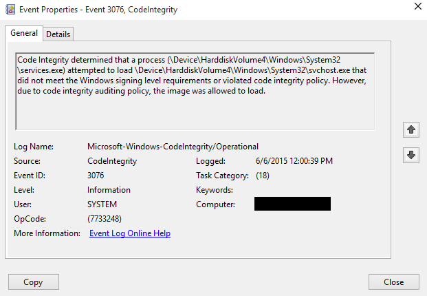

# Deploy code integrity policies: steps

**Applies to**
-   Windows 10
-   Windows Server 2016

For an overview of the process described in the following procedures, see [Deploy code integrity policies: policy rules and file rules](deploy-code-integrity-policies-policy-rules-and-file-rules.md). To understand how the deployment of code integrity policies fits with other steps in the Windows Defender Device Guard deployment process, see [Planning and getting started on the Windows Defender Device Guard deployment process](planning-and-getting-started-on-the-device-guard-deployment-process.md).

## Create a code integrity policy from a reference computer

This section outlines the process to create a code integrity policy with Windows PowerShell. 
For this example, you must initiate variables to be used during the creation process or use the full file paths in the command. 
Then create the code integrity policy by scanning the system for installed applications. 
The policy file is converted to binary format when it gets created so that Windows can interpret it.

> [!Note] 
> Make sure the reference computer is virus and malware-free, and install any software you want to be scanned before creating the code integrity policy. 

### Scripting and applications

Each installed software application should be validated as trustworthy before you create a policy. 
We recommend that you review the reference computer for software that can load arbitrary DLLs and run code or scripts that could render the PC more vulnerable. 
Examples include software aimed at development or scripting such as msbuild.exe (part of Visual Studio and the .NET Framework) which can be removed if you do not want it to run scripts. 
You can remove or disable such software on the reference computer. 
You can also fine-tune your control by [using Windows Defender Device Guard in combination with AppLocker](https://technet.microsoft.com/itpro/windows/keep-secure/introduction-to-device-guard-virtualization-based-security-and-code-integrity-policies#device-guard-with-applocker). 

Members of the security community<sup>\*</sup> continuously collaborate with Microsoft to help protect customers. With the help of their valuable reports, Microsoft has identified a list of valid applications that an attacker could also potentially use to bypass Windows Defender Device Guard code integrity policies. 

Unless your use scenarios explicitly require them, Microsoft recommends that you block the following applications. These applications or files can be used by an attacker to circumvent Application Whitelisting policies, including Windows Defender Device Guard:

- bash.exe
- bginfo.exe<sup>[1]</sup> 
- cdb.exe
- csi.exe
- dbghost.exe
- dbgsvc.exe
- dnx.exe
- fsi.exe
- fsiAnyCpu.exe
- kd.exe
- ntkd.exe
- lxssmanager.dll
- msbuild.exe<sup>[2]</sup>
- mshta.exe
- ntsd.exe
- rcsi.exe
- system.management.automation.dll
- windbg.exe

<sup>[1]</sup>A vulnerability in bginfo.exe has been fixed in the latest version 4.22. If you use BGInfo, for security, make sure to download and run the latest version here [BGInfo 4.22](https://docs.microsoft.com/en-us/sysinternals/downloads/bginfo). Note that BGInfo versions earlier than 4.22 are still vulnerable and should be blocked.

<sup>[2]</sup>If you are using your reference system in a development context and use msbuild.exe to build managed applications, we recommend that you whitelist msbuild.exe in your code integrity policies. However, if your reference system is an end user device that is not being used in a development context, we recommend that you block msbuild.exe.

<sup>*</sup>Microsoft recognizes the efforts of those in the security community who help us protect customers through responsible vulnerability disclosure, and extends thanks to the following people:

<br />

|Name|Twitter|
|---|---|
|Casey Smith |@subTee| 
|Matt Graeber | @mattifestation| 
|Matt Nelson | @enigma0x3| 
|Oddvar Moe |@Oddvarmoe|
|Alex Ionescu | @aionescu|
|Lee Christensen|@tifkin_|

<br />

>[!Note]
>This application list will be updated with the latest vendor information as application vulnerabilities are resolved and new issues are discovered. 

Certain software applications may allow additional code to run by design. 
These types of applications should be blocked by your Windows Defender Device Guard policy. 
In addition, when an application version is upgraded to fix a security vulnerability or potential Windows Defender Device Guard bypass, you should add deny rules to your code integrity policies for that application’s previous, less secure versions. 

Microsoft recommends that you install the latest security updates. 
The June 2017 Windows updates resolve several issues in PowerShell modules that allowed an attacker to bypass Windows Defender Device Guard code integrity policies. 
These modules cannot be blocked by name or version, and therefore must be blocked by their corresponding hashes. 

For October 2017, we are announcing an update to system.management.automation.dll in which we are revoking older versions by hash values, instead of version rules.

Microsoft recommends that you block the following Microsoft-signed applications and PowerShell files by merging the following policy into your existing policy to add these deny rules using the Merge-CIPolicy cmdlet:

```
<?xml version="1.0" encoding="utf-8"?>
<SiPolicy xmlns="urn:schemas-microsoft-com:sipolicy">
  <VersionEx>10.0.0.0</VersionEx>
  <PolicyTypeID>{A244370E-44C9-4C06-B551-F6016E563076}</PolicyTypeID>
  <PlatformID>{2E07F7E4-194C-4D20-B7C9-6F44A6C5A234}</PlatformID>
  <Rules>
    <Rule>
      <Option>Enabled:Unsigned System Integrity Policy</Option>
    </Rule>
    <Rule>
      <Option>Enabled:Audit Mode</Option>
    </Rule>
    <Rule>
      <Option>Enabled:Advanced Boot Options Menu</Option>
    </Rule>
    <Rule>
      <Option>Enabled:UMCI</Option>
    </Rule>
  </Rules>
  <!--EKUS-->
  <EKUs />
  <!--File Rules-->
  <FileRules>
    <Deny  ID="ID_DENY_BGINFO"        FriendlyName="bginfo.exe"         FileName="BGINFO.Exe" MinimumFileVersion = "4.21.0.0" />
    <Deny  ID="ID_DENY_CBD"           FriendlyName="cdb.exe"            FileName="CDB.Exe" MinimumFileVersion = "65535.65535.65535.65535" />
    <Deny  ID="ID_DENY_KD"            FriendlyName="kd.exe"             FileName="kd.Exe" MinimumFileVersion = "65535.65535.65535.65535" />
    <Deny  ID="ID_DENY_KD_KMCI"       FriendlyName="kd.exe"             FileName="kd.Exe" MinimumFileVersion = "65535.65535.65535.65535" />
    <Deny  ID="ID_DENY_NTKD"          FriendlyName="ntkd.exe"           FileName="ntkd.Exe" MinimumFileVersion = "65535.65535.65535.65535" />
    <Deny  ID="ID_DENY_WINDBG"        FriendlyName="windbg.exe"         FileName="windbg.Exe" MinimumFileVersion = "65535.65535.65535.65535" />
    <Deny  ID="ID_DENY_MSBUILD"       FriendlyName="MSBuild.exe"        FileName="MSBuild.Exe" MinimumFileVersion = "65535.65535.65535.65535" />
    <Deny  ID="ID_DENY_CSI"           FriendlyName="csi.exe"            FileName="csi.Exe" MinimumFileVersion = "65535.65535.65535.65535" />
    <Deny  ID="ID_DENY_DBGHOST"       FriendlyName="dbghost.exe"        FileName="DBGHOST.Exe" MinimumFileVersion = "2.3.0.0" /> 
    <Deny  ID="ID_DENY_DBGSVC"        FriendlyName="dbgsvc.exe"         FileName="DBGSVC.Exe" MinimumFileVersion = "2.3.0.0" />    
    <Deny  ID="ID_DENY_DNX"           FriendlyName="dnx.exe"            FileName="dnx.Exe" MinimumFileVersion = "65535.65535.65535.65535" />   
    <Deny  ID="ID_DENY_RCSI"          FriendlyName="rcsi.exe"           FileName="rcsi.Exe" MinimumFileVersion = "65535.65535.65535.65535" />
    <Deny  ID="ID_DENY_NTSD"          FriendlyName="ntsd.exe"           FileName="ntsd.Exe" MinimumFileVersion = "65535.65535.65535.65535" />
    <Deny  ID="ID_DENY_LXSS"          FriendlyName="LxssManager.dll"    FileName="LxssManager.dll" MinimumFileVersion = "65535.65535.65535.65535" />
    <Deny  ID="ID_DENY_BASH"          FriendlyName="bash.exe"           FileName="bash.exe" MinimumFileVersion = "65535.65535.65535.65535" />
    <Deny  ID="ID_DENY_FSI"           FriendlyName="fsi.exe"            FileName="fsi.exe" MinimumFileVersion = "65535.65535.65535.65535" />
    <Deny  ID="ID_DENY_FSI_ANYCPU"    FriendlyName="fsiAnyCpu.exe"      FileName="fsiAnyCpu.exe" MinimumFileVersion = "65535.65535.65535.65535" />
    <Deny  ID="ID_DENY_MSHTA"         FriendlyName="mshta.exe"          FileName="mshta.exe" MinimumFileVersion = "65535.65535.65535.65535" />
    <Deny  ID="ID_DENY_VISUALUIAVERIFY"         FriendlyName="visualuiaverifynative.exe"          FileName="visualuiaverifynative.exe" MinimumFileVersion = "65535.65535.65535.65535" />
    <Deny  ID="ID_DENY_RUNSCRIPTHELPER"         FriendlyName="runscripthelper.exe"                FileName="runscripthelper.exe" MinimumFileVersion="65535.65535.65535.65535" />

    <Deny ID="ID_DENY_D_1" FriendlyName="Powershell 1" Hash="02BE82F63EE962BCD4B8303E60F806F6613759C6" />
    <Deny ID="ID_DENY_D_2" FriendlyName="Powershell 2" Hash="13765D9A16CC46B2113766822627F026A68431DF" />
    <Deny ID="ID_DENY_D_3" FriendlyName="Powershell 3" Hash="148972F670E18790D62D753E01ED8D22B351A57E45544D88ACE380FEDAF24A40" />
    <Deny ID="ID_DENY_D_4" FriendlyName="Powershell 4" Hash="29DF1D593D0D7AB365F02645E7EF4BCCA060763A" />
    <Deny ID="ID_DENY_D_5" FriendlyName="Powershell 5" Hash="2E3C47BBE1BA99842EE187F756CA616EFED61B94" />
    <Deny ID="ID_DENY_D_6" FriendlyName="Powershell 6" Hash="38DC1956313B160696A172074C6F5DA9852BF508F55AFB7FA079B98F2849AFB5" />
    <Deny ID="ID_DENY_D_7" FriendlyName="Powershell 7" Hash="513B625EA507ED9CE83E2FB2ED4F3D586C2AA379" />
    <Deny ID="ID_DENY_D_8" FriendlyName="Powershell 8" Hash="71FC552E66327EDAA72D72C362846BD80CB65EECFAE95C4D790C9A2330D95EE6" />
    <Deny ID="ID_DENY_D_9" FriendlyName="Powershell 9" Hash="72E4EC687CFE357F3E681A7500B6FF009717A2E9538956908D3B52B9C865C189" />
    <Deny ID="ID_DENY_D_10" FriendlyName="Powershell 10" Hash="74E207F539C4EAC648A5507EB158AEE9F6EA401E51808E83E73709CFA0820FDD" />
    <Deny ID="ID_DENY_D_11" FriendlyName="Powershell 11" Hash="75288A0CF0806A68D8DA721538E64038D755BBE74B52F4B63FEE5049AE868AC0" />
    <Deny ID="ID_DENY_D_12" FriendlyName="Powershell 12" Hash="7DB3AD53985C455990DD9847DE15BDB271E0C8D1" />
    <Deny ID="ID_DENY_D_13" FriendlyName="Powershell 13" Hash="84BB081141DA50B3839CD275FF34854F53AECB96CA9AEB8BCD24355C33C1E73E" />
    <Deny ID="ID_DENY_D_14" FriendlyName="Powershell 14" Hash="86DADE56A1DBAB6DDC2769839F89244693D319C6" />
    <Deny ID="ID_DENY_D_15" FriendlyName="Powershell 15" Hash="BD3139CE7553AC7003C96304F08EAEC2CDB2CC6A869D36D6F1E478DA02D3AA16" />
    <Deny ID="ID_DENY_D_16" FriendlyName="Powershell 16" Hash="BE3FFE10CDE8B62C3E8FD4D8198F272B6BD15364A33362BB07A0AFF6731DABA1" />
    <Deny ID="ID_DENY_D_17" FriendlyName="Powershell 17" Hash="C1196433541B87D22CE2DD19AAAF133C9C13037A" />
    <Deny ID="ID_DENY_D_18" FriendlyName="Powershell 18" Hash="C6C073A80A8E76DC13E724B5E66FE4035A19CCA0C1AF3FABBC18E5185D1B66CB" />
    <Deny ID="ID_DENY_D_19" FriendlyName="Powershell 19" Hash="CE5EA2D29F9DD3F15CF3682564B0E765ED3A8FE1" />
    <Deny ID="ID_DENY_D_20" FriendlyName="Powershell 20" Hash="D027E09D9D9828A87701288EFC91D240C0DEC2C3" />
    <Deny ID="ID_DENY_D_21" FriendlyName="Powershell 21" Hash="D2CFC8F6729E510AE5BA9BECCF37E0B49DDF5E31" />
    <Deny ID="ID_DENY_D_22" FriendlyName="Powershell 22" Hash="DED853481A176999723413685A79B36DD0F120F9" />
    <Deny ID="ID_DENY_D_23" FriendlyName="Powershell 23" Hash="DFCD10EAA2A22884E0A41C4D9E6E8DA265321870" />
    <Deny ID="ID_DENY_D_24" FriendlyName="Powershell 24" Hash="F16E605B55774CDFFDB0EB99FAFF43A40622ED2AB1C011D1195878F4B20030BC" />
    <Deny ID="ID_DENY_D_25" FriendlyName="Powershell 25" Hash="F29A958287788A6EEDE6035D49EF5CB85EEC40D214FDDE5A0C6CAA65AFC00EEC" />
    <Deny ID="ID_DENY_D_26" FriendlyName="Powershell 26" Hash="F875E43E12685ECE0BA2D42D55A13798CE9F1FFDE3CAE253D2529F4304811A52" />
    <!--System.Management.Automation.dll -->
    <Deny ID="ID_DENY_D_27" FriendlyName="PowerShell 27" Hash="720D826A84284E18E0003526A0CD9B7FF0C4A98A"/>
    <Deny ID="ID_DENY_D_28" FriendlyName="PowerShell 28" Hash="CB5DF9D0D25571948C3D257882E07C7FA5E768448E0DEBF637E110F9FF575808"/>
    <Deny ID="ID_DENY_D_29" FriendlyName="PowerShell 29" Hash="3C7265C3393C585D32E509B2D2EC048C73AC5EE6"/>
    <Deny ID="ID_DENY_D_30" FriendlyName="PowerShell 30" Hash="7F1E03E956CA38CC0C491CB958D6E61A52491269CDB363BC488B525F80C56424"/>
    <Deny ID="ID_DENY_D_31" FriendlyName="PowerShell 31" Hash="27D86C9B54E1A97399A6DC9C9DF9AE030CB734C8"/>
    <Deny ID="ID_DENY_D_32" FriendlyName="PowerShell 32" Hash="917BD10E82C6E932F9C63B9BDCCC1D9BF04510CD8491B005CFFD273B48B5CD1E"/>
    <Deny ID="ID_DENY_D_33" FriendlyName="PowerShell 33" Hash="B3BB2D75AECB34ED316CE54C6D513420186E4950"/>
    <Deny ID="ID_DENY_D_34" FriendlyName="PowerShell 34" Hash="B734F6269A6738861E1DF98EE0E4E7377FAED10B82AAA9731DA0BB1CB366FCCE"/>
    <Deny ID="ID_DENY_D_35" FriendlyName="PowerShell 35" Hash="FF378B465F2C8A87B4092F7C1F96399C0156CEEB"/>
    <Deny ID="ID_DENY_D_36" FriendlyName="PowerShell 36" Hash="9B884CFE78F921042B003574AE30D9E86EE3DCC11E7110A1C92927F13C3F47E6"/>
    <Deny ID="ID_DENY_D_37" FriendlyName="PowerShell 37" Hash="C7B99E8B59182112A3A14BD39880BDCDDD5C724F"/>
    <Deny ID="ID_DENY_D_38" FriendlyName="PowerShell 38" Hash="6E585890C7369D6D8DA85C8B6B7411463BAA1ACAE9CE4197E033A46C897B35E5"/>
    <Deny ID="ID_DENY_D_39" FriendlyName="PowerShell 39" Hash="BA4B3A92123FBCE66398020AFBCC0BCA1D1AAAD7"/>
    <Deny ID="ID_DENY_D_40" FriendlyName="PowerShell 40" Hash="D8D361E3690676C7FDC483003BFC5C0C39FB16B42DFC881FB8D42A1064740B0B"/>
    <Deny ID="ID_DENY_D_41" FriendlyName="PowerShell 41" Hash="1EA5104AE1A7A53F9421E0193B749F310B9261D1"/>
    <Deny ID="ID_DENY_D_42" FriendlyName="PowerShell 42" Hash="66C1B8569019512ACDDC145DA6D348A68DE008BE7C05930AD0EC6927C26061AD"/>
    <Deny ID="ID_DENY_D_43" FriendlyName="PowerShell 43" Hash="4EB2C3A4B551FC028E00F2E7DA9D0F1E38728571"/>
    <Deny ID="ID_DENY_D_44" FriendlyName="PowerShell 44" Hash="30EAC589069FB79D540080B04B7FDBB8A9B1DF4E96B9D7C98519E49A1ED56851"/>
    <Deny ID="ID_DENY_D_45" FriendlyName="PowerShell 45" Hash="E55505B609DD7A22F55C4BA9EDAD5627ECA6A8E8"/>
    <Deny ID="ID_DENY_D_46" FriendlyName="PowerShell 46" Hash="ABDDA9C1EDA9F2344FB5B79890B7FD854D0E3D28BEC26AE33AAD196948AB642D"/>
    <Deny ID="ID_DENY_D_47" FriendlyName="PowerShell 47" Hash="A15964475D213FB752B42E7DCDDBF4B14D623D14"/>
    <Deny ID="ID_DENY_D_48" FriendlyName="PowerShell 48" Hash="61A68B436D828193E0C7B44D2AF83D22A9CB557B90186E4E6AC998CE5E3BFE8A"/>
    <Deny ID="ID_DENY_D_49" FriendlyName="PowerShell 49" Hash="DB0C4B5CA1CBC3B117AB0439C5937B6A263DFD87"/>
    <Deny ID="ID_DENY_D_50" FriendlyName="PowerShell 50" Hash="6D4FB385328CA01700092E1CDF75A97123A95120D5F8A9877FFB4D5A8531380B"/>
    <Deny ID="ID_DENY_D_51" FriendlyName="PowerShell 51" Hash="72F9DCDA6ECDD6906A2538DFE795A2E2CA787BBC"/>
    <Deny ID="ID_DENY_D_52" FriendlyName="PowerShell 52" Hash="F98FEC4A0306BD398F7FB7F611679B7797D32D54D1F2B35D728C0C7A058153ED"/>
    <Deny ID="ID_DENY_D_53" FriendlyName="PowerShell 53" Hash="C980B65B86F780AC93B9458E9657291083CFEDA8"/>
    <Deny ID="ID_DENY_D_54" FriendlyName="PowerShell 54" Hash="F9473493FF53274B8E75EC7E517F324AA0C5644C6F8045D3EF3A1B9A669ECF78"/>
    <Deny ID="ID_DENY_D_55" FriendlyName="PowerShell 55" Hash="C30355B5E6FA3F793A3CC0A649945829723DD85C"/>
    <Deny ID="ID_DENY_D_56" FriendlyName="PowerShell 56" Hash="4EB14099165177F0F3A1FACE32E72CF2DD221DB44155E73AFF94CB7DA195EF22"/>
    <Deny ID="ID_DENY_D_57" FriendlyName="PowerShell 57" Hash="5C6CC1903D3DA2054ECD9A295EEE26F5561E152A"/>
    <Deny ID="ID_DENY_D_58" FriendlyName="PowerShell 58" Hash="0BF8CAB75DAB712FC848DE7CC7DC5C8A10D666515E7535F89146F45AAAF9EF54"/>
    <Deny ID="ID_DENY_D_59" FriendlyName="PowerShell 59" Hash="1443E8F56DEE11EEF5B746E3657C2F953FD4F6EA"/>
    <Deny ID="ID_DENY_D_60" FriendlyName="PowerShell 60" Hash="487CB42795046E885303FC96EA54C3234E1B2072DAEB4F9218C21CC6C39A3223"/>
    <Deny ID="ID_DENY_D_61" FriendlyName="PowerShell 61" Hash="072D4E33D1478C863DBAB20BF5DFF1A0FB5A9D53"/>
    <Deny ID="ID_DENY_D_62" FriendlyName="PowerShell 62" Hash="631E091AE7AD2C543EE5755BC9D8DB34683C41E20D9A6CD41C8F07827156D6DB"/>
    <Deny ID="ID_DENY_D_63" FriendlyName="PowerShell 63" Hash="FD15A313B890369B7D8E26C13B2070AE044FB4D8"/>
    <Deny ID="ID_DENY_D_64" FriendlyName="PowerShell 64" Hash="AB9886A0993F87C2A39BC7822EE44FD4B4751C530ACF292ACD0319C967FB4F3B"/>
    <Deny ID="ID_DENY_D_65" FriendlyName="PowerShell 65" Hash="4BAFD867B59328E7BB853148FE6D16B9411D7A12"/>
    <Deny ID="ID_DENY_D_66" FriendlyName="PowerShell 66" Hash="D1F22B37902C2DD53FA27438436D9D236A196C10C8E492A8F4A14768644592D3"/>
    <Deny ID="ID_DENY_D_67" FriendlyName="PowerShell 67" Hash="AC53AE4C8AB56D84393D67D820BEBDC3218739D3"/>
    <Deny ID="ID_DENY_D_68" FriendlyName="PowerShell 68" Hash="49580C9459C3917E6F982C8E0D753D293DFA2E4FD1152F78FF7C73CF8B422507"/>
    <Deny ID="ID_DENY_D_69" FriendlyName="PowerShell 69" Hash="333678A44D4BEBE9BEA3041FFDA9E2B55B58F1B5"/>
    <Deny ID="ID_DENY_D_70" FriendlyName="PowerShell 70" Hash="94CBBC3970F01280D98C951BD0C4158D4B09A2BE21B8A27790D9F127B78C6F3F"/>
    <Deny ID="ID_DENY_D_71" FriendlyName="PowerShell 71" Hash="5F5620DC049FE1F1C2DBAC077A59BA69CF2FF72C"/>
    <Deny ID="ID_DENY_D_72" FriendlyName="PowerShell 72" Hash="A32C0769F36CAE0B6A7A1B8CCB6B7A75AA8BEB7F49815E96B4E120BFD7527E0A"/>
    <Deny ID="ID_DENY_D_73" FriendlyName="PowerShell 73" Hash="BDBE541D269EC8235563842D024F9E37883DFB57"/>
    <Deny ID="ID_DENY_D_74" FriendlyName="PowerShell 74" Hash="441076C7FD0AD481E6AC3198F08BE80EA9EB2926CA81D733F798D03DBEFD683E"/>
    <Deny ID="ID_DENY_D_75" FriendlyName="PowerShell 75" Hash="FD6FE9143A46F4EBB46E6B46332FA7171002EBF0"/>
    <Deny ID="ID_DENY_D_76" FriendlyName="PowerShell 76" Hash="85399D84601207AB92C8CA4D7D6E58CB1B0B0B57ED94FA7E5A1191FA1810E223"/>
    <Deny ID="ID_DENY_D_77" FriendlyName="PowerShell 77" Hash="98FD94A89DCF92A7BEDB51C72BAD1A67650DD6E5"/>
    <Deny ID="ID_DENY_D_78" FriendlyName="PowerShell 78" Hash="5CE4B042E986DAFEB7E2D2ABFB80376C4DEC325DB23B584B76039EEA6E1A74B1"/>
    <Deny ID="ID_DENY_D_79" FriendlyName="PowerShell 79" Hash="6BC1E70F0EA84E88AC28BEAF74C10F3ABDF99209"/>
    <Deny ID="ID_DENY_D_80" FriendlyName="PowerShell 80" Hash="93CB3907D1A9473E8A90593250C4A95EAE3A7066E9D8A57535CBDF82AA4AD4C2"/>
    <Deny ID="ID_DENY_D_81" FriendlyName="PowerShell 81" Hash="7FCE82DBBC0FE45AFBE3927C323349C32D5A463A"/>
    <Deny ID="ID_DENY_D_82" FriendlyName="PowerShell 82" Hash="2EDA8CA129E30CB5522C4DCD1E5AFDCA1E9C6447DD7053DACEF18DCDCCF3E2BC"/>
    <Deny ID="ID_DENY_D_83" FriendlyName="PowerShell 83" Hash="BDB3DAC80667A0B931835D5D658C08F236B413D1"/>
    <Deny ID="ID_DENY_D_84" FriendlyName="PowerShell 84" Hash="51287BACB692AAC5A8659774D982B304DC0C0B4A4D8F41CBCCD47D69796786DE"/>
    <Deny ID="ID_DENY_D_85" FriendlyName="PowerShell 85" Hash="9633529CACE25ACCB29EBC5941DE1874903C0297"/>
    <Deny ID="ID_DENY_D_86" FriendlyName="PowerShell 86" Hash="483A3997D5DA69A51DC7EA368A36C3CA4A5BD56CB08BFD9912BE799005156C18"/>
    <Deny ID="ID_DENY_D_87" FriendlyName="PowerShell 87" Hash="B3493E30A2C347B550331C86529BDC288EAF8186"/>
    <Deny ID="ID_DENY_D_88" FriendlyName="PowerShell 88" Hash="9371E2333906441715DE15FEE8A9AA03C4D076CA3C04D9A7AB0CC32189DA66ED"/>
    <Deny ID="ID_DENY_D_89" FriendlyName="PowerShell 89" Hash="5D4B0794EB973D61CF74A700F11BE84E527E0E51"/>
    <Deny ID="ID_DENY_D_90" FriendlyName="PowerShell 90" Hash="537DE34A1F4B3F8345D02F5BBA2B063F070A42FC1581AAC2AA91C1D071B14521"/>
    <Deny ID="ID_DENY_D_91" FriendlyName="PowerShell 91" Hash="F3C75F35F42C1C5B3B4ED888187D6AB4035F994C"/>
    <Deny ID="ID_DENY_D_92" FriendlyName="PowerShell 92" Hash="AD5678ED0734281973465DD728281A6C0EA146620FF2106A4EEFC7E94622B92F"/>
    <Deny ID="ID_DENY_D_93" FriendlyName="PowerShell 93" Hash="91C0F76798A9679188C7D93FDEBAF797BDBE41B2"/>
    <Deny ID="ID_DENY_D_94" FriendlyName="PowerShell 94" Hash="1D9244EAFEDFBFC02E13822E24A476C36FFD362B9D18F6CD195B654A34F946FF"/>
    <Deny ID="ID_DENY_D_95" FriendlyName="PowerShell 95" Hash="7FCB424E67DDAC49413B45D7DCD636AD70E23B41"/>
    <Deny ID="ID_DENY_D_96" FriendlyName="PowerShell 96" Hash="7E6F9A738520F78D1E9D0D0883FB07DD9188408CBE7C2937BDE1590F90C61753"/>
    <Deny ID="ID_DENY_D_97" FriendlyName="PowerShell 97" Hash="A9745E20419EC1C90B23FE965D3C2DF028AF39DC"/>
    <Deny ID="ID_DENY_D_98" FriendlyName="PowerShell 98" Hash="71B5B58EAA0C90397BC9546BCCA8C657500499CD2087CD7D7E1753D54C07E71D"/>
    <Deny ID="ID_DENY_D_99" FriendlyName="PowerShell 99" Hash="3E5294910C59394DA93962128968E6C23016A028"/>
    <Deny ID="ID_DENY_D_100" FriendlyName="PowerShell 100" Hash="DA700D4F58BCEA1D5A9CAD4F20AC725C6A354F9DA40E4F8F95E1C3DC7B84F550"/>
    <Deny ID="ID_DENY_D_101" FriendlyName="PowerShell 101" Hash="266896FD257AD8EE9FC73B3A50306A573714EA8A"/>
    <Deny ID="ID_DENY_D_102" FriendlyName="PowerShell 102" Hash="8E36BD08084C73AF674F2DAD568EE3BA2C85769FA7B3400CB62F7A7BD028BE9A"/>
    <Deny ID="ID_DENY_D_103" FriendlyName="PowerShell 103" Hash="2CB781B3BD79FD277D92332ACA22C04430F9D692"/>
    <Deny ID="ID_DENY_D_104" FriendlyName="PowerShell 104" Hash="92AE03F0090C0A5DF329B4B3FFEDBA622B0521BA699FA303C24120A30ED4C9E6"/>
    <Deny ID="ID_DENY_D_105" FriendlyName="PowerShell 105" Hash="D82583F7D5EA477C94630AC5AAEB771C85BD4B0A"/>
    <Deny ID="ID_DENY_D_106" FriendlyName="PowerShell 106" Hash="9B0F39AB233628A971ACEC53029C9B608CAB99868F1A1C5ABE20BC1BD1C2B70E"/>
    <Deny ID="ID_DENY_D_107" FriendlyName="PowerShell 107" Hash="2DF4350DE3C97C9D4FD2973F8C5EA8AE621D22A8"/>
    <Deny ID="ID_DENY_D_108" FriendlyName="PowerShell 108" Hash="015CE571E8503A353E2250D4D0DA19493B3311F3437527E6DDD2D2B6439FA2EB"/>
    <Deny ID="ID_DENY_D_109" FriendlyName="PowerShell 109" Hash="080DEC3B15AD5AFE9BF3B0943A36285E92BAF469"/>
    <Deny ID="ID_DENY_D_110" FriendlyName="PowerShell 110" Hash="F1391E78F17EA6097906B99C6F4F0AE8DD2E519856F837A3BCC58FBB87DAAE62"/>
    <Deny ID="ID_DENY_D_111" FriendlyName="PowerShell 111" Hash="F87C726CCB5E64C6F363C21255935D5FEA9E4A0E"/>
    <Deny ID="ID_DENY_D_112" FriendlyName="PowerShell 112" Hash="B7B42C3C8C61FD2616C16BBCF36EA15EC26A67536E94764D72A91CE04B89AAA4"/>
    <Deny ID="ID_DENY_D_113" FriendlyName="PowerShell 113" Hash="25F52340199A0EA352C8B1A7014BCB610B232523"/>
    <Deny ID="ID_DENY_D_114" FriendlyName="PowerShell 114" Hash="64D6D1F3A053908C5635BD6BDA36BC8E72D518C7ECE8DA761C0DDE70C50BB632"/>
    <Deny ID="ID_DENY_D_115" FriendlyName="PowerShell 115" Hash="029198F05598109037A0E9E332EC052317E834DA"/>
    <Deny ID="ID_DENY_D_116" FriendlyName="PowerShell 116" Hash="70B4BB6C2B7E9237FB14ABBC94955012285E2CAA74F91455EE52809CDAD4E7FC"/>
    <Deny ID="ID_DENY_D_117" FriendlyName="PowerShell 117" Hash="A4390EF2D77F76DC4EFE55FF74EE1D06C303FDAE"/>
    <Deny ID="ID_DENY_D_118" FriendlyName="PowerShell 118" Hash="3246A0CB329B030DA104E04B1A0728DE83724B08C724FD0238CE4578A0245576"/>
    <Deny ID="ID_DENY_D_119" FriendlyName="PowerShell 119" Hash="89CEAB6518DA4E7F75B3C75BC04A112D3637B737"/>
    <Deny ID="ID_DENY_D_120" FriendlyName="PowerShell 120" Hash="6581E491FBFF954A1A4B9CEA69B63951D67EB56DF871ED8B055193595F042B0D"/>
    <Deny ID="ID_DENY_D_121" FriendlyName="PowerShell 121" Hash="00419E981EDC8613E600C939677F7B460855BF7E"/>
    <Deny ID="ID_DENY_D_122" FriendlyName="PowerShell 122" Hash="61B724BCFC3DA1CC1583DB0BC42EFE166E92D8D3CE91E58A29F7AEBEFAE2149F"/>
    <Deny ID="ID_DENY_D_123" FriendlyName="PowerShell 123" Hash="272EF88BBA9B4B54D242FFE1E96D07DBF53497A0"/>
    <Deny ID="ID_DENY_D_124" FriendlyName="PowerShell 124" Hash="AFC0968EDCE9E5FC1BC392382833EBEF3265B32D3ECBB529D89A1DF33A31E9BD"/>
    <Deny ID="ID_DENY_D_125" FriendlyName="PowerShell 125" Hash="CD9D9789B3B31562C4BE44B6BEEA8815C5EDAE1F"/>
    <Deny ID="ID_DENY_D_126" FriendlyName="PowerShell 126" Hash="FCAF8DC3C7A5D3B29B19A9C5F89324BF65B50C440AC0316B08532CEA2F1FF9B0"/>
    <Deny ID="ID_DENY_D_127" FriendlyName="PowerShell 127" Hash="941D0FD47887035A04E17F46DE6C4004D7FD8871"/>
    <Deny ID="ID_DENY_D_128" FriendlyName="PowerShell 128" Hash="4AD6DC7FF0A2E776CE7F27B4E3D3C1C380CA3548DFED565429D88C3BBE61DD0F"/>
    <Deny ID="ID_DENY_D_129" FriendlyName="PowerShell 129" Hash="421D1142105358B8360454E43FD15767DA111DBA"/>
    <Deny ID="ID_DENY_D_130" FriendlyName="PowerShell 130" Hash="692CABD40C1EDFCB6DC50591F31FAE30848E579D6EF4D2CA0811D06B086CF8BE"/>
    <Deny ID="ID_DENY_D_131" FriendlyName="PowerShell 131" Hash="AC9F095DD4AE80B124F55541761AA1F35E49A575"/>
    <Deny ID="ID_DENY_D_132" FriendlyName="PowerShell 132" Hash="0D8A0FB3BF3CF80D44ED20D9F1E7292E9EE5A49ABCE68592DED55A71B0ACAECE"/>
    <Deny ID="ID_DENY_D_133" FriendlyName="PowerShell 133" Hash="B1CF2A18B281F73FE6685B5CE74D1BA50BE9AFE5"/>
    <Deny ID="ID_DENY_D_134" FriendlyName="PowerShell 134" Hash="095B79953F9E3E2FB721693FBFAD5841112D592B6CA7EB2055B262DEB7C7008A"/>
    <Deny ID="ID_DENY_D_135" FriendlyName="PowerShell 135" Hash="128D7D03E4B85DBF95427D72EFF833DAB5E92C33"/>
    <Deny ID="ID_DENY_D_136" FriendlyName="PowerShell 136" Hash="EACFC615FDE29BD858088AF42E0917E4B4CA5991EFB4394FB3129735D7299235"/>
    <Deny ID="ID_DENY_D_137" FriendlyName="PowerShell 137" Hash="47D2F87F2D2D516D712A156421F0C2BD285200E9"/>
    <Deny ID="ID_DENY_D_138" FriendlyName="PowerShell 138" Hash="8CACA1828E7770DADF21D558976D415AC7BDA16D58926308FD5E9D5087F4B0E6"/>
    <Deny ID="ID_DENY_D_139" FriendlyName="PowerShell 139" Hash="CD9D70B0107801567EEADC4ECD74511A1A6FF4FE"/>
    <Deny ID="ID_DENY_D_140" FriendlyName="PowerShell 140" Hash="9C96396EFCC9DC09F119DE8695CB3372F82DB46D23A1B7A88BD86CBE814233E1"/>
    <Deny ID="ID_DENY_D_141" FriendlyName="PowerShell 141" Hash="233E3B5108A43239C6C13292043DED0567281AF9"/>
    <Deny ID="ID_DENY_D_142" FriendlyName="PowerShell 142" Hash="6EDF19CC53EA2064CE108957343EB3505359CF05BD6955C7502AF565BD761702"/>
    <Deny ID="ID_DENY_D_143" FriendlyName="PowerShell 143" Hash="CD725B606888E5C5426FEAB44E2CC7722DFE5411"/>
    <Deny ID="ID_DENY_D_144" FriendlyName="PowerShell 144" Hash="B20C4F36AE6A3AC323759C81173FACE1B1C112FA5B701C65DCD7313D7CE59907"/>
    <Deny ID="ID_DENY_D_145" FriendlyName="PowerShell 145" Hash="E5212F1081B5777B88F5C41174ADEDB35B4258CF"/>
    <Deny ID="ID_DENY_D_146" FriendlyName="PowerShell 146" Hash="F4DE5B5395701F8C94D65D732E4D212E1879C9C84345B46A941965B094F75017"/>
    <Deny ID="ID_DENY_D_147" FriendlyName="PowerShell 147" Hash="EC41A3FB8D6E3B0F55F6583C14C45B6238753019"/>
    <Deny ID="ID_DENY_D_148" FriendlyName="PowerShell 148" Hash="76CA6B396796351685198D6189E865AFD7FB9E6C5CEFA9EA0B5F0A9F1FC98D57"/>
    <Deny ID="ID_DENY_D_149" FriendlyName="PowerShell 149" Hash="3B2B7042A84033CA846AFE472912524F7BAD57E5"/>
    <Deny ID="ID_DENY_D_150" FriendlyName="PowerShell 150" Hash="2DF95ABEB23DAA0377DFA6360976B69D3CEE7325A9B7571F331D569809FAED8B"/>
    <Deny ID="ID_DENY_D_151" FriendlyName="PowerShell 151" Hash="7BED2F9C0ADF1597C7EBB79163BDA21D8D7D28CA"/>
    <Deny ID="ID_DENY_D_152" FriendlyName="PowerShell 152" Hash="44BDD2DADB13E7A8FF6AFCF4AE3E2CC830506D9475B4C2C71D319E169977998F"/>
    <Deny ID="ID_DENY_D_153" FriendlyName="PowerShell 153" Hash="A1251FA30162B13456A4687495726FF793D511BE"/>
    <Deny ID="ID_DENY_D_154" FriendlyName="PowerShell 154" Hash="9C15E4DE10DE47ACD393359D523211AD8596C61FE54F2C0664D48E1D249231CE"/>
    <Deny ID="ID_DENY_D_155" FriendlyName="PowerShell 155" Hash="D835947C84CFBA652B553A77A90475E02291AA5F"/>
    <Deny ID="ID_DENY_D_156" FriendlyName="PowerShell 156" Hash="B4D6DAA10398D5DA192DFDD75010F428D24762D432934F0E2030D39610D43E12"/>
    <Deny ID="ID_DENY_D_157" FriendlyName="PowerShell 157" Hash="1F85BBEC1DFC5785B91735A7C561E664F7FE1E94"/>
    <Deny ID="ID_DENY_D_158" FriendlyName="PowerShell 158" Hash="828F05BFF829019EC0F3082323FEA859C0D71CCE14B5B75C07E7D418EF354269"/>
    <Deny ID="ID_DENY_D_159" FriendlyName="PowerShell 159" Hash="FC0E23771620B41E6920F2463F49B84307D8BA91"/>
    <Deny ID="ID_DENY_D_160" FriendlyName="PowerShell 160" Hash="C4FA568C852A46316308A660B80D83A11D41071F1CF4A79847A3F56714CC47AF"/>
    <Deny ID="ID_DENY_D_161" FriendlyName="PowerShell 161" Hash="D18240AEE8B9B964F6B9CDFC5AFB6C343C286636"/>
    <Deny ID="ID_DENY_D_162" FriendlyName="PowerShell 162" Hash="7B4C39285569F14AA9799332C542A0796717C5EF9D636BD11B2841450BC6399D"/>
    <Deny ID="ID_DENY_D_163" FriendlyName="PowerShell 163" Hash="1A16008D330330182AA555B1D3E9BE0B2D6BECBF"/>
    <Deny ID="ID_DENY_D_164" FriendlyName="PowerShell 164" Hash="D7685E259D0328937487856A3AB68B6D9D420DD4E02541F4D71164DFA65B4644"/>
    <Deny ID="ID_DENY_D_165" FriendlyName="PowerShell 165" Hash="FBA274406B503B464B349805149E6AA722909CC9"/>
    <Deny ID="ID_DENY_D_166" FriendlyName="PowerShell 166" Hash="FEBC97ED819C79E54157895457DBA755F182D6330A5103E0663AFA07E01E5CF8"/>
    <Deny ID="ID_DENY_D_167" FriendlyName="PowerShell 167" Hash="293AF426A39282770387F5EE25CA719A91419A18"/>
    <Deny ID="ID_DENY_D_168" FriendlyName="PowerShell 168" Hash="A9E655A96A124BC361D9CC5C7663FC033AA6F6609916EFAA76B6A6E9713A0D32"/>
    <Deny ID="ID_DENY_D_169" FriendlyName="PowerShell 169" Hash="AEBFE7497F4A1947B5CB32650843CA0F85BD56D0"/>
    <Deny ID="ID_DENY_D_170" FriendlyName="PowerShell 170" Hash="8C385B2C16136C097C96701D2140E014BF454CFA7297BE0C28431DED15339C0F"/>
    <Deny ID="ID_DENY_D_171" FriendlyName="PowerShell 171" Hash="8FB604CD72701B83BC265D87F52B36C6F14E5DBE"/>
    <Deny ID="ID_DENY_D_172" FriendlyName="PowerShell 172" Hash="B35AFBA7A897CB882C14A08AFB36A8EC938BDA14DF070234A2CCBDBA8F7DF91C"/>
    <Deny ID="ID_DENY_D_173" FriendlyName="PowerShell 173" Hash="CE70309DB83C9202F45028EBEC252747F4936E6F"/>
    <Deny ID="ID_DENY_D_174" FriendlyName="PowerShell 174" Hash="1F6D74FDA1F9EE6BBAC72E7E717A01B9FFC29822561D11175F6809D12215B4ED"/>
    <Deny ID="ID_DENY_D_175" FriendlyName="PowerShell 175" Hash="9D71AD914DBB2FDF793742AA63AEEF4E4A430790"/>
    <Deny ID="ID_DENY_D_176" FriendlyName="PowerShell 176" Hash="8CC1B5FA9A9609AC811F6505FA9B68E85A87BAE1EF676EFFE1BE438EACBDF3E1"/>
    <Deny ID="ID_DENY_D_177" FriendlyName="PowerShell 177" Hash="7484FD78A9298DBA24AC5C882D16DB6146E53712"/>
    <Deny ID="ID_DENY_D_178" FriendlyName="PowerShell 178" Hash="A79A74BFB768312E8EE089060C5C3238D59EF0C044A450FEB97DCA26815ECB34"/>
    <Deny ID="ID_DENY_D_179" FriendlyName="PowerShell 179" Hash="78C3C6AEF52A6A5392C55F1EC98AF18053B3087D"/>
    <Deny ID="ID_DENY_D_180" FriendlyName="PowerShell 180" Hash="493B620FCAD8A91D1FD7C726697E09358CA90822E8D6E021DF56E70B46F7C346"/>
    <Deny ID="ID_DENY_D_181" FriendlyName="PowerShell 181" Hash="783FFB771F08BCF55C2EA474B5460EB65EA9444C"/>
    <Deny ID="ID_DENY_D_182" FriendlyName="PowerShell 182" Hash="09DA1592B8457F860297821EB7FAA7F3BB71FC1916ED5DEE6D85044953640D5C"/>
    <Deny ID="ID_DENY_D_183" FriendlyName="PowerShell 183" Hash="B303D1689ED99613E4F52CE6E5F96AAEBC3A45C3"/>
    <Deny ID="ID_DENY_D_184" FriendlyName="PowerShell 184" Hash="82AB406FD78DCF58F65DC14D6FDDD72840015F3FE5B554428969BECA0325CD9C"/>
    <Deny ID="ID_DENY_D_185" FriendlyName="PowerShell 185" Hash="DB5C6CB23C23BA6A3CD4FD4EC0A4DAEE3FC66500"/>
    <Deny ID="ID_DENY_D_186" FriendlyName="PowerShell 186" Hash="9A46C16C5151D97A0EFA3EA503249E31A6D5D8D25E4F07CD4E5E077A574713FB"/>
    <Deny ID="ID_DENY_D_187" FriendlyName="PowerShell 187" Hash="C1E08AD32F680100C51F138C6C095139E7230C3B"/>
    <Deny ID="ID_DENY_D_188" FriendlyName="PowerShell 188" Hash="A5D5C1F79CD26216194D4C72DBAA3E48CB4A143D9E1F78819E52E9FEB2AD0AE3"/>
    <Deny ID="ID_DENY_D_189" FriendlyName="PowerShell 189" Hash="BACA825D0852E2D8F3D92381D112B99B5DD56D9F"/>
    <Deny ID="ID_DENY_D_190" FriendlyName="PowerShell 190" Hash="ABA28E0FC251E1D7FE5E264E1B36EC5E482D70AA434E75A756356F23F0C1F2F4"/>
    <Deny ID="ID_DENY_D_191" FriendlyName="PowerShell 191" Hash="E89C29D38F554F6CB73B5FD3D0A783CC12FFEBC3"/>
    <Deny ID="ID_DENY_D_192" FriendlyName="PowerShell 192" Hash="4C93CBDCF4328D27681453D8DFD7495955A07EE6A0EFB9A593853A86990CF528"/>
    <Deny ID="ID_DENY_D_193" FriendlyName="PowerShell 193" Hash="5B5E7942233D7C8A325A429FC4F4AE281325E8F9"/>
    <Deny ID="ID_DENY_D_194" FriendlyName="PowerShell 194" Hash="40DA20086ED76A5EA5F62901D110216EE206E7EEB2F2BFF02F61D0BE85B0BB5A"/>
    <Deny ID="ID_DENY_D_195" FriendlyName="PowerShell 195" Hash="926DCACC6983F85A8ABBCB5EE13F3C756705A1D5"/>
    <Deny ID="ID_DENY_D_196" FriendlyName="PowerShell 196" Hash="A22761E2BF18F02BB630962E3C5E32738770AAEA77F8EDA233E77792EB480072"/>
    <Deny ID="ID_DENY_D_197" FriendlyName="PowerShell 197" Hash="6FE6723A355DEB4BC6B8637A634D1B43AFA64112"/>
    <Deny ID="ID_DENY_D_198" FriendlyName="PowerShell 198" Hash="9BCC55A97A275F7D81110877F1BB5B41F86A848EA02B4EE1E1E6A44D927A488F"/>
    <Deny ID="ID_DENY_D_199" FriendlyName="PowerShell 199" Hash="8D5599B34BED4A660DACC0922F6C2F112F264758"/>
    <Deny ID="ID_DENY_D_200" FriendlyName="PowerShell 200" Hash="F375014915E5E027F697B29201362B56F2D9E598247C96F86ABADCC6FF42F034"/>
    <Deny ID="ID_DENY_D_201" FriendlyName="PowerShell 201" Hash="CCFB247A3BCA9C64D82F647F3D30A3172E645F13"/>
    <Deny ID="ID_DENY_D_202" FriendlyName="PowerShell 202" Hash="5E52ABBC051368315F078D31F01B0C1B904C1DDB6D1C1E4A91BE276BDF44C66F"/>
    <Deny ID="ID_DENY_D_203" FriendlyName="PowerShell 203" Hash="E8EB859531F426CC45A3CB9118F399C92054563E"/>
    <Deny ID="ID_DENY_D_204" FriendlyName="PowerShell 204" Hash="CD9E1D41F8D982F4AA6C610A2EFEAEBA5B0CDD883DF4A86FA0180ACD333CAA86"/>
    <Deny ID="ID_DENY_D_205" FriendlyName="PowerShell 205" Hash="C92D4EAC917EE4842A437C54F96D87F003199DE8"/>
    <Deny ID="ID_DENY_D_206" FriendlyName="PowerShell 206" Hash="3A270242EB49E06405FD654FA4954B166297BBC886891C64B4424134C39872DB"/>
    <Deny ID="ID_DENY_D_207" FriendlyName="PowerShell 207" Hash="66681D9171981216B31996429695931DA2A638B9"/>
    <Deny ID="ID_DENY_D_208" FriendlyName="PowerShell 208" Hash="7A2DF7D56912CB4EB5B36D071496EDC97661086B0E4C9CC5D9C61779A5A7DAAA"/>
    <Deny ID="ID_DENY_D_209" FriendlyName="PowerShell 209" Hash="9DCA54C85E4C645CB296FE3055E90255B6506A95"/>
    <Deny ID="ID_DENY_D_210" FriendlyName="PowerShell 210" Hash="8C9C58AD12FE61CBF021634EC6A4B3094750FC002DA224423E0BCEB01ECF292A"/>
    <Deny ID="ID_DENY_D_211" FriendlyName="PowerShell 211" Hash="3AF2587E8B62F88DC363D7F5308EE4C1A6147338"/>
    <Deny ID="ID_DENY_D_212" FriendlyName="PowerShell 212" Hash="D32D88F158FD341E32708CCADD48C426D227D0EC8465FF4304C7B7EAC2C6A93E"/>
    <Deny ID="ID_DENY_D_213" FriendlyName="PowerShell 213" Hash="D3D453EBC368DF7CC2200474035E5898B58D93F1"/>
    <Deny ID="ID_DENY_D_214" FriendlyName="PowerShell 214" Hash="BBE569BCC282B3AF682C1528D4E3BC53C1A0C6B5905FA34ADB4305160967B64A"/>
    <Deny ID="ID_DENY_D_215" FriendlyName="PowerShell 215" Hash="D147CE5C7E7037D1BE3C0AF67EDB6F528C77DB0A"/>
    <Deny ID="ID_DENY_D_216" FriendlyName="PowerShell 216" Hash="11F936112832738AD9B3A1C67537D5542DE8E86856CF2A5893C4D26CF3A2C558"/>
    <Deny ID="ID_DENY_D_217" FriendlyName="PowerShell 217" Hash="7DBB41B87FAA887DE456C8E6A72E09D2839FA1E7"/>
    <Deny ID="ID_DENY_D_218" FriendlyName="PowerShell 218" Hash="3741F3D2F264E047339C95A66085599A49766DEF1C5BD0C32237CE87FA0B41FB"/>
    <Deny ID="ID_DENY_D_219" FriendlyName="PowerShell 219" Hash="5F3AECC89BAF094EAFA3C25E6B883EE68A6F00B0"/>
    <Deny ID="ID_DENY_D_220" FriendlyName="PowerShell 220" Hash="AA085BE6498D2E3F527F3D72A5D1C604508133F0CDC05AD404BB49E8E3FB1A1B"/>
    <Deny ID="ID_DENY_D_221" FriendlyName="PowerShell 221" Hash="DDE4D9A08514347CDE706C42920F43523FC74DEA"/>
    <Deny ID="ID_DENY_D_222" FriendlyName="PowerShell 222" Hash="81835C6294B96282A4D7D70383BBF797C2E4E7CEF99648F85DDA50F7F41B02F6"/>
    <Deny ID="ID_DENY_D_223" FriendlyName="PowerShell 223" Hash="48092864C96C4BF9B68B5006EAEDAB8B57B3738C"/>
    <Deny ID="ID_DENY_D_224" FriendlyName="PowerShell 224" Hash="36EF3BED9A5D0D563BCB354BFDD2931F6256759D1D905BA5DC21CDA496F2FEB7"/>
    <Deny ID="ID_DENY_D_225" FriendlyName="PowerShell 225" Hash="7F6725BA8CCD2DAEEFD0C9590A5DF9D98642CCEA"/>
    <Deny ID="ID_DENY_D_226" FriendlyName="PowerShell 226" Hash="DB68DB3AE32A8A662AA6EE16CF459124D2701719D019B614CE9BF115F5F9C904"/>
    <Deny ID="ID_DENY_D_227" FriendlyName="PowerShell 227" Hash="FF205856A3209227D571EAD4B8C1E611E7FF9924"/>
    <Deny ID="ID_DENY_D_228" FriendlyName="PowerShell 228" Hash="A63B38CE17DA60C4C431FC42C4507A0B7C19B384AC9E121E2988AD026E71ED63"/>
    <Deny ID="ID_DENY_D_229" FriendlyName="PowerShell 229" Hash="479C9429691314D3E21E4F4CA8B95D5BD2BDDEDA"/>
    <Deny ID="ID_DENY_D_230" FriendlyName="PowerShell 230" Hash="2BA4E369D267A9ABDEBA50DA2CB5FC56A8EE4382C5BCFCFFD121350B88A6F0E1"/>
    <Deny ID="ID_DENY_D_231" FriendlyName="PowerShell 231" Hash="C7D70B96440D215173F35412D56CF9329886D8D3"/>
    <Deny ID="ID_DENY_D_232" FriendlyName="PowerShell 232" Hash="B00C54F1AA77D88335675EAF07ED834E68FD96DD7606914C2867F9C506AB0A56"/>
    <Deny ID="ID_DENY_D_233" FriendlyName="PowerShell 233" Hash="2AB804E1FF982AE0EDB591BC61AA909CF32E99C5"/>
    <Deny ID="ID_DENY_D_234" FriendlyName="PowerShell 234" Hash="253120422B0DD987C293CAF5928FA820414C0A01622FD0EAF304A750FC5AEEFE"/>
    <Deny ID="ID_DENY_D_235" FriendlyName="PowerShell 235" Hash="8DAB1D74CAEDBAA8D17805CF00D64A44F5831C12"/>
    <Deny ID="ID_DENY_D_236" FriendlyName="PowerShell 236" Hash="AC1CE3AA9023E23F2F63D5A3536294B914686057336402E059DEF6559D1CE723"/>
    <Deny ID="ID_DENY_D_237" FriendlyName="PowerShell 237" Hash="993425279D204D1D14C3EB989DEB4805ADC558CF"/>
    <Deny ID="ID_DENY_D_238" FriendlyName="PowerShell 238" Hash="BDADDD710E47EB8D24B78E542F3996B0EA2CA577ABD515785819302DB15839DD"/>
    <Deny ID="ID_DENY_D_239" FriendlyName="PowerShell 239" Hash="F4DB0CDF3A3FD163A9B90789CC6D14D326AD609C"/>
    <Deny ID="ID_DENY_D_240" FriendlyName="PowerShell 240" Hash="5D249D8366077713024552CA8D08F164E975AFF89E8909E35A43F02B0DC66F70"/>
    <Deny ID="ID_DENY_D_241" FriendlyName="PowerShell 241" Hash="5B8E45EECA32C2F0968C2252229D768B0DB796A0"/>
    <Deny ID="ID_DENY_D_242" FriendlyName="PowerShell 242" Hash="B4D336B32C27E3D3FEBE4B06252DDE9683814E7E903C98448972AAB7389DFC02"/>
    <Deny ID="ID_DENY_D_243" FriendlyName="PowerShell 243" Hash="4F5D66B449C4D2FDEA532F9B5DBECA5ACA8195EF"/>
    <Deny ID="ID_DENY_D_244" FriendlyName="PowerShell 244" Hash="39F2F19A5C6708CE8CE4E1ABBEBA8D3D1A6220391CA86B2D319E347B46005C97"/>
    <Deny ID="ID_DENY_D_245" FriendlyName="PowerShell 245" Hash="4BFB3F95CA1B79DA3C6B0A2ECB432059E686F967"/>
    <Deny ID="ID_DENY_D_246" FriendlyName="PowerShell 246" Hash="0C4688AACD02829850DE0F792AC06D3C87895412A910EA76F7F9BF31B3B4A3E9"/>
    <Deny ID="ID_DENY_D_247" FriendlyName="PowerShell 247" Hash="6DC048AFA50B5B1B0AD7DD3125AC83D46FED730A"/>
    <Deny ID="ID_DENY_D_248" FriendlyName="PowerShell 248" Hash="432F666CCE8CD222484E263AE02F63E0038143DD6AD07B3EB1633CD3C498C13D"/>

  </FileRules>
  <!--Signers-->
  <Signers />
  <!--Driver Signing Scenarios-->
  <SigningScenarios>
    <SigningScenario Value="131" ID="ID_SIGNINGSCENARIO_DRIVERS_1" FriendlyName="Driver Signing Scenarios">
      <ProductSigners>
        <FileRulesRef>
          <FileRuleRef RuleID="ID_DENY_KD_KMCI" />
        </FileRulesRef>
      </ProductSigners>
    </SigningScenario>
    <SigningScenario Value="12" ID="ID_SIGNINGSCENARIO_WINDOWS" FriendlyName="User Mode Signing Scenarios">
      <ProductSigners>
        <FileRulesRef>
          <FileRuleRef RuleID="ID_DENY_BGINFO"/>
          <FileRuleRef RuleID="ID_DENY_CBD"/>
          <FileRuleRef RuleID="ID_DENY_KD"/>
          <FileRuleRef RuleID="ID_DENY_NTKD" />
          <FileRuleRef RuleID="ID_DENY_WINDBG" />
          <FileRuleRef RuleID="ID_DENY_MSBUILD" />
          <FileRuleRef RuleID="ID_DENY_CSI" />
          <FileRuleRef RuleID="ID_DENY_DBGHOST" />
          <FileRuleRef RuleID="ID_DENY_DBGSVC" />
          <FileRuleRef RuleID="ID_DENY_DNX" />
          <FileRuleRef RuleID="ID_DENY_RCSI" />
          <FileRuleRef RuleID="ID_DENY_NTSD" />
          <FileRuleRef RuleID="ID_DENY_LXSS" />
          <FileRuleRef RuleID="ID_DENY_BASH" />
          <FileRuleRef RuleID="ID_DENY_FSI" />
          <FileRuleRef RuleID="ID_DENY_FSI_ANYCPU" />
          <FileRuleRef RuleID="ID_DENY_MSHTA" />
          <FileRuleRef RuleID="ID_DENY_VISUALUIAVERIFY" />
          <FileRuleRef RuleID="ID_DENY_RUNSCRIPTHELPER"/>
          <FileRuleRef RuleID="ID_DENY_D_1" />
          <FileRuleRef RuleID="ID_DENY_D_2" />
          <FileRuleRef RuleID="ID_DENY_D_3" />
          <FileRuleRef RuleID="ID_DENY_D_4" />
          <FileRuleRef RuleID="ID_DENY_D_5" />
          <FileRuleRef RuleID="ID_DENY_D_6" />
          <FileRuleRef RuleID="ID_DENY_D_7" />
          <FileRuleRef RuleID="ID_DENY_D_8" />
          <FileRuleRef RuleID="ID_DENY_D_9" />
          <FileRuleRef RuleID="ID_DENY_D_10" />
          <FileRuleRef RuleID="ID_DENY_D_11" />
          <FileRuleRef RuleID="ID_DENY_D_12" />
          <FileRuleRef RuleID="ID_DENY_D_13" />
          <FileRuleRef RuleID="ID_DENY_D_14" />
          <FileRuleRef RuleID="ID_DENY_D_15" />
          <FileRuleRef RuleID="ID_DENY_D_16" />
          <FileRuleRef RuleID="ID_DENY_D_17" />
          <FileRuleRef RuleID="ID_DENY_D_18" />
          <FileRuleRef RuleID="ID_DENY_D_19" />
          <FileRuleRef RuleID="ID_DENY_D_20" />
          <FileRuleRef RuleID="ID_DENY_D_21" />
          <FileRuleRef RuleID="ID_DENY_D_22" />
          <FileRuleRef RuleID="ID_DENY_D_23" />
          <FileRuleRef RuleID="ID_DENY_D_24" />
          <FileRuleRef RuleID="ID_DENY_D_25" />
          <FileRuleRef RuleID="ID_DENY_D_26" />
          <FileRuleRef RuleID="ID_DENY_D_27"/>
          <FileRuleRef RuleID="ID_DENY_D_28"/>
          <FileRuleRef RuleID="ID_DENY_D_29"/>
          <FileRuleRef RuleID="ID_DENY_D_30"/>
          <FileRuleRef RuleID="ID_DENY_D_31"/>
          <FileRuleRef RuleID="ID_DENY_D_32"/>
          <FileRuleRef RuleID="ID_DENY_D_33"/>
          <FileRuleRef RuleID="ID_DENY_D_34"/>
          <FileRuleRef RuleID="ID_DENY_D_35"/>
          <FileRuleRef RuleID="ID_DENY_D_36"/>
          <FileRuleRef RuleID="ID_DENY_D_37"/>
          <FileRuleRef RuleID="ID_DENY_D_38"/>
          <FileRuleRef RuleID="ID_DENY_D_39"/>
          <FileRuleRef RuleID="ID_DENY_D_40"/>
          <FileRuleRef RuleID="ID_DENY_D_41"/>
          <FileRuleRef RuleID="ID_DENY_D_42"/>
          <FileRuleRef RuleID="ID_DENY_D_43"/>
          <FileRuleRef RuleID="ID_DENY_D_44"/>
          <FileRuleRef RuleID="ID_DENY_D_45"/>
          <FileRuleRef RuleID="ID_DENY_D_46"/>
          <FileRuleRef RuleID="ID_DENY_D_47"/>
          <FileRuleRef RuleID="ID_DENY_D_48"/>
          <FileRuleRef RuleID="ID_DENY_D_49"/>
          <FileRuleRef RuleID="ID_DENY_D_50"/>
          <FileRuleRef RuleID="ID_DENY_D_51"/>
          <FileRuleRef RuleID="ID_DENY_D_52"/>
          <FileRuleRef RuleID="ID_DENY_D_53"/>
          <FileRuleRef RuleID="ID_DENY_D_54"/>
          <FileRuleRef RuleID="ID_DENY_D_55"/>
          <FileRuleRef RuleID="ID_DENY_D_56"/>
          <FileRuleRef RuleID="ID_DENY_D_57"/>
          <FileRuleRef RuleID="ID_DENY_D_58"/>
          <FileRuleRef RuleID="ID_DENY_D_59"/>
          <FileRuleRef RuleID="ID_DENY_D_60"/>
          <FileRuleRef RuleID="ID_DENY_D_61"/>
          <FileRuleRef RuleID="ID_DENY_D_62"/>
          <FileRuleRef RuleID="ID_DENY_D_63"/>
          <FileRuleRef RuleID="ID_DENY_D_64"/>
          <FileRuleRef RuleID="ID_DENY_D_65"/>
          <FileRuleRef RuleID="ID_DENY_D_66"/>
          <FileRuleRef RuleID="ID_DENY_D_67"/>
          <FileRuleRef RuleID="ID_DENY_D_68"/>
          <FileRuleRef RuleID="ID_DENY_D_69"/>
          <FileRuleRef RuleID="ID_DENY_D_70"/>
          <FileRuleRef RuleID="ID_DENY_D_71"/>
          <FileRuleRef RuleID="ID_DENY_D_72"/>
          <FileRuleRef RuleID="ID_DENY_D_73"/>
          <FileRuleRef RuleID="ID_DENY_D_74"/>
          <FileRuleRef RuleID="ID_DENY_D_75"/>
          <FileRuleRef RuleID="ID_DENY_D_76"/>
          <FileRuleRef RuleID="ID_DENY_D_77"/>
          <FileRuleRef RuleID="ID_DENY_D_78"/>
          <FileRuleRef RuleID="ID_DENY_D_79"/>
          <FileRuleRef RuleID="ID_DENY_D_80"/>
          <FileRuleRef RuleID="ID_DENY_D_81"/>
          <FileRuleRef RuleID="ID_DENY_D_82"/>
          <FileRuleRef RuleID="ID_DENY_D_83"/>
          <FileRuleRef RuleID="ID_DENY_D_84"/>
          <FileRuleRef RuleID="ID_DENY_D_85"/>
          <FileRuleRef RuleID="ID_DENY_D_86"/>
          <FileRuleRef RuleID="ID_DENY_D_87"/>
          <FileRuleRef RuleID="ID_DENY_D_88"/>
          <FileRuleRef RuleID="ID_DENY_D_89"/>
          <FileRuleRef RuleID="ID_DENY_D_90"/>
          <FileRuleRef RuleID="ID_DENY_D_91"/>
          <FileRuleRef RuleID="ID_DENY_D_92"/>
          <FileRuleRef RuleID="ID_DENY_D_93"/>
          <FileRuleRef RuleID="ID_DENY_D_94"/>
          <FileRuleRef RuleID="ID_DENY_D_95"/>
          <FileRuleRef RuleID="ID_DENY_D_96"/>
          <FileRuleRef RuleID="ID_DENY_D_97"/>
          <FileRuleRef RuleID="ID_DENY_D_98"/>
          <FileRuleRef RuleID="ID_DENY_D_99"/>
          <FileRuleRef RuleID="ID_DENY_D_100"/>
          <FileRuleRef RuleID="ID_DENY_D_101"/>
          <FileRuleRef RuleID="ID_DENY_D_102"/>
          <FileRuleRef RuleID="ID_DENY_D_103"/>
          <FileRuleRef RuleID="ID_DENY_D_104"/>
          <FileRuleRef RuleID="ID_DENY_D_105"/>
          <FileRuleRef RuleID="ID_DENY_D_106"/>
          <FileRuleRef RuleID="ID_DENY_D_107"/>
          <FileRuleRef RuleID="ID_DENY_D_108"/>
          <FileRuleRef RuleID="ID_DENY_D_109"/>
          <FileRuleRef RuleID="ID_DENY_D_110"/>
          <FileRuleRef RuleID="ID_DENY_D_111"/>
          <FileRuleRef RuleID="ID_DENY_D_112"/>
          <FileRuleRef RuleID="ID_DENY_D_113"/>
          <FileRuleRef RuleID="ID_DENY_D_114"/>
          <FileRuleRef RuleID="ID_DENY_D_115"/>
          <FileRuleRef RuleID="ID_DENY_D_116"/>
          <FileRuleRef RuleID="ID_DENY_D_117"/>
          <FileRuleRef RuleID="ID_DENY_D_118"/>
          <FileRuleRef RuleID="ID_DENY_D_119"/>
          <FileRuleRef RuleID="ID_DENY_D_120"/>
          <FileRuleRef RuleID="ID_DENY_D_121"/>
          <FileRuleRef RuleID="ID_DENY_D_122"/>
          <FileRuleRef RuleID="ID_DENY_D_123"/>
          <FileRuleRef RuleID="ID_DENY_D_124"/>
          <FileRuleRef RuleID="ID_DENY_D_125"/>
          <FileRuleRef RuleID="ID_DENY_D_126"/>
          <FileRuleRef RuleID="ID_DENY_D_127"/>
          <FileRuleRef RuleID="ID_DENY_D_128"/>
          <FileRuleRef RuleID="ID_DENY_D_129"/>
          <FileRuleRef RuleID="ID_DENY_D_130"/>
          <FileRuleRef RuleID="ID_DENY_D_131"/>
          <FileRuleRef RuleID="ID_DENY_D_132"/>
          <FileRuleRef RuleID="ID_DENY_D_133"/>
          <FileRuleRef RuleID="ID_DENY_D_134"/>
          <FileRuleRef RuleID="ID_DENY_D_135"/>
          <FileRuleRef RuleID="ID_DENY_D_136"/>
          <FileRuleRef RuleID="ID_DENY_D_137"/>
          <FileRuleRef RuleID="ID_DENY_D_138"/>
          <FileRuleRef RuleID="ID_DENY_D_139"/>
          <FileRuleRef RuleID="ID_DENY_D_140"/>
          <FileRuleRef RuleID="ID_DENY_D_141"/>
          <FileRuleRef RuleID="ID_DENY_D_142"/>
          <FileRuleRef RuleID="ID_DENY_D_143"/>
          <FileRuleRef RuleID="ID_DENY_D_144"/>
          <FileRuleRef RuleID="ID_DENY_D_145"/>
          <FileRuleRef RuleID="ID_DENY_D_146"/>
          <FileRuleRef RuleID="ID_DENY_D_147"/>
          <FileRuleRef RuleID="ID_DENY_D_148"/>
          <FileRuleRef RuleID="ID_DENY_D_149"/>
          <FileRuleRef RuleID="ID_DENY_D_150"/>
          <FileRuleRef RuleID="ID_DENY_D_151"/>
          <FileRuleRef RuleID="ID_DENY_D_152"/>
          <FileRuleRef RuleID="ID_DENY_D_153"/>
          <FileRuleRef RuleID="ID_DENY_D_154"/>
          <FileRuleRef RuleID="ID_DENY_D_155"/>
          <FileRuleRef RuleID="ID_DENY_D_156"/>
          <FileRuleRef RuleID="ID_DENY_D_157"/>
          <FileRuleRef RuleID="ID_DENY_D_158"/>
          <FileRuleRef RuleID="ID_DENY_D_159"/>
          <FileRuleRef RuleID="ID_DENY_D_160"/>
          <FileRuleRef RuleID="ID_DENY_D_161"/>
          <FileRuleRef RuleID="ID_DENY_D_162"/>
          <FileRuleRef RuleID="ID_DENY_D_163"/>
          <FileRuleRef RuleID="ID_DENY_D_164"/>
          <FileRuleRef RuleID="ID_DENY_D_165"/>
          <FileRuleRef RuleID="ID_DENY_D_166"/>
          <FileRuleRef RuleID="ID_DENY_D_167"/>
          <FileRuleRef RuleID="ID_DENY_D_168"/>
          <FileRuleRef RuleID="ID_DENY_D_169"/>
          <FileRuleRef RuleID="ID_DENY_D_170"/>
          <FileRuleRef RuleID="ID_DENY_D_171"/>
          <FileRuleRef RuleID="ID_DENY_D_172"/>
          <FileRuleRef RuleID="ID_DENY_D_173"/>
          <FileRuleRef RuleID="ID_DENY_D_174"/>
          <FileRuleRef RuleID="ID_DENY_D_175"/>
          <FileRuleRef RuleID="ID_DENY_D_176"/>
          <FileRuleRef RuleID="ID_DENY_D_177"/>
          <FileRuleRef RuleID="ID_DENY_D_178"/>
          <FileRuleRef RuleID="ID_DENY_D_179"/>
          <FileRuleRef RuleID="ID_DENY_D_180"/>
          <FileRuleRef RuleID="ID_DENY_D_181"/>
          <FileRuleRef RuleID="ID_DENY_D_182"/>
          <FileRuleRef RuleID="ID_DENY_D_183"/>
          <FileRuleRef RuleID="ID_DENY_D_184"/>
          <FileRuleRef RuleID="ID_DENY_D_185"/>
          <FileRuleRef RuleID="ID_DENY_D_186"/>
          <FileRuleRef RuleID="ID_DENY_D_187"/>
          <FileRuleRef RuleID="ID_DENY_D_188"/>
          <FileRuleRef RuleID="ID_DENY_D_189"/>
          <FileRuleRef RuleID="ID_DENY_D_190"/>
          <FileRuleRef RuleID="ID_DENY_D_191"/>
          <FileRuleRef RuleID="ID_DENY_D_192"/>
          <FileRuleRef RuleID="ID_DENY_D_193"/>
          <FileRuleRef RuleID="ID_DENY_D_194"/>
          <FileRuleRef RuleID="ID_DENY_D_195"/>
          <FileRuleRef RuleID="ID_DENY_D_196"/>
          <FileRuleRef RuleID="ID_DENY_D_197"/>
          <FileRuleRef RuleID="ID_DENY_D_198"/>
          <FileRuleRef RuleID="ID_DENY_D_199"/>
          <FileRuleRef RuleID="ID_DENY_D_200"/>
          <FileRuleRef RuleID="ID_DENY_D_201"/>
          <FileRuleRef RuleID="ID_DENY_D_202"/>
          <FileRuleRef RuleID="ID_DENY_D_203"/>
          <FileRuleRef RuleID="ID_DENY_D_204"/>
          <FileRuleRef RuleID="ID_DENY_D_205"/>
          <FileRuleRef RuleID="ID_DENY_D_206"/>
          <FileRuleRef RuleID="ID_DENY_D_207"/>
          <FileRuleRef RuleID="ID_DENY_D_208"/>
          <FileRuleRef RuleID="ID_DENY_D_209"/>
          <FileRuleRef RuleID="ID_DENY_D_210"/>
          <FileRuleRef RuleID="ID_DENY_D_211"/>
          <FileRuleRef RuleID="ID_DENY_D_212"/>
          <FileRuleRef RuleID="ID_DENY_D_213"/>
          <FileRuleRef RuleID="ID_DENY_D_214"/>
          <FileRuleRef RuleID="ID_DENY_D_215"/>
          <FileRuleRef RuleID="ID_DENY_D_216"/>
          <FileRuleRef RuleID="ID_DENY_D_217"/>
          <FileRuleRef RuleID="ID_DENY_D_218"/>
          <FileRuleRef RuleID="ID_DENY_D_219"/>
          <FileRuleRef RuleID="ID_DENY_D_220"/>
          <FileRuleRef RuleID="ID_DENY_D_221"/>
          <FileRuleRef RuleID="ID_DENY_D_222"/>
          <FileRuleRef RuleID="ID_DENY_D_223"/>
          <FileRuleRef RuleID="ID_DENY_D_224"/>
          <FileRuleRef RuleID="ID_DENY_D_225"/>
          <FileRuleRef RuleID="ID_DENY_D_226"/>
          <FileRuleRef RuleID="ID_DENY_D_227"/>
          <FileRuleRef RuleID="ID_DENY_D_228"/>
          <FileRuleRef RuleID="ID_DENY_D_229"/>
          <FileRuleRef RuleID="ID_DENY_D_230"/>
          <FileRuleRef RuleID="ID_DENY_D_231"/>
          <FileRuleRef RuleID="ID_DENY_D_232"/>
          <FileRuleRef RuleID="ID_DENY_D_233"/>
          <FileRuleRef RuleID="ID_DENY_D_234"/>
          <FileRuleRef RuleID="ID_DENY_D_235"/>
          <FileRuleRef RuleID="ID_DENY_D_236"/>
          <FileRuleRef RuleID="ID_DENY_D_237"/>
          <FileRuleRef RuleID="ID_DENY_D_238"/>
          <FileRuleRef RuleID="ID_DENY_D_239"/>
          <FileRuleRef RuleID="ID_DENY_D_240"/>
          <FileRuleRef RuleID="ID_DENY_D_241"/>
          <FileRuleRef RuleID="ID_DENY_D_242"/>
          <FileRuleRef RuleID="ID_DENY_D_243"/>
          <FileRuleRef RuleID="ID_DENY_D_244"/>
          <FileRuleRef RuleID="ID_DENY_D_245"/>
          <FileRuleRef RuleID="ID_DENY_D_246"/>
          <FileRuleRef RuleID="ID_DENY_D_247"/>
          <FileRuleRef RuleID="ID_DENY_D_248"/>
        </FileRulesRef>
      </ProductSigners>
    </SigningScenario>
  </SigningScenarios>
  <UpdatePolicySigners />
  <CiSigners />
  <HvciOptions>0</HvciOptions>
</SiPolicy>

```
<br />

To create a code integrity policy, copy each of the following commands into an elevated Windows PowerShell session, in order:

1.  Initialize variables that you will use. The following example commands use **InitialScan.xml** and **DeviceGuardPolicy.bin** for the names of the files that will be created:

    ` $CIPolicyPath=$env:userprofile+"\Desktop\"`

    ` $InitialCIPolicy=$CIPolicyPath+"InitialScan.xml"`

    ` $CIPolicyBin=$CIPolicyPath+"DeviceGuardPolicy.bin"`

2.  Use [New-CIPolicy](https://technet.microsoft.com/library/mt634473.aspx) to create a new code integrity policy by scanning the system for installed applications:

    ` New-CIPolicy -Level PcaCertificate -FilePath $InitialCIPolicy –UserPEs 3> CIPolicyLog.txt `

    > [!Note] 
    
    > - When you specify the **-UserPEs** parameter (to include user mode executables in the scan), rule option **0 Enabled:UMCI** is automatically added to the code integrity policy. In contrast, if you do not specify **-UserPEs**, the policy will be empty of user mode executables and will only have rules for kernel mode binaries like drivers, in other words, the whitelist will not include applications. If you create such a policy and later add rule option **0 Enabled:UMCI**, all attempts to start applications will cause a response from Windows Defender Device Guard. In audit mode, the response is logging an event, and in enforced mode, the response is blocking the application. 
    
    > - You can add the **-Fallback** parameter to catch any applications not discovered using the primary file rule level specified by the **-Level** parameter. For more information about file rule level options, see [Code integrity file rule levels](deploy-code-integrity-policies-policy-rules-and-file-rules.md#code-integrity-file-rule-levels) in “Deploy code integrity policies: policy rules and file rules.”

    > - To specify that the code integrity policy scan only a specific drive, include the **-ScanPath** parameter followed by a path. Without this parameter, the entire system is scanned.
    
    > - The preceding example includes `3> CIPolicylog.txt`, which redirects warning messages to a text file, **CIPolicylog.txt**.

3.  Use [ConvertFrom-CIPolicy](https://technet.microsoft.com/library/mt733073.aspx) to convert the code integrity policy to a binary format:

    ` ConvertFrom-CIPolicy $InitialCIPolicy $CIPolicyBin`

After you complete these steps, the Windows Defender Device Guard binary file (DeviceGuardPolicy.bin) and original .xml file (IntialScan.xml) will be available on your desktop. You can use the binary version as a code integrity policy or sign it for additional security.

> [!Note] 
> We recommend that you keep the original .xml file of the policy for use when you need to merge the code integrity policy with another policy or update its rule options. Alternatively, you would have to create a new policy from a new scan for servicing. For more information about how to merge code integrity policies, see [Merge code integrity policies](#merge-code-integrity-policies).

We recommend that every code integrity policy be run in audit mode before being enforced. Doing so allows administrators to discover any issues with the policy without receiving error message dialog boxes. For information about how to audit a code integrity policy, see the next section, [Audit code integrity policies](#audit-code-integrity-policies).

## Audit code integrity policies

When code integrity policies are run in audit mode, it allows administrators to discover any applications that were missed during an initial policy scan and to identify any new applications that have been installed and run since the original policy was created. While a code integrity policy is running in audit mode, any binary that runs and would have been denied had the policy been enforced is logged in the **Applications and Services Logs\\Microsoft\\Windows\\CodeIntegrity\\Operational** event log. When these logged binaries have been validated, they can easily be added to a new code integrity policy. When the new exception policy is created, you can merge it with your existing code integrity policies.

> [!Note] 
> Before you begin this process, you need to create a code integrity policy binary file. If you have not already done so, see [Create a code integrity policy from a reference computer](#create-a-code-integrity-policy-from-a-reference-computer), earlier in this topic, for a step-by-step walkthrough of the process to create a code integrity policy and convert it to binary format.

**To audit a code integrity policy with local policy:**

1.  Find a *.bin policy file that you have created, for example, the DeviceGuardPolicy.bin file that resulted from the steps in the earlier section, [Create a code integrity policy from a reference computer](#create-a-code-integrity-policy-from-a-reference-computer). Copy the file to C:\\Windows\\System32\\CodeIntegrity.

2.  On the computer you want to run in audit mode, open the Local Group Policy Editor by running **GPEdit.msc**.

    > [!Note]
    
    > - The computer that you will run in audit mode must be clean of viruses or malware. Otherwise, in the process that you follow after auditing the system, you might unintentionally merge in a code integrity policy that allows viruses or malware to run.
    
    > - An alternative method to test a policy is to rename the test file to SIPolicy.p7b and drop it into C:\\Windows\\System32\\CodeIntegrity, rather than deploy it by using the Local Group Policy Editor.
    
3.  Navigate to **Computer Configuration\\Administrative Templates\\System\\Windows Defender Device Guard**, and then select **Deploy Code Integrity Policy**. Enable this setting by using the appropriate file path, for example, C:\\Windows\\System32\\CodeIntegrity\\DeviceGuardPolicy.bin, as shown in Figure 1.

    > [!Note]
    
    > - The illustration shows the example file name *DeviceGuardPolicy.bin* because this name was used earlier in this topic, in [Create a code integrity policy from a reference computer](#create-a-code-integrity-policy-from-a-reference-computer). Also, this policy file does not need to be copied to every system. You can instead copy the code integrity policies to a file share to which all computer accounts have access.

    > - Any policy you select here is converted to SIPolicy.p7b when it is deployed to the individual computers.

    > - You might have noticed that the GPO setting references a .p7b file and this policy uses a .bin file. Regardless of the type of policy you deploy (.bin, .p7b, or .p7), they are all converted to SIPolicy.p7b when dropped onto the computers running Windows 10. We recommend that you make your code integrity policy names friendly and allow the system to convert the policy names for you. By doing this, it ensures that the policies are easily distinguishable when viewed in a share or any other central repository.

   

   Figure 1. Deploy your code integrity policy

4.  Restart the reference system for the code integrity policy to take effect.

5.  Use the system as you normally would, and monitor code integrity events in the event log. While in audit mode, any exception to the deployed code integrity policy will be logged in the **Applications and Services Logs\\Microsoft\\Windows\\CodeIntegrity\\Operational** event log, as shown in Figure 2.

   

   Figure 2. Exceptions to the deployed code integrity policy

   You will be reviewing the exceptions that appear in the event log, and making a list of any applications that should be allowed to run in your environment.
   
6. If you want to create a catalog file to simplify the process of including unsigned LOB applications in your code integrity policy, this is a good time to create it. For information, see [Deploy catalog files to support code integrity policies](deploy-catalog-files-to-support-code-integrity-policies.md).   

Now that you have a code integrity policy deployed in audit mode, you can capture any audit information that appears in the event log. This is described in the next section.

## Create a code integrity policy that captures audit information from the event log

Use the following procedure after you have been running a computer with a code integrity policy in audit mode for a period of time. When you are ready to capture the needed policy information from the event log (so that you can later merge that information into the original code integrity policy), complete the following steps. 

<!-- Watch the phrase "later step in this procedure" in step 1, in case the organization of the procedures changes. -->

1.  Review the audit information in the event log. From the code integrity policy exceptions that you see, make a list of any applications that should be allowed to run in your environment, and decide on the file rule level that should be used to trust these applications.

    Although the Hash file rule level will catch all of these exceptions, it may not be the best way to trust all of them. For information about file rule levels, see [Code integrity file rule levels](deploy-code-integrity-policies-policy-rules-and-file-rules.md#code-integrity-file-rule-levels) in "Deploy code integrity policies: policy rules and file rules."
    
    Your event log might also contain exceptions for applications that you eventually want your code integrity policy to block. If these appear, make a list of these also, for a later step in this procedure.

2.  In an elevated Windows PowerShell session, initialize the variables that will be used. The example filename shown here is **DeviceGuardAuditPolicy.xml**:

    ` $CIPolicyPath=$env:userprofile+"\Desktop\"`

    ` $CIAuditPolicy=$CIPolicyPath+"DeviceGuardAuditPolicy.xml"`

3.  Use [New-CIPolicy](https://technet.microsoft.com/library/mt634473.aspx) to generate a new code integrity policy from logged audit events. This example uses a file rule level of **Hash** and includes `3> CIPolicylog.txt`, which redirects warning messages to a text file, **CIPolicylog.txt**.

    ` New-CIPolicy -Audit -Level Hash -FilePath $CIAuditPolicy –UserPEs 3> CIPolicylog.txt`

  > [!Note] 
  > When you create policies from audit events, you should carefully consider the file rule level that you select to trust. The preceding example uses the **Hash** rule level, which is the most specific. Any change to the file (such as replacing the file with a newer version of the same file) will change the Hash value, and require an update to the policy.

4.  Find and review the Windows Defender Device Guard audit policy .xml file that you created. If you used the example variables as shown, the filename will be **DeviceGuardAuditPolicy.xml**, and it will be on your desktop. Look for the following:

    - Any applications that were caught as exceptions, but should be allowed to run in your environment. These are applications that should be in the .xml file. Leave these as-is in the file.
    
    - Any applications that actually should not be allowed to run in your environment. Edit these out of the .xml file. If they remain in the .xml file, and the information in the file is merged into your existing code integrity policy, the policy will treat the applications as trusted, and allow them to run. 

You can now use this file to update the existing code integrity policy that you ran in audit mode by merging the two policies. For instructions on how to merge this audit policy with the existing code integrity policy, see the next section, [Merge code integrity policies](#merge-code-integrity-policies).

> [!Note] 
> You may have noticed that you did not generate a binary version of this policy as you did in [Create a code integrity policy from a reference computer](#create-a-code-integrity-policy-from-a-reference-computer). This is because code integrity policies created from an audit log are not intended to run as stand-alone policies but rather to update existing code integrity policies.

## <a href="" id="plug-ins"></a>Use a code integrity policy to control specific plug-ins, add-ins, and modules

As of Windows 10, version 1703, you can use code integrity policies not only to control applications, but also to control whether specific plug-ins, add-ins, and modules can run from specific apps (such as a line-of-business application or a browser):

| Approach (as of Windows 10, version 1703) | Guideline |
|---|---|
| You can work from a list of plug-ins, add-ins, or modules that you want only a specific application to be able to run. Other applications would be blocked from running them. | Use `New-CIPolicyRule` with the `-AppID` option. |
| In addition, you can work  from a list of plug-ins, add-ins, or modules that you want to block in a specific application. Other applications would be allowed to run them. | Use `New-CIPolicyRule` with the `-AppID` and `-Deny` options. |

To work with these options, the typical method is to create a policy that only affects plug-ins, add-ins, and modules, then merge it into your ‘master’ policy (merging is described in the next section).

For example, to create a code integrity policy that allows **addin1.dll** and **addin2.dll** to run in **ERP1.exe**, your organization’s enterprise resource planning (ERP) application, but blocks those add-ins in other applications, run the following commands. Note that in the second command, **+=** is used to add a second rule to the **$rule** variable:

```
$rule = New-CIPolicyRule -DriverFilePath '.\temp\addin1.dll' -Level FileName -AppID '.\ERP1.exe'
$rule += New-CIPolicyRule -DriverFilePath '.\temp\addin2.dll' -Level FileName -AppID '.\ERP1.exe'
New-CIPolicy -Rules $rule -FilePath ".\AllowERPAddins.xml" -UserPEs
```

As another example, to create a code integrity policy that blocks **addin3.dll** from running in Microsoft Word, run the following command. You must include the `-Deny` option to block the specified add-ins in the specifed application:

```
$rule = New-CIPolicyRule -DriverFilePath '.\temp\addin3.dll' -Level FileName -Deny -AppID '.\winword.exe'
New-CIPolicy -Rules $rule -FilePath ".\BlockAddins.xml" -UserPEs
```

## Merge code integrity policies

When you develop code integrity policies, you will occasionally need to merge two policies. A common example is when a code integrity policy is initially created and audited. Another example is when you create a single master policy by using multiple code integrity policies previously created from reference computers. Because each computer running Windows 10 can have only one code integrity policy, it is important to properly maintain these policies. In this example, audit events have been saved into a secondary code integrity policy that you then merge with the initial code integrity policy.

> [!Note] 
> The following example uses several of the code integrity policy .xml files that you created in earlier sections in this topic. You can follow this process, however, with any two code integrity policies you would like to combine.

To merge two code integrity policies, complete the following steps in an elevated Windows PowerShell session:

1.  Initialize the variables that will be used:

    ` $CIPolicyPath=$env:userprofile+"\Desktop\"`

    ` $InitialCIPolicy=$CIPolicyPath+"InitialScan.xml"`

    ` $AuditCIPolicy=$CIPolicyPath+"DeviceGuardAuditPolicy.xml"`

    ` $MergedCIPolicy=$CIPolicyPath+"MergedPolicy.xml"`

    ` $CIPolicyBin=$CIPolicyPath+"NewDeviceGuardPolicy.bin"`

  > [!Note] 
  > The variables in this section specifically expect to find an initial policy on your desktop called **InitialScan.xml** and an audit code integrity policy called **DeviceGuardAuditPolicy.xml**. If you want to merge other code integrity policies, update the variables accordingly.

2.  Use [Merge-CIPolicy](https://technet.microsoft.com/library/mt634485.aspx) to merge two policies and create a new code integrity policy:

    ` Merge-CIPolicy -PolicyPaths $InitialCIPolicy,$AuditCIPolicy -OutputFilePath $MergedCIPolicy`

3.  Use [ConvertFrom-CIPolicy](https://technet.microsoft.com/library/mt733073.aspx) to convert the merged code integrity policy to binary format:

    ` ConvertFrom-CIPolicy $MergedCIPolicy $CIPolicyBin `

Now that you have created a new code integrity policy (for example, called **NewDeviceGuardPolicy.bin**), you can deploy the policy to systems manually or by using Group Policy or Microsoft client management solutions. For information about how to deploy this new policy with Group Policy, see the [Deploy and manage code integrity policies with Group Policy](#deploy-and-manage-code-integrity-policies-with-group-policy) section.

## Enforce code integrity policies

Every code integrity policy is created with audit mode enabled. After you have successfully deployed and tested a code integrity policy in audit mode and are ready to test the policy in enforced mode, complete the following steps in an elevated Windows PowerShell session:

> [!Note] 
> Every code integrity policy should be tested in audit mode first. For information about how to audit code integrity policies, see [Audit code integrity policies](#audit-code-integrity-policies), earlier in this topic.

1.  Initialize the variables that will be used:

    ` $CIPolicyPath=$env:userprofile+"\Desktop\"`

    ` $InitialCIPolicy=$CIPolicyPath+"InitialScan.xml" `

    ` $EnforcedCIPolicy=$CIPolicyPath+"EnforcedPolicy.xml"`

    ` $CIPolicyBin=$CIPolicyPath+"EnforcedDeviceGuardPolicy.bin"`

    > [!Note] 
    > The initial code integrity policy that this section refers to was created in the [Create a code integrity policy from a reference computer](#create-a-code-integrity-policy-from-a-reference-computer) section. If you are using a different code integrity policy, update the **CIPolicyPath** and **InitialCIPolicy** variables.

2. Ensure that rule options 9 (“Advanced Boot Options Menu”) and 10 (“Boot Audit on Failure”) are set the way that you intend for this policy. We strongly recommend that you enable these rule options before you run any enforced policy for the first time. Enabling these options provides administrators with a pre-boot command prompt, and allows Windows to start even if the code integrity policy blocks a kernel-mode driver from running. When ready for enterprise deployment, you can remove these options.

    To ensure that these options are enabled in a policy, use [Set-RuleOption](https://technet.microsoft.com/library/mt634483.aspx) as shown in the following commands. You can run these commands even if you're not sure whether options 9 and 10 are already enabled—if so, the commands have no effect.
    
    ` Set-RuleOption -FilePath $InitialCIPolicy -Option 9`
    
    ` Set-RuleOption -FilePath $InitialCIPolicy -Option 10`

3.  Copy the initial file to maintain an original copy:

    ` copy $InitialCIPolicy $EnforcedCIPolicy`

4.  Use [Set-RuleOption](https://technet.microsoft.com/library/mt634483.aspx) to delete the audit mode rule option:

    ` Set-RuleOption -FilePath $EnforcedCIPolicy -Option 3 -Delete`

  > [!Note] 
  > To enforce a code integrity policy, you delete option 3, the **Audit Mode Enabled** option. There is no “enforced” option that can be placed in a code integrity policy.

5.  Use [ConvertFrom-CIPolicy](https://technet.microsoft.com/library/mt733073.aspx) to convert the new code integrity policy to binary format:

    ` ConvertFrom-CIPolicy $EnforcedCIPolicy $CIPolicyBin`

Now that this policy is in enforced mode, you can deploy it to your test computers. Rename the policy to SIPolicy.p7b and copy it to C:\\Windows\\System32\\CodeIntegrity for testing, or deploy the policy through Group Policy by following the instructions in [Deploy and manage code integrity policies with Group Policy](#deploy-and-manage-code-integrity-policies-with-group-policy). You can also use other client management software to deploy and manage the policy.

## Signing code integrity policies with SignTool.exe

Signed code integrity policies give organizations the highest level of malware protection available in Windows 10. 
In addition to their enforced policy rules, signed policies cannot be modified or deleted by a user or administrator on the computer. 
These policies are designed to prevent administrative tampering and kernel mode exploit access. 
With this in mind, it is much more difficult to remove signed code integrity policies. 
Before you sign and deploy a signed code integrity policy, we recommend that you [audit the policy](#audit-code-integrity-policies) to discover any blocked applications that should be allowed to run. 

Signing code integrity policies by using an on-premises CA-generated certificate or a purchased code signing certificate is straightforward. 
If you do not currently have a code signing certificate exported in .pfx format (containing private keys, extensions, and root certificates), see [Optional: Create a code signing certificate for code integrity policies](optional-create-a-code-signing-certificate-for-code-integrity-policies.md) to create one with your on-premises CA. 

Before signing code integrity policies for the first time, be sure to enable rule options 9 (“Advanced Boot Options Menu”) and 10 (“Boot Audit on Failure”) to leave troubleshooting options available to administrators. To ensure that a rule option is enabled, you can run a command such as `Set-RuleOption -FilePath <PathAndFilename> -Option 9` even if you're not sure whether the option is already enabled—if so, the command has no effect. When validated and ready for enterprise deployment, you can remove these options. For more information about rule options, see [Code integrity policy rules](deploy-code-integrity-policies-policy-rules-and-file-rules.md#code-integrity-policy-rules) in "Deploy code integrity policies: policy rules and file rules."

To sign a code integrity policy with SignTool.exe, you need the following components:

-   SignTool.exe, found in the Windows SDK (Windows 7 or later)

-   The binary format of the code integrity policy that you generated in the [Create a code integrity policy from a reference computer](#create-a-code-integrity-policy-from-a-reference-computer) section or another code integrity policy that you have created

-   An internal CA code signing certificate or a purchased code signing certificate

If you do not have a code signing certificate, see the [Optional: Create a code signing certificate for code integrity policies](optional-create-a-code-signing-certificate-for-code-integrity-policies.md) section for instructions on how to create one. If you use an alternate certificate or code integrity policy, be sure to update the following steps with the appropriate variables and certificate so that the commands will function properly. To sign the existing code integrity policy, copy each of the following commands into an elevated Windows PowerShell session:

1.  Initialize the variables that will be used:

    ` $CIPolicyPath=$env:userprofile+"\Desktop\"`
    
    ` $InitialCIPolicy=$CIPolicyPath+"InitialScan.xml"`
    
    ` $CIPolicyBin=$CIPolicyPath+"DeviceGuardPolicy.bin"`

   > [!Note] 
   > This example uses the code integrity policy that you created in the [Create a code integrity policy from a reference computer](#create-a-code-integrity-policy-from-a-reference-computer) section. If you are signing another policy, be sure to update the **$CIPolicyPath** and **$CIPolicyBin** variables with the correct information.

2.  Import the .pfx code signing certificate. Import the code signing certificate that you will use to sign the code integrity policy into the signing user’s personal store on the computer that will be doing the signing. In this example, you use the certificate that was created in [Optional: Create a code signing certificate for code integrity policies](optional-create-a-code-signing-certificate-for-code-integrity-policies.md).

3.  Export the .cer code signing certificate. After the code signing certificate has been imported, export the .cer version to your desktop. This version will be added to the policy so that it can be updated later.

4.  Navigate to your desktop as the working directory:

    ` cd $env:USERPROFILE\Desktop `

5.  Use [Add-SignerRule](https://technet.microsoft.com/library/mt634479.aspx) to add an update signer certificate to the code integrity policy:

    ` Add-SignerRule -FilePath $InitialCIPolicy -CertificatePath <Path to exported .cer certificate> -Kernel -User –Update`

   > [!Note] 
   > *&lt;Path to exported .cer certificate&gt;* should be  the full path to the certificate that you exported in   step 3.
    Also, adding update signers is crucial to being able to modify or disable this policy in the future. For more information about how to disable signed code integrity policies, see the [Disable signed code integrity policies within Windows](#disable-signed-code-integrity-policies-within-windows) section.

6.  Use [Set-RuleOption](https://technet.microsoft.com/library/mt634483.aspx) to remove the unsigned policy rule option:

    ` Set-RuleOption -FilePath $InitialCIPolicy -Option 6 -Delete`

7.  Use [ConvertFrom-CIPolicy](https://technet.microsoft.com/library/mt733073.aspx) to convert the policy to binary format:

    ` ConvertFrom-CIPolicy $InitialCIPolicy $CIPolicyBin`

8.  Sign the code integrity policy by using SignTool.exe:

    ` <Path to signtool.exe> sign -v /n "ContosoDGSigningCert" -p7 . -p7co 1.3.6.1.4.1.311.79.1 -fd sha256 $CIPolicyBin`

   > [!Note] 
   > The *&lt;Path to signtool.exe&gt;* variable should be the full path to the SignTool.exe utility. **ContosoDGSigningCert** is the subject name of the certificate that will be used to sign the code integrity policy. You should import this certificate to your personal certificate store on the computer you use to sign the policy.

9.  Validate the signed file. When complete, the commands should output a signed policy file called DeviceGuardPolicy.bin.p7 to your desktop. You can deploy this file the same way you deploy an enforced or non-enforced policy. For information about how to deploy code integrity policies, see [Deploy and manage code integrity policies with Group Policy](#deploy-and-manage-code-integrity-policies-with-group-policy).

## Disable unsigned code integrity policies

There may come a time when an administrator wants to disable a code integrity policy. For unsigned code integrity policies, this process is simple. Depending on how the code integrity policy was deployed, unsigned policies can be disabled in one of two ways. If a code integrity policy was manually enabled and copied to the code integrity folder location, simply delete the file and restart the computer. The following locations can contain executing code integrity policies:

-   &lt;EFI System Partition&gt;\\Microsoft\\Boot\\

-   &lt;OS Volume&gt;\\Windows\\System32\\CodeIntegrity\\

If the code integrity policy was deployed by using Group Policy, the GPO that is currently enabling and deploying the policy must be set to disabled. Then, the code integrity policy will be disabled on the next computer restart.

## Disable signed code integrity policies within Windows

Signed policies protect Windows from administrative manipulation as well as malware that has gained administrative-level access to the system. For this reason, signed code integrity policies are intentionally more difficult to remove than unsigned policies. They inherently protect themselves from modification or removal and therefore are difficult even for administrators to remove successfully. If the signed code integrity policy is manually enabled and copied to the CodeIntegrity folder, to remove the policy, you must complete the following steps.

> [!Note] 
> For reference, signed code integrity policies should be replaced and removed from the following locations:

-   &lt;EFI System Partition&gt;\\Microsoft\\Boot\\

-   &lt;OS Volume&gt;\\Windows\\System32\\CodeIntegrity\\


1.  Replace the existing policy with another signed policy that has the **6 Enabled: Unsigned System Integrity Policy** rule option enabled.

    > **Note**&nbsp;&nbsp;To take effect, this policy must be signed with a certificate previously added to the **UpdatePolicySigners** section of the original signed policy you want to replace.

2.  Restart the client computer.

3.  Verify that the new signed policy exists on the client.

    > **Note**&nbsp;&nbsp;If the signed policy that contains rule option 6 has not been processed on the client, the addition of an unsigned policy may cause boot failures.

4.  Delete the new policy.

5.  Restart the client computer.

If the signed code integrity policy has been deployed using by using Group Policy, you must complete the following steps:

1.  Replace the existing policy in the GPO with another signed policy that has the **6 Enabled: Unsigned System Integrity Policy** rule option enabled.

    > **Note**&nbsp;&nbsp;To take effect, this policy must be signed with a certificate previously added to the **UpdatePolicySigners** section of the original signed policy you want to replace.

2.  Restart the client computer.

3.  Verify that the new signed policy exists on the client.

    > **Note**&nbsp;&nbsp;If the signed policy that contains rule option 6 has not been processed on the client, the addition of an unsigned policy may cause boot failures.

4.  Set the GPO to disabled.

5.  Delete the new policy.

6.  Restart the client computer.

## Disable signed code integrity policies within the BIOS

There may be a time when signed code integrity policies cause a boot failure. Because code integrity policies enforce kernel mode drivers, it is important that they be thoroughly tested on each software and hardware configuration before being enforced and signed. Signed code integrity policies are validated in the pre-boot sequence by using Secure Boot. When you disable the Secure Boot feature in the BIOS, and then delete the file from the following locations on the operating system disk, it allows the system to boot into Windows:

-   &lt;EFI System Partition&gt;\\Microsoft\\Boot\\

-   &lt;OS Volume&gt;\\Windows\\System32\\CodeIntegrity\\

## Deploy and manage code integrity policies with Group Policy

Code integrity policies can easily be deployed and managed with Group Policy. A Windows Defender Device Guard administrative template will be available in Windows Server 2016 that allows you to simplify deployment of Windows Defender Device Guard hardware-based security features and code integrity policies. The following procedure walks you through how to deploy a code integrity policy called **DeviceGuardPolicy.bin** to a test OU called *DG Enabled PCs* by using a GPO called **Contoso GPO Test**.

> [!Note] 
> This walkthrough requires that you have previously created a code integrity policy and have a computer running Windows 10 on which to test a Group Policy deployment. For more information about how to create a code integrity policy, see [Create a code integrity policy from a reference computer](#create-a-code-integrity-policy-from-a-reference-computer), earlier in this topic.

> [!Note] 
> Signed code integrity policies can cause boot failures when deployed. We recommend that signed code integrity policies be thoroughly tested on each hardware platform before enterprise deployment.

To deploy and manage a code integrity policy with Group Policy:

1.  On a domain controller on a client computer on which RSAT is installed, open the GPMC by running **GPMC.MSC** or searching for “Group Policy Management” in Windows Search.

2.  Create a new GPO: right-click an OU, for example, the **DG Enabled PCs OU**, and then click **Create a GPO in this domain, and Link it here**, as shown in Figure 3.

    > **Note**&nbsp;&nbsp;You can use any OU name. Also, security group filtering is an option when you consider different ways of combining code integrity policies (or keeping them separate), as discussed in [Planning and getting started on the Windows Defender Device Guard deployment process](planning-and-getting-started-on-the-device-guard-deployment-process.md).

   

   Figure 3. Create a GPO

3.  Name new GPO **Contoso GPO Test**. This example uses Contoso GPO Test as the name of the GPO. You can choose any name that you prefer for this example.

4.  Open the Group Policy Management Editor: right-click the new GPO, and then click **Edit**.

5.  In the selected GPO, navigate to Computer Configuration\\Administrative Templates\\System\\Windows Defender Device Guard. Right-click **Deploy Code Integrity Policy** and then click **Edit**.

    

    Figure 4. Edit the group policy for code integrity

6.  In the **Display Code Integrity Policy** dialog box, select the **Enabled** option, and then specify the code integrity policy deployment path.

   In this policy setting, you specify either the local path in which the policy will exist on the client computer or a Universal Naming Convention (UNC) path that the client computers will look to retrieve the latest version of the policy. For example, with DeviceGuardPolicy.bin on the test computer, the example file path would be C:\\Windows\\System32\\CodeIntegrity\\DeviceGuardPolicy.bin, as shown in Figure 5.

  > [!Note] 
  > The illustration shows the example file name *DeviceGuardPolicy.bin* because this name was used earlier in this topic, in [Create a code integrity policy from a reference computer](#create-a-code-integrity-policy-from-a-reference-computer). Also, this policy file does not need to be copied to every computer. You can instead copy the code integrity policies to a file share to which all computer accounts have access. Any policy selected here is converted to SIPolicy.p7b when it is deployed to the individual client computers.

   

   Figure 5. Enable the code integrity policy

   > [!Note] 
   > You may have noticed that the GPO setting references a .p7b file and this example uses a .bin file for the policy. Regardless of the type of policy you deploy (.bin, .p7b, or .p7), they are all converted to SIPolicy.p7b when dropped on the client computer running Windows 10. Make your code integrity policies friendly and allow the system to convert the policy names for you to ensure that the policies are easily distinguishable when viewed in a share or any other central repository.

7.  Close the Group Policy Management Editor, and then restart the Windows 10 test computer. Restarting the computer updates the code integrity policy. For information about how to audit code integrity policies, see the [Audit code integrity policies](#audit-code-integrity-policies) section.

## Related topics

[Introduction to Windows Defender Device Guard: virtualization-based security and code integrity policies](introduction-to-device-guard-virtualization-based-security-and-code-integrity-policies.md)

[Deploy Windows Defender Device Guard: enable virtualization-based security](deploy-device-guard-enable-virtualization-based-security.md)

