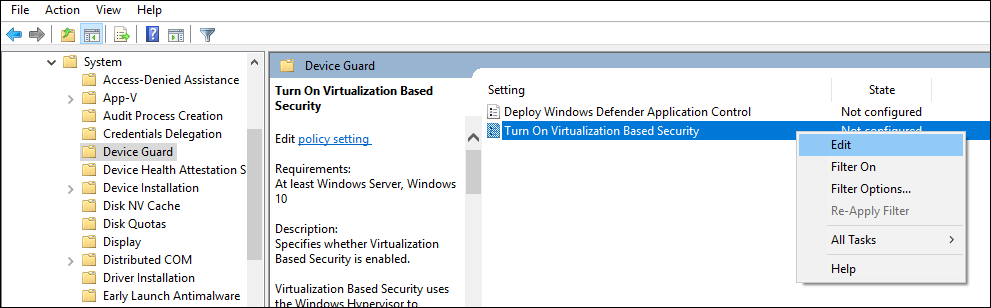

# Deploy Windows Defender Device Guard: enable virtualization-based security

**Applies to**
-   Windows 10
-   Windows Server 2016

Hardware-based security features, also called virtualization-based security or VBS, reinforce Windows Defender Application Control. There are a few steps to configure virtualization-based security:

1.  **Decide whether to use the procedures in this topic, or to use the Windows Defender Device Guard readiness tool**. To enable VBS, you can use [the Device Guard and Credential Guard hardware readiness tool](https://www.microsoft.com/en-us/download/details.aspx?id=53337) or follow the procedures in this topic.

2.  **Verify that hardware and firmware requirements are met**. Verify that your client computers have the hardware and firmware to run VBS. For a list of requirements, see [Hardware, firmware, and software requirements for Windows Defender Device Guard](requirements-and-deployment-planning-guidelines-for-device-guard.md#hardware-firmware-and-software-requirements-for-windows-defender-device-guard).

3.  **Enable the necessary Windows features**. You can use the [hardware readiness tool](https://www.microsoft.com/en-us/download/details.aspx?id=53337) or see [Windows feature requirements for virtualization-based security](#windows-feature-requirements-for-virtualization-based-security-and-device-guard).

4.  **Enable additional features as desired**. You can use the [hardware readiness tool](https://www.microsoft.com/en-us/download/details.aspx?id=53337) or see [Enable virtualization-based security (VBS)](#enable-virtualization-based-security-vbs-and-device-guard). 

## Windows feature requirements for virtualization-based security and Windows Defender Device Guard

Make sure these operating system features are enabled before you can enable VBS:

- Beginning with Windows 10, version 1607 or Windows Server 2016:<br> 
Hyper-V Hypervisor, which is enabled automatically. No further action is needed.

- With an earlier version of Windows 10:<br> 
Hyper-V Hypervisor and Isolated User Mode (shown in Figure 1).
 


**Figure 1. Enable operating system features for VBS, Windows 10, version 1511**

> [!NOTE]
> You can configure these features by using Group Policy or Dism.exe, or manually by using Windows PowerShell or the Windows Features dialog box.

## Enable Virtualization Based Security (VBS) and Windows Defender Device Guard

If you don't want to use the [hardware readiness tool](https://www.microsoft.com/en-us/download/details.aspx?id=53337), you can use Group Policy or the Registry to enable VBS.

### Use Group Policy to enable VBS and Windows Defender Device Guard

1.  To create a new GPO, right-click the OU where you want to link the GPO, and then click **Create a GPO in this domain, and Link it here**.

    

    Figure 2. Create a new OU-linked GPO

2.  Give the new GPO a name, then right-click the new GPO, and click **Edit**.

4.  Within the selected GPO, navigate to Computer Configuration\\Policies\\Administrative Templates\\System\\Device Guard. Right-click **Turn On Virtualization Based Security**, and then click **Edit**.

    

    Figure 3. Enable VBS

5.  Select the **Enabled** button. For **Select Platform Security Level**:

    - **Secure Boot** provides as much protection as a computer’s hardware can support. If the computer does not have input/output memory management units (IOMMUs), enable **Secure Boot**.
    - **Secure Boot with DMA** enables Secure Boot—and VBS itself—only on a computer that supports DMA, that is, a computer with IOMMUs. With this setting, any computer without IOMMUs will not have VBS (hardware-based) protection, although it can have Windows Defender Application Control enabled.<br>For information about how VBS uses the hypervisor to strengthen protections provided by a code integrity policy, see [How Windows Defender Device Guard features help protect against threats](introduction-to-device-guard-virtualization-based-security-and-code-integrity-policies.md#how-windows-defender-device-guard-features-help-protect-against-threats).

    For **Virtualization Based Protection of Code Integrity**:

    - Beginning with Windows 10, version 1607 and Windows Server 2016:<br>For an initial deployment or test deployment, we recommend **Enabled without lock**.<br>When your deployment is stable, we recommend changing to **Enabled with UEFI lock**. This option helps protect the registry from tampering, either through malware or by an unauthorized person.

    - With earlier versions of Windows 10:<br>Select the **Enable Virtualization Based Protection of Code Integrity** check box.

    

    Figure 5. Configure VBS, Lock setting (in Windows 10, version 1607)

7.  Close the Group Policy Management Editor, and then restart the Windows 10 test computer. The settings will take effect upon restart.

8.  Check Device Guard logs in Event Viewer at **Applications and Services Logs\\Microsoft\\Windows\\DeviceGuard-GPEXT\\Operational** for Event ID 7000, which contains the selected settings within a GPO that has been successfully processed. This event is logged only when Group Policy is used.

### Use registry keys to enable VBS and Windows Defender Device Guard

Set the following registry keys to enable VBS and Windows Defender Device Guard. This provides exactly the same set of configuration options provided by Group Policy.

<!--This comment ensures that the Important above and the Warning below don't merge together. -->

> [!IMPORTANT]
> - Among the commands that follow, you can choose settings for **Secure Boot** and **Secure Boot with DMA**. In most situations, we recommend that you choose **Secure Boot**. This option provides Secure Boot with as much protection as is supported by a given computer’s hardware. A computer with input/output memory management units (IOMMUs) will have Secure Boot with DMA protection. A computer without IOMMUs will simply have Secure Boot enabled.<br>In contrast, with **Secure Boot with DMA**, the setting will enable Secure Boot—and VBS itself—only on a computer that supports DMA, that is, a computer with IOMMUs. With this setting, any computer without IOMMUs will not have VBS (hardware-based) protection, although it can still have code integrity policies enabled.<br>For information about how VBS uses the hypervisor to strengthen protections provided by a code integrity policy, see [How Windows Defender Device Guard features help protect against threats](introduction-to-device-guard-virtualization-based-security-and-code-integrity-policies.md#how-windows-defender-device-guard-features-help-protect-against-threats).<br>
> - All drivers on the system must be compatible with virtualization-based protection of code integrity; otherwise, your system may fail. We recommend that you enable these features on a group of test computers before you enable them on users' computers.

#### For Windows 1607 and above

Recommended settings (to enable virtualization-based protection of Code Integrity policies, without UEFI Lock):

``` commands
reg add "HKLM\SYSTEM\CurrentControlSet\Control\DeviceGuard" /v "EnableVirtualizationBasedSecurity" /t REG_DWORD /d 1 /f

reg add "HKLM\SYSTEM\CurrentControlSet\Control\DeviceGuard" /v "RequirePlatformSecurityFeatures" /t REG_DWORD /d 1 /f

reg add "HKLM\SYSTEM\CurrentControlSet\Control\DeviceGuard" /v "Locked" /t REG_DWORD /d 0 /f

reg add "HKLM\SYSTEM\CurrentControlSet\Control\DeviceGuard\Scenarios\HypervisorEnforcedCodeIntegrity" /v "Enabled" /t REG_DWORD /d 1 /f

reg add "HKLM\SYSTEM\CurrentControlSet\Control\DeviceGuard\Scenarios\HypervisorEnforcedCodeIntegrity" /v "Locked" /t REG_DWORD /d 0 /f
```

If you want to customize the preceding recommended settings, use the following settings.

**To enable VBS**

``` command
reg add "HKLM\SYSTEM\CurrentControlSet\Control\DeviceGuard" /v "EnableVirtualizationBasedSecurity" /t REG_DWORD /d 1 /f
```

**To enable VBS and require Secure boot only (value 1)**

``` command
reg add "HKLM\SYSTEM\CurrentControlSet\Control\DeviceGuard" /v "RequirePlatformSecurityFeatures" /t REG_DWORD /d 1 /f
```

> To enable **VBS with Secure Boot and DMA (value 3)**, in the preceding command, change **/d 1** to **/d 3**.

**To enable VBS without UEFI lock (value 0)**

``` command
reg add "HKLM\SYSTEM\CurrentControlSet\Control\DeviceGuard" /v "Locked" /t REG_DWORD /d 0 /f
```

> To enable **VBS with UEFI lock (value 1)**, in the preceding command, change **/d 0** to **/d 1**.

**To enable virtualization-based protection of Code Integrity policies**

``` command
reg add "HKLM\SYSTEM\CurrentControlSet\Control\DeviceGuard\Scenarios\HypervisorEnforcedCodeIntegrity" /v "Enabled" /t REG_DWORD /d 1 /f
```

**To enable virtualization-based protection of Code Integrity policies without UEFI lock (value 0)**

``` command
reg add "HKLM\SYSTEM\CurrentControlSet\Control\DeviceGuard\Scenarios\HypervisorEnforcedCodeIntegrity" /v "Locked" /t REG_DWORD /d 0 /f
```

> To enable **virtualization-based protection of Code Integrity policies with UEFI lock (value 1)**, in the preceding command, change **/d 0** to **/d 1**.

#### For Windows 1511 and below

Recommended settings (to enable virtualization-based protection of Code Integrity policies, without UEFI Lock):

``` command
reg add "HKLM\SYSTEM\CurrentControlSet\Control\DeviceGuard" /v "EnableVirtualizationBasedSecurity" /t REG_DWORD /d 1 /f

reg add "HKLM\SYSTEM\CurrentControlSet\Control\DeviceGuard" /v "RequirePlatformSecurityFeatures" /t REG_DWORD /d 1 /f

reg add "HKLM\SYSTEM\CurrentControlSet\Control\DeviceGuard" /v "HypervisorEnforcedCodeIntegrity" /t REG_DWORD /d 1 /f

reg add "HKLM\SYSTEM\CurrentControlSet\Control\DeviceGuard" /v "Unlocked" /t REG_DWORD /d 1 /f
```

If you want to customize the preceding recommended settings, use the following settings.

**To enable VBS (it is always locked to UEFI)**

``` command
reg add "HKLM\SYSTEM\CurrentControlSet\Control\DeviceGuard" /v "EnableVirtualizationBasedSecurity" /t REG_DWORD /d 1 /f
```

**To enable VBS and require Secure boot only (value 1)**

``` command
reg add "HKLM\SYSTEM\CurrentControlSet\Control\DeviceGuard" /v "RequirePlatformSecurityFeatures" /t REG_DWORD /d 1 /f
```

> To enable **VBS with Secure Boot and DMA (value 3)**, in the preceding command, change **/d 1** to **/d 3**.

**To enable virtualization-based protection of Code Integrity policies (with the default, UEFI lock)**

``` command
reg add "HKLM\SYSTEM\CurrentControlSet\Control\DeviceGuard" /v "HypervisorEnforcedCodeIntegrity" /t REG_DWORD /d 1 /f
```

**To enable virtualization-based protection of Code Integrity policies without UEFI lock**

``` command
reg add "HKLM\SYSTEM\CurrentControlSet\Control\DeviceGuard" /v "Unlocked" /t REG_DWORD /d 1 /f
```

### Validate enabled Windows Defender Device Guard hardware-based security features

Windows 10 and Windows Server 2016 have a WMI class for related properties and features: *Win32\_DeviceGuard*. This class can be queried from an elevated Windows PowerShell session by using the following command:

` Get-CimInstance –ClassName Win32_DeviceGuard –Namespace root\Microsoft\Windows\DeviceGuard`

> [!NOTE]
> The *Win32\_DeviceGuard* WMI class is only available on the Enterprise edition of Windows 10.

The output of this command provides details of the available hardware-based security features as well as those features that are currently enabled. 

#### AvailableSecurityProperties

This field helps to enumerate and report state on the relevant security properties for Windows Defender Device Guard.

| Value  | Description |
|--------|-------------|
| **0.** | If present, no relevant properties exist on the device. |
| **1.** | If present, hypervisor support is available.            |
| **2.** | If present, Secure Boot is available.                   |
| **3.** | If present, DMA protection is available.                |
| **4.** | If present, Secure Memory Overwrite is available.       |
| **5.** | If present, NX protections are available.               |
| **6.** | If present, SMM mitigations are available.              |

> [!NOTE]
> 4, 5, and 6 were added as of Windows 10, version 1607.

#### InstanceIdentifier

A string that is unique to a particular device. Valid values are determined by WMI. 

#### RequiredSecurityProperties

This field describes the required security properties to enable virtualization-based security.

| Value  | Description |
|--------|-------------|
| **0.** | Nothing is required.                                |
| **1.** | If present, hypervisor support is needed.           |
| **2.** | If present, Secure Boot is needed.                  |
| **3.** | If present, DMA protection is needed.               |
| **4.** | If present, Secure Memory Overwrite is needed.      |
| **5.** | If present, NX protections are needed.              |
| **6.** | If present, SMM mitigations are needed.             |

> [!NOTE]
> 4, 5, and 6 were added as of Windows 10, version 1607.

#### SecurityServicesConfigured 

This field indicates whether the Windows Defender Credential Guard or HVCI service has been configured.

| Value  | Description |
|--------|-------------|
| **0.** | No services configured.                                           |
| **1.** | If present, Windows Defender Credential Guard is configured.      |
| **2.** | If present, HVCI is configured.                                   |

#### SecurityServicesRunning

This field indicates whether the Windows Defender Credential Guard or HVCI service is running.

| Value  | Description |
|--------|-------------|
| **0.** | No services running.                                         |
| **1.** | If present, Windows Defender Credential Guard is running.    |
| **2.** | If present, HVCI is running.                                 |


#### Version

This field lists the version of this WMI class. The only valid value now is **1.0**.

#### VirtualizationBasedSecurityStatus

This field indicates whether VBS is enabled and running.

| Value  | Description |
|--------|-------------|
| **0.** | VBS is not enabled.                  |
| **1.** | VBS is enabled but not running.      |
| **2.** | VBS is enabled and running.          |


#### PSComputerName

This field lists the computer name. All valid values for computer name.

Another method to determine the available and enabled Windows Defender Device Guard features is to run msinfo32.exe from an elevated PowerShell session. When you run this program, the Windows Defender Device Guard properties are displayed at the bottom of the **System Summary** section, as shown in Figure 6.


Figure 6. Windows Defender Device Guard properties in the System Summary

## Related topics

- [Introduction to Windows Defender Device Guard: virtualization-based security and code integrity policies](introduction-to-device-guard-virtualization-based-security-and-code-integrity-policies.md)

- [Deploy Windows Defender Device Guard: deploy code integrity policies](deploy-device-guard-deploy-code-integrity-policies.md)
