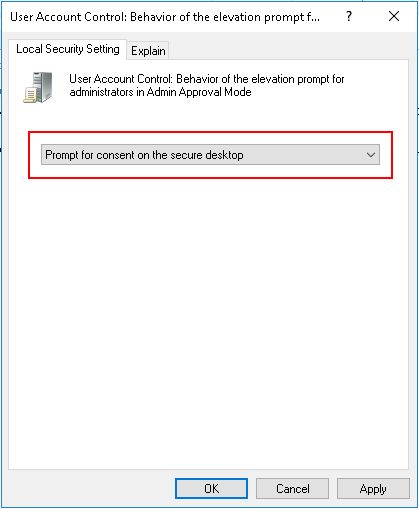

# User Account Control: Admin Approval Mode for the Built-in Administrator account
**Applies to**
-   Windows 10

Describes the best practices, location, values, policy management and security considerations for the **User Account Control: Admin Approval Mode for the Built-in Administrator account** security policy setting.

## Reference

This policy setting determines the behavior of Admin Approval Mode for the built-in administrator account.
When the Admin Approval Mode is enabled, the local administrator account functions like a standard user account, but it has the ability to elevate privileges without logging on by using a different account. In this mode, any operation that requires elevation of privilege displays a prompt that allows the administrator to permit or deny the elevation of privilege. If Admin Approval Mode is not enabled, the built-in Administrator account logs on in Windows XP Mode, and it runs all applications by default with full administrative privileges. By default, this setting is set to **Disabled**.

>**Note:**  If a computer is upgraded from a previous version of the Windows operating system, and the administrator account is the only account on the computer, the built-in administrator account remains enabled, and this setting is also enabled.
 
### Possible values

-   Enabled

    The built-in administrator account logs on in Admin Approval Mode so that any operation that requires elevation of privilege displays a prompt that provides the administrator the option to permit or deny the elevation of privilege.

-   Disabled

    The built-in administrator account logs on in Windows XP Mode, and it runs all applications by default with full administrative privileges.

### Best practices

-   Do not enable the built-in administrator account on the client computer, but use the standard user account and User Account Control (UAC).

### Location

Computer Configuration\\Windows Settings\\Security Settings\\Local Policies\\Security Options

### Default values

The following table lists the actual and effective default values for this policy. Default values are also listed on the policy’s property page.

| Server type or GPO | Default value |
| - | - |
| Default Domain Policy| Not defined|
| Default Domain Controller Policy | Not defined| 
| Stand-Alone Server Default Settings | Disabled| 
| DC Effective Default Settings | Disabled| 
| Member Server Effective Default Settings | Disabled| 
| Client Computer Effective Default Settings | Disabled| 
 

## To enable Admin Approval Mode
If you wish to use Admin Approval Mode with an active built-in administrator account, follow these steps:

1. In the search box, type gpedit.exe.
2. From the Local Group Policy editor, navigate to **Computer Configuration** > **Windows Settings** > **Security Settings** > **Local Policies** > **Security Options**.

   

3. Double-click the policy **UAC-Admin-Approval-Mode-for-the-Built-in-Administrator-account**.
4. On the **Local Security Setting** tab, make sure that the **Enabled** radio button is selected and then click OK.
5. Configure the local security setting  **UAC-Behavior-of-the-elevation-prompt-for-administrators-in-Admin-Approval-Mode** by setting it to **Prompt for consent on the secure desktop** and then click OK.

    

As an alternative way to carry out step 5, you can also type "UAC" in the search box, and then from the User Account Control Settings dialog box, set the slider control to **Notify me only when apps try to make changes to my computer (default)**.

6. To activate the new setting, log out and then log in again.

## Policy management

This section describes features and tools that are available to help you manage this policy.

### Restart requirement

None. Changes to this policy become effective without a device restart when they are saved locally or distributed through Group Policy.

## Security considerations

This section describes how an attacker might exploit a feature or its configuration, how to implement the countermeasure, and the possible negative consequences of countermeasure implementation.

### Vulnerability

 An attack vector for malicious programs is to discover the password of the administrator account because that user account was created for all installations of Windows. To address this risk, the built-in administrator account is disabled in computers running at least Windows Vista. In computers running at least Windows Server 2008, the administrator account is enabled, and the password must be changed the first time the Administrator logs on. In a default installation of a computer running at least Windows Vista, accounts with administrative control over the computer are initially set up in one of two ways:

-   If the computer is not joined to a domain, the first user account you create has the equivalent permissions as a local administrator.
-   If the computer is joined to a domain, no local administrator accounts are created. The enterprise or domain administrator must log on to the computer and create a local administrator account if one is warranted.

### Countermeasure

Enable the **User Account Control: Admin Approval Mode for the Built-in Administrator account** setting if you have the built-in Administrator account enabled.

### Potential impact

Users who log on by using the local administrator account are prompted for consent whenever a program requests an elevation in privilege.
## Related topics

- [Security Options](/windows/device-security/security-policy-settings/security-options)
