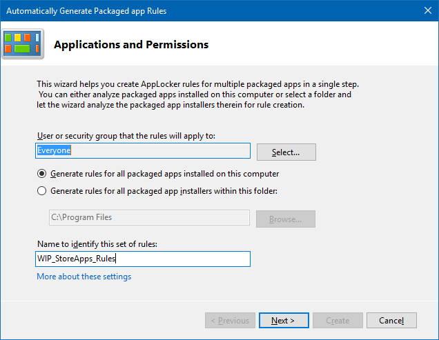
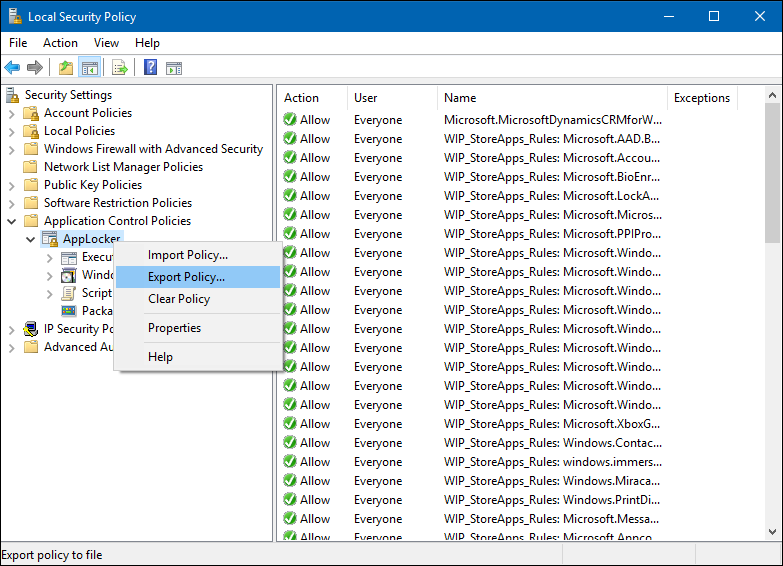
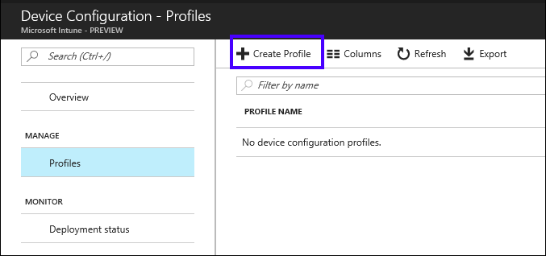
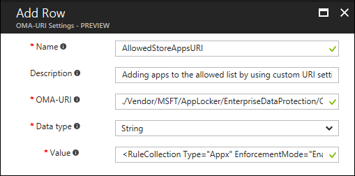
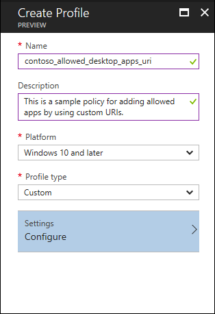
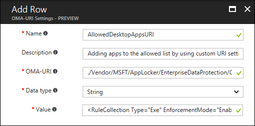

# Add apps to your Windows Information Protection (WIP) policy by using the Microsoft Azure Intune custom URI functionality
**Applies to:**

-   Windows 10, version 1703
-   Windows 10 Mobile, version 1703

You can add apps to your Windows Information Protection (WIP) protected app list using the Microsoft Azure Intune custom URI functionality and AppLocker. For more info about how to create a custom URI using Intune, [Windows 10 custom policy settings in Microsoft Azure Intune](https://go.microsoft.com/fwlink/p/?LinkID=691330).

>[!IMPORTANT]
>Results can be unpredictable if you configure your policy using both the UI and the Custom URI method together. We recommend using a single method for each policy.

## Add Store apps
1.	Open the Local Security Policy snap-in (SecPol.msc).
    
2.	In the left pane, expand **Application Control Policies**, expand **AppLocker**, and then click **Packaged App Rules**, and then right-click and choose **Automatically Generate Rules**.

    The **Automatically Generate Packaged app Rules** wizard opens, letting you create WIP-protected app policies for all the installed apps on a device or for packaged apps within a specific folder.

    

3.  In the **Applications and Permissions** screen, keep the default of **Everyone** in the **User or security group that the rules will apply to** box.

    Keeping this value applies your WIP policy to the managed device, not to a single user or group of users.

4. Type the name you’ll use to tag the rules into the **Name to identify this set of rules** box, and then click **Next**.

    This name should be easily recognizable. For the purposes of this topic, we've used *WIP_StoreApps_Rules*.

    

5. In the **Rule Preferences** screen, keep the default settings, and then click **Next** to start generating the rules.

    >[!Note]
    >We recommend that you use **Publisher** rules because they only work with apps you've specifically defined and they can be configured to not require updating simply because a new version came out.<p>If you can't use **Publisher** rules, we then recommend that you use **File hash** rules. **File hash** rules are a secure alternative that can be used on unsigned code. The primary disadvantage to **File hash** is that every time a binary changes (such as, through servicing updates or upgrades), you'll need to create a new rule.

    

6.  In the **Review Rules** screen, look over your rules to make sure they’re right, and then click **Create** to add them to your collection of rules.

    

7.  In the left pane, right-click **AppLocker**, click **Export Policies**, go to where you want to save the XML file and type a file name, click **Save**, and then clear your AppLocker rules.

    >[!Important]
    >Be aware that what you're saving are the actual AppLocker rules using your local policy. You don't want to apply these rules to your employee devices, you just want to use them to create and export the XML content. You must delete the AppLocker rules before you apply your policy.

    

8.  Open the Microsoft Azure Intune mobile application management console, click **Device configuration**, and then click **Create Profile**.

    

9.  In the **Create Profile** blade, type a name for your profile, such as *contoso_allowed_store_apps_uri*, into the **Name** box, add an optional description for your policy into the **Description** box, select **Windows 10 and later** from the **Platform** dropdown box, select **Custom** from the **Profile type** dropdown box, and then click **Configure**.

    

10. In the **Custom OMA-URI Settings** blade, click **Add**.

11. In the **Add Row** blade, type:

    - **Name.** Type a name for your setting, such as *AllowedStoreAppsURI*.
    
    - **Description.** Type an optional description for your setting.
    
    - **OMA-URI.** Type _./Vendor/MSFT/AppLocker/EnterpriseDataProtection/&gt;your_enterprise_name&lt;/StoreApp EXE_ into the box.

    - **Data type.** Select **String** from the dropdown box.
    
    - **Value.** To find the text to type here, follow these steps:

        1. Open File Explorer, go to the location where you saved your exported XML file from above, and open it using an XML editor, such as Notepad.

        2. Copy the text that includes the **Type** of `Appx` within the **RuleCollection** tags, pasting this info into the **Value** box. For example:
        
            ```
                <RuleCollection Type="Appx" EnforcementMode="Enabled"><your_xml_rules_here></RuleCollection>
            ```
        

5. Click **OK** to save your setting info in the **Add Row** blade, and then click **OK** in the **Custom OMA-URI Settings** blade to save the setting with your policy.

6. Click **Create** to create the policy, including your OMA_URI info.

    After saving the policy, you’ll need to deploy it to your employee’s devices. For more info, see the [Deploy your Windows Information Protection (WIP) policy](deploy-wip-policy-using-intune.md) topic.

## Add Desktop apps
1.	Open the Local Security Policy snap-in (SecPol.msc).
    
2.	In the left pane, expand **Application Control Policies**, expand **AppLocker**, and then click **Packaged App Rules**, and then right-click and choose **Automatically Generate Rules**.

    The **Automatically Generate Packaged app Rules** wizard opens, letting you create WIP-protected app policies for all the installed apps on a device or for packaged apps within a specific folder.

    

3.  In the **Applications and Permissions** screen, keep the default of **Everyone** in the **User or security group that the rules will apply to** box.

    Keeping this value applies your WIP policy to the managed device, not to a single user or group of users.

4. Type the name you’ll use to tag the rules into the **Name to identify this set of rules** box, and then click **Next**.

    This name should be easily recognizable. For the purposes of this topic, we've used *WIP_DesktopApps_Rules*.

    

5. In the **Rule Preferences** screen, keep the default settings, and then click **Next** to start generating the rules.

    

    >[!Important]
    >You can also use **Path** rules instead of the **File hash** if you have concerns about unsigned files potentially changing the hash value if they're updated in the future.
    
    >[!Note]
    >We recommend that you use **Publisher** rules because they only work with apps you've specifically defined and they can be configured to not require updating simply because a new version came out.<p>If you can't use **Publisher** rules, we then recommend that you use **File hash** rules. **File hash** rules are a secure alternative that can be used on unsigned code. The primary disadvantage to **File hash** is that every time a binary changes (such as, through servicing updates or upgrades), you'll need to create a new rule.<p>Finally, there's **Path** rules. **Path** rules are easier to set up and maintain, but can let apps bypass Windows Information Protection (WIP) by simply renaming and moving an unallowed file to match one of the apps on the **Protected App** list. For example, if your **Path** rule says to allow `%PROGRAMFILES%/NOTEPAD.EXE`, it becomes possible to rename DisallowedApp.exe to Notepad.exe, move it into the specified path above, and have it suddenly be allowed.

6.  In the **Review Rules** screen, look over your rules to make sure they’re right, and then click **Create** to add them to your collection of rules.

    

7.  In the left pane, right-click **AppLocker**, click **Export Policies**, go to where you want to save the XML file and type a file name, click **Save**, and then clear your AppLocker rules.

    >[!Important]
    >Be aware that what you're saving are the actual AppLocker rules using your local policy. You don't want to apply these rules to your employee devices, you just want to use them to create and export the XML content. You must delete the AppLocker rules before you apply your policy.

    

8. Open the Microsoft Azure Intune mobile application management console, click **Device configuration**, and then click **Create Profile**.

    

9.  In the **Create Profile** blade, type a name for your profile, such as *contoso_allowed_desktop-apps_uri*, into the **Name** box, add an optional description for your policy into the **Description** box, select **Windows 10 and later** from the **Platform** dropdown box, select **Custom** from the **Profile type** dropdown box, and then click **Configure**.

    

10. In the **Custom OMA-URI Settings** blade, click **Add**.

11. In the **Add Row** blade, type:

    - **Name.** Type a name for your setting, such as *AllowedDesktopAppsURI*.
    
    - **Description.** Type an optional description for your setting.
    
    - **OMA-URI.** Type _./Vendor/MSFT/AppLocker/EnterpriseDataProtection/&gt;your_enterprise_name&lt;/EXE_ into the box.

    - **Data type.** Select **String** from the dropdown box.
    
    - **Value.** To find the text to type here, follow these steps:

        1. Open File Explorer, go to the location where you saved your exported XML file from above, and open it using an XML editor, such as Notepad.

        2. Copy the text that includes the **Type** of `Exe` within the **RuleCollection** tags, pasting this info into the **Value** box. For example:
        
            ```
                <RuleCollection Type="Exe" EnforcementMode="Enabled"><your_xml_rules_here></RuleCollection>
            ```

        

5. Click **OK** to save your setting info in the **Add Row** blade, and then click **OK** in the **Custom OMA-URI Settings** blade to save the setting with your policy.

6. Click **Create** to create the policy, including your OMA_URI info.

    After saving the policy, you’ll need to deploy it to your employee’s devices. For more info, see the [Deploy your Windows Information Protection (WIP) policy](deploy-wip-policy-using-intune.md) topic.

>[!NOTE]
>Help to make this topic better by providing us with edits, additions, and feedback. For info about how to contribute to this topic, see [Contributing to TechNet content](https://github.com/Microsoft/windows-itpro-docs/blob/master/CONTRIBUTING.md).

## Related topics
- [Create a Windows Information Protection (WIP) policy using Microsoft Azure Intune](create-wip-policy-using-intune.md)
- [Deploy your Windows Information Protection (WIP) policy](deploy-wip-policy-using-intune.md)
- [Create and deploy a VPN policy for Windows Information Protection (WIP) using Microsoft Azure Intune](create-vpn-and-wip-policy-using-intune.md)


 

 


