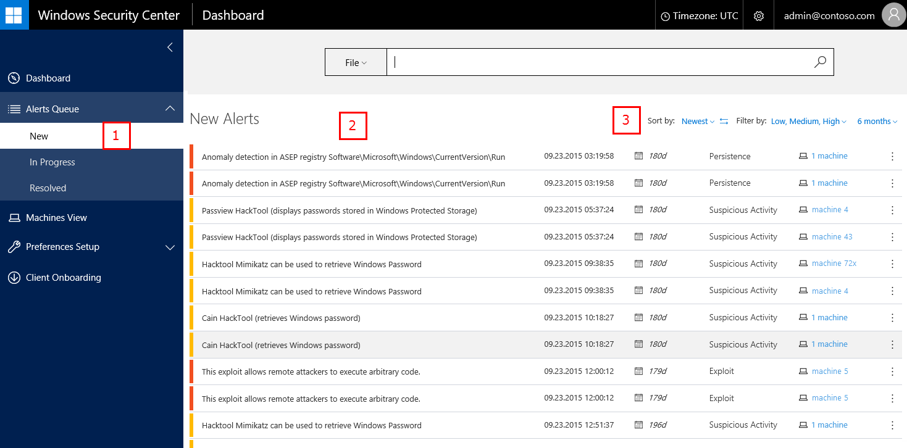

# View and organize the Windows Defender Advanced Threat Protection Alerts queue

- Windows 10 Insider Preview

[Some information relates to pre-released product which may be substantially modified before it's commercially released. Microsoft makes no warranties, express or implied, with respect to the information provided here.]

As a security operations team member, you can manage Windows Defender ATP alerts as part of your routine activities. Alerts will appear in the respective queues according to their current status.

To see a list of alerts, click any of the queues under the **Alerts queue** option in the navigation pane.

> **Note**&nbsp;&nbsp;By default, the queues are sorted from newest to oldest.

The following table and screenshot demonstrate the main areas of the **Alerts queue**.

Highlighted area|Area name|Description
:---|:---|:---
(1)|**Alerts queue**| Select to show **New**, **In Progress**, or **Resolved alerts**
(2)|Alerts|Each alert shows:<ul><li>The severity of an alert as a colored bar</li><li>A short description of the alert, including the name of the threat actor (in cases where the attribution is possible)</li><li>The last occurrence of the alert on any machine</li><li>The number of days the alert has been in the queue</li><li>The general category or type of alert, or the alert's kill-chain stage</li><li>The affected machine (if there are multiple machines, the number of affected machines will be shown)</li><li>A **Manage Alert** menu icon  that allows you to update the alert's status and add comments</li></ul>Clicking an alert expands to display more information about the threat and brings you to the date in the timeline when the alert was detected.
(3)|Alerts sorting and filters | You can sort alerts by: <ul><li>**Newest** (when the threat was last seen on your network)</li><li>**Time in queue** (how long the threat has been in your queue)</li><li>**Severity**</li></ul>You can also filter the displayed alerts by:<ul><li>Severity</li><li>Time period</li></ul>See [Windows Defender ATP alerts](use-windows-defender-advanced-threat-protection.md#windows-defender-atp-alerts) for more details.

##Sort and filter the Alerts queue
You can filter and sort (or "pivot") the Alerts queue to identify specific alerts based on certain criteria.
There are three mechanisms to pivot the queue against:

1. Sort the queue by opening the drop-down menu in the **Sort by** field and choosing:

  - **Newest** - Sorts alerts based on when the alert was last seen on an endpoint. 
  - **Time in queue** - Sorts alerts by the length of time an alert has been in the queue.
  - **Severity** - Sorts alerts by their level of severity.

2. Filter alerts by their **Severity** by opening the drop-down menu in the **Filter by** field and selecting one or more of the check boxes:

  - High (Red) - Threats often associated with APT. These alerts pose a high risk due to the severity of the damage they might inflict on endpoints.
  - Medium (Orange) - Threats considered to be abnormal or suspicious in nature such as anomalous registry modifications and loading of executable files.
  - Low (Yellow) - Threats associated with prevalent malware and hack-tools that pose a lower risk to endpoints.

3. Limit the queue to see alerts from various set periods by clicking the drop-down menu in the date range field (by default, this is selected as **6 months**):

  - **1 day**
  - **3 days**
  - **7 days**
  - **30 days**
  - **6 months**

  > **Note**&nbsp;&nbsp;You can change the sort order (for example, from most recent to least recent) by clicking the sort order icon 
  
### Related topics
  
- [View the Windows Defender Advanced Threat Protection Dashboard](dashboard-windows-advanced-threat-protection.md)
- [Investigate machines in the Windows Defender ATP Machines view](machines-view-windows-advanced-threat-protection.md)
- [Submit files to the Windows Defender ATP Deep analysis feature](deep-analysis-windows-advanced-threat-protection.md)
- [Manage Windows Defender Advanced Threat Protection alerts](manage-alerts-windows-advanced-threat-protection.md)
