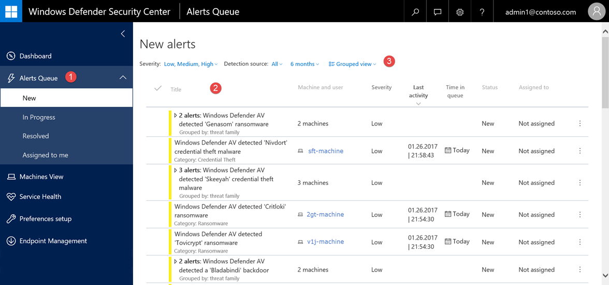

# Alerts queue overview

**Applies to:**

- Windows 10 Enterprise
- Windows 10 Education
- Windows 10 Pro
- Windows 10 Pro Education
- Windows Defender Advanced Threat Protection (Windows Defender ATP)

The **Alerts queue** shows a list of alerts that were flagged from endpoints in your network. Alerts appear in queues according to their current status. In any of the queues, you'll see details such as the severity of alerts and the number of machines where the alerts were seen.

Alerts are organized in three queues, by their workflow status:

- **New**
- **In progress**
- **Resolved**
- **Assigned to me**

To see a list of alerts, click any of the queues under the **Alerts queue** option in the navigation pane.

> [!NOTE]
> By default, the queues are sorted from newest to oldest.

## Sort and filter the alerts
You can sort and filter the alerts by using the available filters or clicking columns that allow you to sort the view in ascending or descending order.

### Filter the alerts list
(1) You can use the following filters to limit the list of alerts displayed during an investigation:

**Severity** 

Alert severity | Description
:---|:---
High  (Red) | Threats often associated with advanced persistent threats (APT). These alerts indicate a high risk due to the severity of damage they can inflict on endpoints.
Medium  (Orange) | Threats rarely observed in the organization, such as anomalous registry change, execution of suspicious files, and observed behaviors typical of attack stages.
Low  (Yellow) | Threats associated with prevalent malware and hack-tools that do not appear to indicate an advanced threat targeting the organization.
Informational  (Grey) | Informational alerts are those that might not be considered harmful to the network but might be good to keep track of.

Reviewing the various alerts and their severity can help you decide on the appropriate action to protect your organization's endpoints.

**Detection source** 
- Windows Defender AV
- Windows Defender ATP

>[!NOTE] The Windows Defender AV filter will only appear if your endpoints are using Windows Defender as the default real-time protection antimalware product.

**Time period** 
- 1 day
- 3 days
- 7 days
- 30 days
- 6 months

**View** 
- **Flat view** - Lists alerts individually with alerts that has the latest activity displayed at the top surfaces.
- **Grouped view** - Groups alerts by alert ID, file hash, malware family and others to enable more efficient alert triage and management. Alert grouping reduces the number of rows in the queue by aggregating categories together.

The group view allows for efficient alert triage and management.

### Use the Alert management pane [JOEY - FIX THE NUMBERING, SELECT ALERT FIRST, MAKE NUMBER 4 TO NUMBER 2]
(2) Select alert  
Selecting an alert brings up the Alert management pane.

(3) You can take immediate action on an alert and see details about an alert from the Alert management pane. You can change the status of an alert from new, in progress, or resolved.

(4) Alert classification  
You can also select the alert classification to indicate if the alert is a true alert or a false alert.

You can also assign the alert to yourself if the alert is not yet being addressed, and view related activity on the machine.

(5) Comments and history  
View comments from other security operations personnel and see historical information about the alert or add your own comments.

### Bulk edit alerts
Select multiple alerts (Ctrl or Shift select) and manage or edit alerts together, which allows resolving multiple similar alerts in one go.

### Related topics
- [Understand the Windows Defender Advanced Threat Protection Dashboard](dashboard-windows-defender-advanced-threat-protection.md)
- [Investigate Windows Defender Advanced Threat Protection alerts](investigate-alerts-windows-defender-advanced-threat-protection.md)
- [Investigate machines in the Windows Defender ATP Machines view](investigate-machines-windows-defender-advanced-threat-protection.md)
- [Investigate a file associated with a Windows Defender ATP alert](investigate-files-windows-defender-advanced-threat-protection.md)
- [Investigate an IP address associated with a Windows Defender ATP alert](investigate-ip-windows-defender-advanced-threat-protection.md)
- [Investigate a domain associated with a Windows Defender ATP alert](investigate-domain-windows-defender-advanced-threat-protection.md)
- [Manage Windows Defender Advanced Threat Protection alerts](manage-alerts-windows-defender-advanced-threat-protection.md)

====================

The alerts view contains the following columns:
-	**Title** – A brief description of the alert
-	**Machine and user** – Machine where the alert was seen and the user entity associated with the alert
-	**Severity** – Alert severity level
-	**Last activity** – Last seen activity related to the alert
-	**Time in queue** – Number of days the alert has been in the queue
-	**Status** – Indicates the queue status
-	**Assigned to** – Shows who is addressing the alert

## Sort and filter the Alerts queue
You can filter and sort (or "pivot") the Alerts queue to identify specific alerts based on certain criteria.

(1) Sorting and filtering
- **Severity** - Low, medium, or high
- **Detection source** - Windows Defender Antivirus or Windows Defender
- **Time period** - 1, 3, 7, 30 days, or 6 months
- **Group view or Flat view**
  - Flat view -
  - Group view - sorts the alerts

(2) Alert management pane  
You can take immediate action on an alert and see details about an alert from the Alert management pane. You can change the status of an alert from new, in progress, or resolved.

(3) Alert classification  
You can also select the alert classification to indicate if the alert is a true alert or a false alert.

You can also assign the alert to yourself if the alert is not yet being addressed, and view related activity on the machine.

(4) Select alert  
Selecting an alert brings up the Alert management pane.

(5) Comments and history  
View comments from other security operations personnel and see historical information about the alert or add your own comments.  

You can also edit alerts by bulk by selecting multiple alerts (Ctrl or Shift select) and manage or edit them together, which allows resolving multiple similar alerts in one go.

The following table and screenshot demonstrate the main areas of the **Alerts queue**.

Highlighted area|Area name|Description
:---|:---|:---
(1)|**Alerts queue**| Select to show **New**, **In Progress**, **Resolved alerts**, or **Assigned to me**
(2)|Alerts|Each alert shows:<ul><li>The severity of an alert as a colored bar</li><li>A short description of the alert, including the category and name of the threat actor (in cases where the attribution is possible)</li><li>The machine and user associated to the alert</li><li>The severity of the alert</li><li>The date when the last activity was seen</li><li>The number of days the alert has been in the queue</li><li>The status of the alert in the queue</li><li>Who the alert is assigned to</li><li>A **Manage Alert** menu icon  that allows you to manage the alert and go to the machine timeline</li></ul>Selecting an alert brings up the alert management pane which shows information on the alert such as its status in the queue, alert classification, who is addressing the alert, related activity on the machine, and historical information.
(3)|Alerts sorting and filters | You can sort alerts by: <ul><li>**Severity**</li><li>**Detection source**</li><li>**Time period** </li><li>**Group view or Flat view**  </li></ul> For more information, see [Sort and filter the Alerts queue](#sort-and-filter-the-alerts-queue) for more details.
