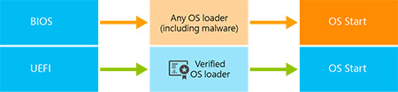

# BitLocker Countermeasures

**Applies to**

-   Windows 10

Windows uses technologies including TPM, Secure Boot, Trusted Boot, and Early Launch Antimalware (ELAM) to protect against attacks on the BitLocker encryption key.

BitLocker is part of a strategic approach to securing mobile data through encryption technology. Data on a lost or stolen computer is vulnerable to unauthorized access, either by running a software attack tool against it or by transferring the computer’s hard disk to a different computer. Today, BitLocker helps mitigate unauthorized data access on lost or stolen computers before the operating system is started by:

-   **Encrypting the hard drives on your computer.** For example, you can turn on BitLocker for your operating system drive, a fixed data drive, or a removable data drive (such as a USB flash drive). Turning on BitLocker for your operating system drive encrypts all system files on the operating system drive, including the swap files and hibernation files.

-   **Ensuring the integrity of early boot components and boot configuration data.** On devices that have a TPM version 1.2 or higher, BitLocker uses the enhanced security capabilities of the TPM to help ensure that your data is accessible only if the computer’s boot components appear unaltered and the encrypted disk is located in the original computer.

The sections that follow provide more detailed information about the different technologies that Windows uses to protect against attacks on the BitLocker encryption key in four different boot phases: before startup, during pre-boot, during startup, and finally after startup.

### Protection before startup

Before Windows starts, you must rely on security features implemented as part of the device hardware, including TPM andSecure Boot. Fortunately, many modern computers feature TPM.

**Trusted Platform Module**

Software alone isn’t sufficient to protect a system. After an attacker has compromised software, the software might be unable to detect the compromise. Therefore, a single successful software compromise results in an untrusted system that might never be detected. Hardware, however, is much more difficult to modify.

A TPM is a microchip designed to provide basic security-related functions, primarily involving encryption keys. The TPM is usually installed on the motherboard of a computer and communicates with the rest of the system through a hardware bus. Physically, TPMs are designed to be tamper-proof. If an attacker tries to physically retrieve data directly from the chip, they’ll probably destroy the chip in the process.

By binding the BitLocker encryption key with the TPM and properly configuring the device, it’s nearly impossible for an attacker to gain access to the BitLocker-encrypted data without obtaining an authorized user’s credentials. Therefore, computers with a TPM can provide a high level of protection against attacks that attempt to directly retrieve the BitLocker encryption key.

For more info about TPM, see [Trusted Platform Module](trusted-platform-module-technology-overview.md).

**UEFI and Secure Boot**

No operating system can protect a device when the operating system is offline. For that reason, Microsoft worked closely with hardware vendors to require firmware-level protection against boot and rootkits that might compromise an encryption solution’s encryption keys.

The UEFI is a programmable boot environment introduced as a replacement for BIOS, which has for the most part remained unchanged for the past 30 years. Like BIOS, PCs start UEFI before any other software; it initializes devices, and UEFI then starts the operating system’s bootloader. As part of its introduction into the pre–operating system environment, UEFI serves a number of purposes, but one of the key benefits is to protect newer devices against a sophisticated type of malware called a bootkit through the use of its Secure Boot feature.

Recent implementations of UEFI (starting with version 2.3.1) can verify the digital signatures of the device’s firmware before running it. Because only the PC’s hardware manufacturer has access to the digital certificate required to create a valid firmware signature, UEFI can prevent firmware-based bootkits. Thus, UEFI is the first link in the chain of trust.

Secure Boot is the foundation of platform and firmware security and was created to enhance security in the pre-boot environment regardless of device architecture. Using signatures to validate the integrity of firmware images before they are allowed to execute, Secure Boot helps reduce the risk of bootloader attacks. The purpose of Secure Boot is to block untrusted firmware and bootloaders (signed or unsigned) from being able to start on the system.

With the legacy BIOS boot process, the pre–operating system environment is vulnerable to attacks by redirecting bootloader handoff to possible malicious loaders. These loaders could remain undetected to operating system and antimalware software. The diagram in Figure 1 contrasts the BIOS and UEFI startup processes.

**Figure 1.** The BIOS and UEFI startup processes

With Secure Boot enabled, UEFI, in coordination with the TPM, can examine the bootloader and determine whether it’s trustworthy. To determine whether the bootloader is trustworthy, UEFI examines the bootloader’s digital signature. Using the digital signature, UEFI verifies that the bootloader was signed using a trusted certificate.

If the bootloader passes these two tests, UEFI knows that the bootloader isn’t a bootkit and starts it. At this point, Trusted Boot takes over, and the Windows bootloader, using the same cryptographic technologies that UEFI used to verify the bootloader, then verifies that the Windows system files haven’t been changed.

All Windows 8–certified devices must meet several requirements related to UEFI-based Secure Boot:

-   They must have Secure Boot enabled by default.

-   They must trust Microsoft’s certificate (and thus any bootloader Microsoft has signed).

-   They must allow the user to configure Secure Boot to trust other signed bootloaders.

-   Except for Windows RT devices, they must allow the user to completely disable Secure Boot.

These requirements help protect you from rootkits while allowing you to run any operating system you want. You have three options for running non-Microsoft operating systems:

-   **Use an operating system with a certified bootloader.** Microsoft can analyze and sign non-Microsoft bootloaders so that they can be trusted. The Linux community is using this process to enable Linux to take advantage of Secure Boot on Windows-certified devices.

-   **Configure UEFI to trust your custom bootloader.** Your device can trust a signed, non-certified bootloader that you specify in the UEFI database, allowing you to run any operating system, including homemade operating systems.

-   **Turn off Secure Boot.** You can turn off Secure Boot. This does not help protect you from bootkits, however.

To prevent malware from abusing these options, the user has to manually configure the UEFI firmware to trust a non-certified bootloader or to turn off Secure Boot. Software cannot change the Secure Boot settings.

Any device that doesn’t require Secure Boot or a similar bootloader-verification technology, regardless of the architecture or operating system, is vulnerable to bootkits, which can be used to compromise the encryption solution.

UEFI is secure by design, but it’s critical to protect the Secure Boot configuration by using password protection. In addition, although several well-publicized attacks against UEFI have occurred, they were exploiting faulty UEFI implementations. Those attacks are ineffective when UEFI is implemented properly.

For more information about Secure Boot, refer to [Securing the Windows 8.1 Boot Process](http://technet.microsoft.com/windows/dn168167.aspx).

### Protection during pre-boot: Pre-boot authentication

Pre-boot authentication with BitLocker is a process that requires the use of either a Trusted Platform Module (TPM), user input, such as a PIN, or both, depending on hardware and operating system configuration, to authenticate prior to making the contents of the system drive accessible. In the case of BitLocker, BitLocker encrypts the entire drive, including all system files. BitLocker accesses and stores the encryption key in memory only after a pre-boot authentication is completed using one or more of the following options: Trusted Platform Module (TPM), user provides a specific PIN, USB startup key.

If Windows can’t access the encryption key, the device can’t read or edit the files on the system drive. Even if an attacker takes the disk out of the PC or steals the entire PC, they won’t be able to read or edit the files without the encryption key. The only option for bypassing pre-boot authentication is entering the highly complex, 48-digit recovery key.

The BitLocker pre-boot authentication capability is not specifically designed to prevent the operating system from starting: That’s merely a side effect of how BitLocker protects data confidentiality and system integrity. Pre-boot authentication is designed to prevent the encryption key from being loaded to system memory on devices that are vulnerable to certain types of cold boot attacks. Many modern devices prevent an attacker from easily removing the memory, and Microsoft expects those devices to become even more common in the future.

On computers with a compatible TPM, operating system drives that are BitLocker-protected can be unlocked in four ways:

-   **TPM-only.** Using TPM-only validation does not require any interaction with the user to decrypt and provide access to the drive. If the TPM validation succeeds, the user logon experience is the same as a standard logon. If the TPM is missing or changed or if the TPM detects changes to critical operating system startup files, BitLocker enters its recovery mode, and the user must enter a recovery password to regain access to the data.

-   **TPM with startup key.** In addition to the protection that the TPM provides, part of the encryption key is stored on a USB flash drive, referred to as a startup key. Data on the encrypted volume cannot be accessed without the startup key.

-   **TPM with PIN.** In addition to the protection that the TPM provides, BitLocker requires that the user enter a PIN. Data on the encrypted volume cannot be accessed without entering the PIN.

-   **TPM with startup key and PIN.** In addition to the core component protection that the TPM provides, part of the encryption key is stored on a USB flash drive, and a PIN is required to authenticate the user to the TPM. This configuration provides multifactor authentication so that if the USB key is lost or stolen, it cannot be used for access to the drive, because the correct PIN is also required.

For many years, Microsoft has recommended using pre-boot authentication to protect against DMA and memory remanence attacks. Today, Microsoft only recommends using pre-boot authentication on PCs where the mitigations described in this document cannot be implemented. These mitigations may be inherent to the device or may come by way of configurations that IT can provision to devices and Windows itself.

Although effective, pre-boot authentication is inconvenient to users. In addition, if a user forgets their PIN or loses their startup key, they’re denied access to their data until they can contact their organization’s support team to obtain a recovery key. Today, most new PCs running Windows 10, Windows 8.1, or Windows 8 provide sufficient protection against DMA attacks without requiring pre-boot authentication. For example, most modern PCs include USB port options (which are not vulnerable to DMA attacks) but do not include FireWire or Thunderbolt ports (which are vulnerable to DMA attacks).

BitLocker-encrypted devices with DMA ports enabled, including FireWire or Thunderbolt ports, should be configured with pre-boot authentication if they are running Windows 10, Windows 7, Windows 8, or Windows 8.1 and disabling the ports using policy or firmware configuration is not an option. Windows 8.1 and later InstantGo devices do not need pre-boot authentication to defend against DMA-based port attacks, as the ports will not be present on certified devices. A non-InstantGo Windows 8.1 and later device requires pre-boot authentication if DMA ports are enabled on the device and additional mitigations described in this document are not implemented. Many customers find that the DMA ports on their devices are never used, and they choose to eliminate the possibility of an attack by disabling the DMA ports themselves, either at the hardware level or through Group Policy.

Many new mobile devices have the system memory soldered to the motherboard, which helps prevent the cold boot–style attack, where the system memory is frozen, removed, and then placed into another device. Those devices, and most PCs, can still be vulnerable when booting to a malicious operating system, however.

You can mitigate the risk of booting to a malicious operating system:

-   **Windows 10 (without Secure Boot), Windows 8.1 (without Secure Boot), Windows 8 (without UEFI-based Secure Boot), or Windows 7 (with or without a TPM).** Disable booting from external media, and require a firmware password to prevent the attacker from changing that option.

-   **Windows 10, Windows 8.1, or Windows 8 (certified or with Secure Boot).** Password protect the firmware, and do not disable Secure Boot.

### Protection During Startup

During the startup process, Windows 10 uses Trusted Boot and Early Launch Antimalware (ELAM) to examine the integrity of every component. The sections that follow describe these technologies in more detail.

**Trusted Boot**

Trusted Boot takes over where UEFI-based Secure Boot leaves off—during the operating system initialization phase. The bootloader verifies the digital signature of the Windows kernel before loading it. The Windows kernel, in turn, verifies every other component of the Windows startup process, including the boot drivers, startup files, and ELAM driver. If a file has been modified or is not properly signed with a Microsoft signature, Windows detects the problem and refuses to load the corrupted component. Often, Windows can automatically repair the corrupted component, restoring the integrity of Windows and allowing the PC to start normally.

Windows 10 uses Trusted Boot on any hardware platform: It requires neither UEFI nor a TPM. However, without Secure Boot, it’s possible for malware to compromise the startup process prior to Windows starting, at which point Trusted Boot protections could be bypassed or potentially disabled.

**Early Launch Antimalware**

Because UEFI-based Secure Boot has protected the bootloader and Trusted Boot has protected the Windows kernel or other Windows startup components, the next opportunity for malware to start is by infecting a non-Microsoft boot-related driver. Traditional antimalware apps don’t start until after the boot-related drivers have been loaded, giving a rootkit disguised as a driver the opportunity to work.

The purpose of ELAM is to load an antimalware driver before drivers that are flagged as boot-start can be executed. This approach provides the ability for an antimalware driver to register as a trusted boot-critical driver. It is launched during the Trusted Boot process, and with that, Windows ensures that it is loaded before any other non-Microsoft software.

With this solution in place, boot drivers are initialized based on the classification that the ELAM driver returns according to an initialization policy. IT pros have the ability to change this policy through Group Policy.

ELAM classifies drivers as follows:

-   **Good.** The driver has been signed and has not been tampered with.

-   **Bad.** The driver has been identified as malware. It is recommended that you not allow known bad drivers to be initialized.

-   **Bad but required for boot.** The driver has been identified as malware, but the computer cannot successfully boot without loading this driver.

-   **Unknown.** This driver has not been attested to by your malware-detection application or classified by the ELAM boot-start driver.

While the features listed above protect the Windows boot process from malware threats that could compromise BitLocker security, it is important to note that DMA ports may be enabled during the window of time between when BitLocker unlocks the drive and Windows boots to the point that Windows can set any port related policies that have been configured. This period of time where the encryption key could be exposed to a DMA attack could be less than a minute on recent devices or longer depending on system performance. The use of pre-boot authentication with a PIN can be used to successfully mitigate against an attack.

### Protection After Startup: eliminate DMA availability

Windows InstantGo–certified devices do not have DMA ports, eliminating the risk of DMA attacks. On other devices, you can disable FireWire, Thunderbolt, or other ports that support DMA.

## See also

-   [Types of Attacks for Volume Encryption Keys](types-of-attacks-for-volume-encryption-keys.md)

-   [Choose the right BitLocker countermeasure](choose-the-right-bitlocker-countermeasure.md)

-   [Protect BitLocker from pre-boot attacks](protect-bitlocker-from-pre-boot-attacks.md)

-   [BitLocker overview](bitlocker-overview-roletech-overview.md)

 

 

