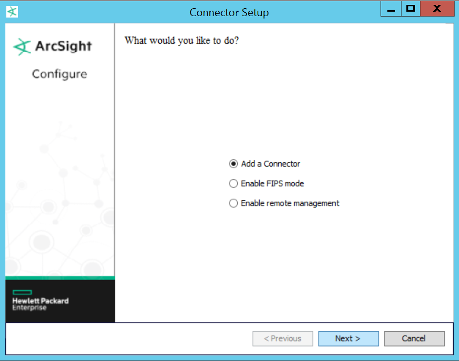
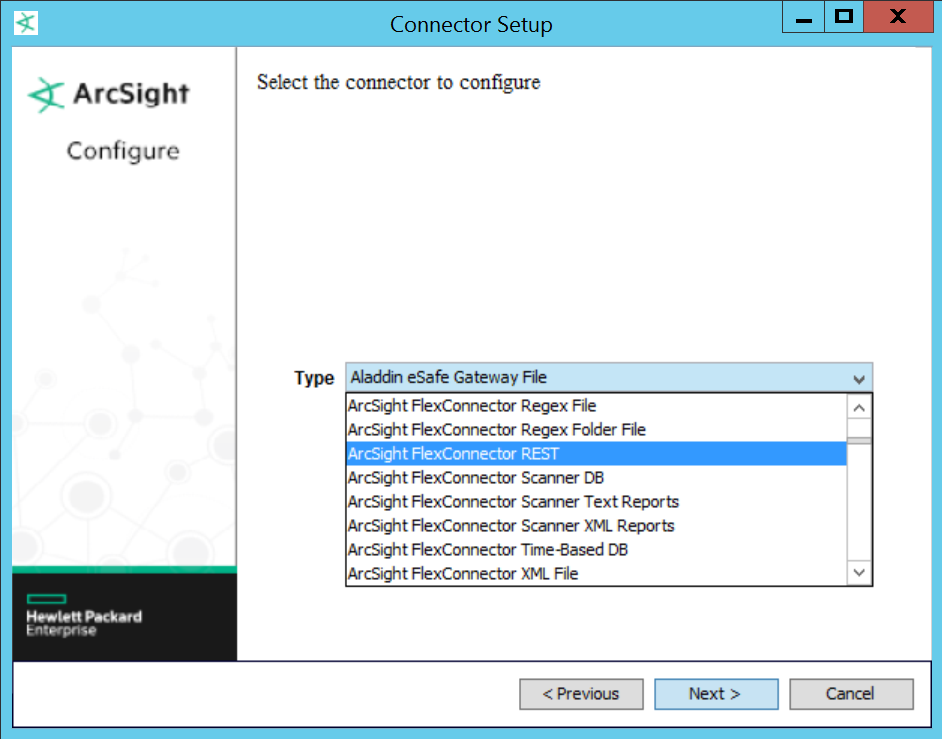
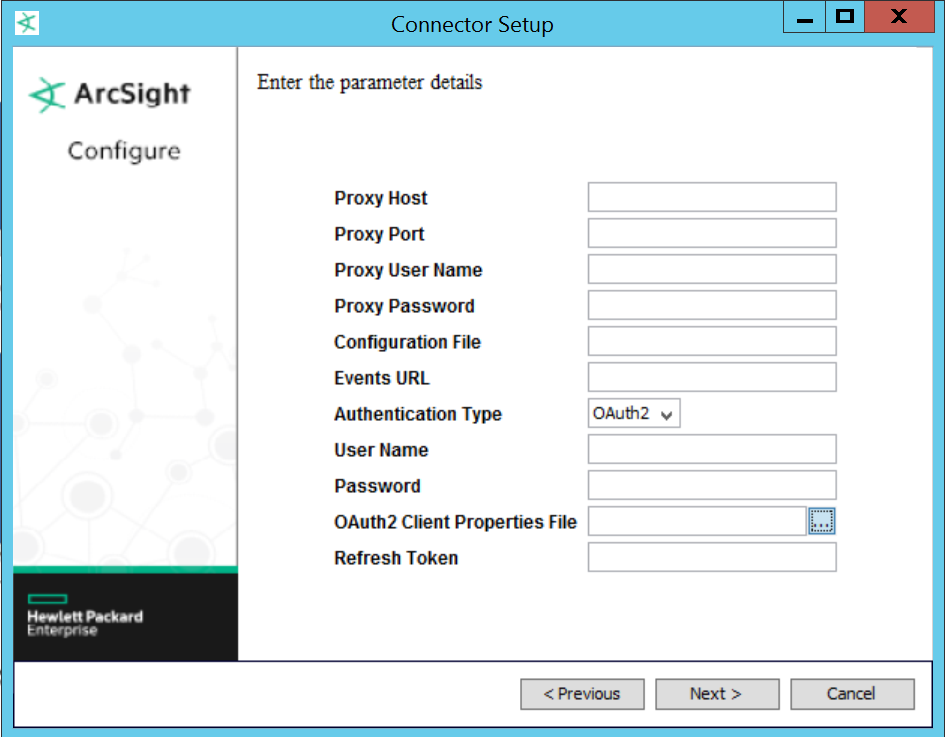
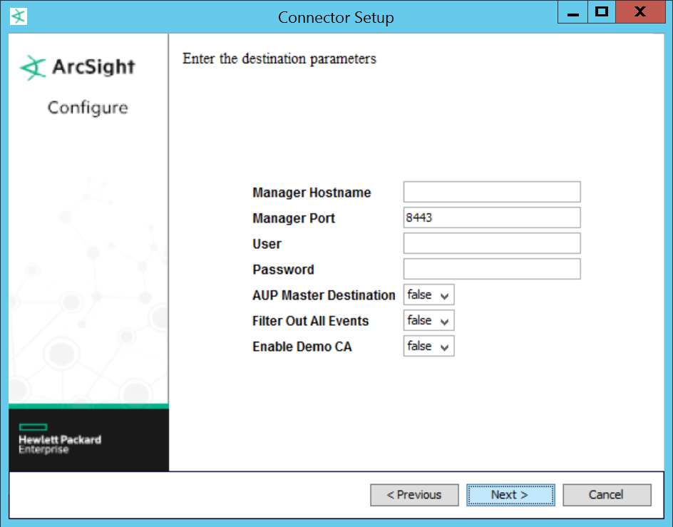
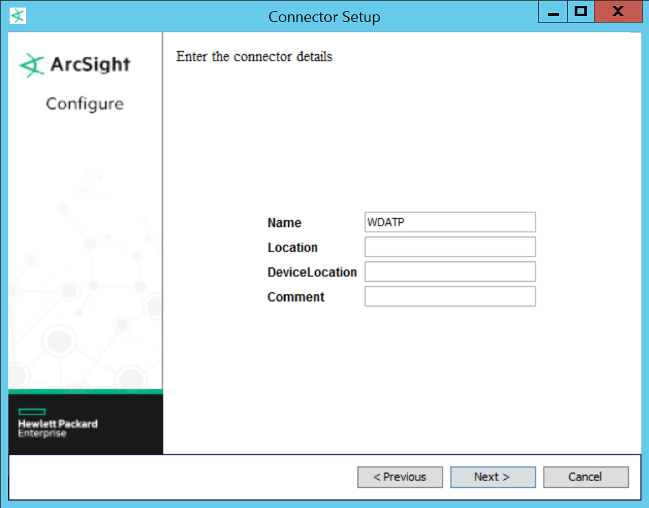

# Configure HP ArcSight to consume Windows Defender ATP alerts

**Applies to:**

- Windows 10 Enterprise
- Windows 10 Education
- Windows 10 Pro
- Windows 10 Pro Education
- Windows Defender Advanced Threat Protection (Windows Defender ATP)

You'll need to configure HP ArcSight so that it can consume Windows Defender ATP alerts.

## Before you begin

1. Get the following information from your Azure Active Directory (AAD) application by selecting the **View Endpoint** on the application configuration page:
    - OAuth 2 Token refresh URL
    - OAuth 2 Client ID
    - OAuth 2 Client secret

2. Download the wdatp-connector.properties file and update the values according to the following:
(JOEY: UPLOAD FILE IN DOWNLOAD CENTER - PUT EMPTY PROPERTIES FILE. PUT WITH THE FOLLOWING VALUES.)

  - **client_ID**: OAuth 2 Client ID
  - **client_secret**: OAuth 2 Client secret
  - **auth_url**: Append the following to the value you obtained from the AAD app: ```?resource=https%3A%2F%2FWDATPAlertExport.Seville.onmicrosoft.com ```

    For example: `https://<url>/<value>/oauth2/authorize?resource=https%3A%2F%2FWDATPAlertExport.Seville.onmicrosoft.com`
  - **token_url**: Use your tenant ID URL [JOEY: NOT SURE IF THIS IS CORRECT - PLEASE HELP PROVIDE TECHNICAL DESCRIPTION]
  - **redirect_uri**: ```https://localhost:44300/wdatpconnector```
  - **scope**: Leave blank [JOEY: NOT SURE IF THIS IS CORRECT - PLEASE CHECK]

3. Download the wdatp-connector.json.properties file. This file is used to parse the information from Windows Defender ATP to HP ArcSight consumable format.
(JOEY: UPLOAD FILE IN DOWNLOAD CENTER)

## Install and configure HP ArcSight SmartConnector
The following steps assume that you have completed all the required steps in [Before you begin](#before-you-begin).

1. Install the latest 32-bit Windows SmartConnector installer. You can find this in the HPE Software center. The tool is typically installed in `C:\ArcSightSmartConnectors\<descriptive_name>\`.

2. Open File Explorer and put the two configuration files in the installation location, for example:

  - WDATP-connector.jsonparser.properties: `C:\ArcSightSmartConnectors\<descriptive_name>\current\user\agent\flexagent\`
  - WDATP-connector.properties: `C:\ArcSightSmartConnectors\<descriptive_name>\`

  [AVIV - I BELIEVE THERE ARE SEVERAL SCREENS BEFORE THE CONNECTOR SETUP IS DISPLAYED. CAN YOU PROVIDE THOSE PLEASE?]

3. In the Connector Setup window, select **Add a Connector**.

 

4. Select the **ArcSight FlexConnector REST** connector and click **Next**.


5. Generate a refresh token to use in the installer:

    a. Open a command prompt.  Browse to `C:\ArcSightSmartConnectors\<descriptive_name>\current\bin`.

    b. Type: `arcsight restutil token -config C:\ArcSightSmartConnectors_Prod\WDATP\WDATP-connector.properties`.
    A Web browser window will open.

    c.  Type in your credentials then click on the password field to let the page redirect.

    d.	In the login prompt enter your `DOMAIN\alias` [AVIV - ARE WE SURE OUR CUSTOMERS FULLOW THE SAME DOMAIN\ALIAS FORMAT?] and your password. After some redirects and providing permission to the app, a token is provided in the command prompt.

    f.	Save the token in a secure location.

6.	Type the following information in the parameter details form. All other values in the form are optional and can be left blank.



Field	| Value
:---|:---
Configuration File | Type in the name of the client property file. It must match the client property file.
Events URL |	https://DataAccess-PRD.trafficmanager.net:444/api/alerts
Authentication Type |	OAuth 2
OAuth 2 Client Properties file	| Select wdatp-connector.properties.
Refresh Token	| Paste the refresh token you generated in the previous step.

You can leave the destination parameter fields with the default values.


Type in a name for the connector. You can leave the other fields blank.

[JOEY: REMOVE WDATP FROM IMAGE & UPDATE STEP NUMBERING]

[AVIV - NEED SCREENSHOTS FOR STEPS 7-13]

7. Destination: ArcSight Manager (encrypted)
8.	Connector details
9.			Name: WDATP
10.	Import the ESM certificate
11.	Install as a service
12.			Internal Name: WDATP
13.	Finish with the installer.
14. Run the connector by running the following command from the installation directory, for example: ` C:\ArcSightSmartConnectors\<descriptive_name>\current\bin, run: arcsight.bat connectors`

15. Verify events are flowing by setting the initial filter to Device Product = Windows Defender ATP.  If so stop the process again and go to Windows Services and start the ArcSight FlexConnector REST.

[BRIAN/AVIV - I CREATED A TROUBLSHOOTING SECTION AND MOVED SOME CONTENT THERE. CAN YOU VERIFY IF MY UNDERSTANTING IS CORRECT PLEASE?]

## HP ArcSight queries [AVIV, SHOULD WE CALL IT QUERY?]
You can now run queries in the HP ArcSight console.

In the HP ArcSight console, create a Windows Defender ATP channel with intervals and properties suitable to your enterprise needs.

Windows Defender ATP alerts will appear as discrete events, with "Microsoft” as the vendor and “Windows Defender ATP” as the device name.


## Troubleshooting HP ArcSight connection [AVIV/BRIAN - SHOULD WE CALL IT CONNECTION?]
**Problem:** Failed to refresh the token.

**Symptom:** You get the following error message:

`Failed to refresh the token. Set reauthenticate to true: com.arcsight.common.al.e: Failed to refresh access token: status=HTTP/1.1 400 Bad Request FATAL EXCEPTION: Could not refresh the access token`

**Solution:**
1. Stop the process.
2. Edit the properties file: `C:\ArcSightSmartConnectors_Prod\<descriptive_name>\WDATP-connector.properties` and add the following value:
`reauthenticate=true`.

3. Restart the connector by running the following command: `arcsight.bat connectors`.

  A browser window appears. Allow it to run, it should disappear, and the connector should now be running.

  > [!NOTE]
  > Verify that the connector is running by stopping the process again. Then start the connector again, and no browser window should appear.

## Related topics
- [Configure security information and events management (SIEM) tools to consume alerts](configure-siem-windows-defender-advanced-threat-protection.md)
- [Configure Azure Active Directory application for SIEM integration](configure-aad-windows-defender-advanced-threat-protection.md)
- [Configure Splunk to consume alerts](configure-splunk-windows-defender-advanced-threat-protection.md)
