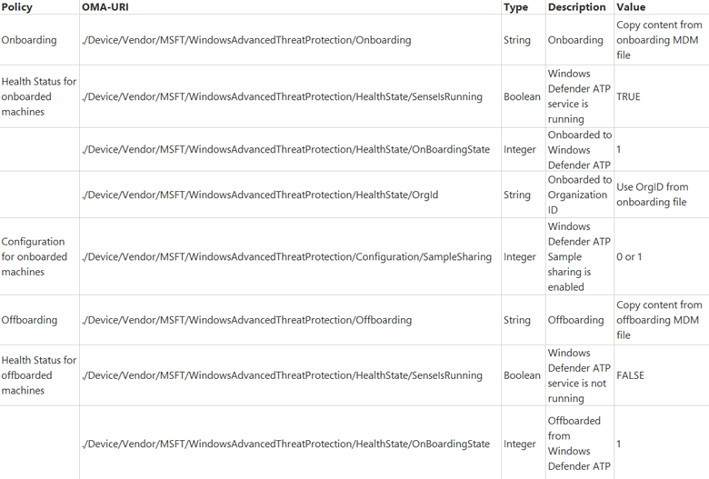

# Configure Windows Defender ATP endpoints

**Applies to:**

- Windows 10 Insider Preview Build 14332 or later
- Windows Defender Advanced Threat Protection (Windows Defender ATP)

[Some information relates to pre-released product which may be substantially modified before it's commercially released. Microsoft makes no warranties, express or implied, with respect to the information provided here.]

Endpoints in your organization must be configured so that the Windows Defender ATP service can get telemetry from them. There are various methods and deployment tools that you can use to configure the endpoints in your organization. 

Windows Defender ATP supports the following deployment tools and methods:

- System Center Configuration Manager (current branch) version 1606 
- System Center 2012 Configuration manager or later versions
- Group Policy
- Microsoft Intune
- Mobile Device Management
- Local script

## Configure endpoints with System Center Configuration Manager (current branch) version 1606
System Center Configuration Manager (current branch) version 1606, currently in technical preview, has UI integrated support for configuring and managing Windows Defender ATP on endpoints. For more information see, the [Support for Windows Defender Advanced Threat Protection service](https://technet.microsoft.com/en-us/library/mt706220.aspx) section.

## Configure endpoints with System Center 2012 Configuration Manager or later versions

1. Open the SCCM configuration package .zip file (*WindowsDefenderATPOnboardingPackage.zip*) that you downloaded from the service onboarding wizard. You can also get the package from the [Windows Defender ATP portal](https://securitycenter.windows.com/):

    a. Click **Endpoint Management** on the **Navigation pane**.

    b. Select **System Center Configuration Manager**, click **Download package**, and save the .zip file.

2. Extract the contents of the .zip file to a shared, read-only location that can be accessed by the network administrators who will deploy the package. You should have a file called *WindowsDefenderATPOnboardingScript.onboarding*.

3. Import the configuration package by following the steps in the [How to Create Packages and Programs in Configuration Manager](https://technet.microsoft.com/en-us/library/gg682112.aspx#BKMK_Import) topic.

4. Deploy the package by following the steps in the [How to Deploy Packages and Programs in Configuration Manager](https://technet.microsoft.com/en-us/library/gg682178.aspx) topic.

    a. Choose a predefined device collection to deploy the package to.

## Configure endpoints with Group Policy
Using the GP configuration package ensures your endpoints will be correctly configured to report to the Windows Defender ATP service.

> **Note**&nbsp;&nbsp;To use GP updates to deploy the package, you must be on Windows Server 2008 R2 or later. The endpoints must be running Windows 10 Insider Preview Build 14332 or later.

1.  Open the GP configuration package .zip file (*WindowsDefenderATPOnboardingPackage.zip*) that you downloaded from the service onboarding wizard. You can also get the package from the [Windows Defender ATP portal](https://securitycenter.windows.com/):

    a.  Click **Endpoint Management** on the **Navigation pane**.

    b.  Select **Group Policy**, click **Download package** and save the .zip file.

2.	Extract the contents of the .zip file to a shared, read-only location that can be accessed by the endpoints. You should have a folder called *OptionalParamsPolicy* and the file *WindowsDefenderATPOnboardingScript.onboarding*.

3. Open the [Group Policy Management Console](https://technet.microsoft.com/en-us/library/cc731212.aspx) (GPMC), right-click the Group Policy Object (GPO) you want to configure and click **Edit**.

4. In the **Group Policy Management Editor**, go to **Computer configuration**, then **Preferences**, and then **Control panel settings**.

5. Right-click **Scheduled tasks**, point to **New**, and then click **Immediate task**.

6. In the  **Task** window that opens, go to the **General** tab. Choose the local SYSTEM user account under **Security options**.

7. Select **Run whether user is logged on or not** and check the **Run with highest privileges** check box.

8. Go to the **Actions** tab and click **New...** Ensure that **Start a program** is selected in the **Action** field. Enter the file name and location of the shared *WindowsDefenderATPOnboardingScript.onboarding* file.

9. Click **OK** and close any open GPMC windows.

For additional settings, see the [Additional configuration settings section](additional-configuration-windows-defender-advanced-threat-protection.md).

## Configure endpoints with Microsoft Intune

For more information on using Windows Defender ATP CSP see, [WindowsAdvancedThreatProtection CSP](https://msdn.microsoft.com/en-us/library/windows/hardware/mt723296(v=vs.85).aspx) and [WindowsAdvancedThreatProtection DDF file](https://msdn.microsoft.com/en-us/library/windows/hardware/mt723297(v=vs.85).aspx).

1. Open the Microsoft Intune configuration package .zip file (*WindowsDefenderATPOnboardingPackage.zip*) that you downloaded from the service onboarding wizard. You can also get the package from the [Windows Defender ATP portal](https://securitycenter.windows.com/):
 
    a.  Click **Endpoint Management** on the **Navigation pane**.

    b.  Select **Microsoft Intune**, click **Download package** and save the .zip file.

2. Extract the contents of the configuration package to a location on the endpoint you want to onboard (for example, the Desktop). You should have a file called *WindowsDefenderATPOnboardingScript.onboarding*.

3. Use the Microsoft Intune custom configuration policy to deploy the following supported OMA-URI settings. For more information on Microsoft Intune policy settings see, [Windows 10 policy settings in Microsoft Intune](https://docs.microsoft.com/en-us/intune/deploy-use/windows-10-policy-settings-in-microsoft-intune).

These policies are categorized into two groups:
- Onboarding - Use the onboarding policies to deploy configuration settings on endpoints. These policies can be sub-categorized to:
    - Onboarding
    - Health Status for onboarded machines
    - Configuration for onboarded machines
- Offboarding - Use the offboarding policies to remove configuration settings on endpoints. These policies can be sub-categorized to:
    - Offboarding
    - Health Status for offboarded machines
    - Configuration for offboarded machines

> **Warning**&nbsp;&nbsp;These two groups must not be deployed on the same machine at same time, otherwise this will cause unpredictable collisions.

 

> **Note**&nbsp;&nbsp;Policies **Health Status for onboarded machines** and **Health Status for offboarded machines** use read-only properties and can't be remediated.

## Configure endpoints with Mobile Device Management tools
You can use mobile device management (MDM) solutions to configure endpoints. Windows Defender ATP supports MDMs by providing OMA-URIs to create policies to manage endpoints. 

For more information on using Windows Defender ATP CSP see, [WindowsAdvancedThreatProtection CSP](https://msdn.microsoft.com/en-us/library/windows/hardware/mt723296(v=vs.85).aspx) and [WindowsAdvancedThreatProtection DDF file](https://msdn.microsoft.com/en-us/library/windows/hardware/mt723297(v=vs.85).aspx).

## Configure endpoints individually with a script

You can also manually onboard individual endpoints to Windows Defender ATP. You might want to do this first when testing the service before you commit to onboarding all endpoints in your network.

1.  Open the GP configuration package .zip file (*WindowsDefenderATPOnboardingPackage.zip*) that you downloaded from the service onboarding wizard. You can also get the package from the [Windows Defender ATP portal](https://securitycenter.windows.com/):

    a.  Click **Endpoint Management** on the **Navigation pane**.

    b.  Select **Local Script**, click **Download package** and save the .zip file.

2.  Extract the contents of the configuration package to a location on the endpoint you want to onboard (for example, the Desktop). You should have a file called *WindowsDefenderATPOnboardingScript.onboarding*.

3.  Open an elevated command-line prompt on the endpoint and run the script:

    a.  Click **Start** and type **cmd**.

    b.  Right-click **Command prompt** and select **Run as administrator**.

    

4.  Type the location of the script file. If you copied the file to the desktop, type: *`%userprofile%\Desktop\WindowsDefenderATPOnboardingScript.onboarding`*

5.  Press the **Enter** key or click **OK**.

See the [Troubleshoot Windows Defender Advanced Threat Protection onboarding issues](troubleshoot-onboarding-windows-defender-advanced-threat-protection.md) topic for details on how you can manually validate that the endpoint is compliant and correctly reports telemetry.

## Related topics
<!--- [Windows Defender ATP service onboarding](service-onboarding-windows-defender-advanced-threat-protection.md)-->
- [Configure endpoint proxy and Internet connectivity settings](configure-proxy-internet-windows-defender-advanced-threat-protection.md)
- [Additional Windows Defender ATP configuration settings](additional-configuration-windows-defender-advanced-threat-protection.md)
- [Monitor the Windows Defender ATP onboarding](monitor-onboarding-windows-defender-advanced-threat-protection.md)
- [Troubleshoot Windows Defender Advanced Threat Protection onboarding issues](troubleshoot-onboarding-windows-defender-advanced-threat-protection.md)
