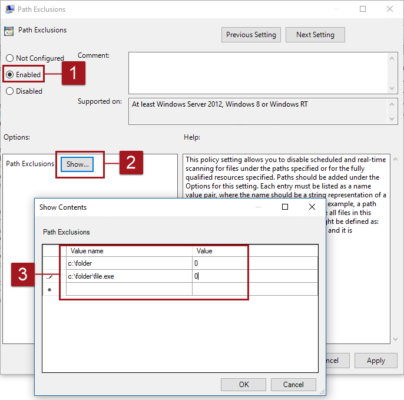
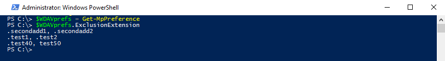

# Configure file and folder exclusions in Windows Defender AV scans


**Applies to:**

- Windows 10

**Audience**

- Enterprise security administrators


**Manageability available with**

- Group Policy
- PowerShell
- Windows Management Instrumentation (WMI)
- System Center Configuration Manager
- Microsoft Intune
- Windows Defender Security Center

You can exclude certain files, folders, processes, and process-modified files from being scanned by Windows Defender AV. The exclusions apply to [scheduled scans](scheduled-catch-up-scans-windows-defender-antivirus.md), [on-demand scans](run-scan-windows-defender-antivirus.md), and [always-on real-time protection and monitoring](configure-real-time-protection-windows-defender-antivirus.md).

Changes made via Group Policy to the exclusion lists **will show** in the lists in the [Windows Defender Security Center app](windows-defender-security-center-antivirus.md#exclusions). However, changes made in the Windows Defender Security Center app **will not show** in the Group Policy lists.

You can add, remove, and review the lists for exclusions in [Group Policy](#gp), [System Center Configuration Manager, Microsoft Intune, and with the Windows Defender Security Center app](#man-tools).

You can also [use PowerShell cmdlets and WMI to configure the exclusion lists](#ps), although you will need to use several different cmdlets.

By default, local changes made to the lists (by users with administrator privileges) will be merged with the lists as defined (and deployed) by Group Policy, Configuration Manager, Intune, PowerShell, or WMI. The Group Policy lists will take precedence in the case of conflicts. You can [configure how locally and globally defined exclusions lists are merged](configure-local-policy-overrides-windows-defender-antivirus.md#merge-lists) to disable this setting.

PowerShell can be used to [validate that your exclusion lists are working as expected](#validate).

<a id="gp"></a>
## Use Group Policy to configure exclusion lists

**Use Group Policy to configure file extension exclusions:**

1.  On your Group Policy management machine, open the [Group Policy Management Console](https://technet.microsoft.com/library/cc731212.aspx), right-click the Group Policy Object you want to configure and click **Edit**.

3.  In the **Group Policy Management Editor** go to **Computer configuration**.

4.  Click **Policies** then **Administrative templates**.

5.  Expand the tree to **Windows components > Windows Defender Antivirus > Exclusions**. 


6. Double-click the **Extension Exclusions** setting and add the exclusions:

    1. Set the option to **Enabled**. 
    2. Under the **Options** section, click **Show...**
    3. Enter each file extension on its own line under the **Value name** column.  Enter **0** in the **Value** column for all processes.

7. Click **OK**. 


<a id="exclude-paths-files"></a>
**Use Group Policy to exclude specified files or folders from scans:**

>[!NOTE]
>The exclusion will apply to any file with the defined file name - regardless of its location. If a folder is defined in the exclusion, then all files and subdirectories under that folder will be excluded.

1.  On your Group Policy management machine, open the [Group Policy Management Console](https://technet.microsoft.com/library/cc731212.aspx), right-click the Group Policy Object you want to configure and click **Edit**.

3.  In the **Group Policy Management Editor** go to **Computer configuration**.

4.  Click **Policies** then **Administrative templates**.

5.  Expand the tree to **Windows components > Windows Defender Antivirus > Exclusions**. 


6. Double-click the **Path Exclusions** setting and add the exclusions:

    1. Set the option to **Enabled**. 
    2. Under the **Options** section, click **Show...**
    3. Enter each path or file on its own line under the **Value name** column. If you are entering a file, ensure you enter a fully qualified path to the file, including the drive letter, folder path, filename, and extension. Enter **0** in the **Value** column for all processes.

7. Click **OK**. 



**Use Group Policy to exclude files that have been used or modified by specified processes from scans:**

>[!NOTE] 
>You can exclude files that are opened by specified processes from being scanned. The specified process won't be excluded - but any files that are opened by that process (regardless of where they are or what they are named) will be excluded. If you need to exclude the process itself, [exclude it as a file](#exclude-paths-files).  
>You can only exclude files modified by processes if the process is an executable.  


1.  On your Group Policy management machine, open the [Group Policy Management Console](https://technet.microsoft.com/library/cc731212.aspx), right-click the Group Policy Object you want to configure and click **Edit**.

3.  In the **Group Policy Management Editor** go to **Computer configuration**.

4.  Click **Policies** then **Administrative templates**.

5.  Expand the tree to **Windows components > Windows Defender Antivirus > Exclusions**. 


6. Double-click the **Process Exclusions** setting and add the exclusions:

    1. Set the option to **Enabled**. 
    2. Under the **Options** section, click **Show...**
    3. Enter each process on its own line under the **Value name** column. Ensure you enter a fully qualified path to the process, including the drive letter, folder path, filename, and extension. The process must be an executable. Enter **0** in the **Value** column for all processes.

7. Click **OK**. 


<a id="ps"></a>
## Use PowerShell cmdlets and WMI to configure exclusion lists

Excluding and reviewing file extensions, paths and files (including processes), and files opened by processes with PowerShell requires using a combination of four  cmdlets and the appropriate exclusion list parameter. The cmdlets are all in the [Defender module](https://technet.microsoft.com/en-us/itpro/powershell/windows/defender/defender).

There are three exclusion lists:
- ExclusionExtension
- ExclusionPath
- ExclusionProcess

You can modify each of the lists with the following cmdlets:
- Set-MpPreference to create or overwrite the defined list
- Add-MpPreference to add new items to the defined list
- Remove-MpPreference to remove or delete items from the defined list
- Get-MpPreference to review the items in the list, either all at once with all other Windows Defender AV settings, or individually for each of the lists

>[!IMPORTANT]
>If you have created a list, either with `Set-MpPreference` or `Add-MpPreference`, using the `Set-MpPreference` cmdlet again will overwrite the existing list. 

The following matrix provides sample commands based on what you want to exclude, and whether you want to create a list, add to the list, or remove items from the list.

<table>
<tr><th>Configuration action</th><th>Type of exclusion</th><th>PowerShell command</th></tr>


<tr><td rowspan="3">Create or overwrite a list</td><td>File extensions that should be excluded from scans</td><td>
Set-MpPreference -ExclusionExtension ".extension1, .extension2, .extension3"</td></tr>

<tr><td>Files (including processes) and paths that should be excluded from scans</td><td>
Set-MpPreference -ExclusionPath "c:\example, d:\test\process.exe, c:\test\file.bat"</td></tr>

<tr><td>Files opened by the specified processes (executables)</td><td>
Set-MpPreference -ExclusionProcess "c:\example\test.exe"</td></tr>


<tr><td rowspan="3">Add to a list</td><td>File extensions that should be excluded from scans</td><td>
Add-MpPreference -ExclusionExtension ".extension4, .extension5"</td></tr>

<tr><td>Files (including processes) and paths that should be excluded from scans</td><td>
Add-MpPreference -ExclusionPath "d:\test, d:\example\file.png"</td></tr>

<tr><td>Files opened by specified processes (executables)</td><td>
Add-MpPreference -ExclusionProcess "f:\test\sample.exe"</td></tr>


<tr><td rowspan="3">Remove items from a list</td><td>File extensions that should be excluded from scans</td><td>
Remove-MpPreference -ExclusionExtension ".extension1, .extension4, .extension5"</td></tr>

<tr><td>Files (including processes) and paths that should be excluded from scans</td><td>
Remove-MpPreference -ExclusionPath "c:\example, d:\example\file.png"</td></tr>

<tr><td>Files opened by specified processes (executables)</td><td>
Remove-MpPreference -ExclusionProcess "c:\example\test.exe"</td></tr>
</table>

### Review the exclusion lists with PowerShell

You can retrieve the items in any of the lists in two ways:
- Retrieve the status of all Windows Defender AV preferences. Each of the three lists will be displayed on separate lines, but the items within the list will be combined into the same line.
- Write the status of all preferences to a variable, and only call the specific list you are interested in. Each use of `Add-MpPreference` is written to a new line.

In both instances the items are sorted alphabetically.

The following sequence of code examples helps to show how this works.

1. Create an example list of extensions that should be excluded from scans:
    ```PowerShell
    PS C:\> Set-MpPreference -ExclusionExtension ".test1, .test2"
    ```

2. Add some additional extensions:

    ```PowerShell
    PS C:\> Add-MpPreference -ExclusionExtension ".test40, test50"
    ```

3. Add another set of extensions:

    ```PowerShell
    PS C:\> Add-MpPreference -ExclusionExtension ".secondadd1, .secondadd2"
    ```

4. Review the list as a combined list:
    ```PowerShell
    PS C:\> Get-MpPreference
    ```

    


5. Use a variable to store and retrieve only the exclusions list:

    ```PowerShell
    PS C:\> $WDAVprefs = Get-MpPreference
    PS C:\> $WDAVprefs.ExclusionExtension
    ```

    


See [Use PowerShell cmdlets to configure and run Windows Defender Antivirus](use-powershell-cmdlets-windows-defender-antivirus.md) and [Defender cmdlets](https://technet.microsoft.com/itpro/powershell/windows/defender/index) for more information on how to use PowerShell with Windows Defender Antivirus.

### Use Windows Management Instruction (WMI) to configure file extension exclusions

Use the [ **Set**, **Add**, and **Remove** methods of the **MSFT_MpPreference**](https://msdn.microsoft.com/en-us/library/dn455323(v=vs.85).aspx) class for the following properties:

```WMI
ExclusionExtension
ExclusionPath
ExclusionProcess
```

The use of **Set**, **Add**, and **Remove** are analogous to their counterparts in PowerShell: `Set-MpPreference`, `Add-MpPreference`, and `Remove-MpPreference`.

See the following for more information and allowed parameters:
- [Windows Defender WMIv2 APIs](https://msdn.microsoft.com/en-us/library/dn439477(v=vs.85).aspx)

<a id="man-tools"></a>
## Use System Center Configuration Manager, Intune, or the Windows Defender Security Center app to configure exclusion lists


**Use Configuration Manager to configure file extension exclusions:**

See [How to create and deploy antimalware policies: Exclusion settings](https://docs.microsoft.com/en-us/sccm/protect/deploy-use/endpoint-antimalware-policies#exclusion-settings) for details on configuring System Center Configuration Manager (current branch).


**Use Microsoft Intune to configure file extension exclusions:**


See [Help secure Windows PCs with Endpoint Protection for Microsoft Intune](https://docs.microsoft.com/en-us/intune/deploy-use/help-secure-windows-pcs-with-endpoint-protection-for-microsoft-intune) and [Windows Defender policy settings in Windows 10](https://docs.microsoft.com/en-us/intune/deploy-use/windows-10-policy-settings-in-microsoft-intune#windows-defender-1) for more details.


**Use the Windows Defender Security app to add exclusions to Windows Defender AV:**

See [Add exclusions in the Windows Defender Security Center app](windows-defender-security-center-antivirus.md#exclusions) for instructions.


 ## Configure auto exclusions lists for Windows Server deployments

If you are using Windows Defender AV to protect Windows Server endpoints or machines, you are [automatically enrolled in certain exclusions](https://technet.microsoft.com/en-us/windows-server-docs/security/windows-defender/automatic-exclusions-for-windows-defender), as defined by your specified Windows Server Role.

These exclusions will not appear in the standard exclusion lists shown in the [Windows Defender Security Center app](windows-defender-security-center-antivirus.md#exclusions).

You can still add or remove custom exclusions (in addition to the Server Role-defined auto exclusions) as described in the other sections in this topic.

You can also disable the auto-exclusions lists with Group Policy, PowerShell cmdlets, and WMI.

**Use Group Policy to disable the auto-exclusions list on Windows Server 2016:**

1.  On your Group Policy management machine, open the [Group Policy Management Console](https://technet.microsoft.com/library/cc731212.aspx), right-click the Group Policy Object you want to configure and click **Edit**.

3.  In the **Group Policy Management Editor** go to **Computer configuration**.

4.  Click **Policies** then **Administrative templates**.

5.  Expand the tree to **Windows components > Windows Defender Antivirus > Exclusions**.

6. Double-click the **Turn off Auto Exclusions** setting and set the option to **Enabled**. Click **OK**. 

**Use PowerShell cmdlets to disable the auto-exclusions list on Windows Server 2016:**

Use the following cmdlets:

```PowerShell
Set-MpPreference -DisableAutoExclusions
```

See [Use PowerShell cmdlets to configure and run Windows Defender Antivirus](use-powershell-cmdlets-windows-defender-antivirus.md) and [Defender cmdlets](https://technet.microsoft.com/itpro/powershell/windows/defender/index) for more information on how to use PowerShell with Windows Defender Antivirus.

**Use Windows Management Instruction (WMI) to disable the auto-exclusions list on Windows Server 2016:**

Use the [**Set** method of the **MSFT_MpPreference**](https://msdn.microsoft.com/en-us/library/dn455323(v=vs.85).aspx) class for the following properties:

```WMI
DisableAutoExclusions
```

See the following for more information and allowed parameters:
- [Windows Defender WMIv2 APIs](https://msdn.microsoft.com/en-us/library/dn439477(v=vs.85).aspx)

## Use wildcards in exclusion lists

You can use the asterisk **\***, question mark **?**, or environment variables (such as %APPDATA%) as wildcards when defining items in the exclusion lists.

You cannot use a wildcard in place of a drive letter.


The following table describes how the wildcards can be used and provides some examples.

Wildcard | Use | Example use | Example matches
---|---|---|---
**\*** (asterisk) | Replaces any number of chararacters | <ul><li>C:\MyData\my\*.zip</li><li>C:\somepath\\\*\Data</li><li>.t\*t</li></ul> | <ul><li>C:\MyData\my-archived-files-43.zip</li><li>C:\somepath\folder1\folder2\Data</li><li>.test</li></ul>
**?** (question mark) | Replaces a single character | <ul><li>C:\MyData\my\*.zip</li><li>C:\somepath\\\*\Data</li><li>.t\*t</li></ul> | <ul><li>C:\MyData\my1.zip</li><li>C:\somepath\P\Data</li><li>.txt </li></ul>
Environment variables | The defined variable will be populated as a path when the exclusion is evaluated |  <ul><li>%ALLUSERSPROFILE%\CustomLogFiles</li><li>%APPDATA%\Data\file.png</li></ul> | <ul><li>C:\ProgramData\CustomLogFiles\Folder1\file1.txt</li><li>C:\Users\username\AppData\Roaming\Data\file.png</li></ul>


<a id="validate"></a>
## Validate exclusions lists with the EICAR test file

You can validate that your exclusion lists are working by using PowerShell with either the `Invoke-WebRequest` cmdlet or the .NET WebClient class to download a test file.

In the following PowerShell snippet, replace *test.txt* with a file that conforms to your exclusion rules. For example, if you have excluded the .testing extension, replace *test.txt* with *test.testing*. If you are testing a path, ensure you run the cmdlet within that path.

```PowerShell
Invoke-WebRequest "http://www.eicar.org/download/eicar.com.txt" -OutFile "test.txt"
```

If Windows Defender AV reports malware, then the rule is not working. If there is no report of malware, and the downloaded file exists, then the exclusion is working. You can open the file to confirm the contents are the same as what is described on the [EICAR testfile website](http://www.eicar.org/86-0-Intended-use.html).

You can also use the following PowerShell code, which calls the .NET WebClient class to download the testfile - as with the `Invoke-WebRequest` cmdlet, replace *c:\test.txt* with a file that conforms to the rule you are validating:

```PowerShell 
$client = new-object System.Net.WebClient
$client.DownloadFile("http://www.eicar.org/download/eicar.com.txt","c:\test.txt")
```


## Related topics

- [Customize, initiate, and review the results of Windows Defender AV scans and remediation](customize-run-review-remediate-scans-windows-defender-antivirus.md)
- [Windows Defender Antivirus in Windows 10](windows-defender-antivirus-in-windows-10.md)