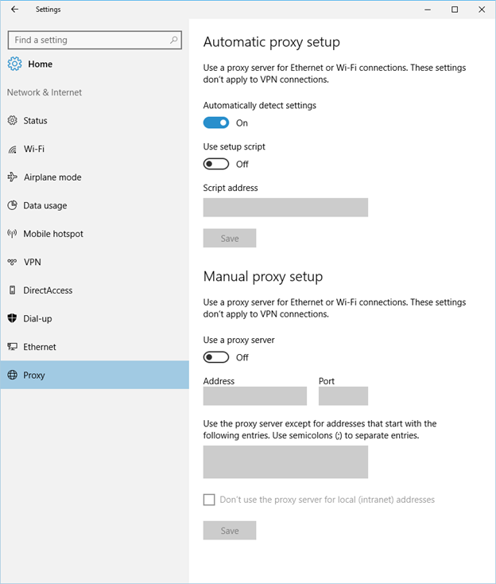
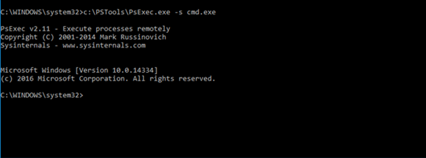
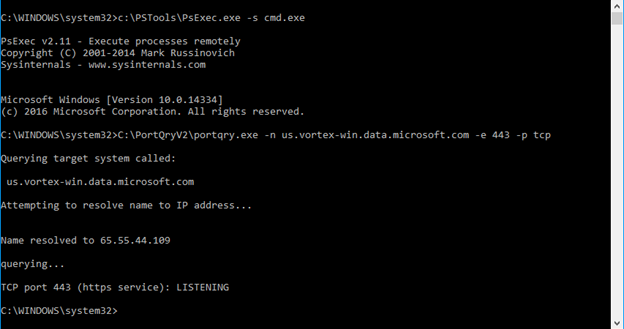

# Configure proxy and Internet connectivity settings

**Applies to:**

- Windows 10 Insider Preview

<span style="color:#ED1C24;">[Some information relates to pre-released product which may be substantially modified before it's commercially released. Microsoft makes no warranties, express or implied, with respect to the information provided here.]</span>

The Window Defender ATP sensor requires Microsoft Windows HTTP (WinHTTP) to report telemetry and communicate with the Windows Defender ATP service.

The embedded Windows Defender ATP sensor runs in system context using the LocalSystem account. The sensor uses Microsoft Windows HTTP Services (WinHTTP) to enable communication with the Windows Defender ATP cloud service.

The WinHTTP configuration setting is independent of the Windows Internet (WinINet) internet browsing proxy settings and can only discover a proxy server by using the following discovery methods:

- Configure Web Proxy Auto Detect (WPAD) settings in the environment and configure Windows to automatically detect the proxy server through Policy or the local Windows settings

- Configure the proxy server manually using Netsh

## Configure Web Proxy Auto Detect (WPAD) settings in the environment and configure Windows to automatically detect the proxy server through Policy or the local Windows settings

Enable the **Automatically detect settings** option in the Windows Proxy settings so that WinHTTP can use the WPAD feature to locate a proxy server.

1. Click **Start** and select **Settings**.

2. Click **Network & Internet**.

3. Select **Proxy**.

4. Verify that the **Automatically detect settings** option is set to On.

    

5. If the **Use setup script** or **Manual proxy setup** options are enabled then you will need to [configure proxy settings manually by using Netsh](#configure-proxy-server-manually-using-netsh) method for WinHTTP to discover the appropriate proxy settings and connect.

## Configure the proxy server manually using Netsh

If **Use setup script** or **Manual proxy setup** settings are configured in the Windows Proxy setting, then endpoints will not be discovered by WinHTTP.
Use Netsh to configure the proxy settings to enable connectivity.

You can configure the endpoint by using any of these methods:

- Importing the configured proxy settings to WinHTTP
- Configuring the proxy settings manually to WinHTTP

After configuring the endpoints, you'll need to verify that the correct proxy settings were applied.

**Import the configured proxy settings to WinHTTP**

1.  Open an elevated command-line prompt on the endpoint:

    a.  Click **Start** and type **cmd**.

    b.  Right-click **Command prompt** and select **Run as administrator**.

2. Enter the following command and press **Enter**:

 ```
 netsh winhttp import proxy source=ie
 ```
 An output showing the applied WinHTTP proxy settings is displayed.


 **Configure the proxy settings manually to WinHTTP**

 1.  Open an elevated command-line prompt on the endpoint:

    a.  Click **Start** and type **cmd**.

    b.  Right-click **Command prompt** and select **Run as administrator**.

 2. Enter the following command and press **Enter**:

 ```
 proxy [proxy-server=] ProxyServerName:PortNumber
 ```
    Replace *ProxyServerName* with the fully qualified domain name of the proxy server.

    Replace *PortNumber* with the port number that you want to configure the proxy server with.

 An output showing the applied WinHTTP proxy settings is displayed.


**Verify that the correct proxy settings were applied**

1.  Open an elevated command-line prompt on the endpoint:

    a.  Click **Start** and type **cmd**.

    b.  Right-click **Command prompt** and select **Run as administrator**.

2. Enter the following command and press **Enter**:

```
netsh winhttp show proxy
```

For more information on how to use Netsh see, [https://technet.microsoft.com/en-us/library/cc731131(v=ws.10).aspx](https://technet.microsoft.com/en-us/library/cc731131(v=ws.10).aspx)     

## Enable access to Windows Defender ATP service URLs in the proxy server

If a proxy or firewall is blocking all traffic by default and allowing only specific domains through, make sure that the following URLs are white-listed to permit communication with Windows Defender ATP service in port 80 and 443:

- us.vortex-win.data.microsoft.com  
- eu.vortex-win.data.microsoft.com
- sevillegwcus.microsoft.com
- sevillegweus.microsoft.com
- sevillegwweu.microsoft.com
- sevillegwneu.microsoft.com
- www.microsoft.com
- crl.microsoft.com
- \*.blob.core.windows.net

If a proxy or firewall is blocking anonymous traffic, as Windows Defender ATP  sensor is connecting from system context, make sure anonymous traffic is permitted to the above listed URLs.

## Verify client connectivity to Windows Defender ATP service URLs

Verify the proxy configuration completed successfully, that WinHTTP can discover and communicate through the proxy server in your environment, and that the proxy server allows traffic to the Windows Defender ATP service URLs.

1. Download the connectivity verification tools to the PC where Windows Defender ATP sensor is running on:

    - [Download PsTools Suite](https://technet.microsoft.com/en-us/sysinternals/bb896649)
    - [Download PortQry Command Line Port Scanner Version 2.0 utility](https://www.microsoft.com/en-us/download/details.aspx?id=17148)

2. Extract the contents of **PsTools** and **PortQry** to a directory on the computer hard drive.

3.  Open an elevated command-line:

    a. Click **Start** and type **cmd**.

    b.  Right-click **Command prompt** and select **Run as administrator**.

4. Enter the following command and press **Enter**:

    ```
    HardDrivePath\PsExec.exe -s cmd.exe
    ```
    Replace *HardDrivePath* with the path where the PsTools Suite was extracted to:
    

5. Enter the following command and press **Enter**:

    ```
    HardDrivePath\portqry.exe -n us.vortex-win.data.microsoft.com -e 443 -p tcp
    ```
    Replace *HardDrivePath* with the path where the PortQry utility was extracted to:
    

6.	Verify that the output shows that the name is **resolved** and connection status is **listening**.

7. Repeat the same steps for the remaining URLs with the following arguments:

    - portqry.exe -n eu.vortex-win.data.microsoft.com -e 443 -p tcp
    - portqry.exe -n sevillegwcus.microsoft.com -e 443 -p tcp
    - portqry.exe -n sevillegweus.microsoft.com -e 443 -p tcp
    - portqry.exe -n sevillegwweu.microsoft.com -e 443 -p tcp
    - portqry.exe -n sevillegwneu.microsoft.com -e 443 -p tcp
    - portqry.exe -n www.microsoft.com -e 80 -p tcp
    - portqry.exe -n crl.microsoft.com -e 80 -p tcp

8. Verify that each URL shows that the name is **resolved** and the connection status is **listening**.

If the any of the verification steps indicate a fail, then verify that you have performed the proxy configuration steps to enable server discovery and access to the service URLs.
