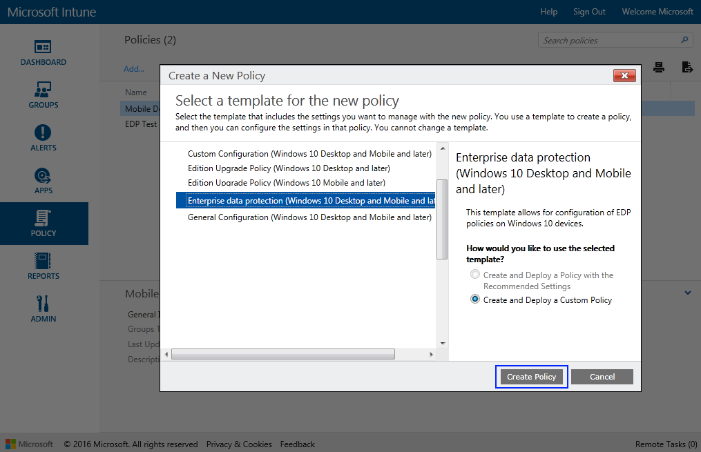
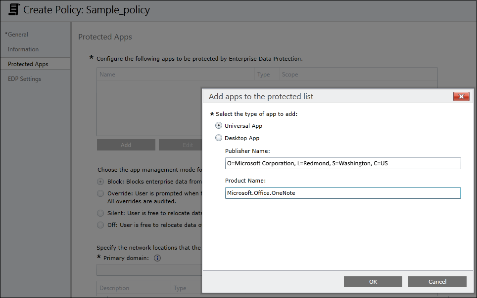
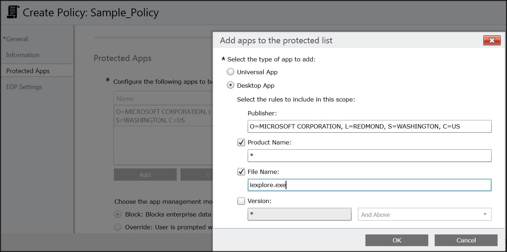
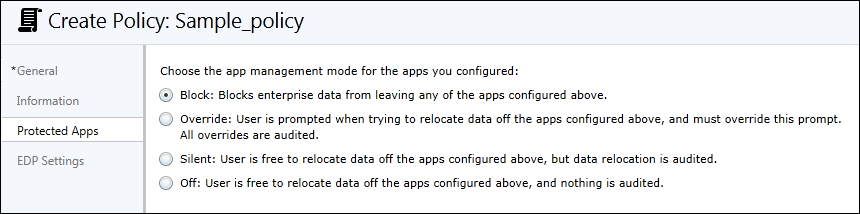
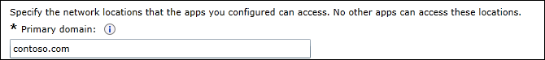
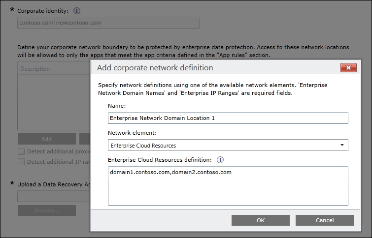
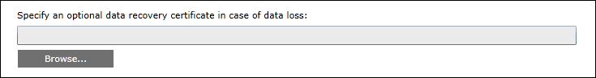
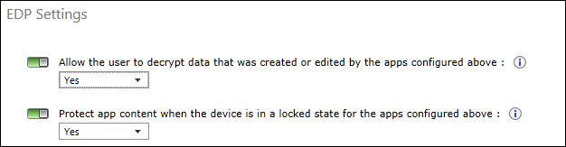

# Create an enterprise data protection (EDP) policy using Microsoft Intune
**Applies to:**

-   Windows 10 Insider Preview
-   Windows 10 Mobile Preview

<span style="color:#ED1C24;">[Some information relates to pre-released product, which may be substantially modified before it's commercially released. Microsoft makes no warranties, express or implied, with respect to the information provided here.]</span>

Microsoft Intune helps you create and deploy your enterprise data protection (EDP) policy, including letting you choose your protected apps, your EDP-protection level, and how to find enterprise data on the network.

## Important note about the June service update
We've received some great feedback from you, our Windows 10 Insider Preview customers, about our enterprise data protection experiences and processes. Because of that feedback, we're delighted to deliver an enhanced apps policy experience with the June service update. This means that when you open an existing enterprise data protection policy after we release the June service update in your test environment, your existing Windows 10 enterprise data protection app rules (formerly in the **Protected Apps** area) will be removed.<p>To prepare for this change, we recommend that you make an immediate backup of your current app rules as they are today, so you can use them to help reconfigure your app rules with the enhanced experience. When you open an existing enterprise data protection policy after we release the June service update, you'll get a dialog box telling you about this change. Click the **OK** button to close the box and to begin reconfiguring your app rules.


Note that if you exit the **Policy** page before you've saved your new policy, your existing deployments won't be affected. However, if you save the policy without reconfiguring your apps, an updated policy will be deployed to your employees with an empty app rules list.
 
## Add an EDP policy
After you’ve installed and set up Intune for your organization, you must create an EDP-specific policy.

**To add an EDP policy**
1.  Open the Intune administration console, and go to the **Policy** node, and then click **Add Policy** from the **Tasks** area.

2.  Go to **Windows**, click the **Enterprise Data Protection (Windows 10 and Mobile and later) policy**, pick the EDP template, click **Create and Deploy a Custom Policy**, and then click **Create Policy**.

    

3.  Type a name (required) and an optional description for your policy into the **Name** and **Description** boxes.

    

## Add individual apps to your Protected App list
During the policy-creation process in Intune, you can choose the apps you want to give access to your enterprise data through EDP. Apps included in this list can protect data on behalf of the enterprise and are restricted from copying or moving enterprise data to unprotected apps.

The steps to add your apps are based on the type of app it is; either a Universal Windows Platform (UWP) app, or a signed Desktop app, also known as a Classic Windows application.

>**Important**<br>EDP-aware apps are expected to prevent enterprise data from going to unprotected network locations and to avoid encrypting personal data. On the other hand, EDP-unaware apps might not respect the corporate network boundary and will encrypt all files they create or modify, meaning that they could encrypt personal data and cause data loss during the revocation process. Care must be taken to get a support statement from the software provider that their app is safe with EDP before adding it to your **Protected App** list.<p>


>**Note**<br>If you want to use **File hash** or **Path** rules, instead of Publisher rules, you must follow the steps in the [Add multiple apps to your enterprise data protection (EDP) Protected Apps list](add-apps-to-protected-list-using-custom-uri.md) topic.

**To add a UWP app**

1.  From the **Configure the following apps to be protected by EDP** table in the **Protected Apps** area, click **Add.**

2.  Click **Universal App**, type the **Publisher Name** and the **Product Name** into the associated boxes, and then click **OK**. If you don't have the publisher or product name, you can find them for both desktop devices and Windows 10 Mobile phones by following these steps.

    **To find the Publisher and Product name values for Microsoft Store apps without installing them**

    1.  Go to the [Windows Store for Business](http://go.microsoft.com/fwlink/p/?LinkID=722910) website, and find your app. For example, Microsoft OneNote.
    
        >**Note**<br>If your app is already installed on desktop devices, you can use the AppLocker local security policy MMC snap-in to gather the info for adding the app to the **Protected App** list. For info about how to do this, see the [Add multiple apps to your enterprise data protection (EDP) Protected Apps list](add-apps-to-protected-list-using-custom-uri.md) topic.

    2.  Copy the ID value from the app URL. For example, Microsoft OneNote's ID URL is https://www.microsoft.com/store/apps/onenote/9wzdncrfhvjl, and you'd copy the ID value, `9wzdncrfhvjl`.

    3.  In a browser, run the Store for Business portal web API, to return a JavaScript Object Notation (JSON) file that includes the publisher and product name values. For example, run https://bspmts.mp.microsoft.com/v1/public/catalog/Retail/Products/*9wzdncrfhvjl*/applockerdata, where *9wzdncrfhvjl* is replaced with your ID value.
    <p>
    The API runs and opens a text editor with the app details.

        ``` json
        {
          "packageIdentityName": "Microsoft.Office.OneNote",
          "publisherCertificateName": "CN=Microsoft Corporation, O=Microsoft Corporation, L=Redmond, S=Washington, C=US"
        }
        ```
    4.  Copy the `publisherCertificateName` value into the **Publisher Name** box and copy the `packageIdentityName` value into the **Product Name** box of Intune.
     <p>**Important**<br>The JSON file might also return a `windowsPhoneLegacyId` value for both the **Publisher Name** and **Product Name** boxes. This means that you have an app that’s using a XAP package and that you must set the **Product Name** as `windowsPhoneLegacyId`, and set the **Publisher Name** as “CN=” followed by the `windowsPhoneLegacyId`.
    <p>For example:<br>
     ``` json
        {
          "windowsPhoneLegacyId": "ca05b3ab-f157-450c-8c49-a1f127f5e71d",
        }
       ```
    

    **To find the Publisher and Product name values for apps installed on Windows 10 Mobile phones**

    1.  If you need to add mobile apps that aren't distributed through the Store for Business, you must use the **Windows Device Portal** feature.
    
        >**Note**<br>Your PC and phone must be on the same wireless network.

    2.  On the Windows Phone, go to **Settings**, choose **Update & security**, and then choose **For developers**.

    3.  In the **For developers** screen, turn on **Developer mode**, turn on **Device Discovery**, and then turn on **Device Portal**.

    4.  Copy the URL in the **Device Portal** area into your device's browser, and then accept the SSL certificate.

    5.  In the **Device discovery** area, press **Pair**, and then enter the PIN into the website from the previous step.

    6.  On the **Apps** tab of the website, you can see details for the running apps, including the publisher and product names.
    
    7. Start the app for which you're looking for the publisher and product name values

    8.  Copy the `publisherCertificateName` value and paste it into the **Publisher Name** box and the `packageIdentityName` value into the **Product Name** box of Intune.
    
        >**Important**<br>The JSON file might also return a `windowsPhoneLegacyId` value for both the **Publisher Name** and **Product Name** boxes. This means that you have an app that’s using a XAP package and that you must set the **Product Name** as `windowsPhoneLegacyId`, and set the **Publisher Name** as “CN=” followed by the `windowsPhoneLegacyId`.
    <p>For example:<br>
     ``` json
        {
          "windowsPhoneLegacyId": "ca05b3ab-f157-450c-8c49-a1f127f5e71d",
        }
       ```

**To add a Classic Windows application**

1.  From the **Configure the following apps to be protected by EDP** table in the **Protected Apps** area, click **Add.**
<p>A dialog box appears, letting you pick whether the app is a **Universal App** or a **Desktop App**.

2.  Click **Desktop App**, pick the options you want (see table), and then click **OK**.
    <table>
        <tr>
            <th>Option</th>
            <th>Manages</th>
        </tr>
        <tr>
            <td>All fields left as "*"</td>
            <td>All files signed by any publisher. (Not recommended.)</td>
        </tr>
        <tr>
            <td><strong>Publisher</strong> selected</td>
            <td>All files signed by the named publisher.<p>This might be useful if your company is the publisher and signer of internal line-of-business apps.</td>
        </tr>
         <tr>
            <td><strong>Publisher</strong> and <strong>Product Name</strong> selected</td>
            <td>All files for the specified product, signed by the named publisher.</td>
        </tr>  
         <tr>
            <td><strong>Publisher</strong>, <strong>Product Name</strong>, and <strong>File Name</strong> selected</td>
            <td>Any version of the named file or package for the specified product, signed by the named publisher.</td>
        </tr>
         <tr>
            <td><strong>Publisher</strong>, <strong>Product Name</strong>, <strong>File Name</strong>, and <strong>File Version, Exactly</strong> selected</td>
            <td>Specified version of the named file or package for the specified product, signed by the named publisher.</td>
        </tr>
         <tr>
            <td><strong>Publisher</strong>, <strong>Product Name</strong>, <strong>File Name</strong>, and <strong>File Version, And above</strong> selected</td>
            <td>Specified version or newer releases of the named file or package for the specified product, signed by the named publisher.<p>This option is recommended for enlightened apps that weren't previously enlightened.</td>
        </tr>
         <tr>
            <td><strong>Publisher</strong>, <strong>Product Name</strong>, <strong>File Name</strong>, and <strong>File Version, And below</strong> selected</td>
            <td>Specified version or older releases of the named file or package for the specified product, signed by the named publisher.</td>
        </tr>                                            
    </table>

If you’re unsure about what to include for the publisher, you can run this PowerShell command:

``` ps1
Get-AppLockerFileInformation -Path "<path of the exe>"
```
Where `"<path_of_the_exe>"` goes to the location of the app on the device. For example, `Get-AppLockerFileInformation -Path "C:\Program Files\Internet Explorer\iexplore.exe"`.

In this example, you'd get the following info:

``` json
Path                                          Publisher
----                                          ---------
%PROGRAMFILES%\INTERNET EXPLORER\IEXPLORE.EXE O=MICROSOFT CORPORATION, L=REDMOND, S=WASHINGTON, C=US\INTERNET EXPLOR...
```
Where the text, `O=MICROSOFT CORPORATION, L=REDMOND, S=WASHINGTON, C=US` is the publisher name to enter in the **Publisher Name** box.



## Exempt apps from EDP restrictions
If you're running into compatibility issues where your app is incompatible with EDP, but still needs to be used with enterprise data, you can exempt the app from the EDP restrictions. This means that your apps won't include auto-encryption or tagging and won't honor your network restrictions. It also means that your exempted apps might leak.

**To exempt an UWP app**

1.  Follow the **Add a UWP app** steps in the [Add multiple apps to your enterprise data protection (EDP) Protected Apps list](add-apps-to-protected-list-using-custom-uri.md) topic, through to Step 11.

2.  In the **OMA-URI** box at Step 12, type `./Vendor/MSFT/AppLocker/EnterpriseDataProtection/<your_enterprise_name>edpexempt/StoreApp EXE`.<p>Where **edpexempt** is added as a substring, making the app exempt.

3.  Open File Explorer, go to the location where you saved your new XML file, and open it using an XML editor, such as Notepad.

4.  Copy the text that has a **Type** of Appx, within in the **RuleCollection** tags, and then go back to Intune and paste the text into the **Value** box of the **Add or edit OMA-URI Setting** box. For example:

    ``` 
    <RuleCollection Type="Appx" EnforcementMode="Enabled"><your_xml_rules_here></RuleCollection>
    ```
    
5.  Click **OK** to close the **Add or edit OMA-URI Setting** box, and then click **Save Policy**.<p>After saving the policy, you’ll need to deploy it to your employee’s devices. For more info, see the [Deploy your enterprise data protection (EDP) policy](deploy-edp-policy-using-intune.md) topic.

**To exempt a Classic Windows application**

1.  Follow the **Add a Classic Windows application app** steps in the [Add multiple apps to your enterprise data protection (EDP) Protected Apps list](add-apps-to-protected-list-using-custom-uri.md) topic, through to Step 11.

2.  In the **OMA-URI** box at Step 12, type `./Vendor/MSFT/AppLocker/EnterpriseDataProtection/<your_enterprise_name>edpexempt/EXE`.<p>Where **edpexempt** is added as a substring, making the app exempt.

3.  Open File Explorer, go to the location where you saved your new XML file, and open it using an XML editor, such as Notepad.

4.  Copy the text that has a **Type** of EXE, within in the **RuleCollection** tags, and then go back to Intune and paste the text into the **Value** box of the **Add or edit OMA-URI Setting** box. For example:

    ``` 
    <RuleCollection Type="Exe" EnforcementMode="Enabled"><your_xml_rules_here></RuleCollection>
    ```

5.  Click **OK** to close the **Add or edit OMA-URI Setting** box, and then click **Save Policy**.<p>After saving the policy, you’ll need to deploy it to your employee’s devices. For more info, see the [Deploy your enterprise data protection (EDP) policy](deploy-edp-policy-using-intune.md) topic.

## Manage the EDP protection level for your enterprise data
After you've added the apps you want to protect with EDP, you'll need to apply a management and protection mode.

We recommend that you start with **Silent** or **Override** while verifying with a small group that you have the right apps on your **Protected Apps** list. After you're done, you can change to your final enforcement policy, either **Override** or **Block**.

<table>
    <tr>
        <th>Mode</th>
        <th>Description</th>
    </tr>
    <tr>
        <td>Block</td>
        <td>EDP looks for inappropriate data sharing practices and stops the employee from completing the action. This can include sharing info across non-enterprise-protected apps in addition to sharing enterprise data between other people and devices outside of your enterprise.</td>
    </tr>
    <tr>
        <td>Override</td>
        <td>EDP looks for inappropriate data sharing, warning employees if they do something deemed potentially unsafe. However, this management mode lets the employee override the policy and share the data, logging the action to your audit log, accessible through the [Reporting CSP](http://go.microsoft.com/fwlink/p/?LinkID=746459).</td>
    </tr>
    <tr>
        <td>Silent</td>
        <td>EDP runs silently, logging inappropriate data sharing, without blocking anything that would’ve been prompted for employee interaction while in Override mode. Unallowed actions, like apps inappropriately trying to access a network resource or EDP-protected data, are still blocked.</td>
    </tr>
    <tr>
        <td>Off</td>
        <td>EDP is turned off and doesn't help to protect or audit your data.<p>After you turn off EDP, an attempt is made to decrypt any closed EDP-tagged files on the locally attached drives.</td>
    </tr> 
</table>  



## Define your enterprise-managed identity domains
Specify your company’s enterprise identity, expressed as your primary internet domain. For example, if your company is Contoso, its enterprise identity might be contoso.com. The first listed domain (in this example, contoso.com) is the primary enterprise identity string used to tag files protected by any app on the **Protected App** list.

You can also specify all the domains owned by your enterprise that are used for user accounts, separating them with the "|" character. For example, if Contoso also has some employees with email addresses or user accounts on the fabrikam.com domain, you would use contoso.com|fabrikam.com.

This list of managed identity domains, along with the primary domain, make up the identity of your managing enterprise. User identities (user@domain) that end in any of the domains on this list, are considered managed.

**To add your primary domain**

-   Type the name of your primary domain into the **Primary domain** field. For example, *contoso.com*.<p>
If you have multiple domains, you must separate them with the "|" character. For example, `contoso.com|fabrikam.com`.

    

## Choose where apps can access enterprise data
After you've added a protection level to your apps, you'll need to decide where those apps can access enterprise data on your network. There are 6 options, including your network domain, cloud domain, proxy server, internal proxy server, IPv4 range, and IPv6 range.

>**Important**<br>
-   Every EDP policy should include policy that defines your enterprise network locations.<p>
- Classless Inter-Domain Routing (CIDR) notation isn’t supported for EDP configurations.

**To specify where your protected apps can find and send enterprise data on the network**

1.  Add additional network locations your apps can access by clicking **Add**, typing a description into the **Description** box, and then choosing your location type, including:
    <table>
        <tr>
            <th>Network location type</th>
            <th>Format</th>
            <th>Description</th>
        </tr>
        <tr>
            <td>Enterprise Cloud Resources</td>
            <td>**With proxy:**<p>contoso.sharepoint.com,proxy.contoso.com|<br>contoso.visualstudio.com,proxy.contoso.com<p>**Without proxy:**<p>contoso.sharepoint.com|contoso.visualstudio.com</td>
            <td>Specify the cloud resources to be treated as corporate and protected by EDP.<p>For each cloud resource, you may also optionally specify an internal proxy server that routes your traffic through your Enterprise Internal Proxy Server.<p>If you have multiple resources, you must separate them using the "|" delimiter. If you don’t use proxy servers, you must also include the "," delimiter just before the "|". For example:<p>`URL <,proxy>|URL <,proxy>`<p>If Windows is unable to determine whether an app should be allowed to connect to a network resource, it will automatically block the connection. If instead you want Windows to allow the connections to happen, you can add the `/*AppCompat*/` string to this setting. For example:<p>`URL <,proxy>|URL <,proxy>|/*AppCompat*/`</td>     
        </tr>
        <tr>
            <td>Enterprise Network Domain Names</td>
            <td>domain1.contoso.com,domain2.contoso.com</td>
            <td>Specify the DNS suffixes used in your environment. All traffic to the fully-qualified domains appearing in this list will be protected.<p>This setting works with the IP ranges settings to detect whether a network endpoint is enterprise or personal on private networks.<p>If you have multiple resources, you must separate them using the "," delimiter.</td>                
        </tr>
        <tr>
            <td>Enterprise Proxy Servers</td>
            <td>domain1.contoso.com:80;<br>domain2.contoso.com:137</td>
            <td>Specify your externally-facing proxy server addresses, along with the port through which traffic is allowed and protected with EDP.<p>This list shouldn’t include any servers listed in the Enterprise Internal Proxy Servers list, which are used for EDP-protected traffic.<p>This setting is also required if you use a proxy in your network. If you don't have a proxy server, you might find that enterprise resources are unavailable when a client is behind a proxy, such as when you’re visiting another company and not on that company’s guest network.<p>If you have multiple resources, you must separate them using the ";" delimiter.</td>                
        </tr>
        <tr>
            <td>Enterprise Internal Proxy Servers</td>
            <td>proxy1.contoso.com;<br>proxy2.contoso.com</td>
            <td>Specify the proxy servers your devices will go through to reach your cloud resources.<p>Using this server type indicates that the cloud resources you’re connecting to are enterprise resources.<p>This list shouldn’t include any servers listed in the Enterprise Proxy Servers list, which are used for non-EDP-protected traffic.<p>If you have multiple resources, you must separate them using the ";" delimiter.</td>                
        </tr>
        <tr>
            <td>Enterprise IPv4 Range</td>
            <td>**Starting IPv4 Address:** 3.4.0.1<br>**Ending IPv4 Address:** 3.4.255.254<br>**Custom URI:** 3.4.0.1-3.4.255.254,10.0.0.1-10.255.255.254</td>
            <td>Specify the addresses for a valid IPv4 value range within your intranet. These addresses, used with your Enterprise Network Domain Names, define your corporate network boundaries.<p>If you have multiple ranges, you must separate them using the "," delimiter.</td>
        </tr>
        <tr>
            <td>Enterprise IPv6 Range</td>
            <td>**Starting IPv6 Address:** 2a01:110::<br>**Ending IPv6 Address:** 2a01:110:7fff:ffff:<br>ffff:ffff:ffff:ffff<br>**Custom URI:** 2a01:110::-2a01:110:7fff:ffff:ffff:ffff:ffff:ffff,<br>fd00::-fdff:ffff:ffff:ffff:ffff:ffff:ffff:ffff</td>
            <td>Specify the addresses for a valid IPv6 value range within your intranet. These addresses, used with your Enterprise Network Domain Names, define your corporate network boundaries.<p>If you have multiple ranges, you must separate them using the "," delimiter.</td>
        </tr>
    </table>  
    
    

2.  Add as many locations as you need, and then click **OK**.<p>The **Add or Edit Enterprise Network Locations box** closes.

3.  In the **Use a data recovery certificate in case of data loss** box, click **Browse** to add a data recovery certificate for your policy.<p>After you create and deploy your EDP policy to your employees, Windows will begin to encrypt your corporate data on the employees’ local device drive. If somehow the employees’ local encryption keys get lost or revoked, the encrypted data can become unrecoverable. To help avoid this possibility, the Data Recovery Agent (DRA) certificate lets Windows use an included public key to encrypt the local data, while you maintain the private key that can unencrypt the data.<p>For steps about how to create and verify an EFS DRA certificate, see the [Create and verify an Encrypting File System (EFS) DRA certificate](#create-and-verify-an-encrypting-file-system-efs-dra-certificate) section of this topic. For more info about how to find and export your data recovery certificate, see the [Data Recovery and Encrypting File System (EFS)](http://go.microsoft.com/fwlink/p/?LinkId=761462) topic.<p>

    

### Create and verify an Encrypting File System (EFS) DRA certificate
If you don’t already have an EFS DRA certificate, you’ll need to create and extract one from your system before you can use EDP in your organization. For the purposes of this section, we’ll use the file name EFSDRA; however, this name can be replaced with anything that makes sense to you.

>**Important**<br>
If you already have an EFS DRA certificate for your organization, you can skip creating a new one. Just use your current EFS DRA certificate in your policy. To add your EFS DRA certificate to your policy by using Microsoft Intune, see Step 3 in the [Choose where apps can access enterprise data](#choose-where-apps-can-access-enterprise-data) section of this topic.

**To manually create an EFS DRA certificate**
1.	On a computer without an EFS DRA certificate installed, open a command prompt with elevated rights, and then navigate to where you want to store the certificate.

2.	Run this command:
    
    `cipher /r:<EFSRA>`
    
    Where *&lt;EFSRA&gt;* is the name of the .cer and .pfx files that you want to create.

3.	When prompted, type and confirm a password to help protect your new Personal Information Exchange (.pfx) file.

    The EFSDRA.cer and EFSDRA.pfx files are created in the location you specified in Step 1.

    **Important**<br> 
    Because these files can be used to decrypt any EDP file, you must protect them accordingly. We highly recommend storing them as a public key (PKI) on a smart card with strong protection, stored in a secured physical location.

4. Add your EFS DRA certificate to your EDP policy by using Step 3 of the [Choose where apps can access enterprise data](#choose-where-apps-can-access-enterprise-data) section of this topic. 

**To verify your data recovery certificate is correctly set up on an EDP client computer**
1. Open an app on your protected app list, and then create and save a file so that it’s encrypted by EDP.

2.	Open a command prompt with elevated rights, navigate to where you stored the file you just created, and then run this command:

    `cipher /c <filename>`

    Where *&lt;filename&gt;* is the name of the file you created in Step 1.

3.	Make sure that your data recovery certificate is listed in the **Recovery Certificates** list.

**To recover your data using the EFS DRA certificate in a test environment**
1.	Copy your EDP-encrypted file to a location where you have admin access.

2.	Install the EFSDRA.pfx file, using your password.

3.	Open a command prompt with elevated rights, navigate to the encrypted file, and then run this command:

    `cipher /d <encryptedfile.extension>`
    
    Where *&lt;encryptedfile.extension&gt;* is the name of your encrypted file. For example, corporatedata.docx.

## Choose your optional EDP-related settings
After you've decided where your protected apps can access enterprise data on your network, you’ll be asked to decide if you want to add any optional EDP settings.

**To add your optional settings**

1.  Choose to set any or all of the optional EDP-related settings:

    -   **Allow the user to decrypt data that was created or edited by the apps configured above.** Clicking **Yes**, or turning off this setting in Intune, lets your employees right-click to decrypt their protected app data, along with the option to decrypt data in the **Save As** box and the **Save As** file picker . Clicking **No** removes the **Decrypt** option and saves all data for protected apps as enterprise-encrypted.

    -   **Protect app content when the device is in a locked state for the apps configured above.** Clicking **Yes** lets EDP help to secure protected app content when a mobile device is locked. We recommend turning this option on to help prevent data leaks from things such as email text that appears on the **Lock** screen of a Windows 10 Mobile phone.

        

2.  Click **Save Policy**.

## Related topics
- [Add multiple apps to your enterprise data protection (EDP) Protected Apps list](add-apps-to-protected-list-using-custom-uri.md)
- [Deploy your enterprise data protection (EDP) policy](deploy-edp-policy-using-intune.md)
- [Create and deploy a VPN policy for enterprise data protection (EDP) using Microsoft Intune](create-vpn-and-edp-policy-using-intune.md)
- [General guidance and best practices for enterprise data protection (EDP)](guidance-and-best-practices-edp.md)


 

 


