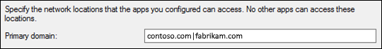
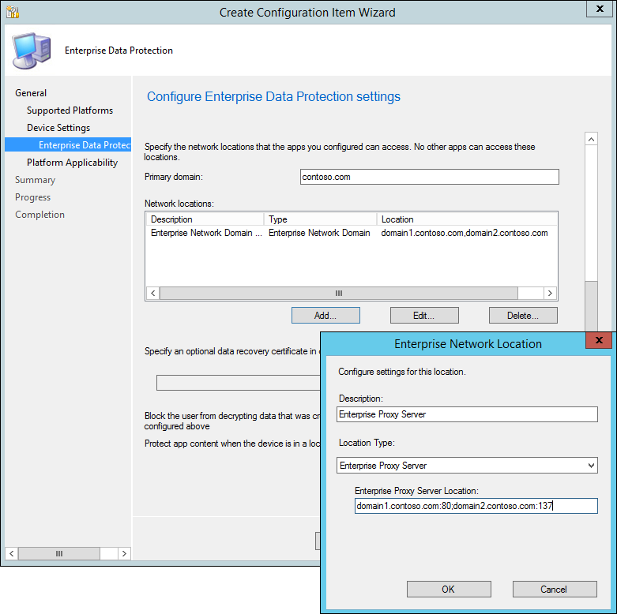

# Create and deploy an enterprise data protection (EDP) policy using System Center Configuration Manager
**Applies to:**

-   Windows 10 Insider Preview
-   Windows 10 Mobile Preview
-   System Center Configuration Manager (version 1511 or later)

<span style="color:#ED1C24;">[Some information relates to pre-released product which may be substantially modified before it's commercially released. Microsoft makes no warranties, express or implied, with respect to the information provided here. An app that calls an API introduced in Windows 10 Anniversary SDK Preview Build 14295 cannot be ingested into the Windows Store during the Preview period.]</span>

Configuration Manager (version 1511 or later) helps you create and deploy your enterprise data protection (EDP) policy, including letting you choose your protected apps, your EDP-protection level, and how to find enterprise data on the network.

## In this topic:
-   [Add an EDP policy](#add-an-edp-policy)

-   [Choose which apps can access your enterprise data](#choose-which-apps-can-access-your-enterprise-data)

-   [Manage the EDP protection level for your enterprise data](#manage-the-edp-protection-level-for-your-enterprise-data)

-   [Define your enterprise-managed identity domains](#define-your-enterprise-managed-identity-domains)

-   [Choose where apps can access enterprise data](#choose-where-apps-can-access-enterprise-data)

-   [Choose your optional EDP-related settings](#choose-your-optional-EDP-related-settings)

-   [Review your configuration choices in the **Summary** screen](#review-your-configuration-choices-in-the-summary-screen)

-   [Deploy the EDP policy](#deploy-the-edp-policy)

## Add an EDP policy
After you’ve installed and set up System Center Configuration Manager for your organization, you must create a configuration item for EDP, which in turn becomes your EDP policy.

**To create a configuration item for EDP**

1.  Open the System Center Configuration Manager console, click the **Assets and Compliance** node, expand the **Overview** node, expand the **Compliance Settings** node, and then expand the **Configuration Items** node.

    

2.  Click the **Create Configuration Item** button.<p>
The **Create Configuration Item Wizard** starts.

    

3.  On the **General Information screen**, type a name (required) and an optional description for your policy into the **Name** and **Description** boxes.

4.  In the **Specify the type of configuration item you want to create** area, pick the option that represents whether you use System Center Configuration Manager for device management, and then click **Next**.

    -   **Settings for devices managed with the Configuration Manager client &gt; Windows 10** option

        -OR-

    -   **Settings for devices managed without the Configuration Manager client &gt; Windows 8.1 and Windows 10** option

5.  On the **Supported Platforms** screen, click the **Windows 10** box, and then click **Next**.

    

6.  On the **Device Settings** screen, click **Enterprise Data Protection**, and then click **Next**.

    

    The **Configure Enterprise Data Protection settings** page appears, where you'll configure your policy for your organization.

## Choose which apps can access your enterprise data


During the policy-creation process in Configuration Manager, you can choose the apps you want to give access to your enterprise data through EDP. Apps included in this list can protect data on behalf of the enterprise and are restricted from copying or moving enterprise data to unprotected apps or unprotected network locations.

The steps to add your apps are based on the type of app it is; either a Universal Windows Platform (UWP) app, or a signed Classic Windows application.

**Important**  
EDP-aware apps are expected to prevent enterprise data from going to unprotected network locations and to avoid encrypting personal data. On the other hand, EDP-unaware apps might not respect the corporate network boundary and will encrypt all files they create or modify, meaning that they could encrypt personal data and cause data leaks during the revocation process. Care must be taken to get a support statement from the software provider that their app is safe with EDP before adding it to your **Protected App** list.

 

**To add a UWP app**

1.  From the **Configure the following apps to be protected by EDP** table in the **Protected Apps** area, click **Add.**

2.  Click **Universal App**, type the **Publisher Name** and the **Product Name** into the associated boxes, and then click **OK**. If you don't have the publisher or product name, you can find them by following these steps.

    **To find the Publisher and Product name values for Microsoft Store apps without installing them**

    1.  Go to the [Windows Store for Business](http://go.microsoft.com/fwlink/p/?LinkID=722910) website, and find your app. For example, Microsoft OneNote.

    2.  Copy the ID value from the app URL. For example, Microsoft OneNote's ID URL is https://www.microsoft.com/store/apps/onenote/9wzdncrfhvjl, and you'd copy the ID value, `9wzdncrfhvjl`.

    3.  In a browser, run the Store for Business portal web API, to return a JavaScript Object Notation (JSON) file that includes the publisher and product name values. For example, run https://bspmts.mp.microsoft.com/v1/public/catalog/Retail/Products/*9wzdncrfhvjl*/applockerdata, where *9wzdncrfhvjl* is replaced with your ID value.

        The API runs and opens a text editor with the app details.

        ``` syntax
        {
          "packageIdentityName": "Microsoft.Office.OneNote",
          "publisherCertificateName": "CN=Microsoft Corporation, O=Microsoft Corporation, L=Redmond, S=Washington, C=US"
        }
        ```

    4.  Copy the `publisherCertificateName` value and paste them into the **Publisher Name** box, copy the `packageIdentityName` value into the **Product Name** box of the **Add app** box, and then click **OK**.

        **Important**  
        If you don’t see the **Product Name** box, it could mean that your tenant is not on the latest build and that you need to wait until it's upgraded. Same applies if you see the **AppId** box. The **AppId** box has been removed in the latest build and should disappear (along with any entries) when your tenant is upgraded.

         

        **Important**  
        The JSON file might also return a `windowsPhoneLegacyId` value for both the **Publisher Name** and **Product Name** boxes. This means that you have an app that’s using a XAP package and that you must set the **Product Name** as `windowsPhoneLegacyId`, and set the **Publisher Name** as “CN=” followed by the `windowsPhoneLegacyId`.

        For example:

         

        ``` syntax
        {
          "windowsPhoneLegacyId": "ca05b3ab-f157-450c-8c49-a1f127f5e71d",
        }
        ```

        

**To add a Classic Windows application**

1.  From the **Configure the following apps to be protected by EDP** table in the **Protected Apps** area, click **Add.**

    A dialog box appears, letting you pick whether the app is a **Universal App** or a **Desktop App**.

2.  Click **Desktop App**, pick the options you want (see table), and then click **OK**.

    <table>
    <colgroup>
    <col width="50%" />
    <col width="50%" />
    </colgroup>
    <thead>
    <tr class="header">
    <th align="left">Option</th>
    <th align="left">Manages</th>
    </tr>
    </thead>
    <tbody>
    <tr class="odd">
    <td align="left"><p>All fields left as “*”</p></td>
    <td align="left"><p>All files signed by any publisher. (Not recommended.)</p></td>
    </tr>
    <tr class="even">
    <td align="left"><p><strong>Publisher</strong> selected</p></td>
    <td align="left"><p>All files signed by the named publisher.</p>
    <p>This might be useful if your company is the publisher and signer of internal line-of-business apps.</p></td>
    </tr>
    <tr class="odd">
    <td align="left"><p><strong>Publisher</strong> and <strong>Product Name</strong> selected</p></td>
    <td align="left"><p>All files for the specified product, signed by the named publisher.</p></td>
    </tr>
    <tr class="even">
    <td align="left"><p><strong>Publisher</strong>, <strong>Product Name</strong>, and <strong>File Name</strong> selected</p></td>
    <td align="left"><p>Any version of the named file or package for the specified product, signed by the named publisher.</p></td>
    </tr>
    <tr class="odd">
    <td align="left"><p><strong>Publisher</strong>, <strong>Product Name</strong>, <strong>File Name</strong>, and <strong>File Version, Exactly</strong>, selected</p></td>
    <td align="left"><p>Specified version of the named file or package for the specified product, signed by the named publisher.</p></td>
    </tr>
    <tr class="even">
    <td align="left"><p><strong>Publisher</strong>, <strong>Product Name</strong>, <strong>File Name</strong>, and <strong>File Version, And above</strong> selected</p></td>
    <td align="left"><p>Specified version or newer releases of the named file or package for the specified product, signed by the named publisher.</p>
    <p>This option is recommended for enlightened apps that weren't previously enlightened.</p></td>
    </tr>
    <tr class="odd">
    <td align="left"><p><strong>Publisher</strong>, <strong>Product Name</strong>, <strong>File Name</strong>, and <strong>File Version, And below</strong> selected</p></td>
    <td align="left"><p>Specified version or older releases of the named file or package for the specified product, signed by the named publisher.</p></td>
    </tr>
    </tbody>
    </table>

     

    If you’re unsure about what to include for the publisher, you can run this PowerShell command:

    ``` syntax
    Get-AppLockerFileInformation -Path "<path of the exe>"
    ```

    Where `"<path of the exe>"` goes to the location of the app on the device. For example, `Get-AppLockerFileInformation -Path "C:\Program Files\Internet Explorer\iexplore.exe"`.

    In this example, you'd get the following info:

    ``` syntax
    Path                   Publisher
    ----                   ---------
    %PROGRAMFILES%\INTERNET EXPLORER\IEXPLORE.EXE O=MICROSOFT CORPORATION, L=REDMOND, S=WASHINGTON, C=US\INTERNET EXPLOR...
    ```

    Where the text, `O=MICROSOFT CORPORATION, L=REDMOND, S=WASHINGTON, C=US` is the publisher name to enter in the **Publisher Name** box.

    

## Manage the EDP protection level for your enterprise data


After you've added the apps you want to protect with EDP, you'll need to apply an app management mode.

We recommend that you start with **Silent** or **Override** while verifying with a small group that you have the right apps on your **Protected Apps** list. After you're done, you can change to your final enforcement policy, either **Override** or **Block**.

<table>
<colgroup>
<col width="50%" />
<col width="50%" />
</colgroup>
<thead>
<tr class="header">
<th align="left">Mode</th>
<th align="left">Description</th>
</tr>
</thead>
<tbody>
<tr class="odd">
<td align="left"><strong>Block</strong></td>
<td align="left"><p>EDP looks for inappropriate data sharing practices and stops the employee from completing the action. This can include sharing info across non-enterprise-protected apps in addition to sharing enterprise data between other people and devices outside of your enterprise.</p></td>
</tr>
<tr class="even">
<td align="left"><strong>Override</strong></td>
<td align="left"><p>EDP looks for inappropriate data sharing, warning employees if they do something deemed potentially unsafe. However, this management mode lets the employee override the policy and share the data, logging the action to your audit log, accessible through the [Reporting CSP](http://go.microsoft.com/fwlink/p/?LinkID=746459).</p></td>
</tr>
<tr class="odd">
<td align="left"><strong>Silent</strong></td>
<td align="left"><p>EDP runs silently, logging inappropriate data sharing, without blocking anything.</p></td>
</tr>
<tr class="even">
<td align="left"><strong>Off</strong>
<p>(Not recommended)</p></td>
<td align="left"><p>EDP is turned off and doesn't help to protect or audit your data.</p>
<p>After you turn off EDP, an attempt is made to decrypt any closed EDP-tagged files on the locally attached drives.</p></td>
</tr>
</tbody>
</table>

 


## Define your enterprise-managed identity domains


Specify your company’s enterprise identity, expressed as your primary internet domain. For example, if your company is Contoso, its enterprise identity might be contoso.com. The first listed domain (in this example, contoso.com) is the primary enterprise identity string used to tag files protected by any app on the **Protected App** list.

You can also specify all the domains owned by your enterprise that are used for user accounts, separating them with the "|" character. For example, if Contoso also has some employees with email addresses or user accounts on the fabrikam.com domain, you would use contoso.com|fabrikam.com.

This list of managed identity domains, along with the primary domain, make up the identity of your managing enterprise. User identities (user@domain) that end in any of the domains on this list, are considered managed.



**To add your primary domain**

-   Type the name of your primary domain into the **Primary domain** field. For example, *contoso.com*.

    If you have multiple domains, you must separate them with the "|" character. For example, contoso.com|fabrikam.com.

## Choose where apps can access enterprise data


After you've added a management level to your protected apps, you'll need to decide where those apps can access enterprise data on your network. There are 6 options, including your network domain, cloud domain, proxy server, internal proxy server, IPv4 range, and IPv6 range.

**To specify where your protected apps can find and send enterprise data on the network**

1.  Add additional network locations your apps can access by clicking **Add**, and then choosing your location type, including:

    <table>
    <colgroup>
    <col width="33%" />
    <col width="33%" />
    <col width="33%" />
    </colgroup>
    <thead>
    <tr class="header">
    <th align="left">Network location type</th>
    <th align="left">Format</th>
    <th align="left">Description</th>
    </tr>
    </thead>
    <tbody>
    <tr class="odd">
    <td align="left"><p>Enterprise Cloud Domain</p></td>
    <td align="left"><p>contoso.sharepoint.com,proxy1.contoso.com|office.com|proxy2.contoso.com</p></td>
    <td align="left"><p>Specify the cloud resources traffic to restrict to your protected apps.</p>
    <p>For each cloud resource, you may also specify an internal proxy server that routes your traffic, from your <strong>Enterprise Internal Proxy Server</strong> policy. If you have multiple resources, you must use the &quot;|&quot; delimiter. Include the &quot;,&quot; delimiter just before the &quot;|&quot; if you don’t use proxies. For example: <code>URL[,Proxy]|URL[,Proxy]</code>.</p></td>
    </tr>
    <tr class="even">
    <td align="left"><p>Enterprise Network Domain</p></td>
    <td align="left"><p>domain1.contoso.com,domain2.contoso.com</p></td>
    <td align="left"><p>Specify the DNS suffix used in your environment. All traffic to the fully-qualified domains using this DNS suffix will be protected. If you have multiple resources, you must use the &quot;,&quot; delimiter.</p>
    <p>This setting works with the IP Ranges settings to detect whether a network endpoint is enterprise or personal on private networks.</p></td>
    </tr>
    <tr class="odd">
    <td align="left"><p>Enterprise Proxy Server</p></td>
    <td align="left"><p>domain1.contoso.com:80;domain2.contoso.com:137</p></td>
    <td align="left"><p>Specify the proxy server and the port traffic is routed through. If you have multiple resources, you must use the &quot;;&quot; delimiter.</p>
    <p>This setting is required if you use a proxy in your network. If you don't have a proxy server, you might find that enterprise resources are unavailable when a client is behind a proxy, such as when using certain Wi-Fi hotspots at hotels and restaurants.</p></td>
    </tr>
    <tr class="even">
    <td align="left"><p>Enterprise Internal Proxy Server</p></td>
    <td align="left"><p>proxy1.contoso.com;proxy2.contoso.com</p></td>
    <td align="left"><p>Specify the proxy servers your cloud resources will go through. If you have multiple resources, you must use the &quot;;&quot; delimiter.</p></td>
    </tr>
    <tr class="odd">
    <td align="left"><p>Enterprise IPv4 Range</p></td>
    <td align="left"><p><strong>Starting IPv4 Address:</strong> 3.4.0.1</p>
    <p><strong>Ending IPv4 Address:</strong> 3.4.255.254</p>
    <p><strong>Custom URI:</strong> 3.4.0.1-3.4.255.254,10.0.0.1-10.255.255.254</p></td>
    <td align="left"><p>Specify the addresses for a valid IPv4 value range within your intranet.</p>
    <p>If you are adding a single range, you can enter the starting and ending addresses into your management system’s UI. If you want to add multiple addresses, we suggest creating a Custom URI, using the &quot;-&quot; delimiter between start and end of a range, and the &quot;,&quot; delimiter to separate ranges.</p></td>
    </tr>
    <tr class="even">
    <td align="left"><p>Enterprise IPv6 Range</p></td>
    <td align="left"><p><strong>Starting IPv6 Address:</strong></p>
    <p>2a01:110::</p>
    <p><strong>Ending IPv6 Address:</strong> 2a01:110:7fff:ffff:ffff:ffff:ffff:ffff</p>
    <p><strong>Custom URI:</strong> 2a01:110::-2a01:110:7fff:ffff:ffff:ffff:ffff:ffff,fd00::-fdff:ffff:ffff:ffff:ffff:ffff:ffff:ffff</p></td>
    <td align="left"><p>Specify the addresses for a valid IPv6 value range within your intranet.</p>
    <p>If you are adding a single range, you can enter the starting and ending addresses into your management system’s UI. If you want to add multiple addresses, we suggest creating a Custom URI, using the &quot;-&quot; delimiter between start and end of a range, and the &quot;,&quot; delimiter to separate ranges.</p></td>
    </tr>
    </tbody>
    </table>

     

    

2.  Add as many locations as you need, and then click **OK**.

    The **Add or Edit Enterprise Network Locations box** closes.

3.  In the **Use a data recovery certificate in case of data loss** box, click **Browse** to add a data recovery certificate for your policy.

    Adding a data recovery certificate helps you to access locally-protected files on the device. For example, if an employee leaves the company and the IT department has to access EDP-protected data from a Windows 10 company computer. This can also help recover data in case an employee's device is accidentally revoked. For more info about how to find and export your data recovery certificate, see the[Data Recovery and Encrypting File System (EFS)](http://go.microsoft.com/fwlink/p/?LinkId=761462) topic.

## Choose your optional EDP-related settings


After you've decided where your protected apps can access enterprise data on your network, you’ll be asked to decide if you want to add any optional EDP settings.

**To add your optional settings**

-   Choose to set any or all of the optional EDP-related settings:

    -   **Block the user from decrypting data that was created or edited by the apps configured above.** Clicking **No**, or leaving the setting blank, lets your employees right-click to decrypt their protected app data, along with the option to decrypt data in the **Save As** box and the **Save As** file picker . Clicking **Yes** removes the **Decrypt** option and saves all data for protected apps as enterprise-encrypted.

    -   **Protect app content when the device is in a locked state for the apps configured above.** Clicking **Yes** lets EDP help to secure protected app content when a mobile device is locked. We recommend turning this option on to help prevent data leaks from things such as email text that appears on the **Lock** screen of a Windows 10 Mobile phone.

        

## Review your configuration choices in the Summary screen


After you've finished configuring your policy, you can review all of your info on the **Summary** screen.

**To view the Summary screen**

-   Click the **Summary** button to review your policy choices, and then click **Next** to finish and to save your policy.

    A progress bar appears, showing you progress for your policy. After it's done, click **Close** to return to the **Configuration Items** page.

    

## Deploy the EDP policy


After you’ve created your EDP policy, you'll need to deploy it to your organization's devices. For info about your deployment options, see these topics:

[Operations and Maintenance for Compliance Settings in Configuration Manager](http://go.microsoft.com/fwlink/p/?LinkId=708224)

[How to Create Configuration Baselines for Compliance Settings in Configuration Manager]( http://go.microsoft.com/fwlink/p/?LinkId=708225)

[How to Deploy Configuration Baselines in Configuration Manager]( http://go.microsoft.com/fwlink/p/?LinkId=708226)

## Next steps


Enrollment can be done for business or personal devices, allowing the devices to use your managed apps and to sync with your managed content and information.

## Related topics


[System Center Configuration Manager and Endpoint Protection (Version 1511)](http://go.microsoft.com/fwlink/p/?LinkId=717372)

[TechNet documentation for Configuration Manager](http://go.microsoft.com/fwlink/p/?LinkId=691623)

[Manage mobile devices with Configuration Manager and Microsoft Intune](http://go.microsoft.com/fwlink/p/?LinkId=691624)

 

 


