# Create a Windows Information Protection (WIP) policy using Microsoft Azure Intune

**Applies to:**

-   Windows 10, version 1703
-   Windows 10 Mobile, version 1703 (except Microsoft Azure Rights Management, which is only available on the desktop)

Microsoft Azure Intune helps you create and deploy your Windows Information Protection (WIP) policy, including letting you choose your allowed apps, your WIP-protection level, and how to find enterprise data on the network.

## Add a WIP policy
After you’ve set up Intune for your organization, you must create a WIP-specific policy.

**To add a WIP policy**
1.  Open the Microsoft Azure Intune mobile application management console, click **All settings**, and then click **App policy**.

    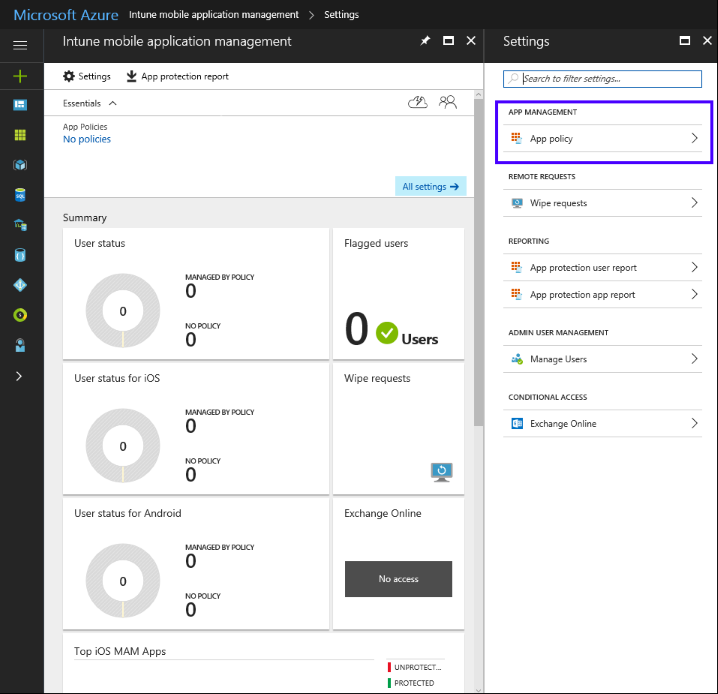

2.  In the **App policy** screen, click **Add a policy**, and then fill out the fields:
    - **Name.** Type a name (required) for your new policy.

    - **Description.** Type an optional description.

    - **Platform.** Choose **Windows 10** as the supported platform for your policy.

    - **Enrollment state.** Choose **With enrollment** as the enrollment state for your policy.

        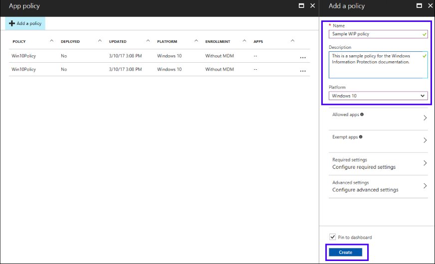

3.  Click **Create**.
    
    The policy is created and appears in the table on the **App Policy** screen.

    >[!NOTE]
    >Optionally, you can also add your apps and set your settings from the **Add a policy** blade, but for the purposes of this documentation, we recommend instead that you create the policy first, and then use the subsequent menus that become available.

### Add apps to your Allowed apps list
During the policy-creation process in Intune, you can choose the apps you want to give access to your enterprise data through WIP. Apps included in this list can protect data on behalf of the enterprise and are restricted from copying or moving enterprise data to unprotected apps.

The steps to add your apps are based on the type of template being applied. You can add a recommended app, a store app (also known as a Universal Windows Platform (UWP) app), or a signed Windows desktop app.

>[!Important]
>WIP-aware apps are expected to prevent enterprise data from going to unprotected network locations and to avoid encrypting personal data. On the other hand, WIP-unaware apps might not respect the corporate network boundary, and WIP-unaware apps will encrypt all files they create or modify. This means that they could encrypt personal data and cause data loss during the revocation process.<p>Care must be taken to get a support statement from the software provider that their app is safe with WIP before adding it to your **Allowed apps** list. If you don’t get this statement, it’s possible that you could experience app compat issues due to an app losing the ability to access a necessary file after revocation.

>[!Note]
>If you want to use **File hash** or **Path** rules, instead of **Publisher** rules, you must follow the steps in the [Add apps to your Windows Information Protection (WIP) policy by using the Microsoft Azure Intune custom URI functionality](add-apps-to-protected-list-using-custom-uri.md) topic.

#### Add a Recommended app to your Allowed apps list
For this example, we’re going to add Microsoft Edge, a recommended app, to the **Allowed apps** list.

**To add a recommended app**
1.  From the **App policy** blade, click the name of your policy, and then click **Allowed apps** from the menu that appears.
    
    The **Allowed apps** blade appears, showing you any apps that are already included in the list for this policy.

    

2.  From the **Allowed apps** blade, click **Add apps**.
    
    The **Add apps** blade appears, showing you all **Recommended apps**.

    

3.  Select each app you want to access your enterprise data, and then click **OK**.
    
    The **Allowed apps** blade updates to show you your selected apps.

        

#### Add a Store app to your Allowed apps list
For this example, we’re going to add Microsoft Power BI, a store app, to the **Allowed apps** list.

**To add a Store app**
1.	From the **App policy** blade, click the name of your policy, and then click **Allowed apps** from the menu that appears.
    
    The **Allowed apps** blade appears, showing you any apps that are already included in the list for this policy.

2.	From the **Allowed apps** blade, click **Add apps**.

3.	On the **Add apps** blade, click **Store apps** from the dropdown list.
    
    The blade changes to show boxes for you to add a publisher and app name.

4.	Type the name of the app and the name of its publisher, and then click **OK**. For this UWP app example, the **Publisher** is `CN=Microsoft Corporation, O=Microsoft Corporation, L=Redmond, S=Washington, C=US` and the Product **name** is `Microsoft.MicrosoftPowerBIForWindows`.

5.	After you’ve entered the info into the fields, click **OK** to add the app to your **Allowed apps** list.

    >[!NOTE]
    >To add multiple Store apps at the same time, you can click the menu **(…)** at the end of the app row, and then continue to add more apps. When you’re done, click **OK**.

    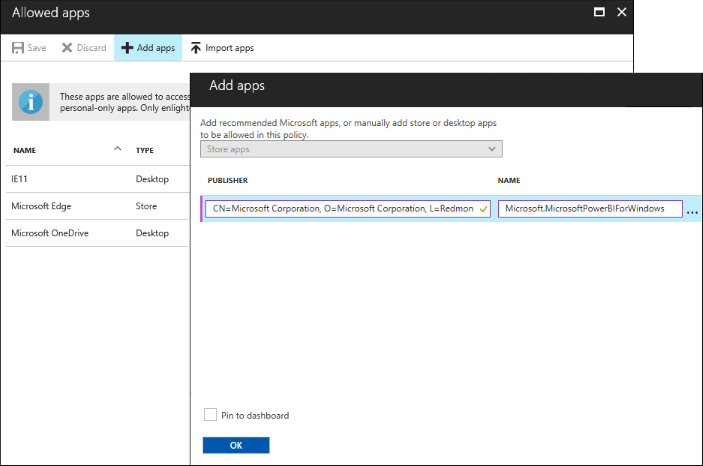

If you don't know the publisher or product name, you can find them for both desktop devices and Windows 10 Mobile phones by following these steps.

**To find the publisher and product name values for Store apps without installing them**
1.	Go to the [Windows Store for Business](https://go.microsoft.com/fwlink/p/?LinkID=722910) website, and find your app. For example, *Microsoft Power BI*.

    >[!NOTE]
    >If your app is already installed on desktop devices, you can use the AppLocker local security policy MMC snap-in to gather the info for adding the app to the protected apps list. For info about how to do this, see the [Add apps to your Windows Information Protection (WIP) policy by using the Microsoft Azure Intune custom URI functionality](add-apps-to-protected-list-using-custom-uri.md) topic.

2.	Copy the ID value from the app URL. For example, Microsoft Power BI ID URL is https://www.microsoft.com/en-us/store/p/microsoft-power-bi/9nblgggzlxn1, and you'd copy the ID value, `9nblgggzlxn1`.

3.	In a browser, run the Store for Business portal web API, to return a JavaScript Object Notation (JSON) file that includes the publisher and product name values. For example, run https://bspmts.mp.microsoft.com/v1/public/catalog/Retail/Products/9nblgggzlxn1/applockerdata, where `9nblgggzlxn1` is replaced with your ID value.
    
    The API runs and opens a text editor with the app details.

    ```json
        {
            "packageIdentityName": "Microsoft.MicrosoftPowerBIForWindows",
            "publisherCertificateName": "CN=Microsoft Corporation, O=Microsoft Corporation, L=Redmond, S=Washington, C=US"
        }
    ```

4. Copy the `publisherCertificateName` value into the **Publisher** box and copy the `packageIdentityName` value into the **Name** box of Intune.

    >[!Important]
    >The JSON file might also return a `windowsPhoneLegacyId` value for both the **Publisher Name** and **Product Name** boxes. This means that you have an app that’s using a XAP package and that you must set the **Product Name** as `windowsPhoneLegacyId`, and set the **Publisher Name** as `CN=` followed by the `windowsPhoneLegacyId`.<p>For example:<br>
    <code>{<br>"windowsPhoneLegacyId": "ca05b3ab-f157-450c-8c49-a1f127f5e71d",<br>}</code>

**To find the publisher and product name values for apps installed on Windows 10 mobile phones**
1.	If you need to add mobile apps that aren't distributed through the Store for Business, you must use the **Windows Device Portal** feature.

    >**Note**<br>Your PC and phone must be on the same wireless network.

2.	On the Windows Phone, go to **Settings**, choose **Update & security**, and then choose **For developers**.

3.	In the **For developers** screen, turn on **Developer mode**, turn on **Device Discovery**, and then turn on **Device Portal**.

4.	Copy the URL in the **Device Portal** area into your device's browser, and then accept the SSL certificate.

5.	In the **Device discovery** area, press **Pair**, and then enter the PIN into the website from the previous step.

6.	On the **Apps** tab of the website, you can see details for the running apps, including the publisher and product names.

7.	Start the app for which you're looking for the publisher and product name values.

8.	Copy the `publisherCertificateName` value and paste it into the **Publisher Name** box and the `packageIdentityName` value into the **Product Name** box of Intune.

    >[!Important]
    >The JSON file might also return a `windowsPhoneLegacyId` value for both the **Publisher Name** and **Product Name** boxes. This means that you have an app that’s using a XAP package and that you must set the **Product Name** as `windowsPhoneLegacyId`, and set the **Publisher Name** as `CN=` followed by the `windowsPhoneLegacyId`.<p>For example:<br>
    <code>{<br>"windowsPhoneLegacyId": "ca05b3ab-f157-450c-8c49-a1f127f5e71d",<br>}</code>

#### Add a Desktop app to your Allowed apps list
For this example, we’re going to add WordPad, a desktop app, to the **Allowed apps** list.

**To add a Desktop app**
1.	From the **App policy** blade, click the name of your policy, and then click **Allowed apps** from the menu that appears.

    The **Allowed apps** blade appears, showing you any apps that are already included in the list for this policy.

2.	From the **Allowed apps** blade, click **Add apps**.

3.	On the **Add apps** blade, click **Desktop apps** from the dropdown list.

    The blade changes to show boxes for you to add the following, based on what results you want returned:

    <table>
        <tr>
            <th>Field</th>
            <th>Manages</th>
        </tr>
        <tr>
            <td>All fields marked as “*”</td>
            <td>All files signed by any publisher. (Not recommended)</td>
        </tr>
        <tr>
            <td>Publisher only</td>
            <td>If you only fill out this field, you’ll get all files signed by the named publisher.<p>This might be useful if your company is the publisher and signer of internal line-of-business apps.</td>
        </tr>
        <tr>
            <td>Publisher and Name only</td>
            <td>If you only fill out these fields, you’ll get all files for the specified product, signed by the named publisher.</td>
        </tr>
        <tr>
            <td>Publisher, Name, and File only</td>
            <td>If you only fill out these fields, you’ll get any version of the named file or package for the specified product, signed by the named publisher.</td>
        </tr>
        <tr>
            <td>Publisher, Name, File, and Min version only</td>
            <td>If you only fill out these fields, you’ll get the specified version or newer releases of the named file or package for the specified product, signed by the named publisher.<p>This option is recommended for enlightened apps that weren't previously enlightened.</td>
        </tr>
        <tr>
            <td>Publisher, Name, File, and Max version only</td>
            <td>If you only fill out these fields, you’ll get the specified version or older releases of the named file or package for the specified product, signed by the named publisher.</td>
        </tr>
        <tr>
            <td>All fields completed</td>
            <td>If you fill out all fields, you’ll get the specified version of the named file or package for the specified product, signed by the named publisher.</td>
        </tr>
    </table>

4.	After you’ve entered the info into the fields, click **OK** to add the app to your **Allowed apps** list.

    >[!Note]
    >To add multiple Desktop apps at the same time, you can click the menu **(…)** at the end of the app row, and then continue to add more apps. When you’re done, click **OK**.

    

    **To find the Publisher values for Desktop apps**
    If you’re unsure about what to include for the publisher, you can run this PowerShell command:

    ```ps1
        Get-AppLockerFileInformation -Path "<path_of_the_exe>"
    ```
    Where `"<path_of_the_exe>"` goes to the location of the app on the device. For example, `Get-AppLockerFileInformation -Path "C:\Program Files\Windows NT\Accessories\wordpad.exe"`.

    In this example, you'd get the following info:

    ``` json
        Path                   Publisher
        ----                   ---------
        %PROGRAMFILES%\WINDOWS NT\ACCESSORIES\WORDPAD.EXE O=MICROSOFT CORPORATION, L=REDMOND, S=WASHINGTON, C=US
    ```
    Where the text, `O=MICROSOFT CORPORATION, L=REDMOND, S=WASHINGTON, C=US` is the publisher name to enter into the **Publisher** box and `WORDPAD.EXE` is the text to enter into the **File** box.

#### Import a list of apps to your Allowed apps list
For this example, we’re going to add an AppLocker XML file to the **Allowed apps** list. You’ll use this option if you want to add multiple apps at the same time. For more info about AppLocker, see the [AppLocker](https://technet.microsoft.com/itpro/windows/keep-secure/applocker-overview) content.

**To create a list of Allowed apps using the AppLocker tool**
1.	Open the Local Security Policy snap-in (SecPol.msc).
    
2.	In the left blade, expand **Application Control Policies**, expand **AppLocker**, and then click **Packaged App Rules**.

    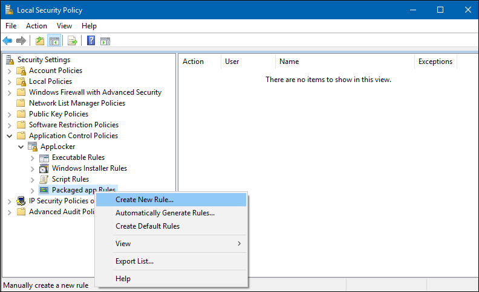

3.	Right-click in the right-hand blade, and then click **Create New Rule**.

    The **Create Packaged app Rules** wizard appears.

4. On the **Before You Begin** page, click **Next**.

    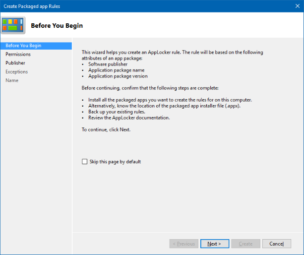

5. On the **Permissions** page, make sure the **Action** is set to **Allow** and the **User or group** is set to **Everyone**, and then click **Next**.

    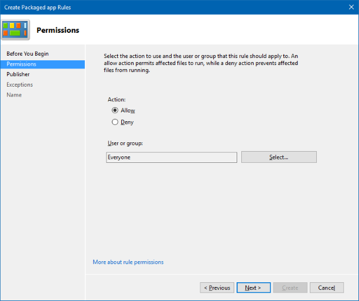

6.	On the **Publisher** page, click **Select** from the **Use an installed packaged app as a reference** area.

    

7. In the **Select applications** box, pick the app that you want to use as the reference for your rule, and then click **OK**. For this example, we’re using Microsoft Dynamics 365.

    

8. On the updated **Publisher** page, click **Create**.

    

9. Click **No** in the dialog box that appears, asking if you want to create the default rules. You must not create default rules for your WIP policy.

    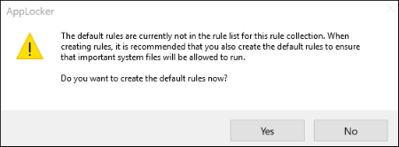

9. Review the Local Security Policy snap-in to make sure your rule is correct.

    

10.	In the left blade, right-click on **AppLocker**, and then click **Export policy**.

    The **Export policy** box opens, letting you export and save your new policy as XML.

    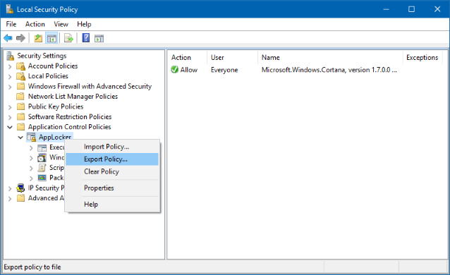

11.	In the **Export policy** box, browse to where the policy should be stored, give the policy a name, and then click **Save**.

    The policy is saved and you’ll see a message that says 1 rule was exported from the policy.

    **Example XML file**<br>
    This is the XML file that AppLocker creates for Microsoft Dynamics 365.

    ```xml
        <?xml version="1.0"?>
        <AppLockerPolicy Version="1">
            <RuleCollection EnforcementMode="NotConfigured" Type="Appx">
                <FilePublisherRule Action="Allow" UserOrGroupSid="S-1-1-0" Description="" Name="Microsoft.MicrosoftDynamicsCRMforWindows10, version 3.2.0.0 and above, from Microsoft Corporation" Id="3da34ed9-aec6-4239-88ba-0afdce252ab4">
                    <Conditions>
                        <FilePublisherCondition BinaryName="*" ProductName="Microsoft.MicrosoftDynamicsCRMforWindows10" PublisherName="CN=Microsoft Corporation, O=Microsoft Corporation, L=Redmond, S=Washington, C=US">
                            <BinaryVersionRange HighSection="*" LowSection="3.2.0.0"/>
                        </FilePublisherCondition>
                    </Conditions>
                </FilePublisherRule>
            </RuleCollection>
            <RuleCollection EnforcementMode="NotConfigured" Type="Dll"/>
            <RuleCollection EnforcementMode="NotConfigured" Type="Exe"/>
            <RuleCollection EnforcementMode="NotConfigured" Type="Msi"/>
            <RuleCollection EnforcementMode="NotConfigured" Type="Script"/>
        </AppLockerPolicy>
    ```

12.	After you’ve created your XML file, you need to import it by using Microsoft Azure Intune.

**To import your list of Allowed apps using Microsoft Azure Intune**

1.	From the **Allowed apps** area, click **Import apps**.
    
    The blade changes to let you add your import file.
    
    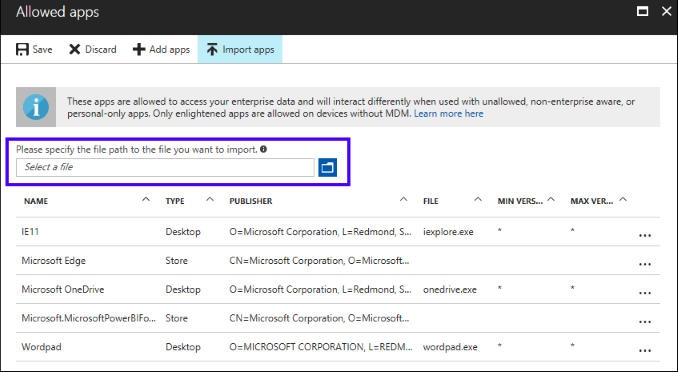

2.	Browse to your exported AppLocker policy file, and then click **Open**.

    The file imports and the apps are added to your **Allowed app** list.

#### Add exempt apps to your policy
If you're running into compatibility issues where your app is incompatible with WIP, but still needs to be used with enterprise data, you can exempt the app from the WIP restrictions. This means that your apps won't include auto-encryption or tagging and won't honor your network restrictions. It also means that your exempted apps might leak.

**To exempt a Store app, a Desktop app, or an AppLocker policy file from the Allowed apps list**

1.	From the **App policy** blade, click the name of your policy, and then click **Exempt apps** from the menu that appears.
    
    The **Exempt apps** blade appears, showing you any apps that are already included in the list for this policy.

2.	From the **Exempt apps** blade, click **Add apps**.

    Be aware that when you exempt apps, they’re allowed to bypass the WIP restrictions and access your corporate data. To allow apps, see the [Add app rules to your policy](#add-apps-to_your-allowed-apps-list) section of this topic.
    
3.	Fill out the rest of the app info, based on the type of app you’re adding:

    - **Recommended app.** Follow the instructions in the [Add a Recommended app to your Allowed apps list](#add-a-recommended-app-to_your-allowed-apps-list) section of this topic.

    - **Store app.** Follow the instructions in the [Add a Store app to your Allowed apps list](#add-a-store-app-to_your-allowed-apps-list) section of this topic.

    - **Desktop app.** Follow the instructions in the [Add a Desktop app to your Allowed apps list](#add-a-desktop-app-to_your-allowed-apps-list) section of this topic.

    - **AppLocker policy file.** Follow the instructions to create your app list in the [Import a list of apps to your Allowed apps list](#import-a-list-of-apps-to_your-allowed-apps-list) section of this topic, using a list of exempted apps.

4. Click **OK**.

### Manage the WIP protection mode for your enterprise data
After you've added the apps you want to protect with WIP, you'll need to apply a management and protection mode.

We recommend that you start with **Silent** or **Allow Overrides** while verifying with a small group that you have the right apps on your allowed apps list. After you're done, you can change to your final enforcement policy, **Hide Overrides**.

**To add your protection mode**

1.	From the **App policy** blade, click the name of your policy, and then click **Required settings** from the menu that appears.
    
    The **Required settings** blade appears.

    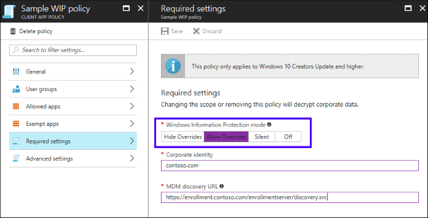

    |Mode |Description |
    |-----|------------|
    |Hide Overrides |WIP looks for inappropriate data sharing practices and stops the employee from completing the action. This can include sharing info across non-enterprise-protected apps in addition to sharing enterprise data between other people and devices outside of your enterprise.|
    |Allow Overrides |WIP looks for inappropriate data sharing, warning employees if they do something deemed potentially unsafe. However, this management mode lets the employee override the policy and share the data, logging the action to your audit log, accessible through the [Reporting CSP](https://go.microsoft.com/fwlink/p/?LinkID=746459).|
    |Silent |WIP runs silently, logging inappropriate data sharing, without blocking anything that would’ve been prompted for employee interaction while in Allow Override mode. Unallowed actions, like apps inappropriately trying to access a network resource or WIP-protected data, are still stopped.|
    |Off (not recommended) |WIP is turned off and doesn't help to protect or audit your data.<p>After you turn off WIP, an attempt is made to decrypt any WIP-tagged files on the locally attached drives. Be aware that your previous decryption and policy info isn’t automatically reapplied if you turn WIP protection back on.|

2.	Click **Save**.

### Define your enterprise-managed corporate identity
Corporate identity, usually expressed as your primary Internet domain (for example, contoso.com), helps to identify and tag your corporate data from apps you’ve marked as protected by WIP. For example, emails using contoso.com are identified as being corporate and are restricted by your Windows Information Protection policies.

Starting with Windows 10, version 1703, Intune automatically determines your corporate identity and adds it to the Corporate identity field. You can specify multiple domains owned by your enterprise by separating them with the "|" character. For example, (`contoso.com|newcontoso.com`). With multiple domains, the first one is designated as your corporate identity and all of the additional ones as being owned by the first one. We strongly recommend that you include all of your email address domains in this list.

**To change your corporate identity**

1.	From the **App policy** blade, click the name of your policy, and then click **Required settings** from the menu that appears.

    The **Required settings** blade appears.

2.	If the identity isn’t correct, or if you need to add additional domains, type info into the **Corporate identity** field. For example, `contoso.com|newcontoso.com`.

    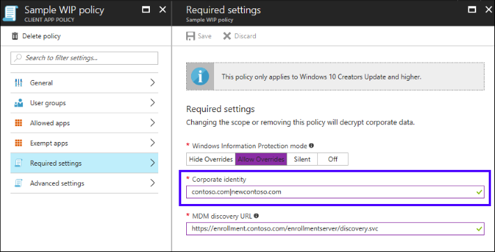

### Choose where apps can access enterprise data
After you've added a protection mode to your apps, you'll need to decide where those apps can access enterprise data on your network.

There are no default locations included with WIP, you must add each of your network locations. This area applies to any network endpoint device that gets an IP address in your enterprise’s range and is also bound to one of your enterprise domains, including SMB shares. Local file system locations should just maintain encryption (for example, on local NTFS, FAT, ExFAT).

>[!Important]
>Every WIP policy should include policy that defines your enterprise network locations.<br>Classless Inter-Domain Routing (CIDR) notation isn’t supported for WIP configurations.

**To define where your allowed apps can find and send enterprise data on you network**

1.	From the **App policy** blade, click the name of your policy, and then click **Advanced settings** from the menu that appears.
    
    The **Advanced settings** blade appears.

2.	Click **Add network boundary** from the Network perimeter area.

    The **Add network boundary** blade appears.

    

3.	Select the type of network boundary to add from the **Boundary type** box.

4.	Type a name for your boundary into the **Name** box, add your values to the **Value** box, based on the following options, and then click **OK**.

    <table>
        <tr>
            <th>Boundary type</th>
            <th>Value format</th>
            <th>Description</th>
        </tr>
        <tr>
            <td>Cloud Resources</td>
            <td><strong>With proxy:</strong> contoso.sharepoint.com,contoso.internalproxy1.com|<br>contoso.visualstudio.com,contoso.internalproxy2.com<p><strong>Without proxy:</strong> contoso.sharepoint.com|contoso.visualstudio.com</td>
            <td>Specify the cloud resources to be treated as corporate and protected by WIP.<p>For each cloud resource, you may also optionally specify a proxy server from your Internal proxy servers list to route traffic for this cloud resource. Be aware that all traffic routed through your Internal proxy servers is considered enterprise.<p>If you have multiple resources, you must separate them using the "|" delimiter. If you don’t use proxy servers, you must also include the "," delimiter just before the "|". For example: <code>URL &lt;,proxy&gt;|URL &lt;,proxy&gt;</code>.<p><strong>Important</strong><br>In some cases, such as when an app connects directly to a cloud resource through an IP address, Windows can’t tell whether it’s attempting to connect to an enterprise cloud resource or to a personal site. In this case, Windows blocks the connection by default. To stop Windows from automatically blocking these connections, you can add the <code>/&#42;AppCompat&#42;/</code> string to the setting. For example: <code>URL &lt;,proxy&gt;|URL &lt;,proxy&gt;|/&#42;AppCompat&#42;/</code>.<p>When using this string, we recommend that you also turn on [Azure Active Directory Conditional Access](https://docs.microsoft.com/en-us/azure/active-directory/active-directory-conditional-access), using the <strong>Domain joined or marked as compliant</strong> option, which blocks apps from accessing any enterprise cloud resources that are protected by conditional access.</td>
        </tr>
        <tr>
            <td>Network domain names</td>
            <td>corp.contoso.com,region.contoso.com</td>
            <td>Starting with Windows 10, version 1703, this field is optional.<p>Specify the DNS suffixes used in your environment. All traffic to the fully-qualified domains appearing in this list will be protected.<p>If you have multiple resources, you must separate them using the "," delimiter.</td>
        </tr>
        <tr>
            <td>Proxy servers</td>
            <td>proxy.contoso.com:80;proxy2.contoso.com:443</td>
            <td>Specify the proxy servers your devices will go through to reach your cloud resources. Using this server type indicates that the cloud resources you’re connecting to are enterprise resources.<p>This list shouldn’t include any servers listed in the Proxy servers list, which are used for non-WIP-protected traffic.<p>If you have multiple resources, you must separate them using the ";" delimiter.</td>
        </tr>
        <tr>
            <td>Internal proxy servers</td>
            <td>contoso.internalproxy1.com;contoso.internalproxy2.com</td>
            <td>Specify the proxy servers your devices will go through to reach your cloud resources.<p>Using this server type indicates that the cloud resources you’re connecting to are enterprise resources.<p>This list shouldn’t include any servers listed in the Enterprise Proxy Servers list, which are used for non-WIP-protected traffic.<p>If you have multiple resources, you must separate them using the ";" delimiter.</td>
        </tr>
        <tr>
            <td>IPv4 ranges</td>
            <td>**Starting IPv4 Address:** 3.4.0.1<br>**Ending IPv4 Address:** 3.4.255.254<br>**Custom URI:** 3.4.0.1-3.4.255.254,<br>10.0.0.1-10.255.255.254</td>
            <td>Starting with Windows 10, version 1703, this field is optional.<p>Specify the addresses for a valid IPv4 value range within your intranet. These addresses, used with your Network domain names, define your corporate network boundaries.<p>If you have multiple ranges, you must separate them using the "," delimiter.</td>
        </tr>
        <tr>
            <td>IPv6 ranges</td>
            <td>**Starting IPv6 Address:** 2a01:110::<br>**Ending IPv6 Address:** 2a01:110:7fff:ffff:ffff:ffff:ffff:ffff<br>**Custom URI:** 2a01:110:7fff:ffff:ffff:ffff:ffff:ffff,<br>fd00::-fdff:ffff:ffff:ffff:ffff:ffff:ffff:ffff</td>
            <td>Starting with Windows 10, version 1703, this field is optional.<p>Specify the addresses for a valid IPv6 value range within your intranet. These addresses, used with your Network domain names, define your corporate network boundaries.<p>If you have multiple ranges, you must separate them using the "," delimiter.</td>
        </tr>
        <tr>
            <td>Neutral resources</td>
            <td>sts.contoso.com,sts.contoso2.com</td>
            <td>Specify your authentication redirection endpoints for your company.<p>These locations are considered enterprise or personal, based on the context of the connection before the redirection.<p>If you have multiple resources, you must separate them using the "," delimiter.</td>
        </tr>
    </table>

5.	Repeat steps 1-4 to add any additional network boundaries.

6.	Decide if you want to Windows to look for additional network settings:

    

    - **Enterprise Proxy Servers list is authoritative (do not auto-detect).** Click this box if you want Windows to treat the proxy servers you specified in the network boundary definition as the complete list of proxy servers available on your network. If you clear this box, Windows will search for additional proxy servers in your immediate network.

	- **Enterprise IP Ranges list is authoritative (do not auto-detect).** Click this box if you want Windows to treat the IP ranges you specified in the network boundary definition as the complete list of IP ranges available on your network. If you clear this box, Windows will search for additional IP ranges on any domain-joined devices connected to your network.

### Upload your Data Recovery Agent (DRA) certificate
After you create and deploy your WIP policy to your employees, Windows begins to encrypt your corporate data on the employees’ local device drive. If somehow the employees’ local encryption keys get lost or revoked, the encrypted data can become unrecoverable. To help avoid this possibility, the Data Recovery Agent (DRA) certificate lets Windows use an included public key to encrypt the local data while you maintain the private key that can unencrypt the data.

>[!Important]
>Using a DRA certificate isn’t mandatory. However, we strongly recommend it. For more info about how to find and export your data recovery certificate, see the [Data Recovery and Encrypting File System (EFS)](https://go.microsoft.com/fwlink/p/?LinkId=761462) topic. For more info about creating and verifying your EFS DRA certificate, see the [Create and verify an Encrypting File System (EFS) Data Recovery Agent (DRA) certificate](https://tnstage.redmond.corp.microsoft.com/en-us/itpro/windows/keep-secure/create-and-verify-an-efs-dra-certificate) topic.

**To upload your DRA certificate**
1.	From the **App policy** blade, click the name of your policy, and then click **Advanced settings** from the menu that appears.

    The **Advanced settings** blade appears.

2. In the **Upload a Data Recovery Agent (DRA) certificate to allow recovery of encrypted data** box, click **Browse** to add a data recovery certificate for your policy.

    

### Choose your optional WIP-related settings
After you've decided where your protected apps can access enterprise data on your network, you’ll be asked to decide if you want to add any optional WIP settings.

**To set your optional settings**

1.	Choose to set any or all optional settings:

    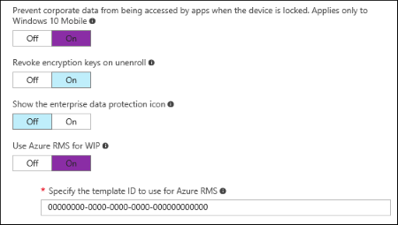
    
    - **Prevent corporate data from being accessed by apps when the device is locked. Applies only to Windows 10 Mobile.** Determines whether to encrypt enterprise data using a key that's protected by an employee's PIN code on a locked device. Apps won't be able to read corporate data when the device is locked. The options are:
        
        - **On (recommended).** Turns on the feature and provides the additional protection.
        
        - **Off, or not configured.** Doesn't enable this feature.
    
    - **Revoke encryption keys on unenroll.** Determines whether to revoke a user’s local encryption keys from a device when it’s unenrolled from Windows Information Protection. If the encryption keys are revoked, a user no longer has access to encrypted corporate data. The options are:
    
        - **On, or not configured (recommended).** Revokes local encryption keys from a device during unenrollment.
        
        - **Off.** Stop local encryption keys from being revoked from a device during unenrollment. For example if you’re migrating between Mobile Device Management (MDM) solutions.
        
    - **Show the Windows Information Protection icon overlay.** Determines whether the Windows Information Protection icon overlay appears on corporate files in the Save As and File Explorer views. The options are:
    
        - **On.** Allows the Windows Information Protection icon overlay to appear on corporate files in the Save As and File Explorer views. Additionally, for unenlightened but allowed apps, the icon overlay also appears on the app tile and with Managed text on the app name in the **Start** menu.
        
        - **Off, or not configured (recommended).** Stops the Windows Information Protection icon overlay from appearing on corporate files or unenlightened, but allowed apps. Not configured is the default option.
        
    - **Use Azure RMS for WIP.** Determines whether to use Azure Rights Management encryption with Windows Information Protection.
    
        - **On.** Starts using Azure Rights Management encryption with WIP. By turning this option on, you can also add a TemplateID GUID to specify who can access the Azure Rights Management protected files, and for how long. For more info about setting up Azure Rights management and using a template ID with WIP, see the [Choose to set up Azure Rights Management with WIP](#choose-to-set-up-azure-rights-management-with-wip) section of this topic.
        
        - **Off, or not configured.** Stops using Azure Rights Management encryption with WIP.

### Choose to set up Azure Rights Management with WIP
WIP can integrate with Microsoft Azure Rights Management to enable secure sharing of files by using removable drives such as USB drives. For more info about Azure Rights Management, see [Microsoft Azure Rights Management](https://products.office.com/en-us/business/microsoft-azure-rights-management). To integrate Azure Rights Management with WIP, you must already have Azure Rights Management set up.

To configure WIP to use Azure Rights Management, you must set the **AllowAzureRMSForEDP** MDM setting to **1** in Microsoft Azure Intune. This setting tells WIP to encrypt files copied to removable drives with Azure Rights Management, so they can be shared amongst your employees on computers running at least Windows 10, version 1703.

Optionally, if you don’t want everyone in your organization to be able to share your enterprise data, you can set the **RMSTemplateIDForEDP** MDM setting to the **TemplateID** of the Azure Rights Management template used to encrypt the data. You must make sure to mark the template with the **EditRightsData** option. 

>[!NOTE]
>For more info about setting the **AllowAzureRMSForEDP** and the **RMSTemplateIDForEDP** MDM settings, see the [EnterpriseDataProtection CSP](https://msdn.microsoft.com/windows/hardware/commercialize/customize/mdm/enterprisedataprotection-csp) topic. For more info about setting up and using a custom template, see [Configuring custom templates for the Azure Rights Management service](https://docs.microsoft.com/en-us/information-protection/deploy-use/configure-custom-templates) topic.

## Related topics
- [Add apps to your Windows Information Protection (WIP) policy by using the Microsoft Azure Intune custom URI functionality](add-apps-to-protected-list-using-custom-uri.md)
- [Deploy your Windows Information Protection (WIP) policy](deploy-wip-policy-using-intune.md)
- [Create and deploy a VPN policy for Windows Information Protection (WIP) using Microsoft Azure Intune](create-vpn-and-wip-policy-using-intune.md)
- [General guidance and best practices for Windows Information Protection (WIP)](guidance-and-best-practices-wip.md)
- [Azure RMS Documentation Update for May 2016](https://blogs.technet.microsoft.com/enterprisemobility/2016/05/31/azure-rms-documentation-update-for-may-2016/)
- [What is Azure Rights Management?]( https://docs.microsoft.com/en-us/information-protection/understand-explore/what-is-azure-rms)

>[!NOTE]
>Help to make this topic better by providing us with edits, additions, and feedback. For info about how to contribute to this topic, see [Contributing to TechNet content](https://github.com/Microsoft/windows-itpro-docs/blob/master/CONTRIBUTING.md).