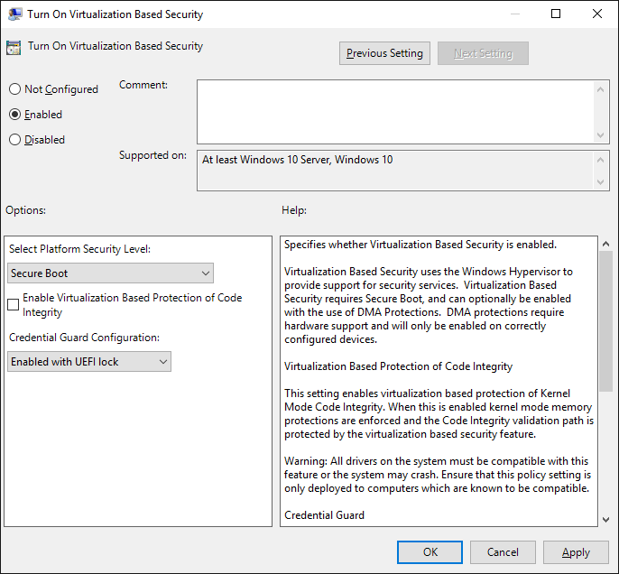

[s,,---
title: Protect derived domain credentials with Credential Guard (Windows 10)
description: Introduced in Windows 10 Enterprise, Credential Guard uses virtualization-based security to isolate secrets so that only privileged system software can access them.
ms.assetid: 4F1FE390-A166-4A24-8530-EA3369FEB4B1
ms.prod: w10
ms.mktglfcycl: explore
ms.sitesec: library
ms.pagetype: security
localizationpriority: high
author: brianlic-msft
---
# Protect derived domain credentials with Credential Guard

**Applies to**
-   Windows 10
-   Windows Server 2016

Introduced in Windows 10 Enterprise and Windows Server 2016, Credential Guard uses virtualization-based security to isolate secrets so that only privileged system software can access them. Unauthorized access to these secrets can lead to credential theft attacks, such as Pass-the-Hash or Pass-The-Ticket. Credential Guard prevents these attacks by protecting NTLM password hashes, Kerberos Ticket Granting Tickets, and credentials stored by applications as domain credentials.

By enabling Credential Guard, the following features and solutions are provided:

   **Hardware security** NTLM, Kerberos, and Credential Manager take advantage of platform security features, including Secure Boot and virtualization, to protect credentials.
-   **Virtualization-based security** Windows NTLM and Kerberos derived credentials and other secrets run in a protected environment that is isolated from the running operating system.
,-   **Better protection against advanced persistent threats** When Credential Manager domain credentials, NTLM, and Kerberos derived credentials are protected using virtualization-based security, the credential theft attack techniques and tools used in many targeted attacks are blocked. Malware running in the operating system with administrative privileges cannot extract secrets that are protected by virtualization-based security. While Credential Guard is a powerful mitigation, persistent threat attacks will likely shift to new attack techniques and you should also incorporate Device Guard and other security strategies and architectures.

## How it works

Kerberos, NTLM, and Credential manager isolate secrets that previous versions of Windows stored in the Local Security Authority (LSA) by using virtualization-based security. Prior to Windows 10, the LSA stored secrets used by the operating system in its process memory. With Credential Guard enabled, the LSA process in the operating system talks to a new component called the isolated LSA process that stores and protects those secrets. Data stored by the isolated LSA process is protected using virtualization-based security and is not accessible to the rest of the operating system. LSA uses remote procedure calls to communicate with the isolated LSA process.

For security reasons, the isolated LSA process doesn't host any device drivers. Instead, it only hosts a small subset of operating system binaries that are needed for security and nothing else. All of these binaries are signed with a certificate that is trusted by virtualization-based security and these signatures are validated before launching the file in the protected environment.

When Credential Guard is enabled, NTLMv1, MS-CHAPv2, Digest, and CredSSP cannot use the signed-in credentials. Thus, single sign-on does not work with these protocols. However, applications can prompt for credentials or use credentials stored in the Windows Vault which are not protected by Credential Guard with any of these protocol. It is strongly recommended that valuable credentials, such as the sign-in credentials, not be used with any of these protocols. If these protocols must be used by domain or Azure AD users, secondary credentials should be provisioned for these use cases.

When Credential Guard is enabled, Kerberos does not allow unconstrained Kerberos delegation or DES encryption, not only for signed-in credentials, but also prompted or saved credentials.

Here's a high-level overview on how the LSA is isolated by using virtualization-based security:


## Requirements

For Credential Guard to provide protections, the computers you are protecting must meet certain baseline hardware, firmware, and software requirements which we will refer to as [Hardware and software requirements](#hardware-and-software-requirements). Additionally Credential Guard blocks specific authentication capabilities, so applications which require blocked capabilities will break. We will refer to this as [Application requirements](#application-requirements). Beyond that, computers can meet additional hardware and firmware requirements, and receive additional protection—those computers will be more hardened against certain threats. To keep this section brief, those will be in [Security Considerations](#security-considerations).

### Hardware and software requirements

To deploy Credential Guard, the computers you are protecting must meet certain baseline hardware, firmware, and software requirements. Beyond that, computers can meet additional hardware and firmware requirements, and receive additional protection—those computers will be more hardened against certain threats. 

To provide basic protection against OS level attempts to read Credential Manager domain credentials, NTLM and Kerberos derived credentials, Credential Manager uses:
- Support for Virtualization-based security (required)
- TPM 2.0 either discrete or firmware (preferred - provides binding to hardware)
- UEFI lock (preferred - prevents attacker from disabling with a simple registry key change)

The Virtualization-based security requires:
- 64 bit CPU
- CPU virtualization extensions plus extended page tables
- Windows hypervisor

### Application requirements

When Credential Guard is enabled, specific authentication capabilities are blocked, so applications which require blocked capabilities will break. Applications should be tested prior to deployment to ensure compatiblity with the reduced functionality. 

>[!WARNING] 
> Enabling Credential Guard on domain controllers is not supported <br>
> The domain controller hosts authentication services which integrate with processes isolated when Credential Guard is enabled, causing crashes. 

>[!NOTE]
> Credential Guard does not provide protections for the Active Directory database or the Security Accounts Manager (SAM). The credentials protected by Kerberos and NTLM when Credential Guard is enabled are also in the Active Directory database (on domain controllers) and the SAM (for local accounts). 

Applications will break if they require:
- Kerberos DES encryption support
- Kerberos unconstrained delegation
- Extracting the Kerberos TGT
- NTLMv1

Applications will prompt & expose credentials to risk if they require:
- Digest authentication
- Credential delegation
- MS-CHAPv2

Applications may cause performance issues when they attempt to hook the isolated Credential Guard process. 

### Security considerations

The following tables provide more information about the hardware, firmware, and software required for deployment of Credential Guard. The tables describe baseline protections, plus protections for improved security that are associated with hardware and firmware options available in 2015, available in 2016, and announced as options for 2017.

> [!NOTE]  
> For new computers running Windows 10, Trusted Platform Module (TPM 2.0) must be enabled by default. This requirement is not restated in the tables that follow.<br>
> If you are an OEM, see the requirements information at [PC OEM requirements for Device Guard and Credential Guard](https://msdn.microsoft.com/library/windows/hardware/mt767514.aspx).<br>
> Starting in Widows 10, 1607, TPM 2.0 is required.

#### Baseline protection recommendations

|Baseline Protections                   | Description                                        |
|---------------------------------------------|----------------------------------------------------|
| Hardware: **64-bit CPU**              | A 64-bit computer is required for the Windows hypervisor to provide VBS. |
| Hardware: **CPU virtualization extensions**,<br>plus **extended page tables** | **Requirements**: These hardware features are required for VBS:<br>One of the following virtualization extensions:<br>- VT-x (Intel) or<br>- AMD-V<br>And:<br>- Extended page tables, also called Second Level Address Translation (SLAT).<br><br>**Security benefits**: VBS provides isolation of secure kernel from normal operating system. Vulnerabilities and Day 0s in normal operating system cannot be exploited because of this isolation. |
| Hardware: **Trusted Platform Module (TPM)**  |  **Requirement**: TPM 1.2 or TPM 2.0, either discrete or firmware.<br><br>**Security benefits**: A TPM provides protection for VBS encryption keys that are stored in the firmware. This helps protect against attacks involving a physically present user with BIOS access. |
| Firmware: **UEFI firmware version 2.3.1.c or higher with UEFI Secure Boot** | **Requirements**: See the following Windows Hardware Compatibility Program requirement: [System.Fundamentals.Firmware.UEFISecureBoot](http://msdn.microsoft.com/library/windows/hardware/dn932805.aspx#system-fundamentals-firmware-uefisecureboot)<br><br>**Security benefits**: UEFI Secure Boot helps ensure that the device boots only authorized code. This can prevent boot kits and root kits from installing and persisting across reboots.  |
| Firmware: **Secure firmware update process**      | **Requirements**: UEFI firmware must support secure firmware update found under the following Windows Hardware Compatibility Program requirement: [System.Fundamentals.Firmware.UEFISecureBoot](http://msdn.microsoft.com/library/windows/hardware/dn932805.aspx#system-fundamentals-firmware-uefisecureboot).<br><br>**Security benefits**: UEFI firmware just like software can have security vulnerabilities that, when found, need to be patched through firmware updates. Patching helps prevent root kits from getting installed. |
| Software: Qualified **Windows operating system**  | **Requirement**: Windows 10 Enterprise, Windows 10 Education, Windows 2016 Server, or Windows Enterprise IoT<br><blockquote><p><strong>Important:</strong><br> Windows Server 2016 running as a domain controller does not support Credential Guard. Only Device Guard is supported in this configuration.</p></blockquote><br>**Security benefits**: Support for VBS and for management features that simplify configuration of Credential Guard. |

> [!IMPORTANT]
> The preceding table lists requirements for baseline protections. The following tables list requirements for improved security. You can use Credential Guard with hardware, firmware, and software that support baseline protections, even if they do not support protections for improved security. However, we strongly recommend meeting the requirements for improved security to significantly strengthen the level of security that Credential Guard can provide.

#### 2015 Additional Security Recommendations (starting with Windows 10, version 1507, and Windows Server 2016, Technical Preview 4)

| Protections for Improved Security          | Description                                        |
|---------------------------------------------|----------------------------------------------------|
| Hardware: **IOMMU** (input/output memory management unit)  |  **Requirement**: VT-D or AMD Vi IOMMU<br><br>**Security benefits**: An IOMMU can enhance system resiliency against memory attacks. For more information, see [ACPI description tables](https://msdn.microsoft.com/windows/hardware/drivers/bringup/acpi-system-description-tables). |
| Firmware: **Securing Boot Configuration and Management** | **Requirements**:<br>- BIOS password or stronger authentication must be supported.<br>- In the BIOS configuration, BIOS authentication must be set.<br>- There must be support for protected BIOS option to configure list of permitted boot devices (for example, “Boot only from internal hard drive”) and boot device order, overriding BOOTORDER modification made by operating system.<br>- In the BIOS configuration, BIOS options related to security and boot options (list of permitted boot devices, boot order) must be secured to prevent other operating systems from starting and to prevent changes to the BIOS settings.<br><br>**Security benefits**:<br>- BIOS password or stronger authentication helps ensure that only authenticated Platform BIOS administrators can change BIOS settings. This helps protect against a physically present user with BIOS access.<br>- Boot order when locked provides protection against the computer being booted into WinRE or another operating system on bootable media. |
| Firmware: **Secure MOR implementation**  |  **Requirement**: Secure MOR implementation<br><br>**Security benefits**: A secure MOR bit prevents advanced memory attacks. For more information, see [Secure MOR implementation](https://msdn.microsoft.com/windows/hardware/drivers/bringup/device-guard-requirements). |

<br>

#### 2016 Additional Security Recommendations (starting with Windows 10, version 1607, and Windows Server 2016)

> [!IMPORTANT]
> The following tables list requirements for improved security, beyond the level of protection described in the preceding tables. You can use Credential Guard with hardware, firmware, and software that do not support the following protections for improved security. As your systems meet more requirements, more protections become available to them.

| Protections for Improved Security         | Description                                        |
|---------------------------------------------|----------------------------------------------------|
| Firmware: **Hardware Rooted Trust Platform Secure Boot** | **Requirements**:<br>Boot Integrity (Platform Secure Boot) must be supported. See the Windows Hardware Compatibility Program requirements under [System.Fundamentals.Firmware.CS.UEFISecureBoot.ConnectedStandby](https://msdn.microsoft.com/library/windows/hardware/dn932807(v=vs.85).aspx#system_fundamentals_firmware_cs_uefisecureboot_connectedstandby)<br>- The Hardware Security Test Interface (HSTI) must be implemented. See [Hardware Security Testability Specification](https://msdn.microsoft.com/en-us/library/windows/hardware/mt712332(v=vs.85).aspx).<br><br>**Security benefits**:<br>- Boot Integrity (Platform Secure Boot) from Power-On provides protections against physically present attackers, and defense-in-depth against malware.<br>- HSTI provides additional security assurance for correctly secured silicon and platform. |
| Firmware: **Firmware Update through Windows Update** | **Requirements**: Firmware must support field updates through Windows Update and UEFI encapsulation update.<br><br>**Security benefits**: Helps ensure that firmware updates are fast, secure, and reliable. |
| Firmware: **Securing Boot Configuration and Management** | **Requirements**:<br>- Required BIOS capabilities: Ability of OEM to add ISV, OEM, or Enterprise Certificate in Secure Boot DB at manufacturing time.<br>- Required configurations: Microsoft UEFI CA must be removed from Secure Boot DB. Support for 3rd-party UEFI modules is permitted but should leverage ISV-provided certificates or OEM certificate for the specific UEFI software.<br><br>**Security benefits**:<br>- Enterprises can choose to allow proprietary EFI drivers/applications to run.<br>- Removing Microsoft UEFI CA from Secure Boot DB provides full control to enterprises over software that runs before the operating system boots. |

<br>

#### 2017 Additional Security Recommendations (starting with the next major release of Windows 10) 

| Protection for Improved Security          | Description                                        |
|---------------------------------------------|----------------------------------------------------|
| Firmware: **Firmware support for SMM protection** | **Requirements**: The [Windows SMM Security Mitigations Table (WSMT) specification](http://download.microsoft.com/download/1/8/A/18A21244-EB67-4538-BAA2-1A54E0E490B6/WSMT.docx) contains details of an Advanced Configuration and Power Interface (ACPI) table that was created for use with Windows operating systems that support Windows virtualization-based security (VBS) features.<br><br>**Security benefits**:<br>- Protects against potential vulnerabilities in UEFI runtime in functions such as Update Capsule, Set Variables, and so on, so they can't compromise VBS.<br>- Reduces attack surface to VBS from system firmware.<br>- Blocks additional security attacks against SMM. |

## Manage Credential Guard

### Enable Credential Guard
Credential Guard can be enabled by using [Group Policy](#turn-on-credential-guard-by-using-group-policy), the [registry](#turn-on-credential-guard-by-using-the-registry), or the Device Guard and Credential Guard [hardware readiness tool](#hardware-readiness-tool).

#### Turn on Credential Guard by using Group Policy

You can use Group Policy to enable Credential Guard. This will add and enable the virtualization-based security features for you if needed.

1.  From the Group Policy Management Console, go to **Computer Configuration** -&gt; **Administrative Templates** -&gt; **System** -&gt; **Device Guard**.
2.  Double-click **Turn On Virtualization Based Security**, and then click the **Enabled** option.
3.  **Select Platform Security Level** box, choose **Secure Boot** or **Secure Boot and DMA Protection**.
4.  In the **Credential Guard Configuration** box, click **Enabled with UEFI lock**, and then click **OK**. If you want to be able to turn off Credential Guard remotely, choose **Enabled without lock**.

    
    
5.  Close the Group Policy Management Console.

To enforce processing of the group policy, you can run ```gpupdate /force```. 

#### Turn on Credential Guard by using the registry

If you don't use Group Policy, you can enable Credential Guard by using the registry. Credential Guard uses virtualization-based security features which have to be enabled first on some operating systems.

#### Add the virtualization-based security features

Starting with Windows 10, version 1607 and Windows Server 2016, enabling Windows features to use virtualization-based security is not necessary and this step can be skipped.

If you are using Windows 10, version 1507 (RTM) or Windows 10, version 1511, Windows features have to be enabled to use virtualization-based security. 
You can do this by using either the Control Panel or the Deployment Image Servicing and Management tool (DISM).
> [!NOTE]  
> If you enable Credential Guard by using Group Policy, these steps are not required. Group Policy will install the features for you.

 
**Add the virtualization-based security features by using Programs and Features**

1.  Open the Programs and Features control panel.
2.  Click **Turn Windows feature on or off**.
3.  Go to **Hyper-V** -&gt; **Hyper-V Platform**, and then select the **Hyper-V Hypervisor** check box.
4.  Select the **Isolated User Mode** check box at the top level of the feature selection. 
5.  Click **OK**.

**Add the virtualization-based security features to an offline image by using DISM**

1.  Open an elevated command prompt.
2.  Add the Hyper-V Hypervisor by running the following command:
    ``` syntax
    dism /image:<WIM file name> /Enable-Feature /FeatureName:Microsoft-Hyper-V-Hypervisor /all
    ```
3. Add the Isolated User Mode feature by running the following command:
    ``` syntax
    dism /image:<WIM file name> /Enable-Feature /FeatureName:IsolatedUserMode
    ```

> [!NOTE]  
> You can also add these features to an online image by using either DISM or Configuration Manager.

#### Enable virtualization-based security and Credential Guard

1.  Open Registry Editor.
2.  Enable virtualization-based security:
    -   Go to HKEY\_LOCAL\_MACHINE\\System\\CurrentControlSet\\Control\\DeviceGuard.
    -   Add a new DWORD value named **EnableVirtualizationBasedSecurity**. Set the value of this registry setting to 1 to enable virtualization-based security and set it to 0 to disable it.
    -   Add a new DWORD value named **RequirePlatformSecurityFeatures**. Set the value of this registry setting to 1 to use **Secure Boot** only or set it to 3 to use **Secure Boot and DMA protection**.
3.  Enable Credential Guard:
    -   Go to HKEY\_LOCAL\_MACHINE\\System\\CurrentControlSet\\Control\\LSA.
    -   Add a new DWORD value named **LsaCfgFlags**. Set the value of this registry setting to 1 to enable Credential Guard with UEFI lock, set it to 2 to enable Credential Guard without lock, and set it to 0 to disable it.
4.  Close Registry Editor.


> [!NOTE]  
> You can also turn on Credential Guard by setting the registry entries in the [FirstLogonCommands](http://msdn.microsoft.com/library/windows/hardware/dn922797.aspx) unattend setting.

<span id="hardware-readiness-tool" />
#### Turn on Credential Guard by using the Device Guard and Credential Guard hardware readiness tool

You can also enable Credential Guard by using the [Device Guard and Credential Guard hardware readiness tool](https://www.microsoft.com/download/details.aspx?id=53337).

```
DG_Readiness_Tool_v2.0.ps1 -Enable -AutoReboot
```

#### Credential Guard deployment in virtual machines

Credential Guard can protect secrets in a Hyper-V virtual machine, just as it would on a physical machine. The enablement steps are the same from within the virtual machine.

Credential Guard protects secrets from non-priviledged access inside the VM. It does not provide additional protection from the host administrator. From the host, you can disable Credential Guard for a virtual machine:

``` PowerShell
Set-VMSecurity -VMName <VMName> -VirtualizationBasedSecurityOptOut $true
```

Requirements for running Credential Guard in Hyper-V virtual machines
- The Hyper-V host must have an IOMMU, and run at least Windows Server 2016 or Windows 10 version 1607.
- The Hyper-V virtual machine must be Generation 2, have an enabled virtual TPM, and running at least Windows Server 2016 or Windows 10. 

### Remove Credential Guard

If you have to remove Credential Guard on a PC, you can use the following set of procedures, or you can [use the Device Guard and Credential Guard hardware readiness tool](#turn-off-with-hardware-readiness-tool).

1.  If you used Group Policy, disable the Group Policy setting that you used to enable Credential Guard (**Computer Configuration** -&gt; **Administrative Templates** -&gt; **System** -&gt; **Device Guard** -&gt; **Turn on Virtualization Based Security**).
2.  Delete the following registry settings:
    - HKEY\_LOCAL\_MACHINE\\System\\CurrentControlSet\\Control\\LSA\LsaCfgFlags
    - HKEY\_LOCAL\_MACHINE\\Software\\Policies\\Microsoft\\Windows\\DeviceGuard\\EnableVirtualizationBasedSecurity
    - HKEY\_LOCAL\_MACHINE\\Software\\Policies\\Microsoft\\Windows\\DeviceGuard\\RequirePlatformSecurityFeatures

    > [!IMPORTANT]  
    > If you manually remove these registry settings, make sure to delete them all. If you don't remove them all, the device might go into BitLocker recovery.

3.  Delete the Credential Guard EFI variables by using bcdedit.

**Delete the Credential Guard EFI variables**

1.  From an elevated command prompt, type the following commands:
    ``` syntax

    mountvol X: /s
    
    copy %WINDIR%\System32\SecConfig.efi X:\EFI\Microsoft\Boot\SecConfig.efi /Y
    
    bcdedit /create {0cb3b571-2f2e-4343-a879-d86a476d7215} /d "DebugTool" /application osloader
    
    bcdedit /set {0cb3b571-2f2e-4343-a879-d86a476d7215} path "\EFI\Microsoft\Boot\SecConfig.efi"
    
    bcdedit /set {bootmgr} bootsequence {0cb3b571-2f2e-4343-a879-d86a476d7215}
    
    bcdedit /set {0cb3b571-2f2e-4343-a879-d86a476d7215} loadoptions DISABLE-LSA-ISO
    
    bcdedit /set {0cb3b571-2f2e-4343-a879-d86a476d7215} device partition=X:
    
    mountvol X: /d
    
    ```
2.  Restart the PC.
3.  Accept the prompt to disable Credential Guard.
4.  Alternatively, you can disable the virtualization-based security features to turn off Credential Guard.

> [!NOTE]  
> The PC must have one-time access to a domain controller to decrypt content, such as files that were encrypted with EFS. If you want to turn off both Credential Guard and virtualization-based security, run the following bcdedit command after turning off all virtualization-based security Group Policy and registry settings: bcdedit /set {0cb3b571-2f2e-4343-a879-d86a476d7215} loadoptions DISABLE-LSA-ISO,DISABLE-VBS

For more info on virtualization-based security and Device Guard, see [Device Guard deployment guide](device-guard-deployment-guide.md).

<span id="turn-off-with-hardware-readiness-tool" />
#### Turn off Credential Guard by using the Device Guard and Credential Guard hardware readiness tool

You can also disable Credential Guard by using the [Device Guard and Credential Guard hardware readiness tool](https://www.microsoft.com/download/details.aspx?id=53337).

```
DG_Readiness_Tool_v2.0.ps1 -Disable -AutoReboot
```
 
### Check that Credential Guard is running

You can use System Information to ensure that Credential Guard is running on a PC.

1.  Click **Start**, type **msinfo32.exe**, and then click **System Information**.
2.  Click **System Summary**.
3.  Confirm that **Credential Guard** is shown next to **Device Guard Security Services Running**.

    Here's an example:
    
    

You can also check that Credential Guard is running by using the [Device Guard and Credential Guard hardware readiness tool](https://www.microsoft.com/download/details.aspx?id=53337).

```
DG_Readiness_Tool_v2.0.ps1 -Ready
```
    
## Considerations when using Credential Guard

-   If Credential Guard is enabled on a device after it's joined to a domain, the user and device secrets may already be compromised. We recommend that Credential Guard is enabled before the PC is joined to a domain.
-   You should perform regular reviews of the PCs that have Credential Guard enabled. This can be done with security audit policies or WMI queries. Here's a list of WinInit event IDs to look for:
    -   **Event ID 13** Credential Guard (LsaIso.exe) was started and will protect LSA credentials.
    -   **Event ID 14** Credential Guard (LsaIso.exe) configuration: 0x1, 0
        -   The first variable: 0x1 means Credential Guard is configured to run. 0x0 means it’s not configured to run.
        -   The second variable: 0 means it’s configured to run in protect mode. 1 means it's configured to run in test mode. This variable should always be 0.
    -   **Event ID 15** Credential Guard (LsaIso.exe) is configured but the secure kernel is not running; continuing without Credential Guard.
    -   **Event ID 16** Credential Guard (LsaIso.exe) failed to launch: \[error code\]
    -   **Event ID 17** Error reading Credential Guard (LsaIso.exe) UEFI configuration: \[error code\]
    You can also verify that TPM is being used for key protection by checking the following event in the **Microsoft** -&gt; **Windows** -&gt; **Kernel-Boot** event source. If you are running with a TPM, the TPM PCR mask value will be something other than 0.
    -   **Event ID 51** VSM Master Encryption Key Provisioning. Using cached copy status: 0x0. Unsealing cached copy status: 0x1. New key generation status: 0x1. Sealing status: 0x1. TPM PCR mask: 0x0.
-   Passwords are still weak so we recommend that your organization deploy Credential Guard and move away from passwords and to other authentication methods, such as physical smart cards, virtual smart cards, Microsoft Passport, or Microsoft Passport for Work.
-   Some 3rd party Security Support Providers (SSPs and APs) might not be compatible with Credential Guard. Credential Guard does not allow 3rd party SSPs to ask for password hashes from LSA. However, SSPs and APs still get notified of the password when a user logs on and/or changes their password. Any use of undocumented APIs within custom SSPs and APs are not supported. We recommend that custom implementations of SSPs/APs are tested against Credential Guard to ensure that the SSPs and APs do not depend on any undocumented or unsupported behaviors. For example, using the KerbQuerySupplementalCredentialsMessage API is not supported. You should not replace the NTLM or Kerberos SSPs with custom SSPs and APs. For more info, see [Restrictions around Registering and Installing a Security Package](http://msdn.microsoft.com/library/windows/desktop/dn865014.aspx) on MSDN.
-   As the depth and breadth of protections provided by Credential Guard are increased, subsequent releases of Windows 10 with Credential Guard running may impact scenarios that were working in the past. For example, Credential Guard may block the use of a particular type of credential or a particular component to prevent malwar efrom taking advantage of vulnerabilities. Therefore, we recommend that scenarios required for operations in an organization are tested before upgrading a device that has Credential Guard running.

-   Starting with Windows 10, version 1511, domain credentials that are stored with Credential Manager are protected with Credential Guard. Credential Manager allows you to store credentials, such as user names and passwords that you use to log on to websites or other computers on a network. The following considerations apply to the Credential Guard protections for Credential Manager:
    -   Credentials saved by Remote Desktop Services cannot be used to remotely connect to another machine without supplying the password. Attempts to use saved credentials will fail, displaying the error message "Logon attempt failed".
    -   Applications that extract derived domain credentials from Credential Manager will no longer be able to use those credentials.
    -   You cannot restore credentials using the Credential Manager control panel if the credentials were backed up from a PC that has Credential Guard turned on. If you need to back up your credentials, you must do this before you enable Credential Guard. Otherwise, you won't be able to restore those credentials.
    - Credential Guard uses hardware security so some features, such as Windows To Go, are not supported.

### NTLM & CHAP Considerations

When you enable Credential Guard, you can no longer use NTLM v1 authentication. If you are using WiFi and VPN endpoints that are based on MS-CHAPv2, they are subject to similar attacks as NTLMv1. We recommend that organizations use certificated-based authentication for WiFi and VPN connections.

### Kerberos Considerations

When you enable Credential Guard, you can no longer use Kerberos unconstrained delegation or DES encryption. Unconstrained delegation could allow attackers to extract Kerberos keys from the isolated LSA process. You must use constrained or resource-based Kerberos delegation instead.
    
## Scenarios not protected by Credential Guard

Some ways to store credentials are not protected by Credential Guard, including:

-   Software that manages credentials outside of Windows feature protection
-   Local accounts and Microsoft Accounts
-   Credential Guard does not protect the Active Directory database running on Windows Server 2016 domain controllers. It also does not protect credential input pipelines, such as Windows Server 2016 servers running Remote Desktop Gateway. If you're using a Windows Server 2016 server as a client PC, it will get the same protection as it would be running Windows 10 Enterprise.
-   Key loggers
-   Physical attacks
-   Does not prevent an attacker with malware on the PC from using the privileges associated with any credential. We recommend using dedicated PCs for high value accounts, such as IT Pros and users with access high value assets in your organization.
-   Third-party security packages
-   Digest and CredSSP credentials
    -   When Credential Guard is enabled, neither Digest nor CredSSP have access to users' logon credentials. This implies no Single Sign-On use for these protocols.
-   Supplied credentials for NTLM authentication are not protected. If a user is prompted for and enters credentials for NTLM authentication, these credentials are vulnerable to be read from LSASS memory. Note that these same credentials are vulnerable to key loggers as well.

## Additional mitigations

Credential Guard can provide mitigations against attacks on derived credentials and prevent the use of stolen credentials elsewhere. However, PCs can still be vulnerable to certain attacks, even if the derived credentials are protected by Credential Guard. These attacks can include abusing privileges and use of derived credentials directly from a compromised device, reusing previously stolen credentials prior to Device Guard, and abuse of management tools and weak application configurations. Because of this, additional mitigations also need to be deployed to make the domain environment more robust.

### Restricting domain users to specific domain-joined devices

Credential theft attacks allow the attacker to steal secrets from one device and use them from another device. If a user can sign on multiple devices then any device could be used to steal credentials. How do you ensure that users only sign on with devices with Credential Guard? By deploying authentication policies which restrict them to specific domain-joined device that have been configured with Credential Guard. For the domain controller to know what device a user is signing on from, Kerberos armoring must be used.

#### Kerberos armoring

Kerberos armoring is part of RFC 6113. When a device supports Kerberos armoring, its TGT is used to protect the user's proof of possession which can mitigate offline dictionary attacks. Kerberos armoring also provides the additional benefit of signed KDC errors this mitigates tampering which can result in things such as downgrade attacks. 

**To enable Kerberos armoring for restricting domain users to specific domain-joined devices**

-   Users need to be in domains which are running Windows Server 2012 R2 or higher
-   All the domain controllers in these domains must be configured to support Kerberos armoring. Set the **KDC support for claims, compound authentication, and Kerberos armoring** Group Policy setting to either **Supported** or **Always provide claims**.
-   All the devices with Credential Guard which the users will be restricted to must be configured to support Kerberos armoring. Enable the **Kerberos client support for claims, compound authentication and Kerberos armoring** Group Policy settings under **Computer Configuration** -&gt; **Administrative Templates** -&gt; **System** -&gt; **Kerberos**.

#### Protecting domain-joined device secrets

Since domain-joined devices also use shared secrets for authentication, attackers can steal those secrets as well. By deploying device certificates with Credential Guard, the private key can be protected. Then authentication policies can require that users sign on devices which authenticate using those certificates. This prevents shared secrets on stolen from the device to be used with stolen user credentials to sign on as the user.

Domain-joined device certificate authentication has the following requirements:
-   Devices' accounts are in Windows Server 2012 domain funcational level or higher domains.
-   All domain controllers in those domains have KDC certificates which satisfy strict KDC validation certificate requirements:
    -   KDC EKU present
    -   DNS domain name matches the DNSName field of the SubjectAltName (SAN) extension
-   Windows 10 devices have the CA issuing the domain controller certificates in the enterprise store.
-   A process is established to ensure the identity and trustworthiness of the device in a similar manner as you would establish the identity and trustworthiness of a user before issuing them a smartcard.

##### Deploying domain-joined device certificates

To guarantee that certificates with the issuance policy required are only on the devices these users must use, they must be deployed manually on each device. The same security procedures used for issuing smart cards to users should be applied to device certificates.

For example, let's say you wanted to use the High Assurance policy only on these devices. Using a Windows Server Enterprise certificate authority, you would create a new template.

**Creating a new certificate template**

1.  From the Certificate Manager console, right-click **Certificate Templates**, and then click **Manage.**
2.  Right-click **Workstation Authentication**, and then click **Duplicate Template**.
3.  Right-click the new template, and then click **Properties**.
4.  On the **Extensions** tab, click **Application Policies**, and then click **Edit**.
5.  Click **Client Authentication**, and then click **Remove**.
6.  Add the ID-PKInit-KPClientAuth EKU. Click **Add**, click **New**, and then specify the following values:
    -   Name: Kerberos Client Auth
    -   Object Identifier: 1.3.6.1.5.2.3.4
7.  On the **Extensions** tab, click **Issuance Policies**, and then click **Edit**.
8.  Under **Issuance Policies**, click**High Assurance**.
9.  On the **Subject name** tab, clear the **DNS name** check box, and then select the **User Principal Name (UPN)** check box.

Then on the devices that are running Credential Guard, enroll the devices using the certificate you just created.

**Enrolling devices in a certificate**

Run the following command:
``` syntax
CertReq -EnrollCredGuardCert MachineAuthentication
```

> [!NOTE]  
> You must restart the device after enrolling the machine authentication certificate.
 
#### How a certificate issuance policy can be used for access control

Beginning with the Windows Server 2008 R2 domain functional level, domain controllers support for authentication mechanism assurance provides a way to map certificate issuance policy OIDs to universal security groups. Windows Server 2012 domain controllers with claim support can map them to claims. To learn more about authentication mechanism assurance, see [Authentication Mechanism Assurance for AD DS in Windows Server 2008 R2 Step-by-Step Guide](https://technet.microsoft.com/en-us/library/dd378897(v=ws.10).aspx) on TechNet.

**To see the issuance policies available**

-   The [get-IssuancePolicy.ps1](#bkmk-getscript) shows all of the issuance policies that are available on the certificate authority.
    From a Windows PowerShell command prompt, run the following command:

    ``` syntax
    .\get-IssuancePolicy.ps1 –LinkedToGroup:All
    ```

**To link a issuance policy to a universal security group**

-   The [set-IssuancePolicyToGroupLink.ps1](#bkmk-setscript) creates a Universal security group, creates an organizational unit, and links the issuance policy to that Universal security group.
    From a Windows PowerShell command prompt, run the following command:

    ``` syntax
    .\set-IssuancePolicyToGroupLink.ps1 –IssuancePolicyName:"<name of issuance policy>" –groupOU:"<Name of OU to create>" –groupName:”<name of Universal security group to create>"
    ```

#### Restricting user sign on

So we now have the following:

-   Created a special certificate issuance policy to identify devices which meet the deployment criteria required for the user to be able to sign on
-   Mapped that policy to a universal security group or claim
-   Provided a way for domain controllers to get the device authorization data during user sign on using Kerberos armoring-   
so what is left to do is configuring the access check on the domain controllers. This is done with authentication policies.

Authentication policies have the following requirements:
-   User accounts are in a Windows Server 2012 domain functional level or higher domain.

**Creating an authentication policy restricting to the specific universal security group**

1.  Open Active Directory Administrative Center.
2.  Click **Authentication**, click **New**, and then click **Authentication Policy**.
3.  In the **Display name** box, enter a name for this authentication policy.
4.  Under the **Accounts** heading, click **Add**.
5.  In the **Select Users, Computers, or Service Accounts** dialog box, type the name of the user account you with to restrict, and then click **OK**.
6.  Under the **User Sign On** heading, click the **Edit** button.
7. Click **Add a condition**.
8. In the **Edit Access Control Conditions** box, ensure that it reads **User** &gt; **Group** &gt; **Member of each** &gt; **Value**, and then click **Add items**.
9. In the **Select Users, Computers, or Service Accounts** dialog box, type the name of the universal security group that you created with the set-IssuancePolicyToGroupLink script, and then click **OK**.
10. Click **OK** to close the **Edit Access Control Conditions** box.
11. Click **OK** to create the authentication policy.
12. Close Active Directory Administrative Center.

> [!NOTE]  
> When the authentication policy enforces policy restrictions, users will not be able to sign on using devices that do not have a certificate with the appropriate issuance policy deployed. This applies to both local and remote sign on scenarios. Therefore, it is strongly recommended to first only audit policy restrictions to ensure you don't have unexpected failures.

#### Discovering authentication failures due to authentication policies

To make tracking authentication failures due to authentication policies easier, an operational log exists with just those events. To enable the logs on the domain controllers, in Event Viewer, navigate to **Applications and Services Logs\\Microsoft\\Windows\\Authentication, right-click AuthenticationPolicyFailures-DomainController**, and then click **Enable Log**.

To learn more about authentication policy events, see [Authentication Policies and Authentication Policy Silos](https://technet.microsoft.com/en-us/library/dn486813(v=ws.11).aspx).

## Appendix: Scripts

Here is a list of scripts that are mentioned in this topic.

### <a href="" id="bkmk-getscript"></a>Get the available issuance policies on the certificate authority

Save this script file as get-IssuancePolicy.ps1.

``` syntax
#######################################
##     Parameters to be defined      ##
##     by the user                   ##
#######################################
Param (
$Identity,
$LinkedToGroup
)
#######################################
##     Strings definitions           ##
#######################################
Data getIP_strings {
# culture="en-US"
ConvertFrom-StringData -stringdata @'
help1 = This command can be used to retrieve all available Issuance Policies in a forest. The forest of the currently logged on user is targetted.
help2 = Usage:
help3 = The following parameter is mandatory:
help4 = -LinkedToGroup:<yes|no|all>
help5 = "yes" will return only Issuance Policies that are linked to groups. Checks that the linked Issuance Policies are linked to valid groups.
help6 = "no" will return only Issuance Policies that are not currently linked to any group.
help7 = "all" will return all Issuance Policies defined in the forest. Checks that the linked Issuance policies are linked to valid groups.
help8 = The following parameter is optional:
help9 = -Identity:<Name, Distinguished Name or Display Name of the Issuance Policy that you want to retrieve>. If you specify an identity, the option specified in the "-LinkedToGroup" parameter is ignored.
help10 = Output: This script returns the Issuance Policy objects meeting the criteria defined by the above parameters.
help11 = Examples:
errorIPNotFound = Error: no Issuance Policy could be found with Identity "{0}"
ErrorNotSecurity = Error: Issuance Policy "{0}" is linked to group "{1}" which is not of type "Security".
ErrorNotUniversal = Error: Issuance Policy "{0}" is linked to group "{1}" whose scope is not "Universal".
ErrorHasMembers = Error: Issuance Policy "{0}" is linked to group "{1}" which has a non-empty membership. The group has the following members:
LinkedIPs = The following Issuance Policies are linked to groups:
displayName = displayName : {0}
Name = Name : {0}
dn = distinguishedName : {0}
        InfoName = Linked Group Name: {0}
        InfoDN = Linked Group DN: {0}   
NonLinkedIPs = The following Issuance Policies are NOT linked to groups:
'@
}
##Import-LocalizedData getIP_strings
import-module ActiveDirectory
#######################################
##           Help                    ##
#######################################
function Display-Help {
    ""
    $getIP_strings.help1
    ""
$getIP_strings.help2
""
$getIP_strings.help3
"     " + $getIP_strings.help4
"             " + $getIP_strings.help5
    "             " + $getIP_strings.help6
    "             " + $getIP_strings.help7
""
$getIP_strings.help8
    "     " + $getIP_strings.help9
    ""
    $getIP_strings.help10
""
""    
$getIP_strings.help11
    "     " + '$' + "myIPs = .\get-IssuancePolicy.ps1 -LinkedToGroup:All"
    "     " + '$' + "myLinkedIPs = .\get-IssuancePolicy.ps1 -LinkedToGroup:yes"
    "     " + '$' + "myIP = .\get-IssuancePolicy.ps1 -Identity:""Medium Assurance"""
""
}
$root = get-adrootdse
$domain = get-addomain -current loggedonuser
$configNCDN = [String]$root.configurationNamingContext
if ( !($Identity) -and !($LinkedToGroup) ) {
display-Help
break
}
if ($Identity) {
    $OIDs = get-adobject -Filter {(objectclass -eq "msPKI-Enterprise-Oid") -and ((name -eq $Identity) -or (displayname -eq $Identity) -or (distinguishedName -like $Identity)) } -searchBase $configNCDN -properties *
    if ($OIDs -eq $null) {
$errormsg = $getIP_strings.ErrorIPNotFound -f $Identity
write-host $errormsg -ForegroundColor Red
    }
    foreach ($OID in $OIDs) {
        if ($OID."msDS-OIDToGroupLink") {
# In case the Issuance Policy is linked to a group, it is good to check whether there is any problem with the mapping.
            $groupDN = $OID."msDS-OIDToGroupLink"
            $group = get-adgroup -Identity $groupDN
    $groupName = $group.Name
# Analyze the group
            if ($group.groupCategory -ne "Security") {
$errormsg = $getIP_strings.ErrorNotSecurity -f $Identity, $groupName
                write-host $errormsg -ForegroundColor Red
            }
            if ($group.groupScope -ne "Universal") {
                $errormsg = $getIP_strings.ErrorNotUniversal -f $Identity, $groupName
write-host $errormsg -ForegroundColor Red
            }
            $members = Get-ADGroupMember -Identity $group
            if ($members) {
                $errormsg = $getIP_strings.ErrorHasMembers -f $Identity, $groupName
write-host $errormsg -ForegroundColor Red
                foreach ($member in $members) {
                    write-host "          "  $member -ForeGroundColor Red
                }
            }
        }
    }
    return $OIDs
    break
}
if (($LinkedToGroup -eq "yes") -or ($LinkedToGroup -eq "all")) {
    $LDAPFilter = "(&(objectClass=msPKI-Enterprise-Oid)(msDS-OIDToGroupLink=*)(flags=2))"
    $LinkedOIDs = get-adobject -searchBase $configNCDN -LDAPFilter $LDAPFilter -properties *
    write-host ""    
    write-host "*****************************************************"
    write-host $getIP_strings.LinkedIPs
    write-host "*****************************************************"
    write-host ""
    if ($LinkedOIDs -ne $null){
      foreach ($OID in $LinkedOIDs) {
# Display basic information about the Issuance Policies
          ""
  $getIP_strings.displayName -f $OID.displayName
  $getIP_strings.Name -f $OID.Name
  $getIP_strings.dn -f $OID.distinguishedName
# Get the linked group.
          $groupDN = $OID."msDS-OIDToGroupLink"
          $group = get-adgroup -Identity $groupDN
          $getIP_strings.InfoName -f $group.Name
          $getIP_strings.InfoDN -f $groupDN
# Analyze the group
          $OIDName = $OID.displayName
    $groupName = $group.Name
          if ($group.groupCategory -ne "Security") {
          $errormsg = $getIP_strings.ErrorNotSecurity -f $OIDName, $groupName
          write-host $errormsg -ForegroundColor Red
          }
          if ($group.groupScope -ne "Universal") {
          $errormsg = $getIP_strings.ErrorNotUniversal -f $OIDName, $groupName
          write-host $errormsg -ForegroundColor Red
          }
          $members = Get-ADGroupMember -Identity $group
          if ($members) {
          $errormsg = $getIP_strings.ErrorHasMembers -f $OIDName, $groupName
          write-host $errormsg -ForegroundColor Red
              foreach ($member in $members) {
                  write-host "          "  $member -ForeGroundColor Red
              }
          }
          write-host ""
      }
    }else{
write-host "There are no issuance policies that are mapped to a group"
    }
    if ($LinkedToGroup -eq "yes") {
        return $LinkedOIDs
        break
    }
}    
if (($LinkedToGroup -eq "no") -or ($LinkedToGroup -eq "all")) {  
    $LDAPFilter = "(&(objectClass=msPKI-Enterprise-Oid)(!(msDS-OIDToGroupLink=*))(flags=2))"
    $NonLinkedOIDs = get-adobject -searchBase $configNCDN -LDAPFilter $LDAPFilter -properties *
    write-host ""    
    write-host "*********************************************************"
    write-host $getIP_strings.NonLinkedIPs
    write-host "*********************************************************"
    write-host ""
    if ($NonLinkedOIDs -ne $null) {
      foreach ($OID in $NonLinkedOIDs) {
# Display basic information about the Issuance Policies
write-host ""
$getIP_strings.displayName -f $OID.displayName
$getIP_strings.Name -f $OID.Name
$getIP_strings.dn -f $OID.distinguishedName
write-host ""
      }
    }else{
write-host "There are no issuance policies which are not mapped to groups"
    }
    if ($LinkedToGroup -eq "no") {
        return $NonLinkedOIDs
        break
    }
}
```
> [!NOTE]  
> If you're having trouble running this script, try replacing the single quote after the ConvertFrom-StringData parameter.
 
### <a href="" id="bkmk-setscript"></a>Link an issuance policy to a group

Save the script file as set-IssuancePolicyToGroupLink.ps1.

``` syntax
#######################################
##     Parameters to be defined      ##
##     by the user                   ##
#######################################
Param (
$IssuancePolicyName,
$groupOU,
$groupName
)
#######################################
##     Strings definitions           ##
#######################################
Data ErrorMsg {
# culture="en-US"
ConvertFrom-StringData -stringdata @'
help1 = This command can be used to set the link between a certificate issuance policy and a universal security group.
help2 = Usage:
help3 = The following parameters are required:
help4 = -IssuancePolicyName:<name or display name of the issuance policy that you want to link to a group>
help5 = -groupName:<name of the group you want to link the issuance policy to>. If no name is specified, any existing link to a group is removed from the Issuance Policy.
help6 = The following parameter is optional:
help7 = -groupOU:<Name of the Organizational Unit dedicated to the groups which are linked to issuance policies>. If this parameter is not specified, the group is looked for or created in the Users container.
help8 = Examples:
help9 = This command will link the issuance policy whose display name is "High Assurance" to the group "HighAssuranceGroup" in the Organizational Unit "OU_FOR_IPol_linked_groups". If the group or the Organizational Unit do not exist, you will be prompted to create them.
help10 = This command will unlink the issuance policy whose name is "402.164959C40F4A5C12C6302E31D5476062" from any group.
MultipleIPs = Error: Multiple Issuance Policies with name or display name "{0}" were found in the subtree of "{1}"
NoIP = Error: no issuance policy with name or display name "{0}" could be found in the subtree of "{1}".
IPFound = An Issuance Policy with name or display name "{0}" was successfully found: {1}
MultipleOUs = Error: more than 1 Organizational Unit with name "{0}" could be found in the subtree of "{1}".
confirmOUcreation = Warning: The Organizational Unit that you specified does not exist. Do you want to create it?
OUCreationSuccess = Organizational Unit "{0}" successfully created.
OUcreationError = Error: Organizational Unit "{0}" could not be created.
OUFoundSuccess = Organizational Unit "{0}" was successfully found.
multipleGroups = Error: More than one group with name "{0}" was found in Organizational Unit "{1}".  
confirmGroupCreation = Warning: The group that you specified does not exist. Do you want to create it?
groupCreationSuccess = Univeral Security group "{0}" successfully created.
groupCreationError = Error: Univeral Security group "{0}" could not be created.
GroupFound = Group "{0}" was successfully found.
confirmLinkDeletion = Warning: The Issuance Policy "{0}" is currently linked to group "{1}". Do you really want to remove the link?
UnlinkSuccess = Certificate issuance policy successfully unlinked from any group.
UnlinkError = Removing the link failed.
UnlinkExit = Exiting without removing the link from the issuance policy to the group.
IPNotLinked = The Certificate issuance policy is not currently linked to any group. If you want to link it to a group, you should specify the -groupName option when starting this script.
ErrorNotSecurity = Error: You cannot link issuance Policy "{0}" to group "{1}" because this group is not of type "Security".
ErrorNotUniversal = Error: You cannot link issuance Policy "{0}" to group "{1}" because the scope of this group is not "Universal".
ErrorHasMembers = Error: You cannot link issuance Policy "{0}" to group "{1}" because it has a non-empty membership. The group has the following members:
ConfirmLinkReplacement = Warning: The Issuance Policy "{0}" is currently linked to group "{1}". Do you really want to update the link to point to group "{2}"?
LinkSuccess = The certificate issuance policy was successfully linked to the specified group.
LinkError = The certificate issuance policy could not be linked to the specified group.
ExitNoLinkReplacement = Exiting without setting the new link.
'@
}
# import-localizeddata ErrorMsg
function Display-Help {
""
write-host $ErrorMsg.help1
""
write-host $ErrorMsg.help2
""
write-host $ErrorMsg.help3
write-host "`t" $ErrorMsg.help4
write-host "`t" $ErrorMsg.help5
""
write-host $ErrorMsg.help6
write-host "`t" $ErrorMsg.help7
""
""
write-host $ErrorMsg.help8
""
write-host $ErrorMsg.help9
".\Set-IssuancePolicyToGroupMapping.ps1 -IssuancePolicyName ""High Assurance"" -groupOU ""OU_FOR_IPol_linked_groups"" -groupName ""HighAssuranceGroup"" "
""
write-host $ErrorMsg.help10
'.\Set-IssuancePolicyToGroupMapping.ps1 -IssuancePolicyName "402.164959C40F4A5C12C6302E31D5476062" -groupName $null '
""
}
# Assumption:  The group to which the Issuance Policy is going
#              to be linked is (or is going to be created) in
#              the domain the user running this script is a member of.
import-module ActiveDirectory
$root = get-adrootdse
$domain = get-addomain -current loggedonuser
if ( !($IssuancePolicyName) ) {
display-Help
break
}
#######################################
##     Find the OID object           ##
##     (aka Issuance Policy)         ##
#######################################
$searchBase = [String]$root.configurationnamingcontext
$OID = get-adobject -searchBase $searchBase -Filter { ((displayname -eq $IssuancePolicyName) -or (name -eq $IssuancePolicyName)) -and (objectClass -eq "msPKI-Enterprise-Oid")} -properties *
if ($OID -eq $null) {
$tmp = $ErrorMsg.NoIP -f $IssuancePolicyName, $searchBase  
write-host $tmp -ForeGroundColor Red
break;
}
elseif ($OID.GetType().IsArray) {
$tmp = $ErrorMsg.MultipleIPs -f $IssuancePolicyName, $searchBase  
write-host $tmp -ForeGroundColor Red
break;
}
else {
$tmp = $ErrorMsg.IPFound -f $IssuancePolicyName, $OID.distinguishedName
write-host $tmp -ForeGroundColor Green
}
#######################################
##  Find the container of the group  ##
#######################################
if ($groupOU -eq $null) {
# default to the Users container
$groupContainer = $domain.UsersContainer
}
else {
$searchBase = [string]$domain.DistinguishedName
$groupContainer = get-adobject -searchBase $searchBase -Filter { (Name -eq $groupOU) -and (objectClass -eq "organizationalUnit")}
if ($groupContainer.count -gt 1) {
$tmp = $ErrorMsg.MultipleOUs -f $groupOU, $searchBase
write-host $tmp -ForegroundColor Red
break;
}
elseif ($groupContainer -eq $null) {
$tmp = $ErrorMsg.confirmOUcreation
write-host $tmp " ( (y)es / (n)o )" -ForegroundColor Yellow -nonewline
$userChoice = read-host
if ( ($userChoice -eq "y") -or ($userChoice -eq "yes") ) {
new-adobject -Name $groupOU -displayName $groupOU -Type "organizationalUnit" -ProtectedFromAccidentalDeletion $true -path $domain.distinguishedName
if ($?){
$tmp = $ErrorMsg.OUCreationSuccess -f $groupOU
write-host $tmp -ForegroundColor Green
}
else{
$tmp = $ErrorMsg.OUCreationError -f $groupOU
write-host $tmp -ForeGroundColor Red
break;
}
$groupContainer = get-adobject -searchBase $searchBase -Filter { (Name -eq $groupOU) -and (objectClass -eq "organizationalUnit")}
}
else {
break;
}
}
else {
$tmp = $ErrorMsg.OUFoundSuccess -f $groupContainer.name
write-host $tmp -ForegroundColor Green
}
}
#######################################
##  Find the group               ##
#######################################
if (($groupName -ne $null) -and ($groupName -ne "")){
##$searchBase = [String]$groupContainer.DistinguishedName
$searchBase = $groupContainer
$group = get-adgroup -Filter { (Name -eq $groupName) -and (objectClass -eq "group") } -searchBase $searchBase
if ($group -ne $null -and $group.gettype().isarray) {
$tmp = $ErrorMsg.multipleGroups -f $groupName, $searchBase
write-host $tmp -ForeGroundColor Red
break;
}
elseif ($group -eq $null) {
$tmp = $ErrorMsg.confirmGroupCreation
write-host $tmp " ( (y)es / (n)o )" -ForegroundColor Yellow -nonewline
$userChoice = read-host
if ( ($userChoice -eq "y") -or ($userChoice -eq "yes") ) {
new-adgroup -samAccountName $groupName -path $groupContainer.distinguishedName -GroupScope "Universal" -GroupCategory "Security"
if ($?){
$tmp = $ErrorMsg.GroupCreationSuccess -f $groupName
write-host $tmp -ForegroundColor Green
}else{
$tmp = $ErrorMsg.groupCreationError -f $groupName
write-host $tmp -ForeGroundColor Red
break
}
$group = get-adgroup -Filter { (Name -eq $groupName) -and (objectClass -eq "group") } -searchBase $searchBase
}
else {
break;
}
}
else {
$tmp = $ErrorMsg.GroupFound -f $group.Name
write-host $tmp -ForegroundColor Green
}
}
else {
#####
## If the group is not specified, we should remove the link if any exists
#####
if ($OID."msDS-OIDToGroupLink" -ne $null) {
$tmp = $ErrorMsg.confirmLinkDeletion -f $IssuancePolicyName, $OID."msDS-OIDToGroupLink"
write-host $tmp " ( (y)es / (n)o )" -ForegroundColor Yellow -nonewline
$userChoice = read-host
if ( ($userChoice -eq "y") -or ($userChoice -eq "yes") ) {
set-adobject -Identity $OID -Clear "msDS-OIDToGroupLink"
if ($?) {
$tmp = $ErrorMsg.UnlinkSuccess
write-host $tmp -ForeGroundColor Green
}else{
$tmp = $ErrorMsg.UnlinkError
write-host $tmp -ForeGroundColor Red
}
}
else {
$tmp = $ErrorMsg.UnlinkExit
write-host $tmp
break
}
}
else {
$tmp = $ErrorMsg.IPNotLinked
write-host $tmp -ForeGroundColor Yellow
}
break;
}
#######################################
##  Verify that the group is         ##
##  Universal, Security, and         ##
##  has no members                   ##
#######################################
if ($group.GroupScope -ne "Universal") {
$tmp = $ErrorMsg.ErrorNotUniversal -f $IssuancePolicyName, $groupName
write-host $tmp -ForeGroundColor Red
break;
}
if ($group.GroupCategory -ne "Security") {
$tmp = $ErrorMsg.ErrorNotSecurity -f $IssuancePolicyName, $groupName
write-host $tmp -ForeGroundColor Red
break;
}
$members = Get-ADGroupMember -Identity $group
if ($members -ne $null) {
$tmp = $ErrorMsg.ErrorHasMembers -f $IssuancePolicyName, $groupName
write-host $tmp -ForeGroundColor Red
foreach ($member in $members) {write-host "   $member.name" -ForeGroundColor Red}
break;
}
#######################################
##  We have verified everything. We  ##
##  can create the link from the     ##
##  Issuance Policy to the group.    ##
#######################################
if ($OID."msDS-OIDToGroupLink" -ne $null) {
$tmp = $ErrorMsg.ConfirmLinkReplacement -f $IssuancePolicyName, $OID."msDS-OIDToGroupLink", $group.distinguishedName
write-host $tmp  "( (y)es / (n)o )" -ForegroundColor Yellow -nonewline
$userChoice = read-host
if ( ($userChoice -eq "y") -or ($userChoice -eq "yes") ) {
$tmp = @{'msDS-OIDToGroupLink'= $group.DistinguishedName}
set-adobject -Identity $OID -Replace $tmp
if ($?) {
$tmp = $Errormsg.LinkSuccess
write-host $tmp -Foreground Green
}else{
$tmp = $ErrorMsg.LinkError
write-host $tmp -Foreground Red
}
} else {
$tmp = $Errormsg.ExitNoLinkReplacement
write-host $tmp
break
}
}
else {
$tmp = @{'msDS-OIDToGroupLink'= $group.DistinguishedName}
set-adobject -Identity $OID -Add $tmp
if ($?) {
$tmp = $Errormsg.LinkSuccess
write-host $tmp -Foreground Green
}else{
$tmp = $ErrorMsg.LinkError
write-host $tmp -Foreground Red
}
}
```

> [!NOTE]  
> If you're having trouble running this script, try replacing the single quote after the ConvertFrom-StringData parameter.
 
## Related topics

- [Isolated User Mode in Windows 10 with Dave Probert (Channel 9)](https://channel9.msdn.com/Blogs/Seth-Juarez/Isolated-User-Mode-in-Windows-10-with-Dave-Probert)
- [Isolated User Mode Processes and Features in Windows 10 with Logan Gabriel (Channel 9)](http://channel9.msdn.com/Blogs/Seth-Juarez/Isolated-User-Mode-Processes-and-Features-in-Windows-10-with-Logan-Gabriel)
- [More on Processes and Features in Windows 10 Isolated User Mode with Dave Probert (Channel 9)](https://channel9.msdn.com/Blogs/Seth-Juarez/More-on-Processes-and-Features-in-Windows-10-Isolated-User-Mode-with-Dave-Probert)
- [Mitigating Credential Theft using the Windows 10 Isolated User Mode (Channel 9)](https://channel9.msdn.com/Blogs/Seth-Juarez/Mitigating-Credential-Theft-using-the-Windows-10-Isolated-User-Mode)
- [Protecting network passwords with Windows 10 Credential Guard](https://www.microsoft.com/itshowcase/Article/Content/831/Protecting-network-passwords-with-Windows-10-Credential-Guard)
- [Enabling Strict KDC Validation in Windows Kerberos](http://www.microsoft.com/download/details.aspx?id=6382)
- [What's New in Kerberos Authentication for Windows Server 2012](http://technet.microsoft.com/library/hh831747.aspx)
- [Authentication Mechanism Assurance for AD DS in Windows Server 2008 R2 Step-by-Step Guide](http://technet.microsoft.com/library/dd378897.aspx)
- [Trusted Platform Module](trusted-platform-module-overview.md)
 
 
