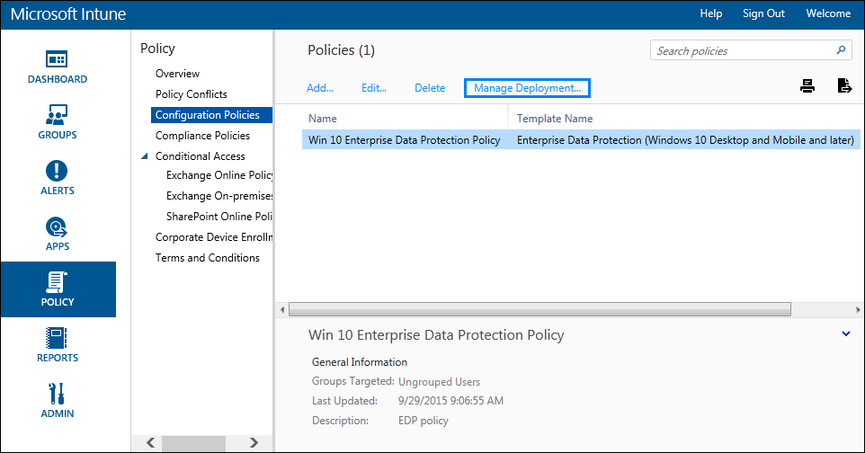
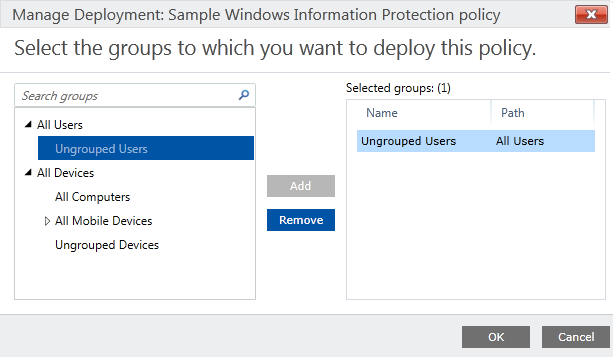

# Deploy your enterprise data protection (EDP) policy using Microsoft Intune
**Applies to:**

-   Windows 10 Insider Preview
-   Windows 10 Mobile Preview

[Some information relates to pre-released product which may be substantially modified before it's commercially released. Microsoft makes no warranties, express or implied, with respect to the information provided here. An app that calls an API introduced in Windows 10 Anniversary SDK Preview Build 14295 cannot be ingested into the Windows Store during the Preview period.]

After you’ve created your enterprise data protection (EDP) policy, you'll need to deploy it to your organization's enrolled devices. Enrollment can be done for business or personal devices, allowing the devices to use your managed apps and to sync with your managed content and information.

**To deploy your EDP policy**

1.  On the **Configuration policies** page, locate your newly-created policy, click to select it, and then click the **Manage Deployment** button.

    

2.  In the left pane of the **Manage Deployment** box, click the employees or groups that should get the policy, and then click **Add**.

The added people move to the **Selected Groups** list on the right-hand pane.

    

3.  After you've picked all of the employees and groups that should get the policy, click **OK**.

The policy is deployed to the selected users' devices.

## Related topics
- [Create an enterprise data protection (EDP) policy using Microsoft Intune](create-edp-policy-using-intune.md)
-[Add multiple apps to your enterprise data protection (EDP) Protected Apps list](add-apps-to-protected-list-using-custom-uri.md)
- [Create and deploy a VPN policy for enterprise data protection (EDP) using Microsoft Intune](create-vpn-and-edp-policy-using-intune.md)
- [General guidance and best practices for enterprise data protection (EDP)](guidance-and-best-practices-edp.md)

 

 

