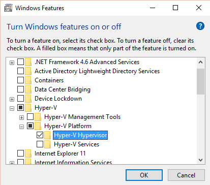
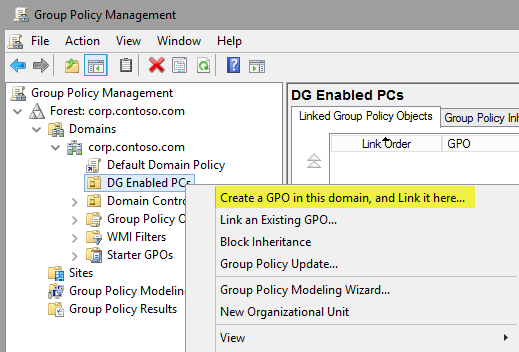
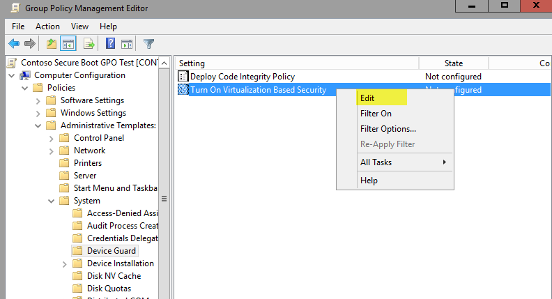
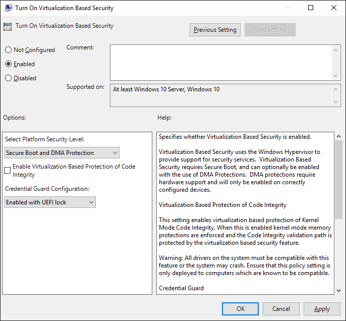
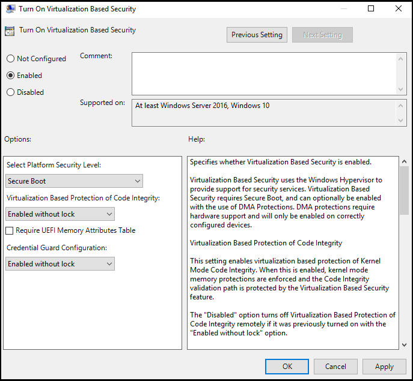
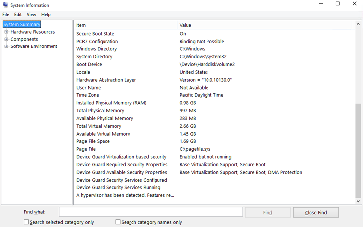
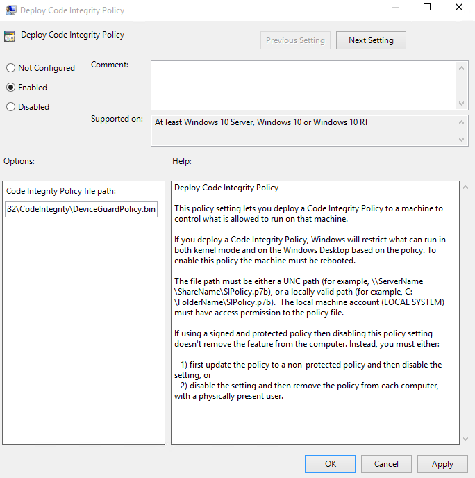

# Device Guard deployment guide

**Applies to**

-   Windows 10

Microsoft Device Guard is a feature set that consists of both hardware and software system integrity hardening features that revolutionize the Windows operating system’s security. Windows 10 employs Device Guard as well as code integrity and advanced hardware features such as CPU virtualization extensions, Trusted Platform Module, and second-level address translation to offer comprehensive modern security to its users. This guide explores the individual features in Device Guard as well as how to plan for, configure, and deploy them.

## Introduction to Device Guard

Today’s security threat landscape is more aggressive than ever before. Modern malicious attacks are focused on revenue generation, intellectual property theft, and targeted system degradation, which results in financial loss. Many of these modern attackers are sponsored by nation states with unknown motives and large cyber terrorism budgets. These threats can enter a company through something as simple as an email message and can permanently damage its reputation for securing its software assets, as well as having significant financial impact. Windows 10 introduces several new security features that help mitigate a large percentage of today’s known threats.

It is estimated that more than 300,000 new malware variants are discovered daily. Unfortunately, companies currently use an ancient method to discover this infectious software and prevent its use. In fact, current PCs trust everything that runs until malware signatures determine whether a threat exists; then, the antimalware software attempts to clean the PC, often after the malicious software’s effect has already been noticed. This signature-based system focuses on reacting to an infection and ensuring that the particular infection does not happen again. In this model, the system that drives malware detection relies on the discovery of malicious software; only then can a signature be provided to the client to remediate it, which implies that a computer must be infected first. The time between the detection of the malware and a client being issued a signature could mean the difference between losing data and staying safe.

In addition to antimalware solutions, there are some “whitelisting” technologies available, including AppLocker. These technologies perform single instance, or blanket-allow or blanket-deny rules for running applications. Although this is more preventative than signature-based detection, it requires significant ongoing maintenance. In Windows 10, these applications are most effective when they are deployed alongside Microsoft Device Guard.

Device Guard breaks the current model of detection first-block later, and allows only trusted applications to run, period. This methodology is consistent with the successful prevention strategy for mobile phone security. With Device Guard, Microsoft has changed how the Windows operating system handles untrusted applications, which makes its defenses difficult for malware to penetrate. This new prevention versus detection model provides Windows clients with the necessary security for modern threats and, when implemented, makes most of today’s threats completely obsolete from day one.

Device Guard's features revolutionize the Windows operating system’s security by taking advantage of new virtualization-based security (VBS) options and the trust-nothing mobile device operating system model, which makes its defenses much more difficult for malware to penetrate. By using configurable code integrity policies, organizations are able to choose exactly which applications are allowed to run in their environment. Configurable code integrity is not limited to Windows Store applications and can be used with existing unsigned or signed Win32 applications, without the requirement that the application be repackaged. In addition, configurable code integrity can be deployed as an individual feature if organizations don’t possess the required hardware for Device Guard. Along with code integrity, Windows 10 leverages advanced hardware features such as CPU virtualization extensions, input/output memory management units (IOMMUs), Trusted Platform Module (TPM), and second-level address translation (SLAT) to offer comprehensive modern security to its users. Device Guard deployed with configurable code integrity and Credential Guard will be among the most impactful client-side security deployments an organization can implement today. In this guide, you learn about the individual features found within Device Guard as well as how to plan for, configure, and deploy them. Device Guard with configurable code integrity is intended for deployment alongside additional threat-mitigating Windows features such as Credential Guard and AppLocker.

## Device Guard overview

Device Guard is a feature set that consists of both hardware and software system integrity hardening features. These features revolutionize the Windows operating system’s security by taking advantage of new virtualization-based security options and the trust-nothing mobile device operating system model. A key feature in this model is called *configurable code integrity*, which allows your organization to choose exactly which software or trusted software publishers are allowed to run code on your client machines—exactly what has made mobile phone security so successful. In addition, Device Guard offers organizations a way to sign existing line-of-business (LOB) applications so that they can trust their own code, without the requirement that the application be repackaged. Also, this same method of signing provides organizations with a way to trust individual third-party applications. Device Guard—with configurable code integrity, Credential Guard, and AppLocker—is the most complete security defense that any Microsoft product has ever been able to offer a Windows client.

Advanced hardware features such as CPU virtualization extensions, IOMMUs, and SLAT, drive these new client security offerings. By integrating these hardware features further into the core operating system, Windows 10 leverages them in new ways. For example, the same type 1 hypervisor technology that is used to run virtual machines in Microsoft Hyper-V is used to isolate core Windows services into a virtualization-based, protected container. This is just one example of how Windows 10 integrates advanced hardware features deeper into the operating system to offer comprehensive modern security to its users. These hardware features are now available in consumer and enterprise PC markets and are discussed in detail in the [Hardware considerations](#hardware) section.

Along with these new features, some components of Device Guard are existing tools or technologies that have been included in this strategic security offering to provide customers with the most secure Windows operating system possible. Device Guard is intended as a set of client security features to be used in conjunction with the other threat-resistance features available in the Windows operating system, some of which are mentioned in this guide. In addition to an overview of each feature, this guide walks you through the configuration and deployment of them.

### 

**Configurable code integrity**

The Windows operating system consists of two operating modes: user mode and kernel mode. The base of the operating system runs within the kernel mode, which is where the Windows operating system directly interfaces with hardware resources. User mode is primarily responsible for running applications and brokering information to and from the kernel mode for hardware resource requests. For example, when an application that is running in user mode needs additional memory, the user mode process must request the resources from kernel mode, not directly from RAM.

Code integrity is the component of the Windows operating system that verifies that the code Windows is running is trusted and safe. Like the operating system, Windows code integrity also contains two primary components: kernel mode code integrity (KMCI) and user mode code integrity (UMCI). KMCI has been used in recent versions of the Windows operating system to protect the kernel mode from running unsigned drivers. Although effective, drivers are not the only route that malware can take to penetrate the kernel mode space of the operating system. In Windows 10, however, Microsoft has raised the standard for kernel mode code out of the box as well as provided enterprises with a way to set their own UMCI and KMCI standards. Beginning with the Code Integrity service itself and continuing through the policies a Windows client uses to verify that an application should be allowed to run, Microsoft has made Windows 10 more secure than any previous Windows release. Historically, UMCI has been available only in Windows RT and on Windows Phone devices, which has made it difficult for these devices to be infected with viruses and malware. In Windows 10, these same successful UMCI standards are available.

Historically, most malware has been unsigned. By simply deploying code integrity policies, organizations will immediately protect themselves against unsigned malware, which is estimated to be responsible for more than 95 percent of current attacks. By using code integrity policies, an enterprise can select exactly which binaries are allowed to run in both user mode and kernel mode, from the signer to the hash level. When completely enforced, it makes user mode in Windows function like a mobile phone, by allowing only specific applications or specific signatures to be trusted and run. This feature alone fundamentally changes the security in an enterprise. This additional security is not limited to Windows apps and does not require that an application be rewritten to be compatible with your existing, unsigned applications. You can implement configurable code integrity without enabling Device Guard, but it is intended to run in conjunction with Device Guard when supported hardware is available. For more information about how to configure, deploy, and manage code integrity policies, see the [Code integrity policies](#code-integrity-policies) section.

**Hardware security features and virtualization-based security**

The Device Guard core functionality and protection start at the hardware level. Devices that have processors equipped with SLAT technologies and virtualization extensions, such as Intel Virtualization Technology (VT-x) and AMD-V, will be able to take advantage of virtualization-based security (VBS) features that enhance Windows security. Device Guard leverages VBS to isolate core Windows services that are critical to the security and integrity of the operating system. This isolation removes the vulnerability of these services from both the user and kernel modes and acts as an impenetrable barrier for most malware used today. One of these isolated services, called the Windows Code Integrity service, drives the Device Guard kernel mode configurable code integrity feature. This prevents code that has penetrated the kernel mode operations from compromising the code integrity service.

Another Windows 10 feature that employs VBS is Credential Guard. Credential Guard provides additional protection to Active Directory domain users by storing domain credentials within the virtualization container that hosts the Windows security services, such as code integrity. By isolating these domain credentials from the active user mode and kernel mode, they have a much lower risk of being stolen. For more information about how Credential Guard complements Device Guard, see the [Device Guard with Credential Guard](#dg-with-cg) section. For information about how to enable Credential Guard, see the [Enable Credential Guard](#enable-cg) section.

### 

**Device Guard with AppLocker**

Although AppLocker is not considered a new Device Guard feature, it complements Device Guard functionality when enforced code integrity cannot be fully implemented or its functionality does not cover every desired scenario. There are many scenarios in which code integrity policies would be used alongside AppLocker rules. As a best practice, you should enforce code integrity policies at the most restrictive level possible for your organization, and then you can use AppLocker to fine-tune the restrictions to an even lower level.

**Note**  One example in which Device Guard functionality needs AppLocker supplementation is when your organization would like to limit universal applications. Universal applications have already been validated by Microsoft to be trustworthy to run, but an organization may not want to allow specific universal applications to run in their environment. You can accomplish this enforcement by using an AppLocker rule.

 

AppLocker and Device Guard should run side-by-side in your organization, which offers the best of both security features at the same time and provides the most comprehensive security to as many devices as possible. In addition to these features, Microsoft recommends that you continue to maintain an enterprise antivirus solution for a well-rounded enterprise security portfolio.

### 

**Device Guard with Credential Guard**

Although Credential Guard is not a feature within Device Guard, many organizations will likely deploy Credential Guard alongside Device Guard for additional protection against credential theft. Similar to virtualization-based protection of kernel mode code integrity, Credential Guard leverages hypervisor technology to protect domain credentials. This mitigation is targeted at resisting the use of pass-the-hash and pass-the-ticket techniques. By employing multifactor authentication with Credential Guard, organizations can gain additional protection against such threats. For information about how to deploy Credential Guard to your Windows 10 Enterprise clients, see the [Enable Credential Guard](#enable-cg) section. In addition to the client-side enablement of Credential Guard, organizations can deploy mitigations at both the CA and domain controller level to help prevent credential theft. Microsoft will be releasing details about these additional mitigations in the future.

**Unified manageability**

You can easily manage Device Guard features by using the familiar enterprise and client-management tools that IT pros use every day. Use the following management tools to enable and manage Device Guard:

-   **Group Policy**. Windows 10 provides an administrative template to configure and deploy the configurable code integrity policies for your organization. This template also allows you to specify which hardware-based security features you would like to enable and deploy. You can manage these settings along with your existing Group Policy Objects (GPOs), which makes it simple to implement Device Guard features. In addition to these code integrity and hardware-based security features, you can use Group Policy to help you manage your catalog files. For more information about catalog files, see the [Catalog files](#catalog-files) section.

-   **Microsoft System Center Configuration Manager**. You can use System Center Configuration Manager to simplify deployment and management of catalog files, code integrity policies, and hardware-based security features, as well as provide version control. For more information about how to deploy catalog files by using System Center Configuration Manager, see the [Deploy catalog files with System Center Configuration Manager](#deploy-cat-sccm) section.

-   **Microsoft Intune**. In a future release of Microsoft Intune, organizations will be able to leverage Intune for deployment and management of code integrity policies and catalog files.

-   **Windows PowerShell**. Windows PowerShell is primarily used to create and service code integrity policies. These policies represent the most powerful component of Device Guard. For a step-by-step walkthrough of how to create, audit, service, enforce, and deploy code integrity policies, see the [Code integrity policies](#code-integrity-policies) section.

These options provide the same experience you are used to in order to manage your existing enterprise management solutions. For more information about how to manage and deploy Device Guard hardware and code integrity features in your organization, see the [Device Guard deployment](#dg-deployment) section.
## Plan for Device Guard

In this section, you will learn about the following topics:

-   [Approach enterprise code integrity deployment](#approach-enterprise). Device Guard deployment in your organization requires a planned approach. In this section, you get high-level recommendations for how to approach enterprise code integrity deployment in your organization.

-   [Device Guard deployment scenarios](#device-guard-deployment). When you plan for Device Guard deployment, Microsoft recommends that you categorize each device in your organization into a deployment scenario. These scenarios will provide a roadmap for your Device Guard deployment.

-   [Code signing adoption](#code-signing-adoption). Code signing is important to the security that Device Guard provides. This section outlines the options for code signing and the benefits and disadvantages of each method.

-   [Hardware considerations](#hardware). Several Device Guard features require advanced hardware. This section outlines the requirements for each of those features and what to look for during your next hardware refresh.

## Approach enterprise code integrity deployment

Enterprises that want to consider Device Guard should not expect deployment to their entire organization overnight. Device Guard implementation requires that you plan for both end-user and IT pro impact. In addition, the deployment of Device Guard features to your enterprise requires a planned, phased approach to ensure that end-user systems are fully capable and ready to enforce these new security restrictions. Perform the following high-level tasks to approach the deployment of Device Guard to your enterprise:

1.  **Group devices into similar functions**. Categorize machines into the groups described in the [Device Guard deployment scenarios](#device-guard-deployment) section. This begins the roadmap for your Device Guard deployment and provides groups of easier and more difficult implementations. From there, assess the quantity of necessary Device Guard policies. The easiest solution is to lock down your entire enterprise, but it might not fit your individual departments’ needs.

    To discover an appropriate number of policies for your organization, try to separate the defined groups into departments or roles. Then ask some questions: What software does each department or role need to do their job? Should they be able to install and run other departments’ software? Do we need to create a base code integrity policy that aligns with our application catalog? Should users be able to install any application or only choose from an “allowed” list? Do we allow users to use their own peripheral devices? These questions will help you discover the number of necessary policies for your organization. Finally, try to focus on which people or departments would require an additional level of privileges. For example, should department x be able to install and run application xyz, even though no other department does? If the answer is yes and justifiable, you will need a secondary code integrity policy for that group. If not, you will likely be able to merge several policies to simplify management. For more information about configurable code integrity policies, see the [Code integrity policies](#code-integrity-policies) section.

2.  **Create code integrity policies from “golden” PCs**. After you create the groups of devices, you can create code integrity policies to align with those groups, similar to the way you would manage corporate images. When you have separated these groups and set up golden PCs that mimic the software and hardware those individual groups require, create code integrity policies from each of them. After you create these, you can merge these code integrity policies to create a master policy, or you can manage and deploy them individually. For step-by-step instructions about how to create code integrity policies, see the [Create code integrity policies from golden PCs](#create-code-golden) section.

3.  **Audit and merge code integrity policies**. Microsoft recommends that you test code integrity policies in audit mode before you enforce them. Audit mode allows administrators to run the code integrity policy on a system but not actually block anything. Rather than not allowing applications to run, events are logged with each exception to the policy. This way, you can easily highlight any issues that were not discovered during the initial scan. You can create additional code integrity policies by using the audit events and merge them into the existing policy. For more information about how to audit code integrity policies, see the [Audit code integrity policies](#audit-code-integrity) section.

4.  **Assess LOB applications that are currently unsigned, and create a catalog file for them**. Catalog files allow organizations to sign applications that do not currently possess digitally signed binaries or applications that a customer would want to add a secondary signature to. These applications can be in-house applications or from third parties, and the process does not require any repackaging of the application. When you create code integrity policies at a rule level above hash values, you will not discover unsigned applications. To include these applications in your code integrity policies, simply create, sign, and deploy a catalog file. For information about catalog files, see the [Catalog files](#catalog-files) section.

5.  **Enable desired hardware security features**. Each type of device found in the [Device Guard deployment scenarios](#device-guard-deployment) section takes advantage of different software and hardware integrity configurations. You should assess hardware-based security features separately from code integrity policies because they provide complementary functionality. For information about how to configure Device Guard hardware-based security features, see the [Configure hardware-based security features](#configure-hardware) section.

6.  **Deploy code integrity policies and catalog files**. After you have created and signed the necessary catalog files and created and audited code integrity policies, you are ready to deploy them in phases. Microsoft strongly recommends that you deploy these components to a test group of users, even after your IT organization has tested and vetted them. This provides a final quality control validation before you deploy the catalog files and policies more broadly. For information about how to deploy catalog files with Group Policy, see the [Deploy catalog files with Group Policy](#deploy-cat-gp) section. For additional information about how to deploy code integrity policies, see the [Deploy code integrity policies with Group Policy](#deploy-manage-code-gp) section.

## Device Guard deployment scenarios

To help simplify the deployment of Device Guard to your organization, Microsoft recommends that you group devices into the deployment scenarios described in this section. Device Guard is not a feature that organizations will just simply “turn on”; rather, it typically requires a phased implementation approach. To see where these scenarios fit into an overall Device Guard deployment approach, see the [Approach to enterprise code integrity deployment](#approach-enterprise) section.

**Fixed-workload devices**

The lists of approved applications on fixed-workload devices rarely change as they perform the same tasks day after day. Examples of such devices include kiosks, point-of-sale systems, and call center PCs. These devices could easily employ the full capabilities of Device Guard and would require little management or policy modification. Device Guard implementation to these devices is painless and requires little ongoing administration. With Device Guard fully implemented, users are able to run only those applications that the IT department installs, manages, and trusts.

Device Guard components that are applicable to fixed-workload devices include:

-   KMCI VBS protection

<!-- -->

-   Enforced UMCI policy

**Fully managed devices**

Fully managed devices are those for which the IT department restricts the software that is installed and run on them, but allows users to request installation of additional software or provides a list of approved software in an application catalog. Examples of such devices include locked-down, company-owned desktops and laptops. With these devices, establish an initial baseline code integrity policy and enforce the code integrity policy. The IT department manages the policies and updates the devices when new applications are approved or are provided in the System Center Configuration Manager catalog.

Device Guard components that are applicable to fully managed devices include:

-   KMCI VBS protection

-   Enforced UMCI policy

In this scenario, an application list is provided and trusted, and the trust policy is constantly re-evaluated when a user requests a new application. When an application is trusted across all of these devices, new user requests for that application do not require a policy update (alignment with application catalog). In addition, you can couple this with an onboarding process for new applications that you should add to the central application catalog. Initial implementation of Device Guard to fully managed devices is simple but does require more administrative overhead to manage trusted signatures of newly requested and approved applications.

**Lightly managed devices**

Lightly managed devices are company-owned machines over which users have full control, which includes what is installed on them. These devices run the organization’s antivirus solution and client management tools but are not restricted by software request or compliance policies.

Device Guard components that are applicable to lightly managed devices include:

-   KMCI VBS protection

-   UMCI policy in Audit mode

**Bring Your Own Device**

Device Guard is not a good way to manage devices in a Bring Your Own Device (BYOD) model. When employees are allowed to bring their own devices, the management of user-mode applications on them can make it difficult for users to use their own devices when they are not at work. In addition, Device Guard functionality is difficult to maintain from an administrative perspective. For devices in this group, explore alternate hardening and security features with MDM-based conditional access solutions, such as Microsoft Intune.

## Code signing adoption

Code signing is crucial to the successful implementation of configurable code integrity policies. These policies can trust the signing certificates from both independent software vendors and customers. In Windows 10, all Windows Store applications are signed. Also, you can easily trust any other signed application by adding the signing certificate to the code integrity policy.

For unsigned applications, customers have multiple options for signing them so that code integrity policies can trust them. The first option is traditional embedded code signing. Organizations that have in-house development teams can incorporate binary code signing into their application development process, and then simply add the signing certificate to their code integrity policies. The second option for signing unsigned applications is to use catalog files. In Windows 10, customers have the ability to create catalog files as they monitor the installation and initial run of an application. For more information about signing existing unsigned LOB applications or third-party applications, see the [Existing line-of-business applications](#existing-lob) section.

### 

**Existing line-of-business applications**

Until now, existing LOB applications were difficult to trust if they were signed by a source other than the Windows Store or not signed at all. With Windows 10, signing your existing LOB and third-party unsigned applications is simplified. This new signing method does not require that applications be repackaged in any way. With catalog files, administrators can sign these unsigned applications simply by monitoring for an installation and initial startup. By using this monitoring information, an administrator can generate a catalog file. Catalog files are simply Secure Hash Algorithm 2 (SHA2) hash lists of discovered binaries. These binaries’ hash values are updated every time an application is updated and therefore require an updated catalog file. For simplified administration, consider incorporating embedded code signing into your application development process. For more information about how to generate catalog files, see the [Catalog files](#catalog-files) section.

**Note**  
Catalog files are lists of individual binaries’ hash values. If the scanned application is updated, you will need to create a new catalog file. That said, binary signing is still highly recommended for any future applications so that no catalog files are needed.

 

When you create a catalog file, you must sign it by using enterprise public key infrastructure (PKI), or a purchased code signing certificate. When signed, code integrity policies can trust the signer or signing certificate of those files. For information about catalog file signing, see the [Catalog files](#catalog-files) section.

**Application development**

Although in-house applications can be signed after packaging by using catalog files, Microsoft strongly recommends that embedded code signing be incorporated into your application development process. When signing applications, simply add the code signing certificate used to sign your applications to your code integrity policy. This ensures that your code integrity policy will trust any future application that is signed with that certificate. Embedding code signing into any in-house application development process is beneficial to your IT organization as you implement code integrity policies.

## Hardware considerations

Careful consideration about which hardware vendor and specific models to purchase during your next hardware refresh is vitally important to the success of your organization’s Device Guard implementation efforts. In alignment with your current hardware life cycle, consider the process that is discussed in the [Approach enterprise code integrity deployment](#approach-enterprise) section when you determine the appropriate order of hardware replacement in your organization. Device Guard should be deployed in phases; therefore, you have time to methodically plan for its implementation.

Different hardware features are required to implement the various features of Device Guard. There will likely be some individual features that you will be able to enable with your current hardware and some that you will not. However, for organizations that want to implement Device Guard in its entirety, several advanced hardware features will be required. For additional details about the hardware features that are required for Device Guard components, see the following table.

<table>
<colgroup>
<col width="50%" />
<col width="50%" />
</colgroup>
<thead>
<tr class="header">
<th align="left">Requirement</th>
<th align="left">Description</th>
</tr>
</thead>
<tbody>
<tr class="odd">
<td align="left">
Windows 10 Enterprise
</td>
<td align="left">
The PC must be running Windows 10 Enterprise.
</td>
</tr>
<tr class="even">
<td align="left">
UEFI firmware version 2.3.1 or higher with UEFI Secure Boot and Platform Secure Boot
</td>
<td align="left">
UEFI Secure Boot ensures that the device boots only authorized code. Additionally, Boot Integrity, also known as Platform Secure Boot must be supported. You can validate it against the following Windows Hardware Compatibility Program requirements:

<ul>
<li>
[System.Fundamentals.Firmware.UEFISecureBoot](http://msdn.microsoft.com/library/windows/hardware/dn932805.aspx#system-fundamentals-firmware-uefisecureboot)
</li>
<li>
[System.Fundamentals.Firmware.CS.UEFISecureBoot.ConnectedStandby](http://msdn.microsoft.com/library/windows/hardware/dn932807.aspx#system-fundamentals-firmware-cs-uefisecureboot-connectedstandby)
</li>
</ul></td>
</tr>
<tr class="odd">
<td align="left">
Virtualization extensions
</td>
<td align="left">
The following virtualization extensions are required to support virtualization-based security:

<ul>
<li>Intel VT-x or AMD-V</li>
<li>Second Level Address Translation</li>
</ul></td>
</tr>
<tr class="even">
<td align="left">
Firmware lock
</td>
<td align="left"><ul>
<li>
The firmware setup should be locked to prevent other operating systems from starting and to prevent changes to the UEFI settings.
</li>
<li>
Work with your hardware manufacturer to ensure that the devices are Device Guard ready.
</li>
<li>
You should require a firmware password or higher authentication to change firmware settings.
</li>
</ul></td>
</tr>
<tr class="odd">
<td align="left">
x64 architecture
</td>
<td align="left">
The features that virtualization-based security uses in the Windows hypervisor can only run on a 64-bit PC.
</td>
</tr>
<tr class="even">
<td align="left">
A VT-d or AMD-Vi IOMMU (Input/output memory management unit)
</td>
<td align="left">
In Windows 10, an IOMMU enhances system resiliency against memory attacks.
</td>
</tr>
<tr class="odd">
<td align="left">
Secure firmware update process
</td>
<td align="left">
To verify that the firmware complies with the secure firmware update process, you can validate it against the [System.Fundamentals.Firmware.UEFISecureBoot](http://msdn.microsoft.com/library/windows/hardware/dn932805.aspx#system-fundamentals-firmware-uefisecureboot) Windows Hardware Compatibility Program requirement.
</td>
</tr>
<tr class="even">
<td align="left">
Signed processor microcode updates
</td>
<td align="left">
If the processor supports it, you must require signed microcode updates.
</td>
</tr>
</tbody>
</table>

 

## Device Guard deployment

In this section, you learn about the following topics:

-   [Configure hardware-based security features](#configure-hardware). This section explains how to enable the hardware-based security features in Device Guard. Also, you verify that the features are enabled by using both Windows Management Infrastructure (WMI) and Msinfo32.exe.

-   [Catalog files](#catalog-files). In this section, you create, sign, and deploy catalog files. You deploy the catalog files by using both Group Policy and System Center Configuration Manager. Also, you use System Center Configuration Manager to inventory the deployed catalog files for reporting purposes.

-   [Code integrity policies](#code-integrity-policies). This section provides information on how to create, audit, service, merge, deploy, and remove signed and unsigned configurable code integrity policies.

## Configure hardware-based security features

Hardware-based security features make up a large part of Device Guard security offerings. VBS reinforces the most important feature of Device Guard: configurable code integrity. There are three steps to configure hardware-based security features in Device Guard:

1.  **Verify that hardware requirements are met and enabled**. Verify that your client machines possess the necessary hardware to run these features. A list of hardware requirements for the hardware-based security features is available in the [Hardware considerations](#hardware) section.

2.  **Enable the necessary Windows features**. There are several ways to enable the Windows features required for hardware-based security. For details on which Windows features are needed, see the [Windows feature requirements for virtualization-based security](#vb-security) section.

3.  **Enable desired features**. When the necessary hardware and Windows features have been enabled, you are ready to enable the desired hardware-based security features. For UEFI Secure Boot, see the [Enable UEFI Secure Boot](#enable-secureboot) section. For information about how to enable VBS protection of the KMCI service, see the [Enable virtualization-based protection of kernel mode code integrity](#enable-virtualbased) section. Finally, for information about how to enable Credential Guard, see the [Enable Credential Guard](#enable-cg) section.

### 

**Windows feature requirements for virtualization-based security**

In addition to the hardware requirements found in the [Hardware considerations](#hardware) section, you must enable certain operating system features before you can enable VBS: Microsoft Hyper-V and isolated user mode (shown in Figure 1).

**Note**  
You can configure these features manually by using Windows PowerShell or Deployment Image Servicing and Management. For specific information about these methods, refer to the [Credential Guard documentation](http://go.microsoft.com/fwlink/p/?LinkId=624529).

 

Figure 1. Enable operating system features for VBS

After you enable these features, you can configure any hardware-based security features you want. For information about how to enable virtualization-based protection of kernel-mode code integrity, see the [Enable virtualization-based protection of kernel-mode code integrity](#enable-virtualbased) section. For information about how to enable UEFI Secure Boot, see the [Enable Unified Extensible Firmware Interface Secure Boot](#enable-secureboot) section. Finally, for additional information about how to enable Credential Guard, see the [Enable Credential Guard](#enable-cg) section.

### 

**Enable Unified Extensible Firmware Interface Secure Boot**

Before you begin this process, verify that the target device meets the hardware requirements for UEFI Secure Boot that are laid out in the [Hardware considerations](#hardware) section. There are two options to configure UEFI Secure Boot: manual configuration of the appropriate registry keys and Group Policy deployment. Complete the following steps to manually configure UEFI Secure Boot on a computer running Windows 10:

**Note**  
There are two platform security levels for Secure Boot: stand-alone Secure Boot and Secure Boot with DMA protection. DMA protection provides additional memory protection but will be enabled only on systems whose processors include DMA protection (IOMMU) technologies. Without the presence of IOMMUs and with DMA protection disabled, customers will lose protection from driver-based attacks.

 

1.  Navigate to the **HKEY\_LOCAL\_MACHINE\\SYSTEM\\CurrentControlSet\\Control\\DeviceGuard** registry subkey.

2.  Set the **EnableVirtualizationBasedSecurity DWORD** value to **1**.

3.  Set the **RequirePlatformSecurityFeatures DWORD** value as appropriate:

    -   Set this value to **1** to enable the **Secure Boot** option.

    -   Set this value to **2** to enable the **Secure Boot with DMA Protection** option.

4.  Restart the client machine.

Unfortunately, it would be time consuming to perform these steps manually on every protected machine in your enterprise. Group Policy offers a much simpler way to deploy UEFI Secure Boot to your organization. This example creates a test organizational unit (OU) called *DG Enabled PCs*. If you prefer to link the policy to an existing OU, and then scope the GPO by using appropriately named computer security groups, you can certainly do so.

**Note**  
Microsoft recommends that you test-enable this feature on a group of test machines before you deploy it to machines that are currently deployed to users.

 

**Use Group Policy to deploy Secure Boot**

1.  To create a new GPO, right-click the OU to which you want to link the GPO, and then click **Create a GPO in this domain, and Link it here**.

    Figure 2. Create a new OU-linked GPO

2.  Name the new GPO **Contoso Secure Boot GPO Test**. This example uses *Contoso Secure Boot GPO Test* as the name of the GPO. You can choose any name for this example. Ideally, the name would align with your existing GPO naming convention.

3.  To open the Group Policy Management Editor, right-click the new GPO, and then click **Edit**.

4.  Within the selected GPO, navigate to Computer Configuration\\Administrative Templates\\System\\Device Guard. Then, right-click **Turn On Virtualization Based Security**, and then click **Edit**.

    

    Figure 3. Enable VBS

5.  Select the **Enabled** option, and then select **Secure Boot and DMA Protection** from the **Select Platform Security Level** list.

    

    Figure 4. Enable Secure Boot

    **Note**  
    Device Guard Secure Boot is maximized when combined with DMA protection. If your hardware contains the IOMMUs required for DMA protection, be sure to select the **Secure Boot and DMA Protection** platform security level. If your hardware does not contain IOMMU, there are several mitigations provided by leveraging Secure Boot without DMA Protection.

     

6.  Close the Group Policy Management Editor, and then restart the Windows 10 test computer. After you configure this setting, UEFI Secure Boot will be enabled upon restart.

7.  Check the test computer’s event log for Device Guard GPOs.

    Processed Device Guard policies are logged in event viewer at Application and Services Logs\\Microsoft\\Windows\\DeviceGuard-GPEXT\\Operational. When the **Turn On Virtualization Based Security** policy is successfully processed, event ID 7000 is logged, which contains the selected settings within the policy.

### 

**Enable virtualization-based security of kernel-mode code integrity**

Before you begin this process, verify that the desired computer meets the hardware requirements for VBS found in the [Hardware considerations](#hardware) section, and enable the Windows features discussed in the [Virtualization-based security Windows feature requirements](#vb-security) section. When validated, you can enable virtualization-based protection of KMCI in one of two ways: manual configuration of the appropriate registry subkeys and Group Policy deployment.

**Note**  
All drivers on the system must be compatible with virtualization-based protection of code integrity; otherwise, your system may fail. Microsoft recommends that you enable this feature on a group of test machines before you enable it on deployed machines.

 

To configure virtualization-based protection of KMCI manually:

1.  Navigate to the **HKEY\_LOCAL\_MACHINE\\SYSTEM\\CurrentControlSet\\Control\\DeviceGuard** registry subkey.

2.  Set the **HypervisorEnforcedCodeIntegrity DWORD** value to **1**.

3.  Restart the client computer.

It would be time consuming to perform these steps manually on every protected machine in your enterprise. Instead, use Group Policy to deploy virtualization-based protection of KMCI. This example creates a test OU called *DG Enabled PCs*, which you will use to link the GPO. If you prefer to link the policy to an existing OU rather than create a test OU and scope the policy by using appropriately named computer security groups, that is another option.

**Note**  
Microsoft recommends that you test-enable this feature on a group of test computers before you deploy it to machines that are currently deployed to users. If untested, there is a possibility that this feature can cause system instability and ultimately cause the client operating system to fail.

 

To use Group Policy to configure VBS of KMCI:

1.  Create a new GPO: Right-click the OU to which you want to link the GPO, and then click **Create a GPO in this domain, and Link it here**.

    

    Figure 5. Create a new OU-linked GPO

2.  Name the new GPO **Contoso VBS CI Protection GPO Test**.

    This example uses *Contoso VBS CI Protection GPO Test* as the name of the GPO. You can choose any name you prefer for this example. Ideally, this name would align with your existing GPO naming convention.

3.  Open the Group Policy Management Editor: Right-click the new GPO, and then click **Edit**.

4.  Within the selected GPO, navigate to Computer Configuration\\Administrative Templates\\System\\Device Guard. Then, right-click **Turn On Virtualization Based Security**, and then click **Edit**.

    

    Figure 6. Enable VBS

5.  Select the **Enabled** option, and then select the **Enable Virtualization Based Protection of Code Integrity** check box.

    

    Figure 7. Enable VBS of KMCI

6.  Close the Group Policy Management Editor, and then restart the Windows 10 test computer. With this setting configured, the VBS of the KMCI will take effect upon restart.

7.  Check the test client event log for Device Guard GPOs.

    Processed Device Guard policies are logged in event viewer under Application and Services Logs\\Microsoft\\Windows\\DeviceGuard-GPEXT\\Operational. When the **Turn On Virtualization Based Security** policy has been successfully processed, event ID 7000 is logged, which contains the selected settings within the policy.

### 

**Enable Credential Guard**

Credential Guard provides an additional layer of credential protection specifically for domain users by storing the credentials within the virtualized container, away from both the kernel and user mode operating system. This makes it difficult for even a compromised system to obtain access to the credentials. In addition to the client-side enablement of Credential Guard, you can deploy additional mitigations at both the Certification Authority and domain controller level to prevent credential theft. Microsoft will be releasing details about these additional mitigations in the future.

Before you begin this process, verify that the desired system meets the hardware requirements for VBS found in the [Hardware considerations](#hardware) section, and that you have enabled the Windows features laid out in the [Virtualization-based security Windows feature requirements](#vb-security) section. When validated, you can enable Credential Guard manually, by configuring the appropriate registry subkeys, or through Group Policy deployment.

To configure VBS of Credential Guard manually:

1.  Navigate to the **HKEY\_LOCAL\_MACHINE\\SYSTEM\\CurrentControlSet\\Control\\Lsa** registry subkey.

2.  Set the **LsaCfgFlags DWORD** value to **1**.

3.  Restart the client computer.

To avoid spending an unnecessary amount of time in manual deployments, use Group Policy to deploy Credential Guard to your organization. This example creates a test OU called *DG Enabled PCs*. To enable Credential Guard, you can link to any OU, and then scope the GPO’s application by using security groups.

**Note**  
Microsoft recommends that you enable Credential Guard before you join a machine to the domain to ensure that all credentials are properly protected. Setting the appropriate registry subkeys during your imaging process would be ideal to achieve this protection.

 

To use Group Policy to enable Credential Guard:

1.  Create a new GPO: right-click the OU to which you want to link the GPO, and then click **Create a GPO in this domain, and Link it here** .

    

    Figure 8. Create a new OU-linked GPO

2.  Name the new GPO **Contoso Credential Guard GPO Test**.

    This example uses *Contoso Credential Guard GPO Test* as the name of the GPO. You can choose any name you prefer for this example. Ideally, this name would align with your existing GPO naming convention.

3.  Open the Group Policy Management Editor: right-click the new GPO, and then click **Edit**.

4.  Within the selected GPO, navigate to Computer Configuration\\Administrative Templates\\System\\Device Guard. Right-click **Turn On Virtualization Based Security**, and then click **Edit**.

    

    Figure 9. Enable VBS

5.  Select the **Enabled** option, and then select the **Enable Credential Guard** check box.

    

    Figure 10. Enable Credential Guard

6.  Close Group Policy Management Editor, and then restart the Windows 10 test computer.

    **Note**  
    The default platform security level is **Secure Boot**. If IOMMUs are available within the protected machines, it is recommended that you select **Secure Boot and DMA Protection** to maximize the mitigations that are available through Credential Guard.

     

7.  Check the test client event log for Device Guard GPOs.

**Note**  
All processed Device Guard policies are logged in event viewer under Application and Services Logs\\Microsoft\\Windows\\DeviceGuard-GPEXT\\Operational.

 

For additional information about how Credential Guard works as well as additional configuration options, please refer to the [Credential Guard documentation](http://go.microsoft.com/fwlink/p/?LinkId=624529).

**Validate enabled Device Guard hardware-based security features**

Windows 10 and Windows Server 2016 and later have a WMI class for Device Guard–related properties and features: *Win32\_DeviceGuard*. This class can be queried from an elevated Windows PowerShell session by using the following command:

`Get-CimInstance –ClassName Win32_DeviceGuard –Namespace root\Microsoft\Windows\DeviceGuard`

**Note**  
The *Win32\_DeviceGuard* WMI class is only available on the Enterprise edition of Windows 10.

The output of this command provides details of the available hardware-based security features as well as those features that are currently enabled. For detailed information about what each property means, refer to Table 1.

 

Table 1. Win32\_DeviceGuard properties

<table>
<colgroup>
<col width="33%" />
<col width="33%" />
<col width="33%" />
</colgroup>
<thead>
<tr class="header">
<th align="left"><strong>Properties</strong></th>
<th align="left"><strong>Description</strong></th>
<th align="left"><strong>Valid values</strong></th>
</tr>
</thead>
<tbody>
<tr class="odd">
<td align="left"><strong>AvailableSecurityProperties</strong></td>
<td align="left">This field helps to enumerate and report state on the relevant security properties for Device Guard.</td>
<td align="left"><ul>
<li>
<strong>0.</strong> If present, no relevant properties exist on the device.
</li>
<li>
<strong>1.</strong> If present, hypervisor support is available.
</li>
<li>
<strong>2.</strong> If present, Secure Boot is available.
</li>
<li>
<strong>3.</strong> If present, DMA protection is available.
</li>
</ul></td>
</tr>
<tr class="even">
<td align="left"><strong>InstanceIdentifier</strong></td>
<td align="left">A string that is unique to a particular device.</td>
<td align="left">Determined by WMI.</td>
</tr>
<tr class="odd">
<td align="left"><strong>RequiredSecurityProperties</strong></td>
<td align="left">This field describes the required security properties to enable virtualization-based security.</td>
<td align="left"><ul>
<li>
<strong>0.</strong> Nothing is required.
</li>
<li>
<strong>1.</strong> If present, Secure Boot is needed.
</li>
<li>
<strong>2.</strong> If present, DMA protection is needed.
</li>
<li>
<strong>3.</strong> If present, both Secure Boot and DMA protection are needed.
</li>
</ul></td>
</tr>
<tr class="even">
<td align="left"><strong>SecurityServicesConfigured</strong></td>
<td align="left">This field indicates whether the Credential Guard or HVCI service has been configured.</td>
<td align="left"><ul>
<li>
<strong>0.</strong> No services configured.
</li>
<li>
<strong>1.</strong> If present, Credential Guard is configured.
</li>
<li>
<strong>2.</strong> If present, HVCI is configured.
</li>
</ul></td>
</tr>
<tr class="odd">
<td align="left"><strong>SecurityServicesRunning</strong></td>
<td align="left">This field indicates whether the Credential Guard or HVCI service is running.</td>
<td align="left"><ul>
<li>
<strong>0.</strong> No services running.
</li>
<li>
<strong>1.</strong> If present, Credential Guard is running.
</li>
<li>
<strong>2.</strong> If present, HVCI is running.
</li>
</ul></td>
</tr>
<tr class="even">
<td align="left"><strong>Version</strong></td>
<td align="left">This field lists the version of this WMI class.</td>
<td align="left">The only valid value now is <strong>1.0</strong>.</td>
</tr>
<tr class="odd">
<td align="left"><strong>VirtualizationBasedSecurityStatus</strong></td>
<td align="left">This field indicates whether VBS is enabled and running.</td>
<td align="left"><ul>
<li>
<strong>0.</strong> VBS is not enabled.
</li>
<li>
<strong>1.</strong> VBS is enabled but not running.
</li>
<li>
<strong>2.</strong> VBS is enabled and running.
</li>
</ul></td>
</tr>
<tr class="even">
<td align="left"><strong>PSComputerName</strong></td>
<td align="left">This field lists the computer name.</td>
<td align="left">All valid values for computer name.</td>
</tr>
</tbody>
</table>

 

Another method to determine the available and enabled Device Guard features is to run msinfo32.exe from an elevated PowerShell session. When you run this program, the Device Guard properties are displayed at the bottom of the **System Summary** section, as shown in Figure 11.

Figure 11. Device Guard properties in the System Summary

## Catalog files

Enforcement of Device Guard on a system requires that every trusted application have a signature or its binary hashes added to the code integrity policy. For many organizations, this can be an issue when considering unsigned LOB applications. To avoid the requirement that organizations repackage and sign these applications, Windows 10 includes a tool called Package Inspector that monitors an installation process for any deployed and executed binary files. If the tool discovers such files, it itemizes them in a catalog file. These catalog files offer you a way to trust your existing unsigned applications, whether developed in house or by a third party, as well as trust signed applications for which you do not want to trust the signer but rather the specific application. When created, these files can be signed, the signing certificates added to your existing code integrity policies, and the catalog files themselves distributed to the clients.

**Note**  
The Enterprise edition of Windows 10 or Windows Server 2016 is required to create and use catalog files.

 

### 

**Create catalog files**

The creation of catalog files is the first step to add an unsigned application to a code integrity policy. To create a catalog file, copy each of the following commands into an elevated Windows PowerShell session, and then complete the steps:

**Note**  
When you establish a naming convention it makes it easier to detect deployed catalog files in the future. In this guide, you will use *\*-Contoso.cat* as the naming convention. For more information about why this practice is helpful to inventory or detect catalog files, see the [Inventory catalog files with System Center Configuration Manager](#inventory-cat-sccm) section.

 

1.  Be sure that a code integrity policy is currently running in audit mode.

    Package Inspector does not always detect installation files that have been removed from the machine during the installation process. To ensure that these binaries are also trusted, the code integrity policy that you created and audited in the [Create code integrity policies from golden PCs](#create-code-golden) and [Audit code integrity policies](#audit-code-integrity) sections should be deployed, in audit mode, to the system on which you are running Package Inspector.

    **Note**  
    This process should **not** be performed on a system running an enforced Device Guard policy, only with a policy running in audit mode. If a policy is currently being enforced, you will not be able to install and run the application.

     

2.  Start Package Inspector, and then scan drive C:

    `PackageInspector.exe Start C:`

    **Note**  
    Package inspector can monitor installations on any local drive. In this example, we install the application on drive C, but any other drive can be used.

     

3.  Copy the installation media to drive C.

    By copying the installation media to drive C, you ensure that Package Inspector detects and catalogs the actual installer. If you skip this step, the future code integrity policy may trust the application to run but not be installed.

4.  Install and launch the application.

    Install the application to drive C. When the installation is finished, launch the application and ensure that any product updates are installed and any downloadable content caught during the scan. When finished, close and reopen the application once again to ensure that the scan has captured all binaries.

    **Note**  
    Every binary that is run while Package Inspector is running will be captured in the catalog. Therefore, be sure not to run additional installations or updates during the scan to minimize the risk of trusting the incorrect binaries. Alternatively, if you want to add multiple applications to a single catalog file, simply repeat the installation and run process while the current scan is running.

     

5.  Stop the scan, and then generate definition and catalog files. When application installation and initial setup are finished, stop the Package Inspector scan and generate the catalog and definition files on your desktop by using the following commands:

    `$ExamplePath=$env:userprofile+"\Desktop"`

    `$CatFileName=$ExamplePath+"\LOBApp-Contoso.cat"`

    `$CatDefName=$ExamplePath+"\LOBApp.cdf"`

    `PackageInspector.exe Stop C: -Name $CatFileName -cdfpath $CatDefName`

**Note**  
This scan catalogs the hash values for each discovered binary file. If the applications that were scanned are updated, complete this process again to trust the new binaries’ hash values.

 

When finished, the files will be saved to your desktop. To trust this catalog file within a code integrity policy, the catalog must first be signed. Then, the signing certificate can be included in the code integrity policy, and the catalog file can be distributed to the individual client machines. Catalog files can be signed by using a certificate and SignTool.exe, a free tool available in the Windows SDK. For more information about signing catalog files with SignTool.exe, see the [Catalog signing with SignTool.exe](#catsign-signtool) section.

### 

**Catalog signing with SignTool.exe**

Device Guard makes it easy for organizations to sign and trust existing unsigned LOB applications. In this section, you sign a catalog file you generated in a previous section by using PackageInspector.exe. For information about how to create catalog files, see the [Create catalog files](#create-catalog-files) section. In this example, you need the following:

-   SignTool.exe, found in the Windows software development kit (SDK—Windows 7 or later)

-   The catalog file that you generated in the [Create catalog files](#create-catalog-files) section, or another catalog file that you have created

-   Internal certification authority (CA) code signing certificate or purchased code signing certificate

If you do not have a code signing certificate, please see the [Create a Device Guard code signing certificate](#create-dg-code) section for a walkthrough of how to create one. In addition to using the certificate you create in the Create a Device Guard code signing certificate section, this example signs the catalog file that you created in the [Create catalog files](#create-catalog-files) section. If you are using an alternate certificate or catalog file, update the following steps with the appropriate variables and certificate. To sign the existing catalog file, copy each of the following commands into an elevated Windows PowerShell session:

1.  Initialize the variables that will be used:

    
    <table>
    <colgroup>
    <col width="100%" />
    </colgroup>
    <tbody>
    <tr class="odd">
    <td align="left"><pre><code>$ExamplePath=$env:userprofile+&quot;\Desktop&quot;</code></pre></td>
    </tr>
    </tbody>
    </table>

    
    <table>
    <colgroup>
    <col width="100%" />
    </colgroup>
    <tbody>
    <tr class="odd">
    <td align="left"><pre><code>$CatFileName=$ExamplePath+&quot;\LOBApp-Contoso.cat&quot;</code></pre></td>
    </tr>
    </tbody>
    </table>

    **Note**  
    In this example, you use the catalog file you created in the [Create catalog files](#create-catalog-files) section. If you are signing another catalog file, be sure to update the *$ExamplePath* and *$CatFileName* variables with the correct information.

     

2.  Import the code signing certificate. Import the code signing certificate that will be used to sign the catalog file to the signing user’s personal store. In this example, you use the certificate that you created in the [Create a Device Guard code signing certificate](#create-dg-code) section.

3.  Sign the catalog file with Signtool.exe:

    
    <table>
    <colgroup>
    <col width="100%" />
    </colgroup>
    <tbody>
    <tr class="odd">
    <td align="left"><pre><code>&lt;Path to signtool.exe&gt; sign /n &quot;ContosoDGSigningCert&quot; /fd sha256 /v $CatFileName</code></pre></td>
    </tr>
    </tbody>
    </table>

    **Note**  
    The *&lt;Path to signtool.exe&gt;* variable should be the full path to the Signtool.exe utility. *ContosoDGSigningCert* is the subject name of the certificate that you will use to sign the catalog file. This certificate should be imported to your personal certificate store on the machine on which you are attempting to sign the catalog file.

     

    **Note**  
    For additional information about Signtool.exe and all additional switches, visit [MSDN Sign Tool page](http://go.microsoft.com/fwlink/p/?LinkId=624163).

     

4.  Verify the catalog file digital signature. Right-click the catalog file, and then click **Properties**. On the **Digital Signatures** tab, verify that your signing certificate exists with a **sha256** algorithm, as shown in Figure 12.

    

    Figure 12. Verify that the signing certificate exists

5.  Copy the catalog file to C:\\Windows\\System32\\catroot\\{F750E6C3-38EE-11D1-85E5-00C04FC295EE}.

    For testing purposes, you can manually copy signed catalog files to their intended folder. For large-scale implementations, Microsoft recommends that you use Group Policy File Preferences to copy the appropriate catalog files to all desired machines or an enterprise systems management product such as System Center Configuration Manager. Doing this simplifies the management of catalog versions, as well.

### 

**Deploy catalog files with Group Policy**

To simplify the management of catalog files, you can use Group Policy preferences to deploy catalog files to the appropriate PCs in your organization. The following process walks you through the deployment of a signed catalog file called LOBApp-Contoso.cat to a test OU called DG Enabled PCs with a GPO called **Contoso DG Catalog File GPO Test**.

**Note**  
This walkthrough requires that you have previously created a signed catalog file and have a Windows 10 client PC on which to test a Group Policy deployment. For more information about how to create and sign a catalog file, see the [Catalog files](#catalog-files) section.

 

To deploy a catalog file with Group Policy:

1.  From either a domain controller or a client PC that has Remote Server Administration Tools (RSAT) installed, open the Group Policy Management Console (GPMC) by running **GPMC.MSC** or by searching for Group Policy Management.

2. Create a new GPO: Right-click the DG Enabled PCs OU, and then click **Create a GPO in this domain, and Link it here**, as shown in Figure 13.
**Note** The DG Enabled PCs OU is just an example of where to link the test GPO that you created in this section. You can use any OU name. Also, security group filtering is an option when you consider policy partitioning options based on the strategy discussed in the [Approach enterprise code integrity deployment](#approach-enterprise) section.

 Figure 13. Create a new GPO

3.  Name the new GPO **Contoso DG Catalog File GPO Test**.

This example uses *Contoso DG Catalog File GPO Test* as the name of the GPO. You can choose any name you prefer for this example.

4.  Open the Group Policy Management Editor: right-click the new GPO, and then click **Edit**.

5.  Within the selected GPO, navigate to Computer Configuration\\Preferences\\Windows Settings\\Files. Right-click **Files**, point to **New**, and then click **File**, as shown in Figure 14.

    

    Figure 14. Create a new file

6.  Configure the catalog file share.

    To use this setting to provide consistent deployment of LOBApp-Contoso.cat, the source file should be on a share that is accessible to the computer account of every deployed machine. This example uses a share on a Windows 10 client machine called \\\\Contoso-Win10\\Share. The catalog file being deployed is copied to this share.

7.  To keep versions consistent, in the **New File Properties** dialog box (Figure 15), select **Replace** from the **Action** list so that the newest version is always used.

    

    Figure 15. Set the new file properties

8.  In the **Source file(s)** box, type the name of your accessible share, with the catalog file name included (for example, \\\\Contoso-Win10\\share\\LOBApp-Contoso.cat).

9.  In the **Destination File** box, type **C:\\Windows\\System32\\catroot\\{F750E6C3-38EE-11D1-85E5-00C04FC295EE}\\LOBApp-Contoso.cat**.

    **Note**  
    LOBApp-Contoso.cat is not a required catalog name: This name was used in the [Create catalog files](#create-catalog-files) section, and so it was used here, as well.

     

10. On the **Common** tab of the **New File Properties** dialog box, select the **Remove this item when it is no longer applied** option. Doing this ensures that the catalog file is removed from every system, in case you ever need to stop trusting this application.

11. Click **OK** to complete file creation.

12. Close the Group Policy Management Editor, and then update the policy on the test Windows 10 machine by running GPUpdate.exe. When the policy has been updated, verify that the catalog file exists in C:\\Windows\\System32\\catroot\\{F750E6C3-38EE-11D1-85E5-00C04FC295EE} on the Windows 10 machine.

### 

**Deploy catalog files with System Center Configuration Manager**

As an alternative to Group Policy, you can use System Center Configuration Manager to deploy catalog files to the managed machines in your environment. This approach can simplify the deployment and management of multiple catalog files as well as provide reporting around which catalog each client or collection has deployed. In addition to the deployment of these files, System Center Configuration Manager can also be used to inventory the currently deployed catalog files for reporting and compliance purposes. Complete the following steps to create a new deployment package for catalog files:

**Note**  
The following example uses a network share named \\\\Shares\\CatalogShare as a source for the catalog files. If you have collection specific catalog files, or prefer to deploy them individually, use whichever folder structure works best for your organization.

 

1.  Open the Configuration Manager console, and select the Software Library workspace.

2.  Navigate to Overview\\Application Management, right-click **Packages**, and then click **Create Package**.

3.  Name the package, set your organization as the manufacturer, and select an appropriate version number (Figure 16).

    

    Figure 16. Specify information about the new package

4.  Click **Next**, and then select **Standard program** as the program type.

5.  On the **Standard Program** page, select a name, and then set the **Command Line** property to **XCopy \\\\Shares\\CatalogShare C:\\Windows\\System32\\catroot\\{F750E6C3-38EE-11D1-85E5-00C04FC295EE} /H /K /E /Y**.

6.  On the **Standard Program** page, select the following options (Figure 17):

    -   In **Name**, type **Contoso Catalog File Copy Program**.

    -   In **Command line**, browse to the program location.

    -   In **Startup folder**, type **C:\\Windows\\System32**.

    -   From the **Run** list, select **Hidden**.

    -   From the **Program can run** list, select **Whether or not a user is logged on**.

    -   From the **Drive mode** list, select **Runs with UNC name**.

    

    Figure 17. Specify information about the standard program

7.  Accept the defaults for the rest of the wizard, and then close the wizard.

After you create the deployment package, deploy it to a collection so that the clients will receive the catalog files. In this example, you deploy the package you just created to a test collection:

1.  In the Software Library workspace, navigate to Overview\\Application Management\\Packages, right-click the catalog file package, and then click **Deploy**.

2.  On the **General** page, select the test collection to which the catalog files will be deployed, and then click **Next**.

3.  On the **Content** page, click **Add** to select the distribution point that will serve content to the selected collection, and then click **Next**.

4.  On the **Deployment Settings** page, select **Required** in the **Purpose** box.

5.  On the **Scheduling** page, click **New**.

6.  In the **Assignment Schedule** dialog box, select **Assign immediately after this event**, set the value to **As soon as possible**, and then click **OK**.

7.  On the **Scheduling** page, click **Next**.

8.  On the **User Experience** page (Figure 18), set the following options, and then click **Next**:

    -   Select the **Software installation** check box.

    -   Select the **Commit changes at deadline or during a maintenance window (requires restarts)** check box.

    

    Figure 18. Specify the user experience

9.  On the **Distribution Points** page, in the **Deployment options** box, select **Run program from distribution point**, and then click **Next**.

10. On the **Summary** page, review the selections, and then click **Next**.

11. Close the wizard.

### 

**Inventory catalog files with System Center Configuration Manager**

When catalog files have been deployed to the machines within your environment, whether by using Group Policy or System Center Configuration Manager, you can inventory them with the software inventory feature of System Center Configuration Manager. The following process walks you through the enablement of software inventory to discover catalog files on your managed systems through the creation and deployment of a new client settings policy.

**Note**  
A standard naming convention for your catalog files will significantly simplify the catalog file software inventory process. In this example, *-Contoso* has been added to all catalog file names.

 

1.  Open the Configuration Manager console, and select the Administration workspace.

2.  Navigate to **Overview\\Client Settings**, right-click **Client Settings**, and then click **Create Custom Client Device Settings**.

3.  Name the new policy, and select the **Software Inventory** check box from the **Select and then configure the custom settings for client devices** list, as shown in Figure 19.

    

    Figure 19. Select custom settings

4.  In the navigation pane, click **Software Inventory**, and then click **Set Types**, as shown in Figure 20.

    

    Figure 20. Set the software inventory

5.  In the **Configure Client Setting** dialog box, click the **Start** button to open the **Inventories File Properties** dialog box.

6.  In the **Name** box, type **\*Contoso.cat**, and then click **Set**.

    **Note**  
    **\*Contoso.cat** is the naming convention used in this example. This should mimic the naming convention you use for your catalog files.

     

7.  In the **Path Properties** dialog box, select **Variable or path name**, and then type **C:\\Windows\\System32\\catroot\\{F750E6C3-38EE-11D1-85E5-00C04FC295EE}** in the box, as shown in Figure 21.

    

    Figure 21. Set the path properties

8.  Click **OK**.

9.  Now that you have created the client settings policy, right-click the new policy, click **Deploy**, and then choose the collection on which you would like to inventory the catalog files.

At the time of the next software inventory cycle, when the targeted clients receive the new client settings policy, you will be able to view the inventoried files in the built-in System Center Configuration Manager reports or Resource Explorer. To view the inventoried files on a client within Resource Explorer, complete the following steps:

1.  Open the Configuration Manager console, and select the Assets and Compliance workspace.

2.  Navigate to Overview\\Devices, and search for the device on which you want to view the inventoried files.

3.  Right-click the computer, point to **Start**, and then click **Resource Explorer**.

4.  In Resource Explorer, navigate to Software\\File Details to view the inventoried catalog files.

**Note**  
If nothing is displayed in this view, navigate to Software\\Last Software Scan in Resource Explorer to verify that the client has recently completed a software inventory scan.

 

## Code integrity policies

Code integrity policies maintain the standards by which a computer running Windows 10 determines whether an application is trustworthy and can be run. For an overview of code integrity, see the [Configurable code integrity](#config-code) section.

A common system imaging practice in today’s IT organization is to establish a “golden” image as a reference for what an ideal system should look like, and then use that image to clone additional company assets. Code integrity policies follow a similar methodology, that begins with the establishment of a golden PC. Like when imaging, you can have multiple golden PCs based on model, department, application set, and so on. Although the thought process around the creation of code integrity policies is similar to imaging, these policies should be maintained independently. Assess the necessity of additional code integrity policies based on what should be allowed to be installed and run and for whom.

**Note**  
Each machine can have only **one** code integrity policy at a time. Whichever way you deploy this policy, it is renamed to SIPolicy.p7b and copied to C:\\Windows\\System32\\CodeIntegrity. Keep this in mind when you create your code integrity policies.

 

Optionally, code integrity policies can align with your software catalog as well as any IT department–approved applications. One simple method to implement code integrity policies is to use existing images to create one master code integrity policy. You do so by creating a code integrity policy from each image, and then by merging the policies. This way, what is installed on all of those images will be allowed to run, should the applications be installed on a computer based on a different image. Alternatively, you may choose to create a base applications policy and add policies based on the computer’s role or department. Organizations have a choice of how their policies are created, merged or serviced, and managed.

**Note**  
The following section assumes that you will deploy code integrity policies as part of your Device Guard deployment. Alternatively, configurable code integrity is available without the enablement of Device Guard.

 

### 

**Code integrity policy rules**

Code integrity policies consist of several components. The two major components, which are configurable, are called *policy rules* and *file rules*, respectively. Code integrity policy rules are options that the code integrity policy creator can specify on the policy. These options include the enablement of audit mode, UMCI, and so on. You can modify these options in a new or existing code integrity policy. File rules are the level to which the code integrity policy scan ties each binary trust. For example, the hash level is going to itemize each discovered hash on the system within the generated code integrity policy. This way, when a binary prepares to run, the code integrity service will validate its hash value against the trusted hashes found in the code integrity policy. Based on that result, the binary will or will not be allowed to run.

To modify the policy rule options of an existing code integrity policy, use the **Set-RuleOption** Windows PowerShell cmdlet. Note the following examples of how to use this cmdlet to add and remove a rule option on an existing code integrity policy:

-   To enable UMCI, add rule option 0 to an existing policy by running the following command:

    `Set-RuleOption -Option 0 -FilePath <Path to policy>`

-   To disable UMCI on an existing code integrity policy, remove rule option 0 by running the following command:

    ` Set-RuleOption -Option 0 -FilePath <Path to policy> -Delete`

You can set several rule options within a code integrity policy. Table 2 lists each rule and its high-level meaning.

Table 2. Code integrity policy - policy rule options

| **Rule option**                                          | **Description**                                                                                                                                                                                                                                                                                    |
|----------------------------------------------------------|----------------------------------------------------------------------------------------------------------------------------------------------------------------------------------------------------------------------------------------------------------------------------------------------------|
| **0 Enabled:UMCI**                                       | Code integrity policies restrict both kernel-mode and user-mode binaries. By default, only kernel-mode binaries are restricted. Enabling this rule option validates user mode executables and scripts.                                                                                             |
| **1 Enabled:Boot Menu Protection**                       | This option is not currently supported.                                                                                                                                                                                                                                                            |
| **2 Required:WHQL**                                      | By default, legacy drivers that are not Windows Hardware Quality Labs (WHQL) signed are allowed to execute. Enabling this rule requires that every executed driver is WHQL signed and removes legacy driver support. Going forward, every new Windows 10–compatible driver must be WHQL certified. |
| **3 Enabled:Audit Mode (Default)**                       | Enables the execution of binaries outside of the code integrity policy but logs each occurrence in the CodeIntegrity event log, which can be used to update the existing policy before enforcement. To enforce a code integrity policy, remove this option.                                        |
| **4 Disabled:Flight Signing**                            | If enabled, code integrity policies will not trust flightroot-signed binaries. This would be used in the scenario in which organizations only want to run released binaries, not flighted builds.                                                                                                  |
| **5 Enabled:Inherent Default Policy**                    | This option is not currently supported.                                                                                                                                                                                                                                                            |
| **6 Enabled:Unsigned System Integrity Policy (Default)** | Allows the policy to remain unsigned. When this option is removed, the policy must be signed and have UpdatePolicySigners added to the policy to enable future policy modifications.                                                                                                               |
| **7 Allowed:Debug Policy Augmented**                     | This option is not currently supported.                                                                                                                                                                                                                                                            |
| **8 Required:EV Signers**                                | In addition to being WHQL signed, this rule requires that drivers must have been submitted by a partner that has an Extended Verification (EV) certificate. All future Windows 10 and later drivers will meet this requirement.                                                                    |
| **9 Enabled:Advanced Boot Options Menu**                 | The F8 preboot menu is disabled by default for all code integrity policies. Setting this rule option allows the F8 menu to appear to physically present users.                                                                                                                                     |
| **10 Enabled:Boot Audit on Failure**                     | Used when the code integrity policy is in enforcement mode. When a driver fails during startup, the code integrity policy will be placed in audit mode so that Windows will load. Administrators can validate the reason for the failure in the CodeIntegrity event log.                           |

 

File rule levels allow administrators to specify the level at which they want to trust their applications. This level of trust could be as low as the hash of each binary and as high as a PCA certificate. File rule levels are specified both when you create a new code integrity policy from a scan and when you create a policy from audit events. In addition, to combine rule levels found in multiple policies, you can merge the policies. When merged, code integrity policies combine their file rules. Each file rule level has its benefit and disadvantage. Use Table 3 to select the appropriate protection level for your available administrative resources and Device Guard deployment scenario.

Table 3. Code integrity policy - file rule levels

| **Rule level**        | **Description**                                                                                                                                                                                                                                                                                                                                                                                                                                                                                                                                                   |
|-----------------------|-------------------------------------------------------------------------------------------------------------------------------------------------------------------------------------------------------------------------------------------------------------------------------------------------------------------------------------------------------------------------------------------------------------------------------------------------------------------------------------------------------------------------------------------------------------------|
| **Hash**              | Specifies individual hash values for each discovered binary. Although this level is specific, it can cause additional administrative overhead to maintain the current product versions’ hash values. Each time a binary is updated, the hash value changes, therefore requiring a policy update.                                                                                                                                                                                                                                                                  |
| **FileName**          | Specifies individual binary file names. Although the hash values for an application are modified when updated, the file names are typically not. This offers less specific security than the hash level but does not typically require a policy update when any binary is modified.                                                                                                                                                                                                                                                                               |
| **SignedVersion**     | This combines the publisher rule with a file version number. This option allows anything from the specified publisher, with a file version at or above the specified version number, to run.                                                                                                                                                                                                                                                                                                                                                                      |
| **Publisher**         | This is a combination of the PCA certificate and the common name (CN) on the leaf certificate. In the scenario that a PCA certificate is used to sign multiple companies’ applications (such as VeriSign), this rule level allows organizations to trust the PCA certificate but only for the company whose name is on the leaf certificate (for example, Intel for device drivers). This level trusts a certificate with a long validity period but only when combined with a trusted leaf certificate.                                                          |
| **FilePublisher**     | This is a combination of the publisher file rule level and the SignedVersion rule level. Any signed file from the trusted publisher that is the specified version or newer is trusted.                                                                                                                                                                                                                                                                                                                                                                            |
| **LeafCertificate**   | Adds trusted signers at the individual signing certificate level. The benefit of using this level versus the individual hash level is that new versions of the product will have different hash values but typically the same signing certificate. Using this level, no policy update would be needed to run the new version of the application. However, leaf certificates have much shorter validity periods than PCA certificates, so additional administrative overhead is associated with updating the code integrity policy when these certificates expire. |
| **PcaCertificate**    | Adds the highest certificate in the provided certificate chain to signers. This is typically one certificate below the root certificate, because the scan does not validate anything above the presented signature by going online or checking local root stores.                                                                                                                                                                                                                                                                                                 |
| **RootCertificate**   | Currently unsupported.                                                                                                                                                                                                                                                                                                                                                                                                                                                                                                                                            |
| **WHQL**              | Trusts binaries if they have been validated and signed by WHQL. This is primarily for kernel binaries.                                                                                                                                                                                                                                                                                                                                                                                                                                                            |
| **WHQLPublisher**     | This is a combination of the WHQL and the CN on the leaf certificate and is primarily for kernel binaries.                                                                                                                                                                                                                                                                                                                                                                                                                                                        |
| **WHQLFilePublisher** | Specifies that the binaries are validated and signed by WHQL, with a specific publisher (WHQLPublisher), and that the binary is the specified version or newer. This is primarily for kernel binaries.                                                                                                                                                                                                                                                                                                                                                            |

 

**Note**  
When you create code integrity policies with the **New-CIPolicy** cmdlet, you can specify a primary file rule level by including the **–Level** parameter. For discovered binaries that cannot be trusted based on the primary file rule criteria, use the **–Fallback** parameter. For example, if the primary file rule level is PCACertificate but you would like to trust the unsigned applications as well, using the Hash rule level as a fallback adds the hash values of binaries that did not have a signing certificate.

 

### 

**Create code integrity policies from golden PCs**

The process to create a golden code integrity policy from a reference system is straightforward. This section outlines the process that is required to successfully create a code integrity policy with Windows PowerShell. First, for this example, you must initiate variables to be used during the creation process. Rather than using variables, you can simply use the full file paths in the command. Next, you create the code integrity policy by scanning the system for installed applications. When created, the policy file is converted to binary format so that Windows can consume its contents.

**Note**  
Before you begin this procedure, ensure that the reference PC is clean of viruses or malware. Each piece of installed software should be validated as trustworthy before you create this policy. Also, be sure that any software that you would like to be scanned is installed on the system before you create the code integrity policy.

 

To create a code integrity policy, copy each of the following commands into an elevated Windows PowerShell session, in order:

1.  Initialize variables that you will use:

    `$CIPolicyPath=$env:userprofile+"\Desktop\"`

    `$InitialCIPolicy=$CIPolicyPath+"InitialScan.xml"`

    `$CIPolicyBin=$CIPolicyPath+"DeviceGuardPolicy.bin"`

2.  Create a new code integrity policy by scanning the system for installed applications:

    `New-CIPolicy -Level PcaCertificate -FilePath $InitialCIPolicy –UserPEs 3> CIPolicyLog.txt `

    **Note**  
    By specifying the *–UserPEs* parameter, rule option **0 Enabled:UMCI** is automatically added to the code integrity policy. If you do not specify this parameter, use the following command to enable UMCI:

    `Set-RuleOption -Option 0 -FilePath $InitialCIPolicy`

     

    **Note**  
    You can add the *–Fallback* parameter to catch any applications not discovered using the primary file rule level specified by the *–Level* parameter. For more information about file rule level options, see the [Code integrity policy rules](#code-integrity-policy-rules) section.

     

    **Note**  
    If you would like to specify the code integrity policy scan to look only at a specific drive, you can do so by using the *–ScanPath* parameter. Without this parameter, as shown in the example, the entire system is scanned.

     

3.  Convert the code integrity policy to a binary format:

    `ConvertFrom-CIPolicy $InitialCIPolicy $CIPolicyBin`

After you complete these steps, the Device Guard binary file (DeviceGuardPolicy.bin) and original .xml file (IntialScan.xml) will be available on your desktop. You can use the binary version as a code integrity policy or sign it for additional security.

**Note**  
Microsoft recommends that you keep the original .xml file of the policy for use when you need to merge the code integrity policy with another policy or update its rule options. Alternatively, you would have to create a new policy from a new scan for servicing. For more information about how to merge code integrity policies, see the [Merge code integrity policies](#merge-code-integrity) section.

 

Microsoft recommends that every code integrity policy be run in audit mode before being enforced. Doing so allows administrators to discover any issues with the policy without receiving error message dialog boxes. For information about how to audit a code integrity policy, see the [Audit code integrity policies](#audit-code-integrity) section.

### 

**Audit code integrity policies**

When code integrity policies are run in audit mode, it allows administrators to discover any applications that were missed during an initial policy scan and to identify any new applications that have been installed and run since the original policy was created. While a code integrity policy is running in audit mode, any binary that runs and would have been denied had the policy been enforced is logged in the Applications and Services Logs\\Microsoft\\CodeIntegrity\\Operational event log. When these logged binaries have been validated, they can easily be added to a new code integrity policy. When the new exception policy is created, you can merge it with your existing code integrity policies.

**Note**  
Before you begin this process, you need to create a code integrity policy binary file. If you have not already done so, see the [Create a code integrity policy](#create-code-golden) section for a step-by-step walkthrough of the process to create a code integrity policy and convert it to binary format.

 

To audit a code integrity policy with local policy:

1.  Copy the DeviceGuardPolicy.bin file that you created in the [Create code integrity policies from golden PCs](#create-code-golden) section to C:\\Windows\\System32\\CodeIntegrity.

2.  On the system you want to run in audit mode, open the Local Group Policy Editor by running **GPEdit.msc**.

3.  Navigate to Computer Configuration\\Administrative Templates\\System\\Device Guard, and then select **Deploy Code Integrity Policy**. Enable this setting by using the file path C:\\Windows\\System32\\CodeIntegrity\\DeviceGuardPolicy.bin, as shown in Figure 22.

    **Note**  
    *DeviceGuardPolicy.bin* is not a required policy name. This name was simply used in the [Create code integrity policies from golden PCs](#create-code-golden) section and so was used here. Also, this policy file does not need to be copied to every system. Alternatively, you can copy the code integrity policies to a file share to which all computer accounts have access.

     

    **Note**  
    Any policy you select here is converted to SIPolicy.p7b when it is deployed to the individual computers.

     

    

    Figure 22. Deploy your code integrity policy

    **Note**  
    You may have noticed that the GPO setting references a .p7b file and this policy uses a .bin file. Regardless of the type of policy you deploy (.bin, .p7b, or .p7), they are all converted to SIPolicy.p7b when dropped on the Windows 10 computers. Microsoft recommends that you make your code integrity policies friendly and allow the system to convert the policy names for you. By doing this, it ensures that the policies are easily distinguishable when viewed in a share or any other central repository.

     

4.  Restart reference system for the code integrity policy to take effect.

5.  Monitor the CodeIntegrity event log. While in audit mode, any exception to the deployed code integrity policy will be logged in the Applications and Services Logs\\Microsoft\\CodeIntegrity\\Operational event log, as shown in Figure 23.

    

    Figure 23. Exceptions to the deployed code integrity policy

6.  Validate any code integrity policy exceptions.

    After you run a code integrity policy in audit mode, Microsoft recommends that each logged exception be researched and validated. In addition to discovering which application is causing the exception and ensuring that it should be added to the code integrity policy, be sure to check which file level should be used to trust each application. Although the Hash file rule level will catch all of these exceptions, it may not be the best way to trust all of the exceptions. For information about file rule levels and their purpose, see the [Code integrity policy rules](#code-integrity-policy-rules) section.

7.  Create code integrity policy from audit events.

    For information about how to create code integrity policies from audit events, see the [Create code integrity policies from golden PCs](#create-code-golden) section.

**Note**  
An alternative method to test a policy is to rename the test file to SIPolicy.p7b and drop it into C:\\Windows\\System32\\CodeIntegrity, rather than deploy it with the local machine policy.

 

### 

**Create an audit code integrity policy**

When you run code integrity policies in audit mode, validate any exceptions and determine whether you will need to add them to the code integrity policy you want to audit. Use the system as you normally would to ensure that any use exceptions are logged. When you are ready to create a code integrity policy from the auditing events, complete the following steps in an elevated Windows PowerShell session:

1.  Initialize the variables that will be used:

    `$CIPolicyPath=$env:userprofile+"\Desktop\"`

    `$CIAuditPolicy=$CIPolicyPath+"DeviceGuardAuditPolicy.xml"`

2.  Analyze audit results.

    Before you create a code integrity policy from audit events, Microsoft recommends that each exception be analyzed, as discussed in steps 5 and 6 of the [Audit code integrity policies](#audit-code-integrity) section.

3.  Generate a new code integrity policy from logged audit events:

    `New-CIPolicy -Audit -Level Hash -FilePath $CIAuditPolicy –UserPEs 3> CIPolicylog.txt`

**Note**  
When you create policies from audit events, you should carefully consider the file rule level that you select to trust. In this example, you use the Hash rule level, which should be used as a last resort.

 

After you complete these steps, the Device Guard audit policy .xml file (DeviceGuardAuditPolicy.xml) will be available on your desktop. You can now use this file to update the existing code integrity policy that you ran in audit mode by merging the two policies. For instructions on how to merge this audit policy with the existing code integrity policy, see the [Merge code integrity policies](#merge-code-integrity) section.

**Note**  
You may have noticed that you did not generate a binary version of this policy as you did in the [Create code integrity policies from golden PCs](#create-code-golden) section. This is because code integrity policies created from an audit log are not intended to run as stand-alone policies but rather to update existing code integrity policies.

 

### 

**Merge code integrity policies**

When you develop code integrity policies, you will occasionally need to merge two policies. A common example is when a code integrity policy is initially created and audited. Another example is when you create a single master policy by using multiple code integrity policies previously created from golden PCs. Because each Windows 10 machine can have only one code integrity policy, it is important to properly maintain these policies. In this example, audit events have been saved into a secondary code integrity policy that you then merge with the initial code integrity policy.

**Note**  
The following example uses the code integrity policy .xml files that you created in the [Create code integrity policies from golden PCs](#create-code-golden) and [Audit code integrity policies](#audit-code-integrity) sections. You can follow this process, however, with any two code integrity policies you would like to combine.

 

To merge two code integrity policies, complete the following steps in an elevated Windows PowerShell session:

1.  Initialize the variables that will be used:

    ` $CIPolicyPath=$env:userprofile+"\Desktop\"`

    `$InitialCIPolicy=$CIPolicyPath+"InitialScan.xml"`

    `$AuditCIPolicy=$CIPolicyPath+"DeviceGuardAuditPolicy.xml"`

    `$MergedCIPolicy=$CIPolicyPath+"MergedPolicy.xml"`

    `    $CIPolicyBin=$CIPolicyPath+"NewDeviceGuardPolicy.bin"`

    **Note**  
    The variables in this section specifically expect to find an initial policy on your desktop called InitialScan.xml and an audit code integrity policy called DeviceGuardAuditPolicy.xml. If you want to merge other code integrity policies, update the variables accordingly.

     

2.  Merge two policies to create a new code integrity policy:

    `Merge-CIPolicy -PolicyPaths $InitialCIPolicy,$AuditCIPolicy -OutputFilePath $MergedCIPolicy`

3.  Convert the merged code integrity policy to binary format:

    ` ConvertFrom-CIPolicy $MergedCIPolicy $CIPolicyBin `

Now that you have created a new code integrity policy called NewDeviceGuardPolicy.bin, you can deploy the policy to systems manually or by using Group Policy or Microsoft client management solutions. For information about how to deploy this new policy with Group Policy, see the [Deploy and manage code integrity policies with Group Policy](#deploy-manage-code-gp) section.

**Enforce code integrity policies**

Every code integrity policy is created with audit mode enabled. After you have successfully deployed and tested a code integrity policy in audit mode and are ready to test the policy in enforced mode, complete the following steps in an elevated Windows PowerShell session:

**Note**  
Every code integrity policy should be tested in audit mode first. For information about how to audit code integrity policies, see the [Audit code integrity policies](#audit-code-integrity) section.

 

1.  Initialize the variables that will be used:

    `$CIPolicyPath=$env:userprofile+"\Desktop\"`

    `$InitialCIPolicy=$CIPolicyPath+"InitialScan.xml" `

    `$EnforcedCIPolicy=$CIPolicyPath+"EnforcedPolicy.xml"`

    `$CIPolicyBin=$CIPolicyPath+"EnforcedDeviceGuardPolicy.bin"`

    **Note**  
    The initial code integrity policy that this section referenced was created in the [Create code integrity polices from golden PCs](#create-code-golden) section. If you are using a different code integrity policy, update the **CIPolicyPath** and **InitialCIPolicy** variables.

     

2.  Copy the initial file to maintain an original copy:

    `cp $InitialCIPolicy $EnforcedCIPolicy`

3.  Remove the audit mode rule option:

    `Set-RuleOption -Option 3 -FilePath $EnforcedCIPolicy -Delete`

    **Note**  
    Rather than adding an **Enforced** option, code integrity policies are implicitly enforced if no **Audit Mode Enabled** option is present.

     

4.  Convert the new code integrity policy to binary format:

    `ConvertFrom-CIPolicy $EnforcedCIPolicy $CIPolicyBin`

    **Note**  
    Microsoft strongly recommends that you enable rule options 9 and 10 before you run any enforced policy for the first time. If already present in the policy, do not remove it. Doing so allows Windows to start if the code integrity policy blocks a kernel-mode driver from running and provides administrators with a pre-boot command prompt. When ready for enterprise deployment, you can remove these options.

     

Now that this policy has been enforced, you can deploy it to your test machines. Rename the policy to SIPolicy.p7b and copy it to C:\\Windows\\System32\\CodeIntegrity for testing, or deploy the policy through Group Policy by following the instructions in the [Deploy and manage code integrity policies with Group Policy](#deploy-manage-code-gp) section, or through client management software by following the instructions in the section “Deploying and managing code integrity policies by using Microsoft client management solutions.”

**Signing code integrity policies with SignTool.exe**

Signed code integrity policies give organizations the highest level of malware protection available in Windows 10. In addition to their enforced policy rules, signed policies cannot be modified or deleted by a user or administrator on the machine. These policies are designed to prevent administrative tampering and kernel mode exploit access. With this in mind, it is much more difficult to remove signed code integrity policies than unsigned ones. Before you sign and deploy a signed code integrity policy, Microsoft recommends that you audit the policy to discover any blocked applications that should be allowed to run. For more information about how to audit code integrity policies, see the [Audit code integrity policies](#audit-code-integrity) section.

Signing code integrity policies by using an on-premises CA-generated certificate or a purchased code signing certificate is straightforward. If you do not currently have a code signing certificate exported in .pfx format (containing private keys, extensions, and root certificates), see [Create a Device Guard code signing certificate](#create-dg-code) to create one with your on-premises CA. Before signing code integrity policies for the first time, be sure to enable rule options 9 and 10 to leave troubleshooting options available to test administrators. When validated and ready for enterprise deployment, you can remove these options. For information about how to add rule options, see the [Code integrity policy rules](#code-integrity-policy-rules) section.

**Note**  
Signing code integrity policies is the last step in a code integrity deployment. It is much more difficult to remove a signed code integrity policy than an unsigned one. Before you deploy a signed code integrity policy to deployed client computers, be sure to test its effect on a subset of machines.

To sign a code integrity policy with SignTool.exe, you need the following components:

-   SignTool.exe, found in the Windows SDK (Windows 7 or later)

-   The binary format of the code integrity policy that you generated in the [Create code integrity policies from golden PCs](#create-code-golden) section or another code integrity policy that you have created

-   An internal CA code signing certificate or a purchased code signing certificate

 

If you do not have a code signing certificate, see the [Create a Device Guard code signing certificate](#create-dg-code) section for instructions on how to create one. If you use an alternate certificate or code integrity policy, be sure to update the following steps with the appropriate variables and certificate so that the commands will function properly. To sign the existing code integrity policy, copy each of the following commands into an elevated Windows PowerShell session:

1.  Initialize the variables that will be used:

    `$CIPolicyPath=$env:userprofile+"\Desktop\" $InitialCIPolicy=$CIPolicyPath+"InitialScan.xml" $CIPolicyBin=$CIPolicyPath+"DeviceGuardPolicy.bin"`

    **Note**  
    This example uses the code integrity policy that you created in the [Create code integrity policies from golden PCs](#create-code-golden) section. If you are signing another policy, be sure to update the **$CIPolicyPath** and **$CIPolicyBin** variables with the correct information.

     

2.  Import the .pfx code signing certificate. Import the code signing certificate that you will use to sign the code integrity policy into the signing user’s personal store on the machine that will be doing the signing. In this example, you use the certificate that was created in the [Create a Device Guard code signing certificate](#create-dg-code) section.

3.  Export the .cer code signing certificate. After the code signing certificate has been imported, export the .cer version to your desktop. This version will be added to the policy so that it can be updated later.

4.  Navigate to your desktop as the working directory:

    `cd $env:USERPROFILE\Desktop `

5.  Add an update signer certificate to the code integrity policy:

    `Add-SignerRule -FilePath $InitialCIPolicy -CertificatePath <Path to exported .cer certificate> -Kernel -User –Update`

    **Note**  
    *&lt;Path to exported .cer certificate&gt;* should be the full path to the certificate that you exported in step 3.

     

    **Note**  
    Adding update signers is crucial to being able to modify or disable this policy in the future. For more information about how to disable signed code integrity policies, see the [Disable signed code integrity policies within Windows](#disable-signed-code) section.

     

6.  Remove the unsigned policy rule option:

    `Set-RuleOption -Option 6 -FilePath $InitialCIPolicy -Delete`

7.  Convert the policy to binary format:

    `ConvertFrom-CIPolicy $InitialCIPolicy $CIPolicyBin`

8.  Sign the code integrity policy by using SignTool.exe:

    `<Path to signtool.exe> sign -v /n "ContosoDGSigningCert" -p7 . -p7co 1.3.6.1.4.1.311.79.1 -fd sha256 $CIPolicyBin`

    **Note**  
    The *&lt;Path to signtool.exe&gt;* variable should be the full path to the SignTool.exe utility. **ContosoDGSigningCert** is the subject name of the certificate that will be used to sign the code integrity policy. You should import this certificate to your personal certificate store on the machine you use to sign the policy.

     

9.  Validate the signed file. When complete, the commands should output a signed policy file called DeviceGuardPolicy.bin.p7 to your desktop. You can deploy this file the same way you deploy an enforced or non-enforced policy. For information about how to deploy code integrity policies, see the [Deploy and manage code integrity policies with Group Policy](#deploy-manage-code-gp) section.

### 

**Disable unsigned code integrity policies**

There may come a time when an administrator wants to disable a code integrity policy. For unsigned code integrity policies, this process is simple. Depending on how the code integrity policy was deployed, unsigned policies can be disabled in one of two ways. If a code integrity policy was manually enabled and copied to the code integrity folder location, simply delete the file and restart the machine. The following locations can contain executing code integrity policies:

-   &lt;EFI System Partition&gt;\\Microsoft\\Boot\\

-   &lt;OS Volume&gt;\\Windows\\System32\\CodeIntegrity\\

If the code integrity policy was deployed by using Group Policy, the GPO that is currently enabling and deploying the policy must be set to disabled. Then, the code integrity policy will be disabled on the next computer restart.

### 

**Disable signed code integrity policies within Windows**

Signed policies protect Windows from administrative manipulation as well as malware that has gained administrative-level access to the system. For this reason, signed code integrity policies are intentionally more difficult to remove than unsigned policies. They inherently protect themselves from modification or removal and therefore are difficult even for administrators to remove successfully. If the signed code integrity policy is manually enabled and copied to the CodeIntegrity folder, to remove the policy, you must complete the following steps:

**Note**  
For reference, signed code integrity policies should be replaced and removed from the following locations:

-   &lt;EFI System Partition&gt;\\Microsoft\\Boot\\

-   &lt;OS Volume&gt;\\Windows\\System32\\CodeIntegrity\\

 

1.  Replace the existing policy with another signed policy that has the **6 Enabled: Unsigned System Integrity Policy** rule option enabled.

    **Note**  
    To take effect, this policy must be signed with a certificate previously added to the **UpdatePolicySigners** section of the original signed policy you want to replace.

     

2.  Restart the client computer.

3.  Verify that the new signed policy exists on the client.

    **Note**  
    If the signed policy that contains rule option 6 has not been processed on the client, the addition of an unsigned policy may cause boot failures.

     

4.  Delete the new policy.

5.  Restart the client computer.

If the signed code integrity policy has been deployed using by using Group Policy, you must complete the following steps:

1.  Replace the existing policy in the GPO with another signed policy that has the **6 Enabled: Unsigned System Integrity Policy** rule option enabled.

    **Note**  
    To take effect, this policy must be signed with a certificate previously added to the **UpdatePolicySigners** section of the original signed policy you want to replace.

     

2.  Restart the client computer.

3.  Verify that the new signed policy exists on the client.

    **Note**  
    If the signed policy that contains rule option 6 has not been processed on the client, the addition of an unsigned policy may cause boot failures.

     

4.  Set the GPO to disabled.

5.  Delete the new policy.

6.  Restart the client computer.

### 

**Disable signed code integrity policies within the BIOS**

There may be a time when signed code integrity policies cause a boot failure. Because code integrity policies enforce kernel mode drivers, it is important that they be thoroughly tested on each software and hardware configuration before being enforced and signed. Signed code integrity policies are validated in the pre-boot sequence by using Secure Boot. When you disable the Secure Boot feature in the BIOS, and then delete the file from the following locations on the operating system disk, it allows the system to boot into Windows:

-   &lt;EFI System Partition&gt;\\Microsoft\\Boot\\

-   &lt;OS Volume&gt;\\Windows\\System32\\CodeIntegrity\\

### 

**Deploy and manage code integrity policies with Group Policy**

Code integrity policies can easily be deployed and managed with Group Policy. A Device Guard administrative template will be available in Windows Server 2016 that allows you to simplify deployment of Device Guard hardware-based security features and code integrity policies. The following procedure walks you through how to deploy a code integrity policy called **DeviceGuardPolicy.bin** to a test OU called *DG Enabled PCs* by using a GPO called **Contoso GPO Test**.

**Note**  
This walkthrough requires that you have previously created a code integrity policy and have a Windows 10 client PC on which to test a Group Policy deployment. For more information about how to create a code integrity policy, see the [Create code integrity polices from golden PCs](#create-code-golden) section.

 

**Note**  
Signed code integrity policies can cause boot failures when deployed. Microsoft recommends that signed code integrity policies be thoroughly tested on each hardware platform before enterprise deployment.

 

To deploy and manage a code integrity policy with Group Policy:

1.  On a domain controller on a client computer on which RSAT is installed, open the GPMC by running **GPMC.MSC** or searching for “Group Policy Management” in Windows Search.

2.  Create a new GPO: right-click the DG Enabled PCs OU, and then click **Create a GPO in this domain, and Link it here**, as shown in Figure 24.

    **Note**  
    The DG Enabled PCs OU is just an example of where to link the test GPO created in this section. Any OU name can be used. Also, security group filtering is an option when considering policy partitioning options based on the strategy discussed in the [Approach enterprise code integrity deployment](#approach-enterprise) section.

     

    

    Figure 24. Create a GPO

3.  Name new GPO **Contoso GPO Test**. This example uses Contoso GPO Test as the name of the GPO. You can choose any name that you prefer for this example.

4.  Open the Group Policy Management Editor: right-click the new GPO, and then click **Edit**.

5.  In the selected GPO, navigate to Computer Configuration\\Administrative Templates\\System\\Device Guard. Then, right-click **Deploy Code Integrity Policy**, and then click **Edit**.

    

    Figure 25. Edit the code integration policy

6.  In the **Display Code Integrity Policy** dialog box, select the **Enabled** option, and then specify the code integrity policy deployment path.

    In this policy setting, you specify either the local path in which the policy will exist on the client computer or a Universal Naming Convention (UNC) path that the client computers will look to retrieve the latest version of the policy. This example copied the DeviceGuardPolicy.bin file onto the test machine and will enable this setting and use the file path C:\\Windows\\System32\\CodeIntegrity\\DeviceGuardPolicy.bin, as shown in Figure 26.

    **Note**  
    *DeviceGuardPolicy.bin* is not a required policy name: It was simply used in the [Create code integrity policies from golden PCs](#create-code-golden) section and so is used here, as well. Also, this policy file does not need to be copied to every computer. Alternatively, you can copy the code integrity policies to a file share to which the computer accounts have access. Any policy selected here is converted to SIPolicy.p7b when it is deployed to the individual client computers.

     

    

    Figure 26. Enable the code integrity policy

    **Note**  
    You may have noticed that the GPO setting references a .p7b file and this example uses a .bin file for the policy. Regardless of the type of policy you deploy (.bin, .p7b, or .p7), they are all converted to SIPolicy.p7b when dropped on the Windows 10 client computers. Make your code integrity policies friendly and allow the system to convert the policy names for you to ensure that the policies are easily distinguishable when viewed in a share or any other central repository.

     

7.  Close the Group Policy Management Editor, and then restart the Windows 10 test machine. Restarting the client computer updates the code integrity policy. For information about how to audit code integrity policies, see the [Audit code integrity policies](#audit-code-integrity)section.

## Create a Device Guard code signing certificate

To sign catalog files or code integrity policies internally, you will either need a publicly issued code signing certificate or an internal CA. If you have purchased a code signing certificate, you can skip these steps and proceed to the sections that outline the steps to sign catalog files and code integrity policies. If you have not purchased a certificate but have an internal CA, complete these steps to create a code signing certificate:

1.  Open the Certification Authority Microsoft Management Console (MMC) snap-in, and then select your issuing CA.

2.  When connected, right-click **Certificate Templates**, and then click **Manage** to open the Certification Templates Console.

    

    Figure 27. Manage the certificate templates

3.  In the navigation pane, right-click the Code Signing certificate, and then click **Duplicate Template**.

4.  On the **Compatibility** tab, clear the **Show resulting changes** check box. Select **Windows Server 2012** from the **Certification Authority** list, and then select **Windows 8 / Windows Server 2012** from the **Certificate recipient** list.

5.  On the **General** tab, specify the **Template display name** and **Template name**. This example uses **DG Catalog Signing Certificate**.

6.  On the **Request Handling** tab, select the **Allow private key to be exported** check box.

7.  On the **Extensions** tab, select the **Basic Constraints** check box, and then click **Edit**.

8.  In the **Edit Basic Constraints Extension** dialog box, select the **Enable the extension** check box, as shown in Figure 28.

    

    Figure 28. Enable constraints on the new template

9.  If a certificate manager is required to approve any issued certificates, on the **Issuance Requirements** tab, select **CA certificate manager approval**.

10. On the **Subject Name** tab, select **Supply in the request**.

11. On the **Security** tab, verify that whatever account will be used to request the certificate has the right to enroll the certificate.

12. Click **OK** to create the template, and then close the Certificate Template Console.

When this certificate template has been created, you must publish it to the CA published template store. To do so, complete the following steps:

1.  In the Certification Authority MMC snap-in, right-click **Certification Templates**, point to **New**, and then click **Certificate Template to Issue**, as shown in Figure 29.

    A list of available templates to issue appears, including the template you just created.

    

    Figure 29. Select the new certificate template to issue

2.  Select the DG Catalog signing certificate, and then click **OK**.

Now that the template is available to be issued, you must request one from the Windows 10 computer that you use to create and sign catalog files. To begin, open the MMC, and then complete the following steps:

1.  In MMC, from the **File** menu, click **Add/Remove Snap-in**. Double-click **Certificates**, and then select **My user account**.

2.  In the Certificates snap-in, right-click the Personal store folder, point to **All Tasks**, and then click **Request New Certificate**.

3.  Click **Next** twice to get to the certificate selection list.

4.  In the **Request Certificate** list, select your newly created code signing certificate, and then select the blue text that requests additional information, as shown in Figure 30.

    

    Figure 30. Get more information for your code signing certificate

5.  In the **Certificate Properties** dialog box, for **Type**, select **Common name**. For **Value**, select **ContosoDGSigningCert**, and then click **Add**. When added, click **OK.**

6.  Enroll and finish.

**Note**  
If a certificate manager is required to approve any issued certificates and you selected to require management approval on the template, the request will need to be approved in the CA before it will be issued to the client.

 

This certificate must be installed in the user’s personal store on the computer that will be signing the catalog files and code integrity policies. If the signing is going to be taking place on the machine on which you just requested the certificate, exporting the certificate to a .pfx file will not be required because it already exists in your personal store. If you are signing on another computer, you will need to export the .pfx certificate with the necessary keys and properties. To do so, complete the following steps:

1.  Right-click the certificate, point to **All Tasks**, and then click **Export**.

2.  Click **Next**, and then select **Yes, export the private key**.

3.  Choose the default settings, and then select **Export all extended properties**.

4.  Set a password, select an export path, and then select **DGCatSigningCert.pfx** as the file name.

When the certificate has been exported, import it into the personal store for the user who will be signing the catalog files or code integrity policies on the specific computer that will be signing them.

## Related topics

[AppLocker overview](http://go.microsoft.com/fwlink/p/?LinkId=624172)

[Code integrity](http://go.microsoft.com/fwlink/p/?LinkId=624173)

[Credential guard](http://go.microsoft.com/fwlink/p/?LinkId=624529)

[Device Guard certification and compliance](http://go.microsoft.com/fwlink/p/?LinkId=624840)

[Driver compatibility with Device Guard in Windows 10](http://go.microsoft.com/fwlink/p/?LinkId=624843)

[Dropping the Hammer Down on Malware Threats with Windows 10’s Device Guard](http://go.microsoft.com/fwlink/p/?LinkId=624844)

 

 

