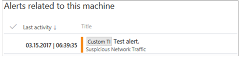

# Experiment with custom threat intelligence (TI) alerts

**Applies to:**

- Windows 10 Enterprise
- Windows 10 Education
- Windows 10 Pro
- Windows 10 Pro Education
- Windows Defender Advanced Threat Protection (Windows Defender ATP)

<span style="color:#ED1C24;">[Some information relates to pre-released product, which may be substantially modified before it's commercially released. Microsoft makes no warranties, express or implied, with respect to the information provided here.]</span>

With the Windows Defender ATP threat intelligence API, you can create custom threat intelligence alerts that can help you keep track of possible attack activities in your organization.  

For more information about threat intelligence concepts, see [Understand threat intelligence concepts](threat-indicator-concepts-windows-defender-advanced-threat-protection.md).

This article demonstrates an end-to-end usage of the threat intelligence API to get you started in using the threat intelligence API.

You'll be guided through sample steps so you can experience how the threat intelligence API feature works. Sample steps include creating alerts definitions and indicators of compromise (IOCs), and examples of how triggered custom TI alerts look like.

## Step 1: Enable the threat intelligence API and obtain authentication details
To use the threat intelligence API feature, you'll need to enable the feature. For more information, see [Enable the custom threat intelligence application](enable-custom-ti-windows-defender-advanced-threat-protection.md).

This step is required to generate security credentials that you need to use while working with the API.

## Step 2: Create a sample alert definition and IOCs
This step will guide you in creating an alert definition and an IOC for a malicious IP.

1. Open a Windows PowerShell ISE.

2. Copy and paste the following PowerShell script. This script will upload a sample alert definition and IOC to Windows Defender ATP which you can use to generate an alert.
  >[!NOTE]
  >Make sure you replace the `authUrl`, `clientId`, and `clientSecret` values with your details which you saved in when you enabled the threat intelligence application.

  [!code[ExampleScript](./code/example-script.ps1#L1-L60)]

3. Run the script and verify that the operation succeeded in the results the window. Wait up to 20 minutes until the new or updated alert definition propagates to the detection engines.

  If you get the exception “The remote server returned an error: (407) Proxy Authentication Required", you need to add the proxy configuration by adding the following code to the PowerShell script.

  ```
  $webclient=New-Object System.Net.WebClient
  $creds=Get-Credential
  $webclient.Proxy.Credentials=$creds
  ```

## Step 3: Simulate a custom TI alert
This step will guide you in simulating an event in connection to a malicious IP that will trigger the Windows Defender ATP custom TI alert.

1. Open a Windows PowerShell ISE in the machine you onboarded to Windows Defender ATP.

2. Type `Invoke-WebRequest 52.184.197.12` in the editor and click **Run**. This call will generate a network communication event to the demo IP that will raise an alert based on the custom alert definition.

  

## Step 4: Explore the custom alert in the portal
This step will guide you in exploring the custom alert in the portal.

1.	Open the [Windows Defender ATP portal](http: /securitycenter.windows.com/) on a browser.

2.	Log in with your Windows Defender ATP credentials.

3.	The dashboard should display the custom TI alert for the victim machine resulting from the simulated attack.

  
