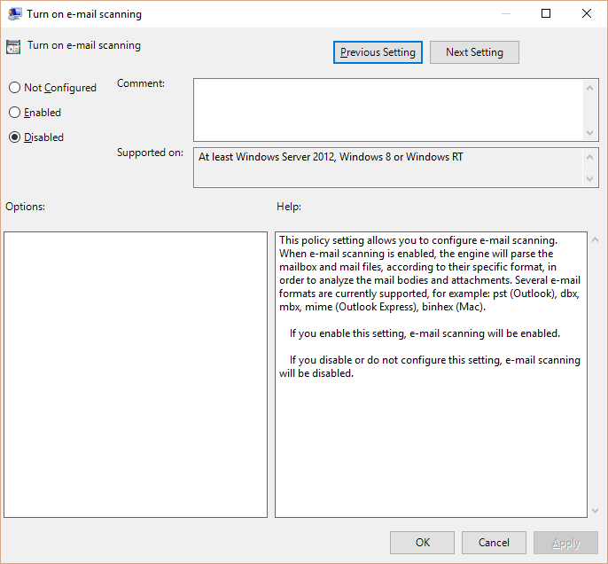
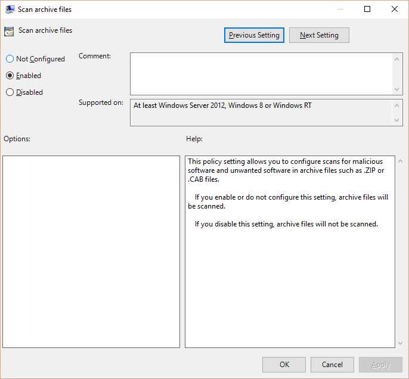
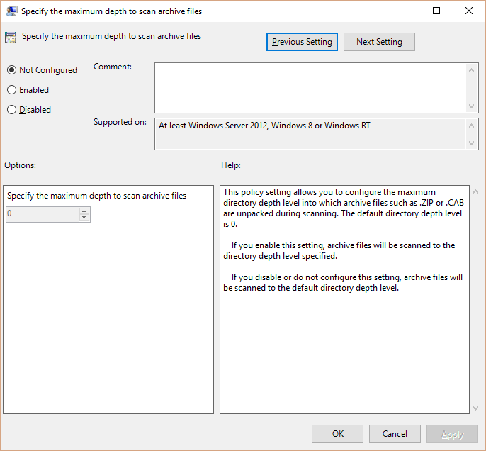
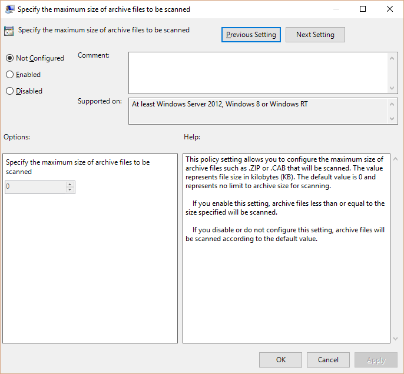
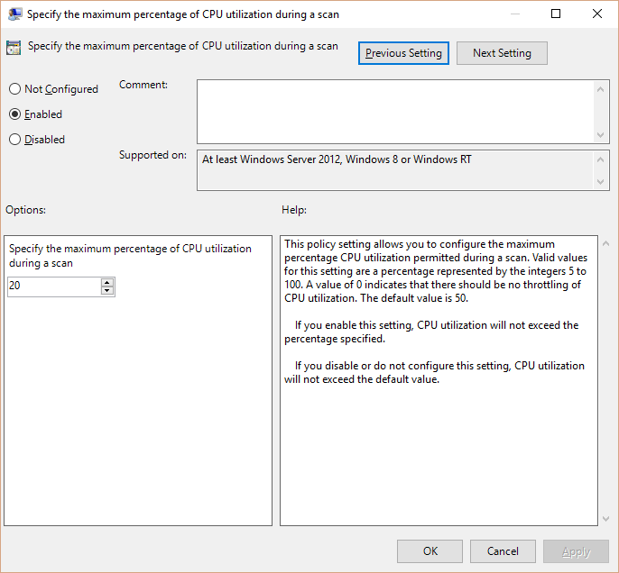

# Update and manage Windows Defender in Windows 10

**Applies to**
-   Windows 10

IT professionals can manage Windows Defender on Windows 10 endpoints in their organization using Microsoft Active Directory or Windows Server Update Services (WSUS), apply updates to endpoints, and manage scans using:

-   Group Policy Settings
-   Windows Management Instrumentation (WMI)
-   PowerShell

## Manage Windows Defender endpoints through Active Directory and WSUS

All Windows 10 endpoints are installed with Windows Defender and include support for management through:
-   Active Directory
-   WSUS

You can use the Active Directory to configure the settings; Group policies can be used for centralized configuration and enforcement of many Windows Defender settings including client user interface, scan settings, and exclusions.
WSUS can be used to view basic update compliance and deploy updates manually or through automatic rules.

Note that System Center 2012 R2 Configuration Manager SP1, System Center 2012 Configuration Manager SP2, and Microsoft Intune can provide centralized management of Windows Defender, including:

-   Settings management
-   Definition update management
-   Alerts and alert management
-   Reports and reporting

When you enable *Endpoint Protection* on your clients, it will install an additional management layer on Windows Defender to manage the in-box Windows Defender agent. While the client user interface will still appear as Windows Defender, the management layer for System Center Endpoint Protection or Intune will be listed in the **Add/Remove Programs** control panel, though it will appear as if the full product is installed. Learn more about managing *Endpoint Protection*:

-   [Help secure Windows PCs with Endpoint Protection for Microsoft Intune](https://technet.microsoft.com/library/dn646970.aspx)
-   [Endpoint Protection in Configuration Manager](https://technet.microsoft.com/library/hh508760.aspx)

Read more about System Center Configuration Manager in [Introduction to Endpoint Protection in Configuration Manager](https://technet.microsoft.com/library/hh508781.aspx).
> **Important:**  You must be licensed to use *Endpoint Protection* to manage clients in your Configuration Manager hierarchy.
 
## Apply updates to Windows Defender endpoints

It is important to keep Windows Defender endpoints updated to ensure they are protected. All Windows Defender updates, including General Distribution Release (GDR) updates, are now applied as operating system updates.
You can manage the distribution of updates through the [Windows Server Update Services (WSUS)](https://technet.microsoft.com/windowsserver/bb332157).

## Manage email scans in Windows Defender

You can use Windows Defender to scan email files. Malware can install itself and hide in email files, and although real-time protection offers you the best protection from email malware, you can also scan emails stored on your PC or server with Windows Defender.
> **Important:**  Mail scanning only applies to on-demand and scheduled scans, not on-access scans.
 
Windows Defender scans Microsoft Office Outlook 2003 and older email files. We identify the file type at run-time based on the content of the file, not on location or extension.
> **Note: **  Scanning email files might increase the time required to complete a scan.
 
Windows Defender can extract embedded objects within a file (attachments and archived files, for example) and scan internally.
> **Note:**  While Windows Defender can be configured to scan email files, it can only remediate threats detected inside certain files, for example:
-   DBX
-   MBX
-   MIME
 
You can configure Windows Defender to scan PST files used by Outlook 2003 or older versions (where the archive type is set to non-uni-code), but Windows Defender cannot remediate threats detected inside PST files. We recommend using real-time protection to protect against email malware.

If Windows Defender detects a threat inside an email, it will show you the following information to assist you in identifying the compromised email, so you can remediate the threat:
-   Email subject
-   Attachment name
Email scanning in Windows Defender is turned off by default. There are three ways you can manage scans through Windows Defender:
-   *Group Policy* settings
-   WMI
-   PowerShell
> **Important:**  There are some risks associated with scanning some Microsoft Outlook files and email messages. You can read about tips and risks associated with scanning Outlook files and email messages in the following articles:
-   [Scanning Outlook files in Outlook 2013](https://technet.microsoft.com/library/dn769141.aspx#bkmk-1)
-   [Scanning email messages in Outlook 2013](https://technet.microsoft.com/library/dn769141.aspx#bkmk-2)
 
## Use *Group Policy* settings to enable email scans

This policy setting allows you to turn on email scanning. When email scanning is enabled, the engine will parse the mailbox and mail files to analyze the mail bodies and attachments.

Turn on email scanning with the following *Group Policy* settings:
1.  Open the **Group Policy Editor**.
2.  In the **Local Computer Policy** tree, expand **Computer Configuration**, then **Administrative Templates**, then **Windows Components**, then **Windows Defender**.
3.  Click **Scan**.
4.  Double-click **Turn on e-mail scanning**.

    This will open the **Turn on e-mail scanning** window:
    
    
    
5.  Select **Enabled**.
6.  Click **OK** to apply changes.

## Use WMI to disable email scans

You can write a WMI script or application to disable email scanning. Read more about [WMI in this article](https://msdn.microsoft.com/library/windows/desktop/dn439477.aspx), and read about [Windows Preference classes in this article](https://msdn.microsoft.com/library/windows/desktop/dn455323.aspx).

Use the **DisableEmailScanning** property of the **MSFT\_MpPreference** class (part of the Windows DefenderWMI provider) to enable or disable this setting:
**DisableEmailScanning**
Data type: **boolean**
Access type: Read-only
Disable email scanning.

## Use PowerShell to enable email scans

You can also enable email scanning using the following PowerShell parameter:
1.  Open PowerShell or PowerShellIntegrated Scripting Environment (ISE).
2.  Type **Set-MpPreference -DisableEmailScanning $false**.

Read more about this in:
-   [Scripting with Windows PowerShell](https://technet.microsoft.com/library/bb978526.aspx)
-   [Defender Cmdlets](https://technet.microsoft.com/library/dn433280.aspx)

## Manage archive scans in Windows Defender

You can use Windows Defender to scan archive files. Malware can install itself and hide in archive files, and although real-time protection offers you the best protection from malware, you can also scan archives stored on your PC or server with Windows Defender.
> **Important:**  Archive scanning only applies to on-demand and scheduled scans, not on-access scans.
 
Archive scanning in Windows Defender is turned on by default. There are four ways you can manage scans through Windows Defender:
-   *Group Policy* settings
-   WMI
-   PowerShell
-   Endpoint Protection
> **Note:**  Scanning archive files might increase the time required to complete a scan.
 
If you exclude an archive file type by using the **Extensions** box, Windows Defender will not scan files with that extension (no matter what the content is), even when you have selected the **Scan archive files** check box. For example, if you exclude .rar files but there’s a .r00 file that’s actually .rar content, it will still be scanned if archive scanning is enabled.

## Use *Group Policy* settings to enable archive scans

This policy setting allows you to turn on archive scanning.

Turn on email scanning with the following *Group Policy* settings:
1.  Open the **Group Policy Editor**.
2.  In the **Local Computer Policy** tree, expand **Computer Configuration**, then **Administrative Templates**, then **Windows Components**, then **Windows Defender**.
3.  Click **Scan**.
4.  Double-click **Scan archive files**.

    This will open the **Scan archive files** window:
    
    
    
5.  Select **Enabled**.
6.  Click **OK** to apply changes.

There are a number of archive scan settings in the **Scan** repository you can configure through *Group Policy*, for example:
-   Maximum directory depth level into which archive files are unpacked during scanning

    
    
-   Maximum size of archive files that will be scanned

    
    
-   Maximum percentage CPU utilization permitted during a scan

    

## Use WMI to disable archive scans

You can write a WMI script or application to disable archive scanning. Read more about [WMI in this article](https://msdn.microsoft.com/library/windows/desktop/dn439477.aspx), and read about [Windows Preference classes in this article](https://msdn.microsoft.com/library/windows/desktop/dn455323.aspx).

Use the **DisableArchiveScanning** property of the **MSFT\_MpPreference** class (part of the Windows DefenderWMI provider) to enable or disable this setting:
**DisableArchiveScanning**
Data type: **boolean**
Access type: Read-only
Disable archive scanning.

## Use PowerShell to enable archive scans

You can also enable archive scanning using the following PowerShell parameter:
1.  Open PowerShell or PowerShellISE.
2.  Type **Set-MpPreference -DisableArchiveScanning $false**.

Read more about this in:
-   [Scripting with Windows PowerShell](https://technet.microsoft.com/library/bb978526.aspx)
-   [Defender Cmdlets](https://technet.microsoft.com/library/dn433280.aspx)

## Use Endpoint Protection to configure archive scans

In Endpoint Protection, you can use the advanced scanning options to configure archive scanning. For more information, see [What are advanced scanning options?](https://technet.microsoft.com/library/ff823807.aspx)

## Related topics

- [Configure Windows Defender in Windows 10](configure-windows-defender-in-windows-10.md)
- [Troubleshoot Windows Defender in Windows 10](troubleshoot-windows-defender-in-windows-10.md)
 
 
