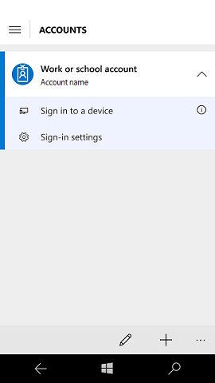

# Enable phone sign-in to PC or VPN

**Applies to**

-   Windows 10
-   Windows 10 Mobile

In Windows 10, version 1607, your network users can use Windows Phone with Windows Hello to sign in to a PC, connect to VPN, and sign in to Office 365 in a browser. Phone sign-in uses Bluetooth, which means no need to wait for a phone call -- just unlock the phone and tap the app.

> [!NOTE]
> Phone sign-in is currently limited to select Technology Adoption Program (TAP) participants.

You can create a Group Policy or mobile device management (MDM) policy that will allow users to sign in to a work PC or their company's VPN using the credentials stored on their Windows 10 phone.

 ## Prerequisites
 
 - Both phone and PC must be running Windows 10, version 1607.
 - The PC must be running Windows 10 Pro, Enterprise, or Education
 - Both phone and PC must have Bluetooth.
 - The **Microsoft Authenticator** app must be installed on the phone.
 - The PC must be joined to an Active Directory domain that is connected to an Azure Active Directory (Azure AD) domain, or the PC must be joined to Azure AD.
 - The phone must be joined to Azure AD or have a work account added.
 - The VPN configuration profile must use certificate-based authentication.
 
## Set policies

To enable phone sign-in, you must enable the following policies using Group Policy or MDM.

-  Group Policy: **Computer Configuration** or **User Configuration** > **Policies** > **Administrative Templates** > **Windows Components** > **Windows Hello for Business**
    - Enable **Use Windows Hello for Business**
    - Enable **Phone Sign-in**
- MDM: 
    - Set **UsePassportForWork** to **True**
    - Set **Remote\UseRemotePassport** to **True**

## Configure VPN 

To enable phone sign-in to VPN, you must enable the [policy](#set-policies) for phone sign-in and ensure that VPN is configured as follows:

- For inbox VPN, set up the VPN profile with Extensible Authentication Protocol (EAP) with the **Smart card or other certificate (TLS)** EAP type, also known as EAP-Transport Level Security (EAP-TLS). To exclusively access the VPN certificates on the phone, in the EAP filtering XML, add either **EKU** or **Issuer** (or both) filtering to make sure it picks only the Remote NGC certificate.
- For a Universal Windows Platform (UWP) VPN plug-in, add filtering criteria based on the 3rd party mechanism for the Remote NGC Certificate.

## Get the app

If you want to distribute the **Microsoft Authenticator** app, your organization must have set up Windows Store for Business, with Microsoft added as a [Line of Business (LOB) publisher](../manage/working-with-line-of-business-apps.md).

[Tell people how to sign in using their phone.](prepare-people-to-use-microsoft-passport.md#bmk-remote)

## Related topics

- [Manage identity verification using Windows Hello for Business](hello-manage-identity-verification.md)
- [How Windows Hello for Business works](hello-how-it-works.md)
- [Implement Windows Hello for Business in your organization](hello-implement-in-organization.md)
- [Why a PIN is better than a password](hello-why-pin-is-better-than-password.md)
- [Prepare people to use Windows Hello](hello-prepare-people-to-use.md)
- [Windows Hello and password changes](hello-and-password-changes.md)
- [Windows Hello errors during PIN creation](hello-errors-during-pin-creation.md)
- [Event ID 300 - Windows Hello successfully created](hello-event-300.md)
- [Windows Hello biometrics in the enterprise](hello-biometrics-in-enterprise.md)

 

 

