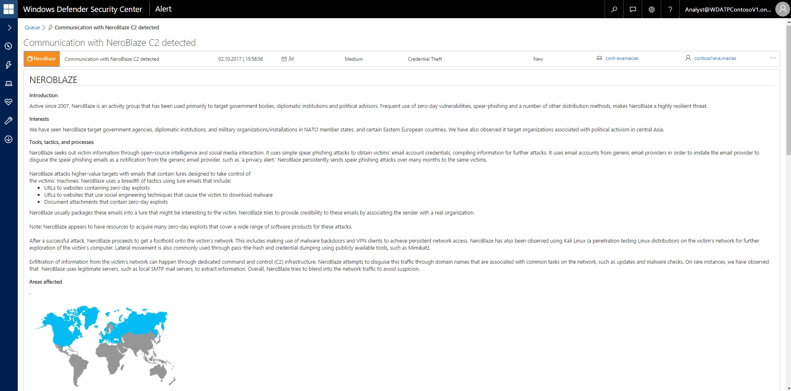
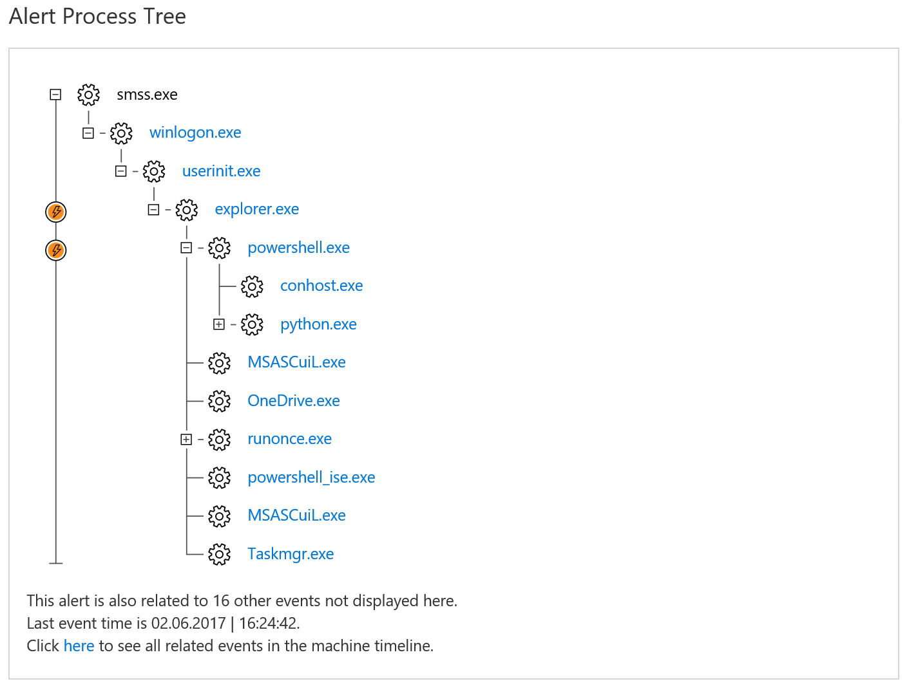
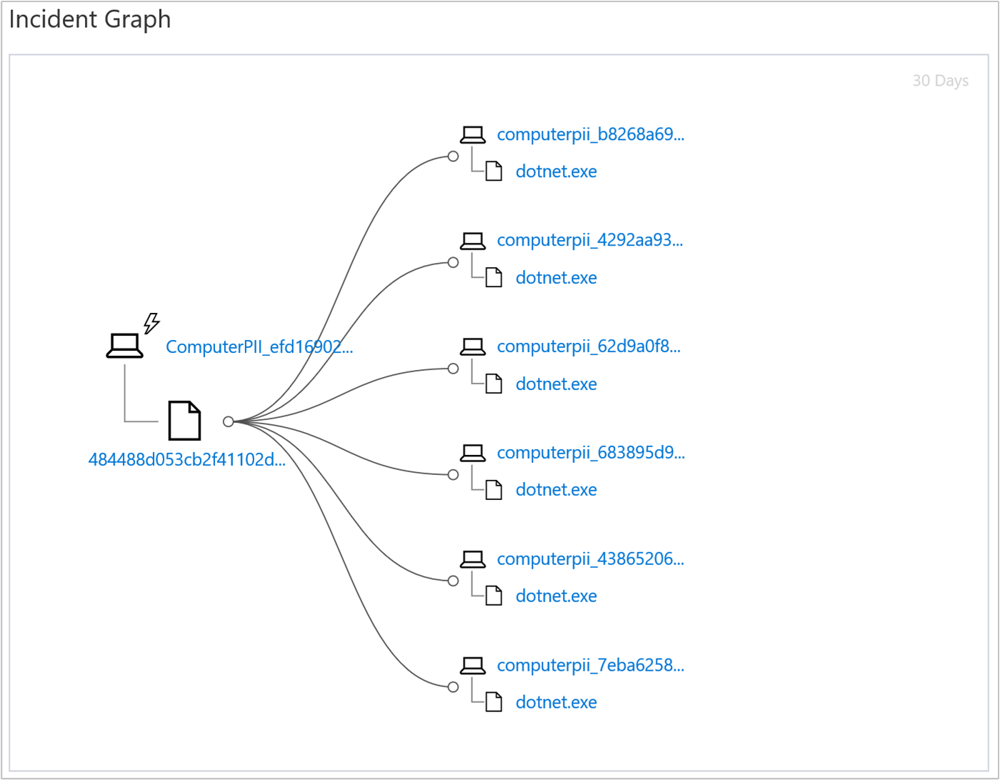
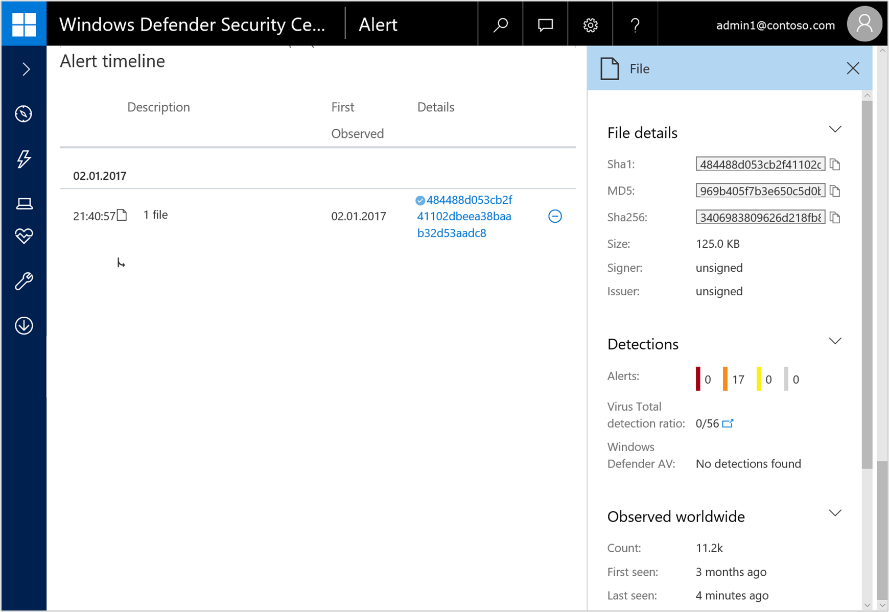

# Investigate Windows Defender Advanced Threat Protection alerts

**Applies to:**

- Windows 10 Enterprise
- Windows 10 Education
- Windows 10 Pro
- Windows 10 Pro Education
- Windows Defender Advanced Threat Protection (Windows Defender ATP)

You can click an alert in any of the [alert queues](alerts-queue-windows-defender-advanced-threat-protection.md) to begin an investigation. Selecting an alert brings up the **Alert management pane**, while clicking an alert brings you the alert details view where general information about the alert, some recommended actions, an alert process tree, an incident graph, and an alert timeline is shown.  

You can click on the machine link from the alert view to navigate to the machine. The alert will be highlighted automatically, and the timeline will display the appearance of the alert and its evidence in the **Machine timeline**. If the alert appeared more than once on the machine, the latest occurrence will be displayed in the **Machine timeline**.

Alerts attributed to an adversary or actor display a colored tile with the actor's name.

Click on the actor's name to see the threat intelligence profile of the actor, including a brief overview of the actor, their interests or targets, their tools, tactics, and processes (TTPs) and areas where they've been observed worldwide. You will also see a set of recommended actions to take.

Some actor profiles include a link to download a more comprehensive threat intelligence report.

The detailed alert profile helps you understand who the attackers are, who they target, what techniques, tools, and procedures (TTPs) they use, which geolocations they are active in, and finally, what recommended actions you may take. In many cases, you can download a more detailed Threat Intelligence report about this attacker or campaign for offline reading.

## Alert process tree
The **Alert process tree** takes alert triage and investigation to the next level, displaying the alert and related evidence and other events that occurred within the same execution context and time. This rich triage context of the alert and surrounding events is available on the alert page.

The **Alert process tree** expands to display the execution path of the alert, its evidence, and related events that occurred in the minutes - before and after - the alert.

The alert and related events or evidence have circles with thunderbolt icons inside them.

>[!NOTE]
>The alert process tree might not be available in some alerts.

Clicking in the circle immediately to the left of the indicator displays the **Alert details** pane where you can take a deeper look at the details about the alert. It displays rich information about the selected process, file, IP address, and other details taken from the entity's page –  while remaining on the alert page, so you never leave the current context of your investigation.  

## Incident graph
The **Incident Graph**  provides a visual representation of the organizational footprint of the alert and its evidence: where the evidence that triggered the alert was observed on other machines. It provides a graphical mapping from the original machine and evidence expanding to show other machines in the organization where the triggering evidence was also observed.

The **Incident Graph**  previously supported expansion by File and Process, and now supports expansion by additional criteria: known processes and Destination IP Address.

The Windows Defender ATP service keeps track of "known processes". Alerts related to known processes mostly include specific command lines, that combined are the basis for the alert. The **Incident Graph** supports expanding known processes with their command line to display other machines where the known process and the same command line were observed.

The **Incident Graph** expansion by destination IP Address, shows the organizational footprint of communications with this IP Address without having to change context by navigating to the IP Address page.

You can click the full circles on the incident graph to expand the nodes and view the expansion to other machines where the matching criteria were observed.

## Alert timeline
The **Alert timeline** feature provides an addition view of the evidence that triggered the alert on the machine, and shows the date and time the evidence triggering the alert was observed, as well as the first time it was observed on the machine. This can help in understanding if the evidence was first observed at the time of the alert, or whether it was observed on the machine earlier - without triggering an alert.

Selecting an alert detail brings up the **Details pane** where you'll be able to see more information about the alert such as file details, detections, instances of it observed worldwide, and in the organization.

## Related topics
- [View the Windows Defender Advanced Threat Protection Dashboard](dashboard-windows-defender-advanced-threat-protection.md)
- [View and organize the Windows Defender Advanced Threat Protection Alerts queue ](alerts-queue-windows-defender-advanced-threat-protection.md)
- [Investigate a file associated with a Windows Defender ATP alert](investigate-files-windows-defender-advanced-threat-protection.md)
- [Investigate an IP address associated with a Windows Defender ATP alert](investigate-ip-windows-defender-advanced-threat-protection.md)
- [Investigate a domain associated with a Windows Defender ATP alert](investigate-domain-windows-defender-advanced-threat-protection.md)
- [View and organize the Windows Defender ATP Machines view](machines-view-overview-windows-defender-advanced-threat-protection.md)
- [Investigate machines in the Windows Defender ATP Machines view](investigate-machines-windows-defender-advanced-threat-protection.md)
- [Investigate a user account in Windows Defender ATP](investigate-user-windows-defender-advanced-threat-protection.md)
- [Manage Windows Defender Advanced Threat Protection alerts](manage-alerts-windows-defender-advanced-threat-protection.md)
- [Take response actions in Windows Defender ATP](response-actions-windows-defender-advanced-threat-protection.md)
