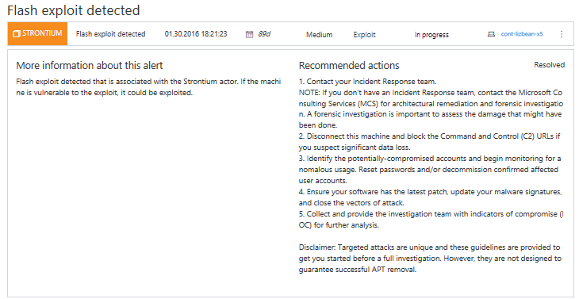

# Investigate Windows Defender Advanced Threat Protection alerts

- Windows 10 Insider Preview

[Some information relates to pre-released product which may be substantially modified before it's commercially released. Microsoft makes no warranties, express or implied, with respect to the information provided here.]

Alerts in Windows Defender ATP indicate possible security breaches on endpoints in your organization.

There are three alert severity levels, described in the following table.

Alert severity | Description
:---|:---
High (Red) | Threats often associated with APT. These alerts pose a high risk due to the severity of the damage they might inflict on endpoints.
Medium (Orange) | Threats considered to be abnormal or suspicious in nature such as anomalous registry modifications and loading of executable files.
Low (Yellow) | Threats associated with prevalent malware and hack-tools that pose a lower risk to endpoints.

Reviewing the various alerts and their severity can help you take the appropriate action to protect your organization's endpoints.

Alerts are organized in three queues, by their workflow status:

- **New**
- **In progress**
- **Resolved**

You can investigate alerts by clicking an alert in [any of the alert queues](alerts-queue-windows-defender-advanced-threat-protection.md).

Details about the alert is displayed such as:
- Alert information such as when it was last observed
- Alert description
- Recommended actions
- The scope of the breach
- The alert timeline

Depending on the type of alert, you click on the name to see a detailed report about the threat. You'll see information such as a brief introduction of the threat, its interests, tools, tactics, and processes, and the areas it affects worldwide.

### Related topics
- [View the Windows Defender Advanced Threat Protection Dashboard](dashboard-windows-defender-advanced-threat-protection.md)
- [View and organize the Windows Defender Advanced Threat Protection Alerts queue](alerts-queue-windows-defender-advanced-threat-protection.md)
- [Investigate machines in the Windows Defender ATP Machines view](machines-view-windows-defender-advanced-threat-protection.md)
- [Investigate a file associated with a Windows Defender ATP alert](investigate-files-windows-defender-advanced-threat-protection.md)
- [Investigate an IP address](investigate-ip-windows-defender-advanced-threat-protection.md)
- [Investigate a domain associated with a Windows Defender ATP alert](investigate-domain-windows-defender-advanced-threat-protection.md)
- [Manage Windows Defender Advanced Threat Protection alerts](manage-alerts-windows-defender-advanced-threat-protection.md)
