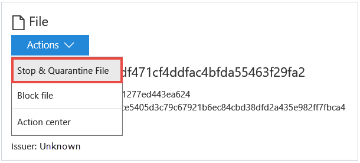
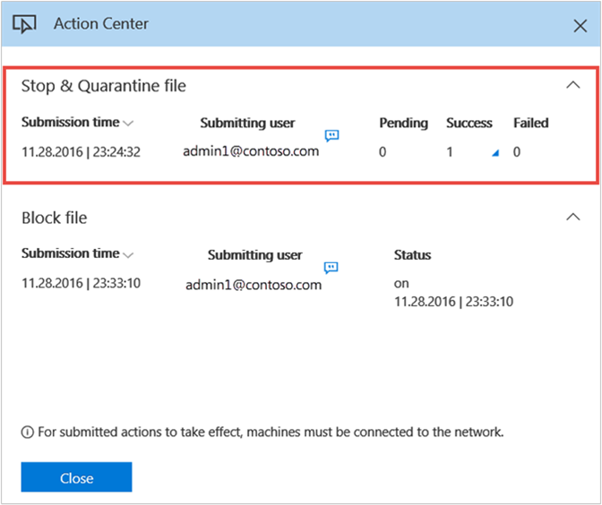
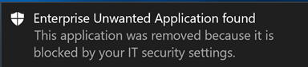
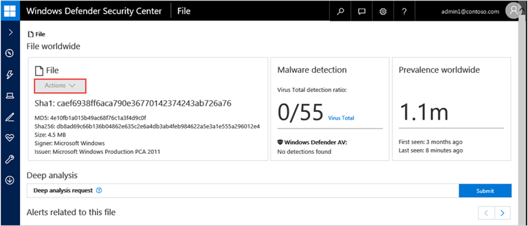
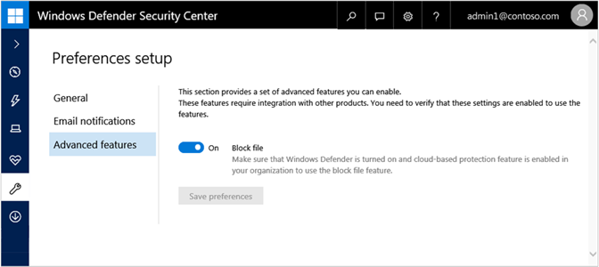
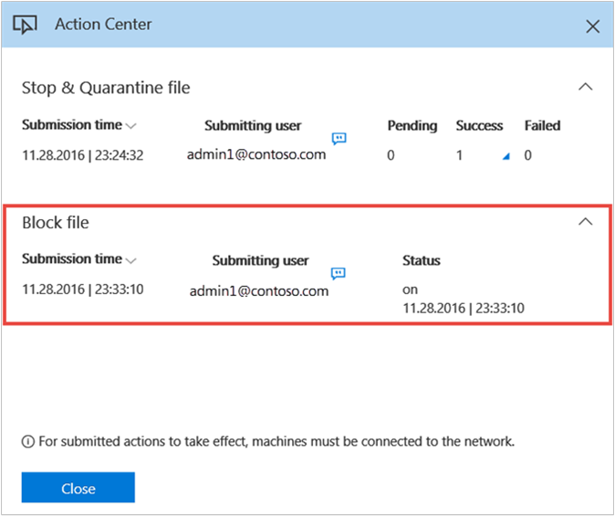
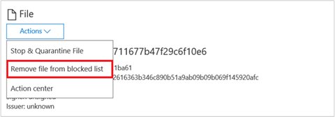

# Investigate a file associated with a Windows Defender ATP alert

**Applies to:**

- Windows 10 Enterprise
- Windows 10 Education
- Windows 10 Pro
- Windows 10 Pro Education
- Windows Defender Advanced Threat Protection (Windows Defender ATP)

<span style="color:#ED1C24;">[Some information relates to pre-released product, which may be substantially modified before it's commercially released. Microsoft makes no warranties, express or implied, with respect to the information provided here.]</span>

Investigate the details of a file associated with a specific alert, behavior, or event to help determine if the file exhibits malicious activities, identify the attack motivation, and understand the potential scope of the breach.

You can get information from the following sections in the file view:

- File details, Malware detection, Prevalence worldwide
-	Deep analysis
-	Alerts related to this file
-	File in organization
-	Most recent observed machines with file


The file details, malware detection, and prevalence worldwide sections display various attributes about the file. You’ll see actions you can take on the file and details such as the file’s MD5, the VirusTotal detection ratio and Windows Defender AV detection if available, and the file’s prevalence worldwide.

The **Alerts related to this file** section provides a list of alerts that are associated with the file. This list is a simplified version of the Alerts queue, and shows the date when the last activity was detected, a short description of the alert, the user associated with the alert, the alert's severity, the alert's status in the queue, and who is addressing the alert.

The **File in organization** section provides details on the prevalence of the file, prevalence in email inboxes and the name observed in the organization.

The **Most recent observed machines with the file** section allows you to specify a date range to see which machines have been observed with the file. This allows for greater accuracy in defining entities to display such as if and when an entity was observed in the organization. For example, if you’re trying to identify the origin of a network communication to a certain IP Address within a 10-minute period on a given date, you can specify that exact time interval, and see only files that communicated with that IP Address at that time, drastically reducing unnecessary scrolling and searching.

## Stop and quarantine files in your network
You can contain an attack in your organization by stopping the malicious process and quarantine the file where it was observed.

The **Stop & Quarantine File** action includes stopping running processes, quarantining the files, and deleting persistency such as registry keys.

The action takes effect on machines with the latest Windows 10 Insider Preview build where the file was observed in the last 30 days.

### Stop and quarantine files
1.	Select the file you want to stop and quarantine. You can select a file from any of the following views or use the Search box:

    - **Alerts** - click the corresponding links from the Description or Details in the Alert timeline
    - **Search box** - select File from the drop-down menu and enter the file name

2.	Open the **Action menu** and select **Stop & Quarantine File**.
    

3. Type a comment (optional), and select **Yes** to take action on the file. The comment will be saved in the Action center for reference.

  The Action center shows the submission information:
    

    -	**Submission time** – Shows when the action was submitted.
    -	**Submitting user** – Shows who submitted the action on the file. You can view the comments provided by the user by selecting the information icon.
    -	**Pending** – Shows the number of machines where the file is yet to be stopped and quarantined from. This can take time for cases when the machine is offline or not connected to the network.
    -	**Success** – Shows the number of machines where the file has been stopped and quarantined.
    -	**Failed** – Shows the number of machines where the action failed and details about the failure.

4. Select any of the status indicators to view more information about the action. For example, select **Failed** to see where the action failed.

**Notification on machine user**:</br>
When the file is being removed from an endpoint, the following notification is shown:



In the machine timeline, a new event is added for each machine where a file was stopped and quarantined.

>[!NOTE]
>The **Action** button is turned off for files signed by Microsoft to prevent negative impact on machines in your organization caused by the removal of files that might be related to the operating system.



For prevalent files in the organization, a warning is shown before an action is implemented to validate that the operation is intended.

### Remove file from quarantine
You can roll back and remove a file from quarantine if you’ve determined that it’s clean after an investigation. Run the following command on each machine where the file was quarantined.

1.	Open an elevated command-line prompt on the endpoint:

    a.	Go to **Start** and type cmd.

    b.	Right-click **Command prompt** and select **Run as administrator**.

2.	Enter the following command, and press **Enter**:
 ```
 “%ProgramFiles%\Windows Defender\MpCmdRun.exe” -Restore -Name EUS:Win32/CustomEnterpriseBlock –All
 ```
    >[!NOTE]
    >Windows Defender ATP will remove all files that were quarantined on this machine in the last 30 days.

## Block files in your network
You can prevent further propagation of an attack in your organization by banning potentially malicious files or suspected malware. If you know a potentially malicious file, you can block it. This operation will prevent it from being read, written, or executed on machines in your organization.

>[!NOTE]
>This feature is only available if your organization uses Windows Defender and Cloud-based protection is enabled.  For more information, see [Manage cloud-based protection](configure-windows-defender-in-windows-10.md). </br></br>
This feature is designed to prevent suspected malware (or potentially malicious files) from being downloaded from the web. The coverage will be extended over time. The action takes effect on machines with the latest Windows 10 Insider Preview build.

### Enable the block file feature
1.	In the navigation pane, select **Preference Setup** > **Advanced features** > **Block file**.

2.	Toggle the setting between **On** and **Off** and select **Save preferences**.

  

3. Type a comment (optional) and select **Yes** to take action on the file.
The Action center shows the submission information:

  

  - **Submission time** – Shows when the action was submitted.
  -	**Submitting user** - Shows who submitted the action on the file. You can view the comments provided by the user by selecting the information icon.
  -	**Status** -Indicates whether the file was added to or removed from the blacklist.

When the file is blocked, there will be a new event in the machine timeline.</br>

**Notification on machine user**:</br>
When a file is being blocked on the endpoint, the following notification is displayed to inform the user that the file was blocked:


>[!NOTE]
>The **Action** button is turned off for files signed by Microsoft to prevent negative impact on machines in your organization caused by the removal of files that might be related to the operating system.


For prevalent files in the organization, a warning is shown before an action is implemented to validate that the operation is intended.

### Remove file from blocked list
1.	Select the file you want to remove from the blocked list. You can select a file from any of the following views or use the Search box:

  -	**Alerts** - Click the file links from the Description or Details in the Alert timeline
  -	**Machines view** - Click the file links in the Description or Details columns in the Observed on machine section
  -	**Search box** - Select File from the drop-down menu and enter the file name

2.	Open the **Actions** menu and select **Remove file from blocked list**.

  

3. Type a comment and select **Yes** to take action on the file. The file will be allowed to run in the organization.

## Isolate files from the network
Depending on the severity of the attack and the sensitivity of the machine, you might want to isolate the machine from the network. This action can help prevent the attacker from controlling the compromised machine and performing further activities such as data exfiltration and lateral movement.

This machine isolation feature disconnects the compromised machine from the network while retaining connectivity to the Windows Defender ATP service, which continues to monitor the machine.

>[!NOTE]
>You’ll be able to reconnect the machine back to the network at any time.

## Isolate machine
1.	Select the machine that you want to isolate. You can select or search for a machine from any of the following views:

  -	**Dashboard** – Select the machine name from the Top machines with active alerts section.
  -	**Alerts queue** - Select the machine name beside the machine icon from the alerts queue.
  -	**Machines view** - Select the machine name from the list of machines.
  -	**Search box** - Select Machine from the drop-down menu and enter the machine name.

2.	Open the **Actions** menu and select **Isolate machine**.

  

3. Type a comment (optional) and select **Yes** to take action on the machine.
  >[!NOTE]
  >The machine will remain connected to the Windows Defender ATP service even if it is isolated from the network.

  The Action center shows the submission information:
  

  -	**Submission time** – Shows when the isolation action was submitted.
  -	**Submitting user** – Shows who submitted the action on the machine. You can view the comments provided by the user by selecting the information icon.
  -	**Status** – Indicates any pending actions or the results of completed actions.

When the isolation configuration is applied, there will be a new event in the machine timeline.

**Notification on machine user**:</br>
When a machine is being isolated, the following notification is displayed to inform the user that the machine is being isolated from the network:


## Undo machine isolation
Depending on the severity of the attack and the state of the machine you can choose to release the machine isolation after you have verified that the compromised machine has been remediated.

1.	Select a machine that was previously isolated.

2.	Open the **Actions** menu and select **Undo machine isolation**.

  

3.	Type a comment (optional) and select **Yes** to take action on the file. The machine will be reconnected to the network.

## Collect an investigation package from a machine
As part of the investigation or response process, you can collect an investigation package from a machine. By collecting the investigation package, you can identify the current state of the machine and further understand the tools and techniques used by the attacker.

You can download the package (Zip file) and investigate the events that occurred on a machine.

The package contains the following folders:

Folder | Description
:---|:---
Autoruns | Contains a set of files that each represent the content of the registry of a known auto start entry point (ASEP) to help identify attacker’s persistency on the machine. </br></br> NOTE: If the registry key is not found, the file will contain the following message: “ERROR: The system was unable to find the specified registry key or value.”
Installed program | This CSV file contains the list of installed program that can help identify what is currently installed on the machine. For more information, see [Win32_Product class](https://go.microsoft.com/fwlink/?linkid=841509).
Network connections | This folder contains a set of data points related to the connectivity information which can help in identifying connectivity to suspicious URLs/attacker’s command & control or any lateral movement/remote connections.</br></br> -	ActiveNetworkConnections.txt – Displays protocol statistics and current TCP/IP network connections. Provides the ability to look for suspicious connectivity made by a process. </br></br> - Arp.txt – Displays the current address resolution protocol (ARP) cache tables for all interfaces. </br> ARP cache can reveal additional hosts on a network that have been compromised or suspicious systems on the network that night have been used to run an internal attack.</br></br> -	Dnscache.txt - Displays the contents of the DNS client resolver cache, which includes both entries preloaded from the local Hosts file and any recently obtained resource records for name queries resolved by the computer. This can help in identifying suspicious connections. </br></br> - Ipconfig.txt – Displays the full TCP/IP configuration for all adapters. Adapters can represent physical interfaces, such as installed network adapters, or logical interfaces, such as dial-up connections.
Prefetch files | Windows Prefetch files are designed to speed up the application startup process. It can be used to track all the files recently used in the system and find traces for applications that might have been deleted but can still be found in the prefetch file list. </br></br> - Prefetch folder –  Contains a copy of the prefetch files from `%SystemRoot%\Prefetch`. NOTE: It is suggested to download a prefetch file viewer to view the prefetch files. </br></br> - PrefetchFilesList.txt – Contains the list of all the copied files which can be used to track if there were any copy failures to the prefetch folder.
Processes | Contains a CSV file listing the running processes which provides the ability to identify current processes running on the machine. This can be useful when identify if there is a suspicious process and its state.
Scheduled tasks | Contains a CSV file listing the scheduled tasks which can be used to identify routines performed automatically on a chosen machine to look for a suspicious code set to run automatically.
Security event log | Contains the security event log which contains records of login/logout activity or other security-related events specified by the system's audit policy. NOTE: Open the event log file using Event viewer.
Services | Contains the services.txt file which lists services and their states.
SMB sessions | Lists shared access to files, printers, and serial ports and miscellaneous communications between nodes on a network. This can help identify data exfiltration or lateral movement. </br></br> Contains files for SMBInboundSessions and SMBOutboundSession. </br></br> NOTE: If the file contains the following message: “ERROR: The system was unable to find the specified registry key or value.”, it means that there were no SMB sessions of this type (inbound or outbound).
Temp Directories | Contains a set of text files that lists the files located in %Temp% for every user in the system. </br></br> This can help to track suspicious files that an attacker may dropped on the system. </br></br> NOTE: If the file contains the following message: “The system cannot find the path specified”, it means that there is no temp directory for this user, and might be because the user didn’t log in to the system.
Users and Groups | Provides a list of files that each represent a group and its members.
CollectionSummaryReport.xls | This file is a summary of the investigation package collection, it contains the list of data points, the command used to extract the data, the execution status, and the error code in case of failure. You can use this report to track if the package includes all the expected data and identify if there were any errors.

## Collect investigation package
1.	Select the machine that you want to investigate. You can select or search for a machine from any of the following views:

  -	**Dashboard** – Select the machine name from the Top machines with active alerts section.
  -	**Alerts queue** – Select the machine name beside the machine icon from the alerts queue.
  -	**Machines view** – Select the heading of the machine name from the machines view.
  -	**Search box** – Select Machine from the drop-down menu and enter the machine name.

2.	Open the **Actions** menu and select **Collect investigation package**.

    The Action center shows the submission information:
    

    - **Submission time** – Shows when the action was submitted.
    -	**Submitting user** - Shows who submitted the action on the file. You can view the comments provided by the user by selecting the information icon.
    -	**Status** - Indicates if the package was successfully collected from the network. When the collection is complete, you can download the package.

3.	Select **Package available** to download the package. </br>
    When the package is available a new event will be added to the machine timeline.</br>
    You can download the package from the machine page, or the Action center.

    

    You can also search for historical packages in the machine timeline.

## Check activity details in Action center
The Action center provides information on actions that were taken on a machine or file. You’ll be able to view the details on the last action that were taken on a file such as stopped and quarantined files or blocked files.

You’ll also be able to view if a machine was isolated and if an investigation package is available from a machine. All related details are also shown, for example, submission time, submitting user, and if the action succeeded or failed.


## Deep analysis
Cyber security investigations are typically triggered by an alert. Alerts are related to one or more observed files that are often new or unknown. Clicking a file takes you to the file view where you can see the file's metadata. To enrich the data related to the file, you can submit the file for deep analysis.

The deep analysis feature executes a file in a secure, fully instrumented cloud environment. Deep analysis results show the file's activities, observed behaviors, and associated artifacts, such as dropped files, registry modifications, and communication with IPs.
Deep analysis currently supports extensive analysis of PE (portable executable) files (including _.exe_ and _.dll_ files).

Deep analysis of a file takes several minutes. When the file analysis is complete, results are made available in the File view page, under a new **Deep analysis summary** section. The summary includes a list of observed *behaviors*, some of which can indicate malicious activity, and *observables*, including contacted IPs and files created on the disk.

Results of deep analysis are matched against threat intelligence and any matches will generate appropriate alerts.

### Submit files for analysis

Use the deep analysis feature to investigate the details of any file, usually during an investigation of an alert or for any other reason where you suspect malicious behavior. This feature is available in the context of the file view.

In the file's page, **Submit for deep analysis** is enabled when the file is available in the Windows Defender ATP backend sample collection or if it was observed on a Windows 10 machine that supports submitting to deep analysis.

> [!NOTE]
> Only files from Windows 10 can be automatically collected.

You can also manually submit a sample through the [Malware Protection Center Portal](https://www.microsoft.com/security/portal/submission/submit.aspx) if the file was not observed on a Windows 10 machine, and wait for **Submit for deep analysis** button to become available.

> [!NOTE]
> Due to backend processing flows in the Malware Protection Center Portal, there could be up to 10 minutes of latency between file submission and availability of the deep analysis feature in Windows Defender ATP.

When the sample is collected, Windows Defender ATP runs the file in is a secure environment and creates a detailed report of observed behaviors and associated artifacts, such as files dropped on machines, communication to IPs, and registry modifications.

**Submit files for deep analysis:**

1. Select the file that you want to submit for deep analysis. You can select or search a file from any of the following views:
  - Alerts - click the file links from the **Description** or **Details** in the Alert timeline
  - **Machines View** - click the file links from the **Description** or **Details** in the **Machine in organization** section
  - Search box - select **File** from the drop-down menu and enter the file name
2. In the **Deep analysis** section of the file view, click **Submit**.


>**Note**&nbsp;&nbsp;Only portable executable (PE) files are supported, including _.exe_ and _.dll_ files

A progress bar is displayed and provides information on the different stages of the analysis. You can then view the report when the analysis is done.

> [!NOTE]
> Depending on machine availability, sample collection time can vary. There is a 3-hour timeout for sample collection. The collection will fail and the operation will abort if there is no online Windows 10 machine reporting at that time. You can re-submit files for deep analysis to get fresh data on the file.

## View deep analysis reports

View the deep analysis report that Windows Defender ATP provides to see the details of the deep analysis that was conducted on the file you submitted. This feature is available in the file view context.

You can view the comprehensive report that provides details on:

- Observed behaviors
- Associated artifacts

The details provided can help you investigate if there are indications of a potential attack.


1. Select the file you submitted for deep analysis.
2. Click **See the report below**. Information on the analysis is displayed.


## Troubleshooting deep analysis

If you encounter a problem when trying to submit a file, try each of the following troubleshooting steps.


1. Ensure the file is a PE. PE files typically have _.exe_ or _.dll_ extensions (executable programs or applications).
2. Ensure the service has access to the file, that it still exists, and has not been corrupted or modified.
3. You can wait a short while and try to submit the file again, in case the queue is full or there was a temporary connection or communication error.
4. Verify the policy setting enables sample collection and try to submit the file again.

  a. Change the following registry entry and values to change the policy on specific endpoints:
 ```
HKLM\SOFTWARE\Policies\Microsoft\Windows Advanced Threat Protection
  Value = 0 - block sample collection
  Value = 1 - allow sample collection
```
5. Change the organizational unit through the Group Policy. For more information, see [Configure with Group Policy](configure-endpoints-gp-windows-defender-advanced-threat-protection.md).
6. If these steps do not resolve the issue, contact [winatp@microsoft.com](mailto:winatp@microsoft.com).

> [!NOTE]
> If the value *AllowSampleCollection* is not available, the client will allow sample collection by default.

### Related topics
- [Understand the Windows Defender Advanced Threat Protection Dashboard](dashboard-windows-defender-advanced-threat-protection.md)
- [Alerts overview](alerts-queue-windows-defender-advanced-threat-protection.md)
- [Investigate Windows Defender Advanced Threat Protection alerts](investigate-alerts-windows-defender-advanced-threat-protection.md)
- [Investigate machines in the Windows Defender ATP Machines view](investigate-machines-windows-defender-advanced-threat-protection.md)
- [Investigate an IP address associated with a Windows Defender ATP alert](investigate-ip-windows-defender-advanced-threat-protection.md)
- [Investigate a domain associated with a Windows Defender ATP alert](investigate-domain-windows-defender-advanced-threat-protection.md)
- [Manage Windows Defender Advanced Threat Protection alerts](manage-alerts-windows-defender-advanced-threat-protection.md)
