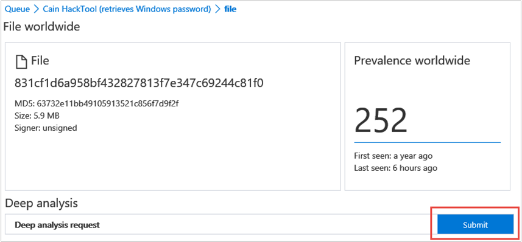

# Investigate a file associated with a Windows Defender ATP alert

**Applies to:**

- Windows 10 Insider Preview Build 14332 or later
- Windows Defender Advanced Threat Protection (Windows Defender ATP)

<span style="color:#ED1C24;">[Some information relates to pre-released product which may be substantially modified before it's commercially released. Microsoft makes no warranties, express or implied, with respect to the information provided here.]</span>

Investigate the details of a file associated with a specific alert, behavior, or event to help determine if the file exhibits malicious activities, identify the attack motivation, and understand the potential scope of the breach.

You can get information from the following sections in the file view:

- File details
- Deep analysis
- File in organization
- Observed in organization

The file details section shows attributes of the file such as its MD5 hash or number and its prevalence worldwide.

The **Deep analysis** section provides the option of submitting a file for deep analysis to gain detailed visibility on observed suspicious behaviors, and associated artifacts. For more information on submitting files for deep analysis, see the **Deep analysis** topic.

The **File in organization** section provides details on the prevalence of the file and the name observed in the organization.

The **Observed in organization** section provides a chronological view on the events and associated alerts that were observed on the file.

You'll see a list of machines associated with the file and a description of the action taken by the file.

**Investigate a file**

1. Select the file you want to investigate. You can select a file from any of the following views or use the Search box:
  - Alerts - click the file links from the **Description** or **Details** in the Alert timeline
  - Machines view - click the file links in the **Description** or **Details** columns in the **Observed on machine** section
  - Search box - select **File** from the drop-down menu and enter the file name
2. View the file details.
3. Use the search filters to define the search criteria. You can also use the timeline search box to further filter displayed search results.

##Deep analysis
Cyber security investigations are typically triggered by an alert. Alerts are related to one or more observed files that are often new or unknown. Clicking a file takes you to the file view where you can see the file's metadata. To enrich the data related to the file, you can submit the file for deep analysis.

The deep analysis feature executes a file in a secure, fully instrumented cloud environment. Deep analysis results show the file's activities, observed behaviors, and associated artifacts, such as dropped files, registry modifications, and communication with IPs.
Deep analysis currently supports extensive analysis of PE (portable executable) files (including _.exe_ and _.dll_ files).

Deep analysis of a file takes several minutes. When the file analysis is complete, results are made available in the File view page, under a new **Deep analysis summary** section. The summary includes a list of observed *behaviors*, some of which can indicate malicious activity, and *observables*, including contacted IPs and files created on the disk.

Results of deep analysis are matched against threat intelligence and any matches will generate appropriate alerts.

## Submit files for analysis

Use the deep analysis feature to investigate the details of any file, usually during an investigation of an alert or for any other reason where you suspect malicious behavior. This feature is available in the context of the file view.

In the file's page, **Submit for deep analysis** is enabled when the file is available in the Windows Defender ATP backend sample collection or if it was observed on a Windows 10 machine that supports submitting to deep analysis.

> **Note**&nbsp;&nbsp;Only files from Windows 10 can be automatically collected.

You can also manually submit a sample through the [Malware Protection Center Portal](https://www.microsoft.com/en-us/security/portal/submission/submit.aspx) if the file was not observed on a Windows 10 machine, and wait for **Submit for deep analysis** button to become available.

> **Note**&nbsp;&nbsp;Due to backend processing flows in the Malware Protection Center Portal, there could be up to 10 minutes of latency between file submission and availability of the deep analysis feature in Windows Defender ATP.

When the sample is collected, Windows Defender ATP runs the file in is a secure environment and creates a detailed report of observed behaviors and associated artifacts, such as files dropped on machines, communication to IPs, and registry modifications.

**Submit files for deep analysis:**

1. Select the file that you want to submit for deep analysis. You can select or search a file from any of the following views:
  - Alerts - click the file links from the **Description** or **Details** in the Alert timeline
  - **Machines View** - click the file links from the **Description** or **Details** in the **Machine in organization** section
  - Search box - select **File** from the drop-down menu and enter the file name
2. In the **Deep analysis** section of the file view, click **Submit**.



>**Note**&nbsp;&nbsp;Only portable executable (PE) files are supported, including _.exe_ and _.dll_ files

A progress bar is displayed and provides information on the different stages of the analysis. You can then view the report when the analysis is done.

> **Note**&nbsp;&nbsp;Depending on machine availability, sample collection time can vary. There is a 1-hour timeout for sample collection. The collection will fail and the operation will abort if there is no online Windows 10 machine reporting at that time. You can re-submit files for deep analysis to get fresh data on the file.

## View deep analysis report

View the deep analysis report that Windows Defender ATP provides to see the details of the deep analysis that was conducted on the file you submitted. This feature is available in the file view context.

You can view the comprehensive report that provides details on:

- Observed behaviors
- Associated artifacts

The details provided can help you investigate if there are indications of a potential attack.

**View deep analysis reports:**

1. Select the file you submitted for deep analysis.
2. Click **See the report below**. Information on the analysis is displayed.


## Troubleshooting deep analysis

If you encounter a problem when trying to submit a file, try each of the following troubleshooting steps.

**Troubleshoot deep analysis:**

1. Ensure the file is a PE. PE files typically have _.exe_ or _.dll_ extensions (executable programs or applications).
2. Ensure the service has access to the file, that it still exists, and has not been corrupted or modified.
3. You can wait a short while and try to submit the file again, in case the queue is full or there was a temporary connection or communication error.
4. Verify the policy setting enables sample collection and try to submit the file again.

  a. Change the following registry entry and values to change the policy on specific endpoints:
 ```
HKLM\SOFTWARE\Policies\Microsoft\Sense\AllowSampleCollection
  Value = 0 - block sample collection
  Value = 1 - allow sample collection
```
5. Change the organizational unit through the Group Policy. See [Configure with Group Policy](additional-configuration-windows-defender-advanced-threat-protection.md#configure-with-group-policy).
6. If these steps do not resolve the issue, contact [winatp@microsoft.com](mailto:winatp@microsoft.com).

> **Note**&nbsp;&nbsp;If the value *AllowSampleCollection* is not available, the client will allow sample collection by default.

### Related topics
- [View the Windows Defender Advanced Threat Protection Dashboard](dashboard-windows-defender-advanced-threat-protection.md)
- [View and organize the Windows Defender Advanced Threat Protection Alerts queue](alerts-queue-windows-defender-advanced-threat-protection.md)
- [Investigate Windows Defender Advanced Threat Protection alerts](investigate-alerts-windows-defender-advanced-threat-protection.md)
- [Investigate machines in the Windows Defender ATP Machines view](investigate-machines-windows-defender-advanced-threat-protection.md)
- [Investigate an IP address associated with a Windows Defender ATP alert](investigate-ip-windows-defender-advanced-threat-protection.md)
- [Investigate a domain associated with a Windows Defender ATP alert](investigate-domain-windows-defender-advanced-threat-protection.md)
- [Manage Windows Defender Advanced Threat Protection alerts](manage-alerts-windows-defender-advanced-threat-protection.md)
