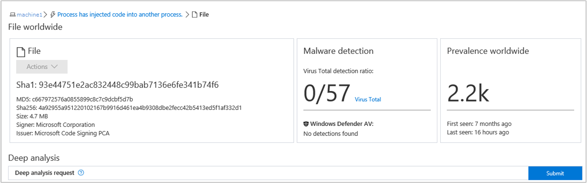
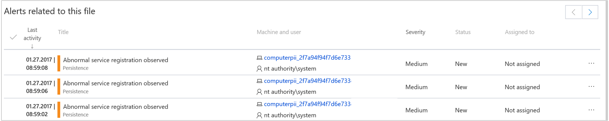
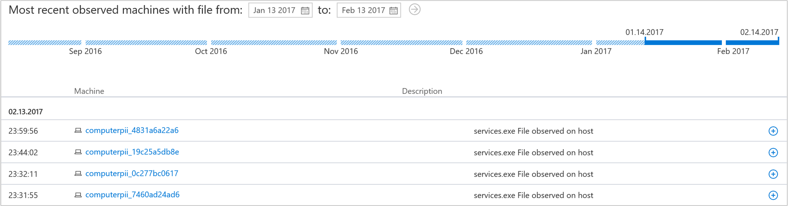

# Investigate a file associated with a Windows Defender ATP alert

**Applies to:**

- Windows 10 Enterprise
- Windows 10 Education
- Windows 10 Pro
- Windows 10 Pro Education
- Windows Defender Advanced Threat Protection (Windows Defender ATP)

[Some information relates to pre-released product, which may be substantially modified before it's commercially released. Microsoft makes no warranties, express or implied, with respect to the information provided here.]

Investigate the details of a file associated with a specific alert, behavior, or event to help determine if the file exhibits malicious activities, identify the attack motivation, and understand the potential scope of the breach.

You can get information from the following sections in the file view:

- File details, Malware detection, Prevalence worldwide
-	Deep analysis
-	Alerts related to this file
-	File in organization
-	Most recent observed machines with file

The file details, malware detection, and prevalence worldwide sections display various attributes about the file. You’ll see actions you can take on the file and details such as the file’s MD5, the VirusTotal detection ratio and Windows Defender AV detection if available, and the file’s prevalence worldwide. You'll also be able to [submit a file for deep analysis](respond-file-alerts-windows-defender-advanced-threat-protection.md#deep-analysis).

The **Alerts related to this file** section provides a list of alerts that are associated with the file. This list is a simplified version of the Alerts queue, and shows the date when the last activity was detected, a short description of the alert, the user associated with the alert, the alert's severity, the alert's status in the queue, and who is addressing the alert.

The **File in organization** section provides details on the prevalence of the file, prevalence in email inboxes and the name observed in the organization.

The **Most recent observed machines with the file** section allows you to specify a date range to see which machines have been observed with the file.

This allows for greater accuracy in defining entities to display such as if and when an entity was observed in the organization. For example, if you’re trying to identify the origin of a network communication to a certain IP Address within a 10-minute period on a given date, you can specify that exact time interval, and see only files that communicated with that IP Address at that time, drastically reducing unnecessary scrolling and searching.
