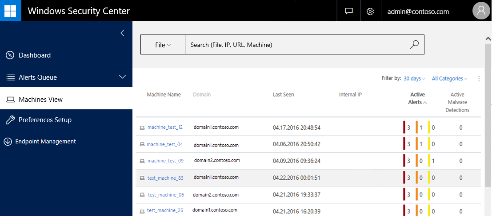
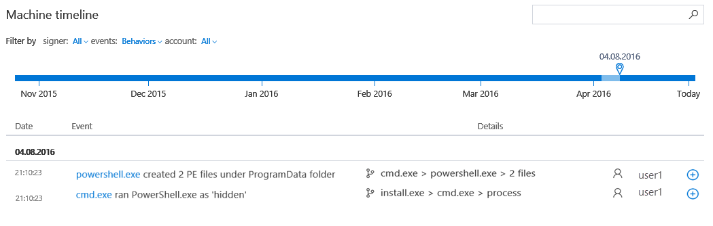
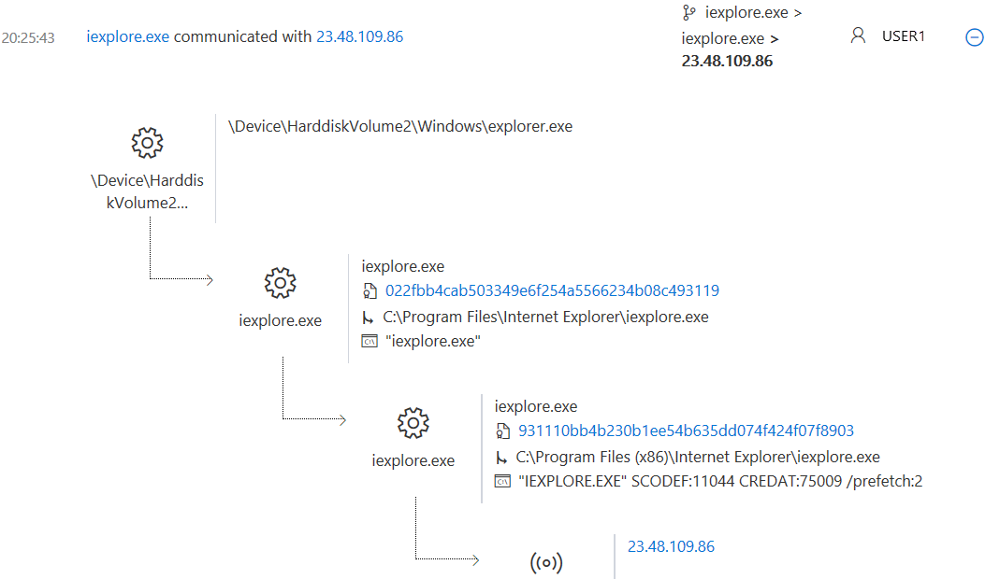

# Investigate machines in the Windows Defender ATP Machines view

**Applies to:**

- Windows 10 Insider Preview

[Some information relates to pre-released product which may be substantially modified before it's commercially released. Microsoft makes no warranties, express or implied, with respect to the information provided here.]

The **Machines view** shows a list of the machines in your network, the corresponding number of active alerts for each machine categorized by alert severity levels, and the number of active malware detections. This view allows you to identify machines with the highest risk at a glance, and keep track of all the machines that are reporting telemetry in your network.

Use the Machines view in these two main scenarios:

- **During onboarding**
  - During the onboarding process, the Machines view gradually gets populated with endpoints as they begin to report telemetry. Use this view to track your onboarded endpoints as they appear. Use the available features to sort and filer to see which endpoints have most recently reported telemetry, or download the complete endpoint list as a CSV file for offline analysis.
- **Day-to-day work**
  - The **Machines view** enables you to identify machines that are most at risk in a glance. High-risk machines are those with the greatest number and highest-severity alerts. By sorting the machines by risk, you'll be able to identify the most vulnerable machines and take action on them.

The Machines view contains the following columns:

- **Machine name** - the name or GUID of the machine
- **Domain** - the domain the machine belongs to
- **Last seen** - when the machine last reported telemetry
- **Internal IP** - the local internal Internet Protocol (IP) address of the machine
- **Active Alerts** - the number of alerts reported by the machine by severity
- **Active malware detections** - the number of active malware detections reported by the machine

> **Note**&nbsp;&nbsp;The **Active alerts** and **Active malware detections** filter column will only appear if your endpoints are using [Windows Defender](https://technet.microsoft.com/en-us/library/mt622091(v=vs.85).aspx) as the default real-time protection antimalware product.

Click any column header to sort the view in ascending or descending order.

You can sort the **Machines view** by **Machine name**, **Last seen**, **IP**, **Active Alerts**, and **Active malware detections**. Scroll down the **Machines view** to see additional machines.

The view contains two filters: time and threat category.

You can filter the view by the following time periods:

- 1 day
- 3 days
- 7 days
- 30 days
- 6 months

> **Note**&nbsp;&nbsp;When you select a time period, the list will only display machines that reported within the selected time period. For example, selecting 1 day will only display a list of machines that reported telemetry within the last 24-hour period.

The threat category filter lets you filter the view by the following categories:

- Password stealer
- Ransomware
- Exploit
- Threat
- Low severity

See the [Investigate machines with active alerts](dashboard-windows-defender-advanced-threat-protection.md#investigate-machines-with-active-malware-detections) topic for a description of each category.

You can also download a full list of all the machines in your organization, in CSV format. Click the **Manage Alert** menu icon  to download the entire list as a CSV file.

 **Note**: Exporting the list depends on the number of machines in your organization. It can take a significant amount of time to download, depending on how large your organization is.
Exporting the list in CSV format displays the data in an unfiltered manner. The CSV file will include all machines in the organization, regardless of any filtering applied in the view itself.

## Investigate a machine
Investigate the details of an alert raised on a specific machine to identify other behaviors or events that might be related to the alert or the potential scope of breach.

You can click on affected machines whenever you see them in the portal to open a detailed report about that machine. Affected machines are identified in the following areas:

- The [Machines view](#Investigate-machines-in-the-Windows-Defender-ATP-Machines-view)
- The [Alerts queue](alerts-queue-windows-defender-advanced-threat-protection.md)
- The [Dashboard](dashboard-windows-defender-advanced-threat-protection.md)
- Any individual alert
- Any individual file details view
- Any IP address or domain details view

When you investigate a specific machine, you'll see:

- **Machine details**, **Machine IP Addresses**, and **Machine Reporting**
- **Alerts related to this machine**
- **Machine timeline**

The machine details, IP, and reporting sections display some attributes of the machine such as its name, domain, OS, IP address, and how long it's been reporting telemetry to the Windows Defender Advanced Threat Protection service.

The **Alerts related to this machine** section provides a list of alerts that are associated with the machine. This list is a simplified version of the [Alerts queue](alerts-queue-windows-defender-advanced-threat-protection.md), and shows the date that the alert was detected, a short description of the alert, the alert's severity, the alert's threat category, and the alert's status in the queue.

The **Machine timeline** section provides a chronological view of the events and associated alerts that have been observed on the machine.

You'll see an aggregated view of alerts, a short description of the alert, details on the action taken, and which user ran the action. This helps you see significant activities or behaviors that occurred on a machine within your network in relation to a specific time frame. Several icons are used to identify various detections and their current state. For more information, see [Windows Defender ATP icons](portal-overview-windows-defender-advanced-threat-protection.md#windows-defender-atp-icons).

This feature also enables you to selectively drill down into a behavior or event that occurred within a given time period. You can view the temporal sequence of events that occurred on a machine over a specified time period.

Use the search bar to look for specific alerts or files associated with the machine.

You can also filter by:

- Signed or unsigned files
- Detections mode: displays Windows ATP Alerts and detections
- Behaviors mode: displays "detections" and selected events of interest
- Verbose mode: displays "behaviors" (including "detections"), and all reported events
- Logged on users, System, Network, or Local service

Use the time-based slider to filter events from a specific date. By default, the machine timeline is set to display the events of the current day.

Using the slider updates the listed alerts to the date that you select. Displayed events are filtered from that date and older.

The slider is helpful when you're investigating a particular alert on a machine. You can navigate from the **Alerts view** and click on the machine associated with the alert to jump to the specific date when the alert was observed, enabling you to investigate the events that took place around the alert.

From the **Machine view**, you can also navigate to the file, IP, or URL view and the timeline associated with an alert is retained, helping you view the investigation from different angles and retain the context of the event time line.

From the list of events that are displayed in the timeline, you can examine the behaviors or events in to help identify indicators of interests such as files and IP addresses to help determine the scope of a breach. You can then use the information to respond to events and keep your system secure.

Windows Defender ATP monitors and captures questionable behavior on Windows 10 machines and displays the process tree flow in the **Machine timeline**. This gives you better context of the behavior which can contribute to understanding the correlation between events, files, and IP addresses in relation to the machine.

**Investigate a machine:**

1. Select the machine that you want to investigate. You can select or search a machine from any of the following views:
  - **Dashboard** - click the machine name from the **Top machines with active alerts** section
  - **Alerts queue** - click the machine name beside the machine icon
  - **Machines view** - click the heading of the machine name
  - **Search box** - select **Machine** from the drop-down menu and enter the machine name
2. Information about the specific machine is displayed.

**Use the machine timeline**

1. Use the sort and filter feature to narrow down the search results.
2. Use the timeline search box to filter specific indicators that appear in the machine timeline.
3. Click the expand icon  in the timeline row or click anywhere on the row to see additional information about the alert, behavior, or event.

### Related topics
- [View the Windows Defender Advanced Threat Protection Dashboard](dashboard-windows-defender-advanced-threat-protection.md)
- [View and organize the Windows Defender Advanced Threat Protection Alerts queue](alerts-queue-windows-defender-advanced-threat-protection.md)
- [Investigate Windows Defender Advanced Threat Protection alerts](investigate-alerts-windows-defender-advanced-threat-protection.md)
- [Investigate a file associated with a Windows Defender ATP alert](investigate-files-windows-defender-advanced-threat-protection.md)
- [Investigate an IP address associated with a Windows Defender ATP alert](investigate-ip-windows-defender-advanced-threat-protection.md)
- [Investigate a domain associated with a Windows Defender ATP alert](investigate-domain-windows-defender-advanced-threat-protection.md)
- [Manage Windows Defender Advanced Threat Protection alerts](manage-alerts-windows-defender-advanced-threat-protection.md)
