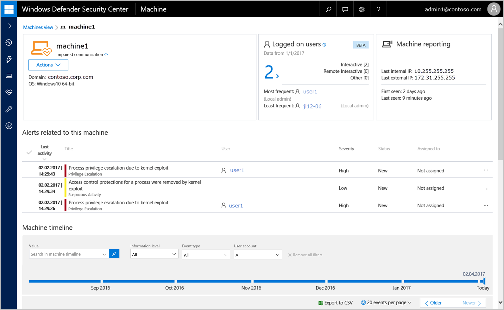
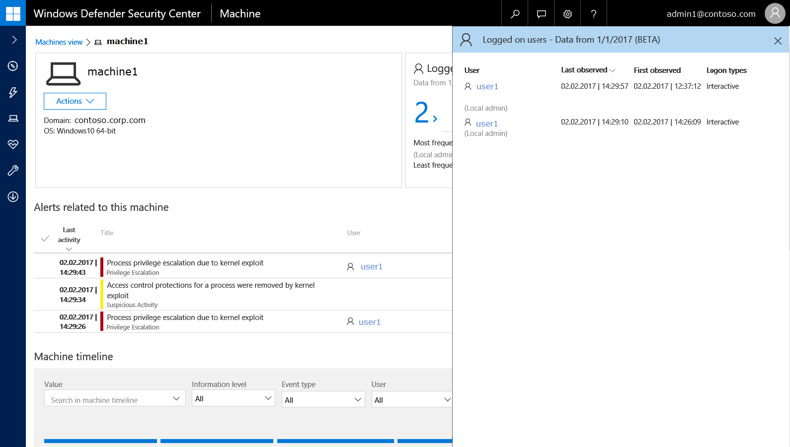
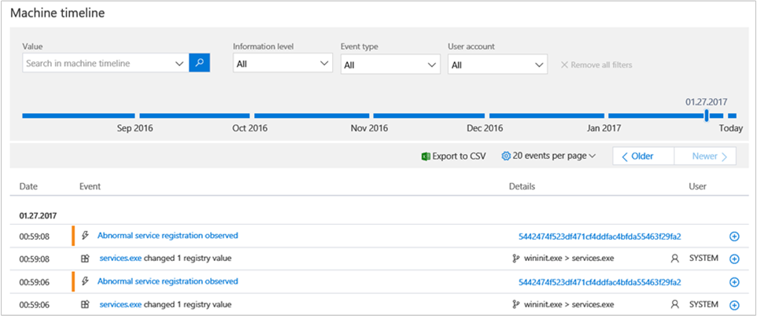
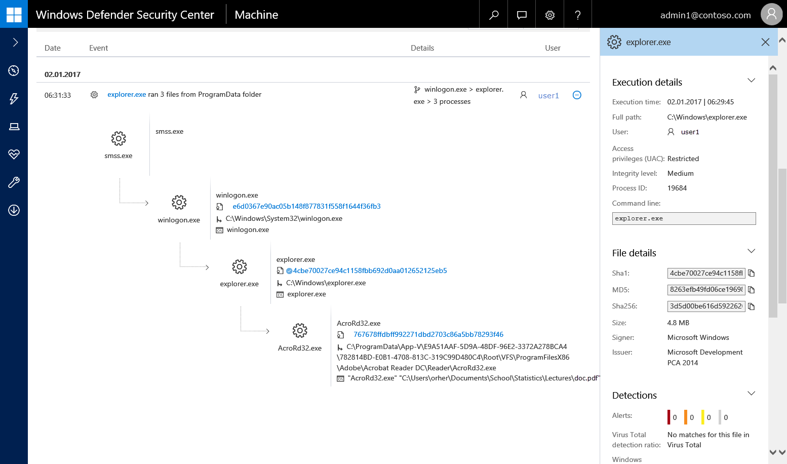
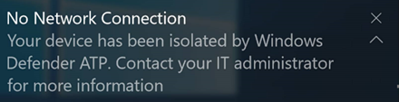

# Investigate machines in the Windows Defender ATP Machines view

**Applies to:**

- Windows 10 Enterprise
- Windows 10 Education
- Windows 10 Pro
- Windows 10 Pro Education
- Windows Defender Advanced Threat Protection (Windows Defender ATP)

[Some information relates to pre-released product, which may be substantially modified before it's commercially released. Microsoft makes no warranties, express or implied, with respect to the information provided here.]

## Investigate machines
Investigate the details of an alert raised on a specific machine to identify other behaviors or events that might be related to the alert or the potential scope of breach.

You can click on affected machines whenever you see them in the portal to open a detailed report about that machine. Affected machines are identified in the following areas:

- The [Machines view](investigate-machines-windows-defender-advanced-threat-protection.md)
- The [Alerts queue](alerts-queue-windows-defender-advanced-threat-protection.md)
- The [Dashboard](dashboard-windows-defender-advanced-threat-protection.md)
- Any individual alert
- Any individual file details view
- Any IP address or domain details view

When you investigate a specific machine, you'll see:
-	Machine details, Logged on user, and Machine Reporting
- Alerts related to this machine
- Machine timeline

The machine details, total logged on users and machine reporting sections display various attributes about the machine. You’ll see details such as machine name, health status, actions you can take on the machine, domain, operating system (OS), total logged on users and who frequently and less frequently logged on, IP address, and how long it's been reporting sensor data to the Windows Defender ATP service.

Clicking on the number of total logged on users in the Logged on user tile opens the Users Details pane that displays the following information for logged on users in the past 30 days:

-	User account domain\\user account name
-	Date and time they were last observed on the machine
-	Date and time they were first observed on the machine

 For more information, see [Investigate user entities](investigate-user-entity-windows-defender-advanced-threat-protection.md).

The **Alerts related to this machine** section provides a list of alerts that are associated with the machine. This list is a simplified version of the [Alerts queue](alerts-queue-windows-defender-advanced-threat-protection.md), and shows the date when the last activity was detected, a short description of the alert, the user associated with the alert, the alert's severity, the alert's status in the queue, and who is addressing the alert.

The **Machine timeline** section provides a chronological view of the events and associated alerts that have been observed on the machine.

This feature also enables you to selectively drill down into events that occurred within a given time period. You can view the temporal sequence of events that occurred on a machine over a specified time period.

Windows Defender ATP monitors and captures questionable behavior on Windows 10 machines and displays the process tree flow in the **Machine timeline**. This gives you better context of the behavior which can contribute to understanding the correlation between events, files, and IP addresses in relation to the machine.

### Search for specific alerts
Use the search bar to look for specific alerts or files associated with the machine:

-	**Value** – Type in any search keyword to filter the timeline with the attribute you’re searching for.
-	**Informational level** – Click the drop-down button to filter by the following levels:
  - **Detections mode**: displays Windows ATP Alerts and detections
  -	**Behaviors mode**: displays "detections" and selected events of interest
  -	**Verbose mode**: displays "behaviors" (including "detections"), and all reported events
-	**User** – Click the drop-down button to filter the machine timeline by the following users associated to an action taken that triggered an alert:
  -	Logon users
  -	System
  -	Network
  -	Local service

### Filter events from a specific date
Use the time-based slider to filter events from a specific date. By default, the machine timeline is set to display the events of the current day.

Using the slider updates the listed alerts to the date that you select. Displayed events are filtered from that date and older.

The slider is helpful when you're investigating a particular alert on a machine. You can navigate from the **Alerts view** and click on the machine associated with the alert to jump to the specific date when the alert was observed, enabling you to investigate the events that took place around the alert.

### Export machine timeline events
You can also export detailed event data from the machine timeline to conduct offline analysis. You can choose to export the machine timeline for the current date or specify a date range. You can export up to seven days of data and specify the specific time between the two dates.

### Navigate between pages
Use the events per page drop-down to choose the number of alerts you’d like to see on the page. You can choose to display 20, 50, or 100 events per page. You can also move between pages by clicking **Older** or **Newer**.

From the **Machines view**, you can also navigate to the file, IP, or URL view and the timeline associated with an alert is retained, helping you view the investigation from different angles and retain the context of the event time line.

From the list of events that are displayed in the timeline, you can examine the behaviors or events in to help identify indicators of interests such as files and IP addresses to help determine the scope of a breach. You can then use the information to respond to events and keep your system secure.

You can also use the [Alerts spotlight](investigate-alerts-windows-defender-advanced-threat-protection.md#alert-timeline) feature to see the correlation between alerts and events on a specific machine.

Expand an event to view associated processes related to the event. Click on the circle next to any process or IP address in the process tree to investigating further into the identified processes. This action brings up the **Details pane** which includes execution context of processes, network communications and a summary of metadata on the file or IP address.

This enhances the ‘in-context’ information across investigation and exploration activities, reducing the need to switch between contexts. It lets you focus on the task of tracing associations between attributes without leaving the current context.

## Isolate machines from the network
Depending on the severity of the attack and the sensitivity of the machine, you might want to isolate the machine from the network. This action can help prevent the attacker from controlling the compromised machine and performing further activities such as data exfiltration and lateral movement.

This machine isolation feature disconnects the compromised machine from the network while retaining connectivity to the Windows Defender ATP service, which continues to monitor the machine.

>[!NOTE]
>You’ll be able to reconnect the machine back to the network at any time.

1.	Select the machine that you want to isolate. You can select or search for a machine from any of the following views:

  -	**Dashboard** – Select the machine name from the Top machines with active alerts section.
  -	**Alerts queue** - Select the machine name beside the machine icon from the alerts queue.
  -	**Machines view** - Select the machine name from the list of machines.
  -	**Search box** - Select Machine from the drop-down menu and enter the machine name.

2.	Open the **Actions** menu and select **Isolate machine**.

  

3. Type a comment (optional) and select **Yes** to take action on the machine.
  >[!NOTE]
  >The machine will remain connected to the Windows Defender ATP service even if it is isolated from the network.

  The Action center shows the submission information:
  

  -	**Submission time** – Shows when the isolation action was submitted.
  -	**Submitting user** – Shows who submitted the action on the machine. You can view the comments provided by the user by selecting the information icon.
  -	**Status** – Indicates any pending actions or the results of completed actions.

When the isolation configuration is applied, there will be a new event in the machine timeline.

**Notification on machine user**: 
When a machine is being isolated, the following notification is displayed to inform the user that the machine is being isolated from the network:

## Undo machine isolation
Depending on the severity of the attack and the state of the machine you can choose to release the machine isolation after you have verified that the compromised machine has been remediated.

1.	Select a machine that was previously isolated.

2.	Open the **Actions** menu and select **Undo machine isolation**.

  

3.	Type a comment (optional) and select **Yes** to take action on the file. The machine will be reconnected to the network.

## Collect investigation package from machines
As part of the investigation or response process, you can collect an investigation package from a machine. By collecting the investigation package, you can identify the current state of the machine and further understand the tools and techniques used by the attacker.

You can download the package (Zip file) and investigate the events that occurred on a machine.

The package contains the following folders:

Folder | Description
:---|:---
Autoruns | Contains a set of files that each represent the content of the registry of a known auto start entry point (ASEP) to help identify attacker’s persistency on the machine.    NOTE: If the registry key is not found, the file will contain the following message: “ERROR: The system was unable to find the specified registry key or value.”
Installed program | This CSV file contains the list of installed program that can help identify what is currently installed on the machine. For more information, see [Win32_Product class](https://go.microsoft.com/fwlink/?linkid=841509).
Network connections | This folder contains a set of data points related to the connectivity information which can help in identifying connectivity to suspicious URLs, attacker’s command and control (C&C) infrastructure, any lateral movement, or remote connections.   -	ActiveNetworkConnections.txt – Displays protocol statistics and current TCP/IP network connections. Provides the ability to look for suspicious connectivity made by a process.    - Arp.txt – Displays the current address resolution protocol (ARP) cache tables for all interfaces.    ARP cache can reveal additional hosts on a network that have been compromised or suspicious systems on the network that night have been used to run an internal attack.   -	Dnscache.txt - Displays the contents of the DNS client resolver cache, which includes both entries preloaded from the local Hosts file and any recently obtained resource records for name queries resolved by the computer. This can help in identifying suspicious connections.    - Ipconfig.txt – Displays the full TCP/IP configuration for all adapters. Adapters can represent physical interfaces, such as installed network adapters, or logical interfaces, such as dial-up connections.
Prefetch files | Windows Prefetch files are designed to speed up the application startup process. It can be used to track all the files recently used in the system and find traces for applications that might have been deleted but can still be found in the prefetch file list.    - Prefetch folder –  Contains a copy of the prefetch files from `%SystemRoot%\Prefetch`. NOTE: It is suggested to download a prefetch file viewer to view the prefetch files.    - PrefetchFilesList.txt – Contains the list of all the copied files which can be used to track if there were any copy failures to the prefetch folder.
Processes | Contains a CSV file listing the running processes which provides the ability to identify current processes running on the machine. This can be useful when trying to identify if there is a suspicious process and its state.
Scheduled tasks | Contains a CSV file listing the scheduled tasks which can be used to identify routines performed automatically on a chosen machine to look for a suspicious code set to run automatically.
Security event log | Contains the security event log which contains records of login or logout activity, or other security-related events specified by the system's audit policy.   NOTE: Open the event log file using Event viewer.
Services | Contains the services.txt file which lists services and their states.
SMB sessions | Lists shared access to files, printers, and serial ports and miscellaneous communications between nodes on a network. This can help identify data exfiltration or lateral movement.    Contains files for SMBInboundSessions and SMBOutboundSession.    NOTE: If the file contains the following message: “ERROR: The system was unable to find the specified registry key or value.”, it means that there were no SMB sessions of this type (inbound or outbound).
Temp Directories | Contains a set of text files that lists the files located in %Temp% for every user in the system.    This can help to track suspicious files that an attacker may dropped on the system.    NOTE: If the file contains the following message: “The system cannot find the path specified”, it means that there is no temp directory for this user, and might be because the user didn’t log in to the system.
Users and Groups | Provides a list of files that each represent a group and its members.
CollectionSummaryReport.xls | This file is a summary of the investigation package collection, it contains the list of data points, the command used to extract the data, the execution status, and the error code in case of failure. You can use this report to track if the package includes all the expected data and identify if there were any errors.

1.	Select the machine that you want to investigate. You can select or search for a machine from any of the following views:

  -	**Dashboard** – Select the machine name from the Top machines with active alerts section.
  -	**Alerts queue** – Select the machine name beside the machine icon from the alerts queue.
  -	**Machines view** – Select the heading of the machine name from the machines view.
  -	**Search box** – Select Machine from the drop-down menu and enter the machine name.

2.	Open the **Actions** menu and select **Collect investigation package**.

    The Action center shows the submission information:
    

    - **Submission time** – Shows when the action was submitted.
    -	**Submitting user** - Shows who submitted the action on the file. You can view the comments provided by the user by selecting the information icon.
    -	**Status** - Indicates if the package was successfully collected from the network. When the collection is complete, you can download the package.

3.	Select **Package available** to download the package.  
    When the package is available a new event will be added to the machine timeline. 
    You can download the package from the machine page, or the Action center.

    

    You can also search for historical packages in the machine timeline.

## Check activity details in Action center
The **Action center** provides information on actions that were taken on a machine or file. You’ll be able to view if a machine was isolated and if an investigation package is available from a machine. All related details are also shown, for example, submission time, submitting user, and if the action succeeded or failed.

## Related topics
- [Understand the Windows Defender Advanced Threat Protection Dashboard](dashboard-windows-defender-advanced-threat-protection.md)
- [Alerts overview](alerts-queue-windows-defender-advanced-threat-protection.md)
- [Investigate Windows Defender Advanced Threat Protection alerts](investigate-alerts-windows-defender-advanced-threat-protection.md)
- [Manage Windows Defender Advanced Threat Protection alerts](manage-alerts-windows-defender-advanced-threat-protection.md)
- [Machines overview](machines-view-overview-windows-defender-advanced-threat-protection.md)
- [Investigate a file associated with a Windows Defender ATP alert](investigate-files-windows-defender-advanced-threat-protection.md)
- [Investigate an IP address associated with a Windows Defender ATP alert](investigate-ip-windows-defender-advanced-threat-protection.md)
- [Investigate a domain associated with a Windows Defender ATP alert](investigate-domain-windows-defender-advanced-threat-protection.md)
