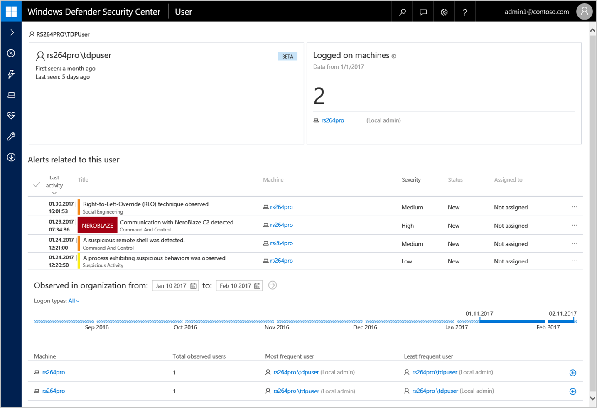
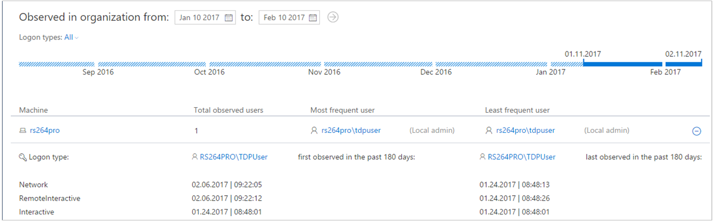

# Investigate a user account associated with a Windows Defender ATP alert

**Applies to:**

- Windows 10 Enterprise
- Windows 10 Education
- Windows 10 Pro
- Windows 10 Pro Education
- Windows Defender Advanced Threat Protection (Windows Defender ATP)

[Some information relates to pre-released product, which may be substantially modified before it's commercially released. Microsoft makes no warranties, express or implied, with respect to the information provided here.]

## Investigate user account entities
Identify user accounts with the most active alerts (displayed on dashboard as "Users at risk") and and investigate cases of potential compromised credentials, or pivot on the associated user account when investigating an alert or machine to identify possible lateral movement between machines with that user account.

You can find user account information in the following views:
- Dashboard
- Alert queue
- Machine details page

A clickable user account link is available in these views, that will take you to the user account details page where more details about the user account are shown.

When you investigate a user account entity, you'll see:
- User account details and Logged on machines
- Alerts related to this user
- Observed in organization (machines logged on to)

The user account entity details and logged on machines section display various attributes about the user account. You'll see details such as when the user was first and last seen and the total number of machines the user logged on to. You'll also see a list of the machines that the user logged on to, and can expand these to see details of the logon events on each machine.

The **Alerts related to this user** section provides a list of alerts that are associated with the user account. This list  is a filtered view of the [Alert queue](alerts-queue-windows-defender-advanced-threat-protection.md), and shows alerts where the user context is the selected user account, the date when the last activity was detected, a short description of the alert, the machine associated with the alert, the alert's severity, the alert's status in the queue, and who is assigned the alert.

The **Observed in organization** section allows you to specify a date range to see a list of machines where this user was observed logged on to, and the most frequent and least frequent logged on user account on each of these machines.

The machine health state is displayed in the machine icon and color as well as in a description text. Clicking on the icon displays additional details regarding machine health.

## Search for specific user accounts

1. Select **User** from the **Search bar** drop-down menu.
2. Enter the user account in the **Search** field.
3. Click the search icon or press **Enter**.

A list of users matching the query text is displayed. You'll see the user account's domain and name, when the user account was last seen, and the total number of machines it was observed logged on to in the last 30 days.

You can filter the results by the following time periods:
- 1 day
- 3 days
- 7 days
- 30 days
- 6 months
