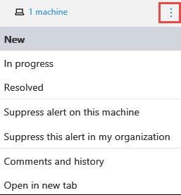
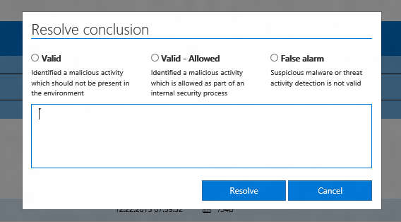
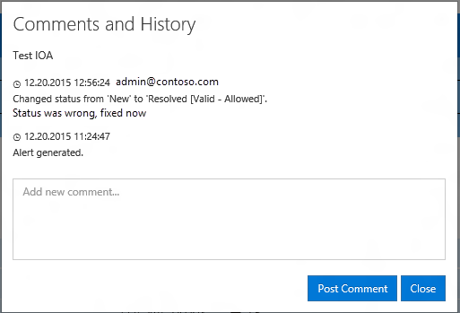
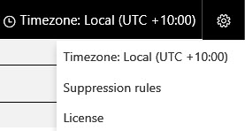
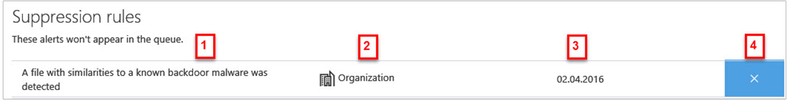

# Manage Windows Defender Advanced Threat Protection alerts

**Applies to:**

- Windows 10 Insider Preview Build 14332 or later
- Windows Defender Advanced Threat Protection (Windows Defender ATP)

[Some information relates to pre-released product which may be substantially modified before it's commercially released. Microsoft makes no warranties, express or implied, with respect to the information provided here.]

Windows Defender ATP notifies you of detected, possible attacks or breaches through alerts. A summary of new alerts is displayed in the **Dashboard**, and you can access all alerts in the **Alerts queue** menu.

See the [Investigate Windows Defender ATP alerts](investigate-alerts-windows-defender-advanced-threat-protection.md#investigate-windows-defender-advanced-threat-protection-alerts) topic for more details on how to investigate alerts.

Click the **Manage Alert** menu icon  on the top of the alert to access the Manage Alert menu and manage alerts.

The **Manage alert** icon appears on the alert's heading in the **New**, **In Progress**, or **Resolved** queues, and on the details page for individual alerts.

You can use the **Manage Alert** menu to:

- Change the status of an alert
- Resolve an alert
- Suppress alerts so they won't show up in the **Alerts queue** from this point onwards
- View the history and comments of an alert

## Change the status of an alert

You can categorize alerts (as **New**, **In Progress**, or **Resolved**) by changing their status as your investigation progresses. This helps you organize and manage how your team can respond to alerts.

For example, a team leader can review all **New** alerts, and decide to assign them to the **In Progress** queue for further analysis.

Alternatively, the team leader might assign the alert to the **Resolved** queue if they know the alert is benign, coming from a machine that is irrelevant (such as one belonging to a security administrator), or is being dealt with through an earlier alert.

**Change an alert's status:**

1. Click the **Manage Alert** menu icon  on the heading of the alert.
2. Choose the new status for the alert (the current status is highlighted in bold and appears on the alert).

## Resolve an alert

You can resolve an alert by changing the status of the alert to **Resolved**. This causes the **Resolve conclusion** window to appear, where you can indicate why the alert was resolved and enter any additional comments.

The comments and change of status are recorded in the [Comments and history window](#view-history-and-comments).

## Suppress alerts

Windows Defender ATP lets you create suppression rules so you can limit the alerts you see in the **Alerts queue**.

Suppression rules can be created from an existing alert.

When a suppression rule is created, it will take effect from this point onwards. It will not affect existing alerts already in the queue, but new alerts triggered after the rule is created will not be displayed.

There are two contexts for a suppression rule that you can choose from:

- **Suppress alert on this machine**
- **Suppress alert in my organization**

The context of the rule lets you tailor the queue to ensure that only alerts you are interested in will appear. You can use the examples in the following table to help you choose the context for a suppression rule:

**Context** | **Definition** |**Example scenarios**
---|---|---
**Suppress alert on this machine** | Alerts with the same alert title and on that specific machine only will be suppressed.   All other alerts on that machine will not be suppressed. | <ul><li>A security researcher is investigating a malicious script that has been used to attack other machines in your organization.</li><li>A developer regularly creates PowerShell scripts for their team.</li></ul>
**Suppress alert in my organization** | Alerts with the same alert title on any machine will be suppressed. | <ul><li>A benign administrative tool is used by everyone in your organization.</li></ul>

**Suppress an alert and create a suppression rule:**

1. Click the **Manage Alert** menu icon  on the heading of an existing alert.
2. Choose the context for suppressing the alert.

> **Note**&nbsp;&nbsp;You cannot create a custom or blank suppression rule. You must start from an existing alert.

**See the list of suppression rules:**

1. Click the settings icon  on the main menu bar at the top of the Windows Defender ATP screen.
2. Click **Suppression rules**.

  

> **Note**&nbsp;&nbsp;You can also click **See rules** in the confirmation window that appears when you suppress an alert.

The list of suppression rules shows all the rules that users in your organization have created.
Each rule shows:

- (1) The title of the alert that is suppressed
- (2) Whether the alert was suppressed for a single machine (clicking the machine name will allow you to investigate the machine) or the entire organization
- (3) The date when the alert was suppressed
- (4) An option to delete the suppression rule, which will cause alerts with this title to be displayed in the queue from this point onwards.

## View the history and comments of an alert
You can use the **Manage Alert** menu icon  to see a list of previous changes and comments made to the alert and to add new comments. You can also use the menu to open multiple alerts in different tabs so you can compare several alerts at the same time.

Whenever a change or comment is made to an alert, it is recorded in the **Comments and history** window.

**See the history of an alert and its comments:**

1. Click the **Manage Alert** menu icon  on the heading of the alert.
2. Click **Comments and history** to view related comments and history on the alert.

Comments are indicated by a message box icon () and include the username of the commenter and the time the comment was made.

**Add a new comment:**

1. Type your comment into the field.
2. Click **Post Comment**.

The comment will appear instantly.

You will also be prompted to enter a comment if you change the status of an alert to **Resolved**.

Changes are indicated by a clock icon (), and are automatically recorded when:

- The alert is created
- The status of the alert is changed

### Related topics
- [View the Windows Defender Advanced Threat Protection Dashboard](dashboard-windows-defender-advanced-threat-protection.md)
- [View and organize the Windows Defender Advanced Threat Protection Alerts queue](alerts-queue-windows-defender-advanced-threat-protection.md)
- [Investigate Windows Defender Advanced Threat Protection alerts](investigate-alerts-windows-defender-advanced-threat-protection.md)
- [Investigate machines in the Windows Defender ATP Machines view](investigate-machines-windows-defender-advanced-threat-protection.md)
- [Investigate a file associated with a Windows Defender ATP alert](investigate-files-windows-defender-advanced-threat-protection.md)
- [Investigate an IP address associated with a Windows Defender ATP alert](investigate-ip-windows-defender-advanced-threat-protection.md)
- [Investigate a domain associated with a Windows Defender ATP alert](investigate-domain-windows-defender-advanced-threat-protection.md)
