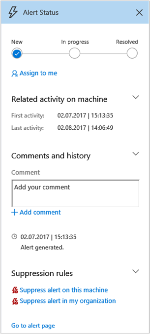

# Manage Windows Defender Advanced Threat Protection alerts

**Applies to:**

- Windows 10 Enterprise
- Windows 10 Education
- Windows 10 Pro
- Windows 10 Pro Education
- Windows Defender Advanced Threat Protection (Windows Defender ATP)

Windows Defender ATP notifies you of possible malicious events, attributes, and contextual information through alerts. A summary of new alerts is displayed in the **Dashboard**, and you can access all alerts in the **Alerts queue** menu.

You can manage alerts by selecting an alert in the **Alerts queue** or the **Alerts related to this machine** section of the machine details view.

Selecting an alert in either of those places brings up the **Alert management pane**.

## Change the status of an alert

You can categorize alerts (as **New**, **In Progress**, or **Resolved**) by changing their status as your investigation progresses. This helps you organize and manage how your team can respond to alerts.

For example, a team leader can review all **New** alerts, and decide to assign them to the **In Progress** queue for further analysis.

Alternatively, the team leader might assign the alert to the **Resolved** queue if they know the alert is benign, coming from a machine that is irrelevant (such as one belonging to a security administrator), or is being dealt with through an earlier alert.

## Alert classification
You can specify if an alert is a true alert or a false alert.

## Assign alerts
If an alert is no yet assigned, you can select **Assign to me** to assign the alert to yourself.

## Add comments and view the history of an alert
You can add comments and view historical events about an alert to see previous changes made to the alert.

Whenever a change or comment is made to an alert, it is recorded in the **Comments and history** section.

Added comments instantly appear on the pane.

## Suppress alerts

Windows Defender ATP lets you create suppression rules so you can limit the alerts you see in the **Alerts queue**.

Suppression rules can be created from an existing alert.

When a suppression rule is created, it will take effect from this point onwards. It will not affect existing alerts already in the queue, but new alerts triggered after the rule is created will not be displayed.

There are two contexts for a suppression rule that you can choose from:

- **Suppress alert on this machine**
- **Suppress alert in my organization**

The context of the rule lets you tailor the queue to ensure that only alerts you are interested in will appear. You can use the examples in the following table to help you choose the context for a suppression rule:

**Context** | **Definition** |**Example scenarios**
---|---|---
**Suppress alert on this machine** | Alerts with the same alert title and on that specific machine only will be suppressed.   All other alerts on that machine will not be suppressed. | <ul><li>A security researcher is investigating a malicious script that has been used to attack other machines in your organization.</li><li>A developer regularly creates PowerShell scripts for their team.</li></ul>
**Suppress alert in my organization** | Alerts with the same alert title on any machine will be suppressed. | <ul><li>A benign administrative tool is used by everyone in your organization.</li></ul>

**Suppress an alert and create a suppression rule:**

1. Select the alert you'd like to suppress. This brings up the **Alert management** pane.
2. Scroll down to the **Supression rules** section.
3. Choose the context for suppressing the alert.

> [!NOTE]
> You cannot create a custom or blank suppression rule. You must start from an existing alert.

**See the list of suppression rules:**

1. Click the settings icon  on the main menu bar at the top of the Windows Defender ATP screen.
2. Click **Suppression rules**.

  

The list of suppression rules shows all the rules that users in your organization have created.

Each rule shows:

- (1) The title of the alert that is suppressed
- (2) Whether the alert was suppressed for a single machine (clicking the machine name will allow you to investigate the machine) or the entire organization
- (3) The date when the alert was suppressed
- (4) An option to delete the suppression rule, which will cause alerts with this title to be displayed in the queue from this point onwards.

## Related topics
- [View the Windows Defender Advanced Threat Protection Dashboard](dashboard-windows-defender-advanced-threat-protection.md)
- [View and organize the Windows Defender Advanced Threat Protection Alerts queue ](alerts-queue-windows-defender-advanced-threat-protection.md)
- [Investigate Windows Defender Advanced Threat Protection alerts](investigate-alerts-windows-defender-advanced-threat-protection.md)
- [Investigate a file associated with a Windows Defender ATP alert](investigate-files-windows-defender-advanced-threat-protection.md)
- [Investigate an IP address associated with a Windows Defender ATP alert](investigate-ip-windows-defender-advanced-threat-protection.md)
- [Investigate a domain associated with a Windows Defender ATP alert](investigate-domain-windows-defender-advanced-threat-protection.md)
- [View and organize the Windows Defender ATP Machines view](machines-view-overview-windows-defender-advanced-threat-protection.md)
- [Investigate machines in the Windows Defender ATP Machines view](investigate-machines-windows-defender-advanced-threat-protection.md)
- [Investigate a user account in Windows Defender ATP](investigate-user-windows-defender-advanced-threat-protection.md)
- [Take response actions in Windows Defender ATP](response-actions-windows-defender-advanced-threat-protection.md)
