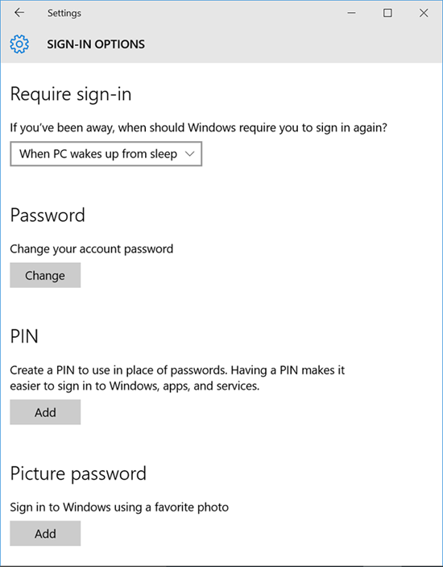
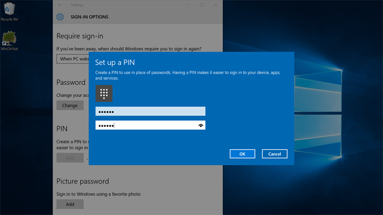
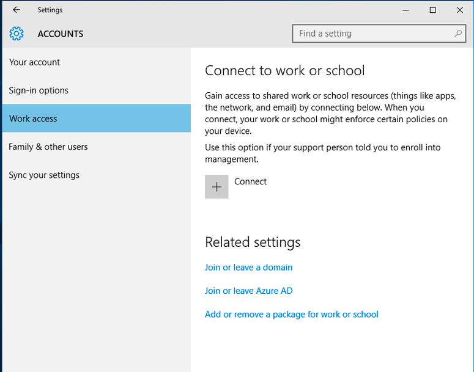

# Microsoft Passport guide

**Applies to**

-   Windows 10

**In this article**

-   [Problems with traditional credentials](#problems-with-traditional-credentials)
-   [Solve credential problems](#solve-credential-problems)
-   [What is Windows Hello?](#what-is-windows-hello-)
-   [What is Microsoft Passport?](#what-is-microsoft-passport-)
-   [How Microsoft Passport works](#how-microsoft-passport-works)
-   [Design a Microsoft Passport for Work deployment](#design)
-   [Implement Microsoft Passport](#implement-microsoft-passport)
-   [Roadmap](#roadmap)

This guide describes the new Windows Hello and Microsoft Passport technologies that are part of the Windows 10 operating system. It highlights specific capabilities of these technologies that help mitigate threats from conventional credentials and provides guidance about how to design and deploy these technologies as part of your Windows 10 rollout.

A fundamental assumption about information security is that a system can identify who’s using it. In identifying a user, the system can decide whether the user has identified himself or herself appropriately (a process known as authentication), and then determine what that properly authenticated user should be able to do (a process known as authorization). The overwhelming majority of computer systems deployed throughout the world depend on user credentials as a means of making authentication and authorization decisions, and that means that these systems depend on reusable, user-created passwords for their security. The oft-cited maxim that authentication can involve “something you know, something you have, or something you are” neatly highlights the issue: a reusable password is an authentication factor all by itself, so anyone who knows the password can impersonate the user who owns it.

## Problems with traditional credentials

Ever since the mid-1960s, when Fernando Corbató and his team at the Massachusetts Institute of Technology championed the introduction of the password, users and administrators have had to deal with the use of passwords for user authentication and authorization. Over time, the state of the art for password storage and use has advanced somewhat (with password hashing and salt being the two most noticeable improvements), but we’re still faced with two serious problems: passwords are easy to clone and easy to steal. Implementation faults may render them insecure, and users have a hard time balancing convenience and security.

**Credential theft**

The biggest risk of passwords is simple: an attacker can steal them easily. Every place a password is entered, processed, or stored is vulnerable. For example, an attacker can steal a collection of passwords or hashes from an authentication server by eavesdropping on network traffic to an application server, by implanting malware in an application or on a device, by logging user keystrokes on a device, or by watching to see which characters a user types — and those are just the most common attack methods. One can enact more exotic attacks to steal one or many passwords.

The risk of theft is driven by the fact that the authentication factor the password represents is the password. Without additional authentication factors, the system assumes that anyone who knows the password is the authorized user.

Another, related risk is that of credential replay, in which an attacker captures a valid credential by eavesdropping on an insecure network, and then replays it later to impersonate a valid user. Most authentication protocols (including Kerberos and OAuth) protect against replay attacks by including a time stamp in the credential exchange process, but that protects the token that the authentication system issues, not the password that the user provides to get the ticket in the first place.

**Credential reuse**

The common approach of using an email address as the user name makes a bad problem worse. An attacker who successfully recovers a user name–password pair from a compromised system can then try that same pair on other systems. Surprisingly often, this tactic works to allow attackers to springboard from a compromised system into other systems. The use of email addresses as user names leads to other problems, too, which we’ll explore later in this guide.

### 

**Trading convenience for complexity**

Most security is a tradeoff between convenience and security: the more secure a system is, the less convenient it will typically be for users. Although system designers and implementers have a broad range of tools to make their systems more secure, users get a vote, too. When users perceive that a security mechanism gets in the way of what they want to do, they often look for ways to circumvent it. This behavior leads to an arms race of sorts, with users adopting strategies to minimize the effort required to comply with their organization’s password policies as those policies evolve.

**Password complexity**

If the major risk to passwords is that an attacker might guess them through brute-force analysis, it might seem reasonable to require users to include a broader character set in their passwords or make them longer, but as a practical matter, password length and complexity requirements have two negative side effects. First, they encourage password reuse. Estimates by [Herley, Florêncio, and van Oorschot](http://go.microsoft.com/fwlink/p/?LinkId=627392) calculate that the stronger a password is, the more likely it is to be reused. Because users put more effort into the creation and memorization of strong passwords, they are much more likely to use the same credential across multiple systems. Second, adding length or character set complexity to passwords does not necessarily make them more difficult to guess. For example, P@ssw0rd1 is nine characters long and includes uppercase and lowercase letters, numbers, and special characters, but it’s easily guessed by many of the common password-cracking tools now available on the Internet. These tools can attack passwords by using a pre-computed dictionary of common passwords, or they can start with a base word such as password, and then apply common character substitutions. A completely random eight-character password might therefore actually take longer to guess than P@ssw0rd123.

**Password expiration**

Because a reusable password is the only authentication factor in password-based systems, designers have attempted to reduce the risk of credential theft and reuse. One common method for doing so is the use of limited-lifetime passwords. Some systems allow for passwords that can be used only once, but by far the more common approach is to make passwords expire after a certain period. Limiting the useful lifetime of a password puts a cap on how long a stolen password will be useful to an attacker. This practice helps protect against cases where a long-lived password is stolen, held, and used for a long time, but it also harkens back to the time when password cracking was impractical for everyone except nation state-level attackers. A smart attacker would attempt to steal passwords rather than crack them because of the time penalty associated with password cracking.

The widespread availability of commodity password-cracking tools and the massive computing power available through mechanisms such as GPU-powered crackers or distributed cloud-based cracking tools has reversed this equation so that it is often more effective for an attacker to crack a password than to try to steal it. In addition, the widespread availability of self-service [password-reset mechanisms](#password-reset) means that an attacker needs only a short window of time during which the password is valid to change the password and thus reset the validity period. Relatively few enterprise networks provide self-service password-reset mechanisms, but they are common for Internet services. In addition, many users use the secure credential store on Windows and Mac OS X systems to store valuable passwords for Internet services, so an attacker who can compromise the operating system password may be able to obtain a treasure trove of other service passwords at no cost.

Finally, overly short timelines for password expiration can tempt users to make small changes in their passwords at each expiration period — for example, moving from password123 to password456 to password789. This approach reduces the work necessary to crack the password, especially if the attacker knows any of the old passwords.

### 

**Password-reset mechanisms**

To let users better manage their own passwords, some services provide a way for users to change their own password. Some implementations require users to log on with their current password, while others allow users to select the **Forgot my password** option, which sends an email to the user’s registered email address. The problem with these mechanisms is that many of them are implemented such that an attacker can exploit them. For example, an attacker who can successfully guess or steal a user’s email password can merrily request password resets for all of the victim’s other accounts, because the reset emails go to the compromised account. For this reason, most enterprise networks are configured so that only administrators can reset user passwords; for example, Active Directory supports the use of a **Password must be changed on next logon** flag so that after the administrator resets a password, the user can reset the password only after providing the administrator-set password. Some mobile device management (MDM) systems support similar functionality for mobile devices.

**User password carelessness**

An insidious problem makes these design and implementation weaknesses worse: some users just aren’t careful with their passwords. They write them down in insecure locations, choose easy-to-guess passwords, take minimal (if any) precautions against malware, or even give their passwords to other people. These users aren’t necessarily careless because they don’t care; they want to get things done, and overly stringent password length or expiration policies or too many passwords hinders them.

**Mitigate credential risks**

Given the issues described so far, it might seem obvious that reusable passwords are a security hazard. The argument is simple: adding authentication factors reduces the value of the passwords themselves, because even a successful password theft won’t let an attacker log on to a system unless he or she also has the associated additional factors. Unfortunately, this simple argument has many practical complications. Security and operating system vendors have tried to solve the problems that reusable credentials pose for decades — with limited success.

The most obvious mitigation to the risks reusable passwords pose is to add one or more authentication factors. At different times over the past 30 years, different vendors have attempted to solve this problem by calling for the use of biometric identifiers (including fingerprints, iris and retina scans, and hand geometry), software-based and hardware-based tokens, physical and virtual smart cards, and voice or Short Message Service (SMS) authentication through the user’s mobile phone. A detailed description of each of these authenticators and its pros and cons is outside the scope of this guide, but no matter which authentication method you choose, core challenges have limited adoption of all Multi-Factor Authentication (MFA) solutions, including:

-   **Infrastructure complexity and cost.** Any system that requires the user to provide an additional authentication factor at the point of access has to have a way to collect that information. Although it’s possible to retrofit fielded hardware by adding fingerprint readers, eye scanners, smart card readers, and so on, few enterprises have been willing to take on the cost and support burden required to do so.

-   **Lack of standardization.** Although Microsoft included operating system–level smart card support as part of the Windows Vista operating system, smart card and reader vendors were free to continue to ship their own drivers, as were manufacturers of other authentication devices. Lack of standardization led to both application and support fragmentation, which means that it wasn’t always possible to mix and match solutions within an enterprise, even when the manufacturers of those solutions advertised them as being compatible.

-   **Backward compatibility.** Retrofitting already-deployed operating systems and applications to use MFA has proven an extremely difficult task. Nearly three years after its release, Microsoft Office 2013 is finally getting support for MFA. The vast majority of both commercial and custom line-of-business (LOB) applications will never be retrofitted to take advantage of any authentication system other than what the underlying operating system provides.

-   **User inconvenience.** Solutions that require users to obtain, keep track of, and use physical tokens are often unpopular. If users have to have a particular token for remote access or other scenarios that are supposed to make things more convenient, they tend to become quickly dissatisfied with the burden of keeping up with an additional device. This pushback is multiplied for solutions that have to be attached to computers (such as smart card readers) because such solutions introduce problems of portability, driver support, and operating system and application integration.

-   **Device compatibility.** Not every hardware form factor supports every authentication method. For example, despite occasional feeble efforts from vendors, no market for mobile phone-compatible smart card readers ever emerged. So when Microsoft first implemented smart cards as an authenticator for remote network access, one key limitation was that employees could log on only from desktop or laptop computers that had smart card readers. Any authentication method that relies on additional hardware or software may run into this problem. For example, several popular “soft token” systems rely on mobile apps that run on a limited number of mobile hardware platforms.

Another pesky problem has to do with institutional knowledge and maturity. Strong authentication systems are complex. They have lots of components, and they can be expensive to design, maintain, and operate. For some enterprises, the additional cost and overhead of maintaining an in-house public key infrastructure (PKI) to issue smart cards or the burden of managing add-on devices exceeds the value they perceive in having stronger authentication. This is a special case of the common problem that financial institutions face: if the cost of fraud reduction is higher than the cost of the fraud itself, it’s hard to justify the economics of better fraud-prevention measures.

## Solve credential problems

Solving the problems that passwords pose is tricky. Tightening password policies alone won’t do it: users may just recycle, share, or write down passwords. Although user education is critical for authentication security, education alone doesn’t eliminate the problem, either.

As you’ve seen, additional authenticators won’t necessarily help if the new authentication systems add complexity, cost, or fragility. In Windows 10, Microsoft addresses these problems with two new technologies: Windows Hello and Microsoft Passport. Working together, these technologies help increase both security and user convenience:

-   Microsoft Passport replaces passwords with strong two-factor authentication (2FA) by verifying existing credentials and by creating a device-specific credential that a user gesture (either biometric or PIN-based) protects. This combination effectively replaces physical and virtual smart cards as well as reusable passwords for logon and access control.

-   Windows Hello provides reliable, fully integrated biometric authentication based on facial recognition or fingerprint matching. Windows Hello uses a combination of special infrared (IR) cameras and software to increase accuracy and guard against spoofing. Major hardware vendors are shipping devices that have integrated Windows Hello-compatible cameras, and fingerprint reader hardware can be used or added to devices that don’t currently have it. On devices that support Windows Hello, an easy biometric gesture unlocks users’ Microsoft Passport credentials.

## What is Windows Hello?

Windows Hello is the name Microsoft has given to the new biometric sign-in system built into Windows 10. Because it is built directly into the operating system, Windows Hello allows face or fingerprint identification to unlock users’ devices. Authentication happens when the user supplies his or her unique biometric identifier to access the device-specific Microsoft Passport credentials, which means that an attacker who steals the device can’t log on to it unless that attacker has the PIN. The Windows secure credential store protects biometric data on the device. By using Windows Hello to unlock a device, the authorized user gains access to all of his or her Windows experience, apps, data, websites, and services.

The Windows Hello authenticator is known as a Hello. A Hello is unique to the combination of an individual device and a specific user; it doesn’t roam among devices, isn’t shared with a server, and cannot easily be extracted from a device. If multiple users share a device, each user gets a unique Hello for that device. You can think of a Hello as a token you can use to unlock (or release) a stored credential: the Hello itself doesn’t authenticate you to an app or service, but it releases credentials that can.

At the launch of Windows 10, the operating system supported three Hello types:

-   **PIN.** Before you can use Windows Hello to enable biometrics on a device, you must choose a PIN as your initial Hello gesture. After you’ve set a PIN, you can add biometric gestures if you want to. You can always use the PIN gesture to release your credentials, so you can still unlock and use your device even if you can’t use your preferred biometric because of an injury or because the sensor is unavailable or not working properly.

-   **Facial recognition.** This type uses special cameras that see in IR light, which allows them to reliably tell the difference between a photograph or scan and a living person. Several vendors are shipping external cameras that incorporate this technology, and major laptop manufacturers are incorporating it into their devices, as well.

-   **Fingerprint recognition.** This type uses a capacitive fingerprint sensor to scan your fingerprint. Fingerprint readers have been available for Windows computers for years, but the current generation of sensors is significantly more reliable and less error-prone. Most existing fingerprint readers (whether external or integrated into laptops or USB keyboards) work with Windows 10.

Biometric data used to implement these Hello gestures is stored securely on the local device only. It doesn’t roam and is never sent to external devices or servers. Because Windows Hello only stores biometric identification data on the device, there’s no single collection point an attacker can compromise to steal biometric data. Breaches that expose biometrics collected and stored for other uses (such as fingerprints collected and stored for law enforcement or background check purposes) don’t pose a significant threat: an attacker who steals biometrics literally has only a template of the identifier, and that template cannot easily be converted to a form that the attacker can present to a biometric sensor. The data path for Windows Hello-compatible sensors is resistant to tampering, too, which further reduces the chance that an attacker will be able to successfully inject faked biometric data. In addition, before an attacker can even attempt to inject data into the sensor pipeline, that attacker must gain physical access to the device — and an attacker who can do that can mount several other, less difficult attacks.

Windows Hello offers several major benefits. First, when combined with Microsoft Passport, it effectively solves the problems of credential theft and sharing. Because an attacker must obtain both the device and the selected biometric, it is much more difficult to gain access without the user’s knowledge. Second, the use of biometrics means that users benefit from having a simple authenticator that’s always with them: there’s nothing to forget, lose, or leave behind. Instead of worrying about memorizing long, complex passwords, users can take advantage of a convenient, secure method for signing in to all their Windows devices. Finally, in many cases, there’s nothing additional to deploy or manage to use Windows Hello (although Microsoft Passport may require additional deployment, as described later in this guide). Windows Hello support is built directly into the operating system, and users or enterprises can add compatible biometric devices to provide biometric gesture recognition, either as part of a coordinated rollout or as individual users or groups decide to add the necessary sensors. Windows Hello is part of Windows, so no additional deployment is required to start using it.

## What is Microsoft Passport?

Windows Hello provides a robust way for a device to recognize an individual user; that addresses the first part of the path between a user and a requested service or data item. After the device has recognized the user, however, it still must authenticate the user before deciding whether to grant access to a requested resource. Microsoft Passport provides strong 2FA, fully integrated into Windows, that replaces reusable passwords with the combination of a specific device and a Hello or PIN. Microsoft Passport isn’t just a replacement for traditional 2FA systems, though. It’s conceptually similar to smart cards: authentication is performed by using cryptographic primitives instead of string comparisons, and the user’s key material is secure inside tamper-resistant hardware. Microsoft Passport doesn’t require the extra infrastructure components required for smart card deployment, either. In particular, you don’t need a PKI if you don’t currently have one. Microsoft Passport combines the major advantage of smart cards — deployment flexibility for virtual smart cards and robust security for physical smart cards — without any of their drawbacks.

Microsoft Passport offers four significant advantages over the current state of Windows authentication: it’s more flexible, it’s based on industry standards, it’s an effective risk mitigator, and it’s ready for the enterprise. Let’s look at each of these advantages in more detail.

**It’s flexible**

Microsoft Passport offers unprecedented flexibility. Although the format and use of reusable passwords are fixed, Microsoft Passport gives both administrators and users options to manage authentication. First and foremost, Microsoft Passport works with both biometric identifiers and PINs, so users’ credentials are protected even on devices that don’t support biometrics. Users can even use their phone to release their credentials instead of a PIN or biometric gesture on the main device. Microsoft Passport seamlessly takes advantage of the hardware of the devices in use; as users upgrade to newer devices, Microsoft Passport is ready to use them, and organizations can upgrade existing devices by adding biometric sensors where appropriate.

Microsoft Passport offers flexibility in the datacenter, too. To deploy it, in some modes you must add Windows Server 2016 Technical Preview domain controllers to your Active Directory environment, but you don’t have to replace or remove your existing Active Directory servers — the servers required for Microsoft Passport build on and add capability to your existing infrastructure. You don’t have to change the domain or forest functional level, and you can either add on-premises servers or use Microsoft Azure Active Directory to deploy Microsoft Passport on your network. The choice of which users you should enable for Microsoft Passport use is completely up to you: you choose the policies and devices to support and which authentication factors you want users to have access to. This makes it easy to use Microsoft Passport to supplement existing smart card or token deployments by adding strong credential protection to users who don’t currently have it or to deploy Microsoft Passport in scenarios that call for extra protection for sensitive resources or systems (described in the [Design a Microsoft Passport deployment](#design) section).

**It’s standardized**

Both software vendors and enterprise customers have come to realize that proprietary identity and authentication systems are a dead end. The future lies with open, interoperable systems that allow secure authentication across a variety of devices, LOBs, and external applications and websites. To this end, a group of industry players formed the Fast IDentity Online Alliance (FIDO), a nonprofit organization intended to address the lack of interoperability among strong authentication devices as well as the problems users face when they have to create and remember multiple user names and passwords. The FIDO Alliance plans to change the nature of authentication by developing specifications that define an open, scalable, interoperable set of mechanisms that supplant reliance on passwords to securely authenticate users of online services. This new standard for security devices and browser plug ins will allow any website or cloud application to interface with a broad variety of existing and future FIDO-enabled devices that the user has for online security. For more information, see the [FIDO Alliance website](http://go.microsoft.com/fwlink/p/?LinkId=627393).

In 2013, Microsoft joined the FIDO Alliance. FIDO standards enable a universal framework that a global ecosystem delivers for a consistent and greatly improved user experience of strong passwordless authentication. The FIDO 1.0 specifications, published in December 2014, provide for two types of authentications: passwordless (known as the Universal Authentication Framework \[UAF\]) and 2nd Factor (U2F). The FIDO Alliance is working on a set of 2.0 proposals to combine the best parts of the U2F and UAF FIDO 1.0 standards. Microsoft is actively contributing to the proposals, and Windows 10 is a reference implementation of these concepts. In addition to supporting those protocols, the Windows implementation covers other aspects of the end-to-end experience that the specification does not cover, including user interface to, storage of, and protection for users’ device keys and the tokens issued after authentication; supporting administrator policies; and providing deployment tools. Microsoft expects to continue working with the FIDO Alliance as the FIDO 2.0 specification moves forward. Interoperability of FIDO products is a hallmark of FIDO authentication. Microsoft believes that bringing a FIDO solution to market will help solve a critical need for enterprises and consumers alike.

**It’s effective**

Microsoft Passport effectively mitigates two major security risks. First, by eliminating the use of reusable passwords for logon, it reduces the risk that a user’s credential will be copied or reused. On devices that support the Trusted Platform Module (TPM) standard, user key material can be stored in the user device’s TPM, which makes it more difficult for an attacker to capture the key material and reuse it. For devices that lack TPM, Microsoft Passport can encrypt and store credential data in software, but administrators can disable this feature to force a “TPM or nothing” deployment.

Second, because Microsoft Passport doesn’t depend on a single, centralized server, the risk of compromise from a breach of that server is removed. Although an attacker could theoretically compromise a single device, there’s no single point of attack that an intruder can leverage to gain widespread access to the environment.

**It’s enterprise-ready**

Every edition of Windows 10 includes Microsoft Passport functionality for individual use; enterprise and personal users can take advantage of Microsoft Passport to protect their individual credentials with compatible applications and services. In addition, enterprises whose users are running Windows 10 Professional and Windows 10 Enterprise have the ability to use Microsoft Passport for Work, an enhanced version of Microsoft Passport that includes the ability to centrally manage Microsoft Passport settings for PIN strength and biometric use through Group Policy Objects (GPOs).

## How Microsoft Passport works

To use Microsoft Passport to sign in with an identity provider (IDP), a user needs a configured device, which means that the Microsoft Passport life cycle starts when you configure a device for Microsoft Passport use. When the device is set up, its user can use the device to authenticate to services. In this section, we explore how device registration works, what happens when a user requests authentication, how key material is stored and processed, and which servers and infrastructure components are involved in different parts of this process.

**Register a new user or device**

A goal of Microsoft Passport is to allow a user to open a brand-new device, securely join an organizational network to download and manage organizational data, and create a new Hello gesture to secure the device. Microsoft refers to the process of setting up a device for use with Microsoft Passport as registration.

**Note**  
This is separate from the organizational configuration required to use Microsoft Passport with Active Directory or Azure AD; that configuration is discussed later in this guide. This configuration must be completed before users can begin to register.

 

The registration process works like this:

1.  The user configures an account on the device.

    This account can be a local account on the device, a domain account stored in the on-premises Active Directory domain, a Microsoft account, or an Azure AD account. For a new device, this step may be as simple as logging on with a Microsoft account. Logging on with a Microsoft account on a Windows 10 device automatically sets up Microsoft Passport on the device; users don’t have to do anything extra to enable it.

2.  To log on using that account, the user has to enter the existing credentials for it.

    The IDP that “owns” the account receives the credentials and authenticates the user. This IDP authentication may include the use of an existing second authentication factor, or proof. For example, a user who registers a new device by using an Azure AD account will have to provide an SMS-based proof that Azure AD sends.

3.  When the user has provided the proof to the IDP, the user enables PIN authentication (Figure 1).

    The PIN will be associated with this particular credential.

    

    Figure 1. Set up a PIN in the **Account Settings** control panel item

    When the user sets the PIN, it becomes usable immediately (Figure 2).

    

    Figure 2. When set, the PIN is immediately usable

Remember that Microsoft Passport depends on pairing a device and a credential, so the PIN chosen is associated only with the combination of the active account and that specific device. The PIN must comply with whatever length and complexity policy the account administrator has configured; this policy is enforced on the device side. Other registration scenarios that Microsoft Passport supports are:

-   A user who upgrades from the Windows 8.1 operating system will log on by using his or her existing enterprise password. That triggers MFA from the IDP side; after receiving and returning a proof, such as a text message or voice code, the IDP authenticates the user to the upgraded Windows 10 device, and the user can set his or her PIN.

-   A user who typically uses a smart card to log on will be prompted to set up a PIN the first time he or she logs on to a Windows 10 device the user has not previously logged on to.

-   A user who typically uses a virtual smart card to log on will be prompted to set up a PIN the first time he or she logs on to a Windows 10 device the user has not previously logged on to.

When the user has completed this process, Microsoft Passport generates a new public–private key pair on the device. The TPM generates and stores this private key; if the device doesn’t have a TPM, the private key is encrypted and stored in software. This initial key is referred to as the protector key. It’s associated only with a single gesture; in other words, if a user registers a PIN, a fingerprint, and a face on the same device, each of those gestures will have a unique protector key. The protector key securely wraps the authentication key for a specific container. Each container has only one authentication key, but there can be multiple copies of that key wrapped with different unique protector keys (each of which is associated with a unique gesture). Microsoft Passport also generates an administrative key that the user or administrator can use to reset credentials, when necessary. In addition to the protector key, TPM-enabled devices generate a block of data that contains attestations from the TPM.

At this point, the user has a PIN gesture defined on the device and an associated protector key for that PIN gesture. That means he or she is able to securely log on to the device with the PIN and thus that he or she can establish a trusted session with the device to add support for a biometric gesture as an alternative for the PIN. When you add a biometric gesture, it follows the same basic sequence: the user authenticates to the system by using his or her PIN, and then registers the new biometric (“smile for the camera!”), after which Windows generates a unique key pair and stores it securely. Future logons can then use either the PIN or the registered biometric gestures.

**What’s a container?**

You’ll often hear the term *container* used in reference to MDM solutions. Microsoft Passport uses the term, too, but in a slightly different way. Container in this context is shorthand for a logical grouping of key material or data. Windows 10 supports two containers: the default container holds user key material for personal accounts, including key material associated with the user’s Microsoft account or with other consumer identity providers, and the enterprise container holds credentials associated with a workplace or school account.

The enterprise container exists only on devices that have been registered with an organization; it contains key material for the enterprise IDP, such as on-premises Active Directory or Azure AD. The enterprise container contains only key data for Active Directory or Azure AD. If the enterprise container is present on a device, it’s unlocked separately from the default container, which maintains separation of data and access across personal and enterprise credentials and services. For example, a user who uses a biometric gesture to log on to a managed computer can separately unlock his or her personal container by entering a PIN when logging on to make a purchase from a website.

These containers are logically separate. Organizations don’t have any control over the credentials users store in the default container, and applications that authenticate against services in the default container can’t use credentials from the enterprise container. However, individual Windows applications can use the Microsoft Passport application programming interfaces (APIs) to request access to credentials as appropriate, so that both consumer and LOB applications can be enhanced to take advantage of Microsoft Passport.

It’s important to keep in mind that there are no physical containers on disk, in the registry, or elsewhere. Containers are logical units used to group related items. The keys, certificates, and credentials Microsoft Passport stores are protected without the creation of actual containers or folders.

Each container actually contains a set of keys, some of which are used to protect other keys. Figure 3 shows an example: the protector key is used to encrypt the authentication key, and the authentication key is used to encrypt the individual keys stored in the container.

Figure 3. Each logical container holds one or more sets of keys

Containers can contain several types of key material:

-   An *authentication key*, which is always an asymmetric public–private key pair. This key pair is generated during registration. It must be unlocked each time it’s accessed, by using either the user’s PIN or a previously generated biometric gesture. The authentication key exists until the user resets the PIN, at which time a new key will be generated. When the new key is generated, all the key material that the old key previously protected must be decrypted and re-encrypted using the new key.

-   *Virtual smart card keys* are generated when a virtual smart card is generated and stored securely in the container. They’re available whenever the user’s container is unlocked.

-   *Secure/Multipurpose Internet Mail Extensions (S/MIME) keys and certificates*, which a certification authority (CA) generates. The keys associated with the user’s S/MIME certificate can be stored in a Microsoft Passport container so they’re available to the user whenever the container is unlocked.

-   The *IDP key*. These keys can be either symmetric or asymmetric, depending on which IDP you use. A single container may contain zero or more IDP keys, with some restrictions (for example, the enterprise container can contain zero or one IDP keys). IDP keys are stored in the container as illustrated in Figure 3. For certificate-based Microsoft Passport for Work, when the container is unlocked, applications that require access to the IDP key or key pair can request access. IDP keys are used to sign or encrypt authentication requests or tokens sent from this machine to the IDP. IDP keys are typically long lived but could have a shorter lifetime than the authentication key.

Microsoft accounts, Active Directory accounts, and Azure AD accounts all require the use of asymmetric key pairs. The device generates public and private keys, registers the public key with the IDP (which stores it for later verification), and securely stores the private key. For enterprises, the IDP keys can be generated in two ways:

-   The IDP key pair can be associated with an enterprise CA through the Windows Network Device Enrollment Service (NDES), described more fully in [Network Device Enrollment Service Guidance](http://go.microsoft.com/fwlink/p/?LinkId=733947). In this case, Microsoft Passport requests a new certificate with the same key as the certificate from the existing PKI. This option lets organizations that have an existing PKI continue to use it where appropriate. Given that many applications, such as popular virtual private network systems, require the use of certificates, when you deploy Microsoft Passport in this mode, it allows a faster transition away from user passwords while still preserving certificate-based functionality. This option also allows the enterprise to store additional certificates in the protected container.

-   The IDP can generate the IDP key pair directly, which allows quick, lower-overhead deployment of Microsoft Passport in environments that don’t have or need a PKI.

**How keys are protected**

Any time key material is generated, it must be protected against attack. The most robust way to do this is through specialized hardware. There’s a long history of using hardware security modules (HSMs) to generate, store, and process keys for security-critical applications. Smart cards are a special type of HSM, as are devices that are compliant with the Trusted Computing Group TPM standard. Wherever possible, the Microsoft Passport for Work implementation takes advantage of onboard TPM hardware to generate, store, and process keys. However, Microsoft Passport and Microsoft Passport for Work do not require an onboard TPM. Administrators can choose to allow key operations in software, in which case any user who has (or can escalate to) administrative rights on the machine can use the IDP keys to sign requests. As an alternative, in some scenarios, devices that don’t have a TPM can be remotely authenticated by using a device that does have a TPM, in which case all the sensitive operations are performed with the TPM and no key material is exposed.

Whenever possible, Microsoft recommends the use of TPM hardware. The TPM protects against a variety of known and potential attacks, including PIN brute-force attacks. The TPM provides an additional layer of protection after an account lockout, too. When the TPM has locked the key material, the user will have to reset the PIN (which means he or she will have to use MFA to reauthenticate to the IDP before the IDP allows him or her to re-register). Resetting the PIN means that all keys and certificates encrypted with the old key material will be removed.

**Authentication**

When a user wants to access protected key material — perhaps to use an Internet site that requires a logon or to access protected resources on a corporate intranet — the authentication process begins with the user entering a PIN or biometric gesture to unlock the device, a process sometimes called *releasing the key*. Think of it like using a physical key to unlock a door: before you can unlock the door, you need to remove the key from your pocket or purse. On a personal device that’s connected to an organizational network, users will use their personal PIN or biometric to release the key; on a device joined to an on-premises or Azure AD domain, they will use the organizational PIN.

This process unlocks the protector key for the primary container on the device. When that container is unlocked, applications (and thus the user) can use whatever IDP keys reside inside the container.

These keys are used to sign requests that are sent to the IDP, requesting access to specified resources. It’s important to understand that although the keys are unlocked, applications cannot use them at will. Applications can use specific APIs to request operations that require key material for particular actions (for example, decrypt an email message or log on to a website). Access through these APIs doesn’t require explicit validation through a user gesture, and the key material isn’t exposed to the requesting application. Rather, the application asks for authentication, encryption, or decryption, and the Microsoft Passport layer handles the actual work and returns the results. Where appropriate, an application can request a forced authentication even on an unlocked device. Windows prompts the user to reenter the PIN or perform an authentication gesture, which adds an extra level of protection for sensitive data or actions. For example, you can configure the Windows Store to require reauthentication any time a user purchases an application, even though the same account and PIN or gesture were already used to unlock the device.

The actual authentication process works like this:

1.  The client sends an empty authentication request to the IDP. (This is merely for the handshake process.)

2.  The IDP returns a challenge, known as a *nonce*.

3.  The device signs the nonce with the appropriate private key.

4.  The device returns the original nonce, the signed nonce, and the ID of the key used to sign the nonce.

5.  The IDP fetches the public key that the key ID specified, uses it to verify the signature on the nonce, and verifies that the nonce the device returned matches the original.

6.  If all the checks in step 5 succeed, the IDP returns two data items: a symmetric key, which is encrypted with the device’s public key, and a security token, which is encrypted with the symmetric key.

7.  The device uses its private key to decrypt the symmetric key, and then uses that symmetric key to decrypt the token.

8.  The device makes a normal authentication request for the original resource, presenting the token from the IDP as its proof of authentication.

When the IDP validates the signature, it is verifying that the request came from the specified user and device. The private key specific to the device signs the nonce, which allows the IDP to determine the identity of the requesting user and device so that it can apply policies for content access based on user, device type, or both together. For example, an IDP could allow access to one set of resources only from mobile devices and a different set from desktop devices.

Remote unlock, which is planned for a future release of Windows 10, builds on these scenarios by enabling seamless remote authentication from a mobile device as a second factor. For example, suppose that you’re visiting another office at your company and you need to borrow a computer there temporarily, but you don’t want to potentially expose your credentials to capture. Rather than type in your credentials, you can click **other user** on the Windows 10 logon screen, type your user name, pick the tile for remote authentication, and use an app on your phone, which you already unlocked by using its built-in facial-recognition sensors. The phone and computer are paired and handshake via Bluetooth, you type your authentication PIN on the phone, and the computer gets confirmation of your identity from the IDP. All this happens without typing a password anywhere or typing your PIN on the PC.

**The infrastructure**

Microsoft Passport depends on having compatible IDPs available to it. As of this writing, that means you have four deployment possibilities:

-   Use an existing Windows-based PKI centered around Active Directory Certificate Services. This option requires additional infrastructure, including a way to issue certificates to devices. You can use NDES to register devices directly, Microsoft System Center Configuration Manager Technical Preview or later for on-premises environments, or Microsoft Intune where it’s available to manage mobile device participation in Microsoft Passport.

-   You can configure Windows Server 2016 Technical Preview domain controllers to act as IDPs for Microsoft Passport. In this mode, the Windows Server 2016 Technical Preview domain controllers act as IDPs alongside any existing Windows Server 2008 R2 or later domain controllers. There is no requirement to replace all existing domain controllers, merely to introduce at least one Windows Server 2016 Technical Preview domain controller per Active Directory site and update the forest Active Directory Domain Services (AD DS) schema to Windows Server 2016 Technical Preview.

-   The normal discovery mechanism that clients use to find domain controllers and global catalogs relies on Domain Name System (DNS) SRV records, but those records don’t contain version data. Windows 10 computers will query DNS for SRV records to find all available Active Directory servers, and then query each server to identify those that can act as Microsoft Passport IDPs. The number of authentication requests your users generate, where your users are located, and the design of your network all drive the number of Windows Server 2016 Technical Preview domain controllers required.

-   Azure AD can act as an IDP either by itself or alongside an on-premises AD DS forest. Organizations that use Azure AD can register devices directly without having to join them to a local domain by using the capabilities the Azure AD Device Registration service provides.

In addition to the IDP, Microsoft Passport requires an MDM system. This system can be the cloud-based Intune if you use Azure AD, or an on-premises System Center Configuration Manager deployment that meets the system requirements described in the [Deployment requirements](#deployreq) section of this document.

## Design a Microsoft Passport for Work deployment

Microsoft Passport for Work is designed for integration with your existing and future directory infrastructure and device deployments, but this flexibility means there are many considerations to think about when you design your deployment. Some of these decisions are technical, while others are organizational or even political. In this section, we examine the key points where you have to make decisions about how to implement Microsoft Passport for Work. Remember, individual devices can use the individual version of Microsoft Passport without any infrastructure changes on your part. Microsoft Passport for Work allows you to control and centrally manage user authentication and device registration. To use the initial version of Microsoft Passport for Work, each device must have an Azure AD identity, so automatic registration of devices provides a means both to register new devices and to apply optional policies to manage Microsoft Passport for Work.

**One deployment strategy**

Different organizations will necessarily take different approaches to the deployment of Microsoft Passport depending on their capabilities and needs, but there is only one strategy: deploy Microsoft Passport for Work throughout the organization to get maximum protection for the maximum number of devices and resources. Organizations can take one of three basic routes to accomplish that strategy:

-   Deploy Microsoft Passport for Work everywhere according to whatever device or user deployment strategy works best for the organization.

-   Deploy Microsoft Passport for Work first to high-value or high-risk targets, by using conditional access policies to restrict access to key resources only to users who hold strong authentication credentials.

-   Blend Microsoft Passport for Work into an existing multi-factor environment, using it as an additional form of strong authentication alongside physical or virtual smart cards.

**Deploy Microsoft Passport for Work everywhere**

In this approach, you deploy Microsoft Passport throughout the organization in a coordinated rollout. In some ways, this method is similar to any other desktop deployment project; the only real difference is that you must already have the Microsoft Passport infrastructure in place to support device registration before you can start using Microsoft Passport on Windows 10 devices.

**Note**  
You can still upgrade to Windows 10 or add new Windows 10 devices without changing your infrastructure. You just can’t use Microsoft Passport for Work on a device until the device joins Azure AD and receives the appropriate policy.

 

The major benefit of this approach is that it provides uniform protection for all parts of the organization. Sophisticated attackers have shown a great deal of skill in breaching large organizations by identifying weak points in their security, including users and systems that don’t have high-value information but that can be exploited to get it. Applying consistent protection across every device that an attacker could use to access enterprise data is excellent protection against these types of attacks.

The downside to this approach is its complexity. Smaller organizations may find that managing the rollout of a new operating system across all devices is beyond the scope of their experience and capability. For these organizations, users can self-upgrade, and new users may end up with Windows 10 because they get new devices when they join. Larger organizations, especially those that are highly decentralized or have operations across many physical sites, may have more deployment knowledge and resources but face the challenge of coordinating rollout efforts across a larger user base and footprint.

For more information about desktop deployment of Windows 10, visit the [Windows 10 TechCenter](http://go.microsoft.com/fwlink/p/?LinkId=626581).

One key aspect of this deployment strategy is how to get Windows 10 in users’ hands. Because different organizations have wildly differing strategies to refresh hardware and software, there’s no one-size-fits-all strategy. For example, some organizations pursue a coordinated strategy that puts new desktop operating systems in users’ hands every 2–3 years on existing hardware, supplementing with new hardware only where and when required. Others tend to replace hardware and deploy whatever version of the Windows client operating system ships on the purchased devices. In both cases, there are typically separate deployment cycles for servers and server operating systems, and the desktop and server cycles may or may not be coordinated.

In addition to the issue of Windows 10 deployment to users, you must consider how and when (or if!) you’ll deploy biometric devices to users. Because Windows Hello can take advantage of multiple biometric identifiers, you have a flexible range of device options, which includes the purchase of new devices that incorporate your selected biometric, seeding select users with appropriate devices, rollout of biometric devices as part of a scheduled hardware refresh and using PIN gestures until users get devices, or relying on remote unlock as a second authentication factor.

**Deploy to high-value or high-risk targets**

This strategy takes into account the fact that in most networks, not every asset is equally protected or equally valuable. There are two ways to think about this. One is that you can focus on protecting the users and services that are most at risk of compromise because of their value. Examples include sensitive internal databases or the user accounts of your key executives. The other option is that you can focus on areas of your network that are the most vulnerable, such as users who travel frequently (and thus run a higher risk of lost or stolen devices or drive-by credential theft). Either way, the strategy is the same: selectively and quickly deploy Microsoft Passport to protect specific people and resources. For example, you might issue new Windows 10 devices with biometric sensors to all users who need access to a sensitive internal database, and then deploy the minimum required infrastructure to support Microsoft Passport–secured access to that database for those users.

One of the key design capabilities of Microsoft Passport for Work is that it supports Bring Your Own Device (BYOD) environments by allowing users to register their own devices with the organizational IDP (whether on premises, hybrid, or Azure AD). You may be able to take advantage of this capability to quickly deploy Microsoft Passport to protect your most vulnerable users or assets, ideally by using biometrics as an additional safety measure for the most valuable potential targets.

**Blend Microsoft Passport with your infrastructure**

Organizations that have already invested in smart cards, virtual smart cards, or token-based systems can still benefit from Microsoft Passport. Of those organizations, many use physical tokens and smart cards to protect only critical assets because of the expense and complexity of their deployment. Microsoft Passport offers a valuable complement to these systems because it protects users who currently rely on reusable credentials; protection of all users’ credentials is an important step toward blunting attacks that seek to leverage compromise of any credential into a widespread breach. This approach also gives you a great deal of flexibility in scheduling and deployment.

Some enterprises have deployed multi-use smart cards that provide building-access control, access to copiers or other office equipment, stored value for lunchroom purchases, remote network access, and other services. Deployment of Microsoft Passport in such environments doesn’t prevent you from continuing to use smart cards for these services. You can leave the existing smart card infrastructure in place for its existing use cases, and then register desktop and mobile devices in Microsoft Passport and use Microsoft Passport to secure access to network and Internet resources. This approach requires a more complicated infrastructure and a greater degree of organizational maturity because it requires you to link your existing PKI with an enrollment service and Microsoft Passport itself.

Smart cards can act as a useful complement to Microsoft Passport in another important way: to bootstrap the initial logon for Microsoft Passport registration. When a user registers with Microsoft Passport on a device, part of that registration process requires a conventional logon. Rather than using a traditional password, organizations that have previously deployed the necessary infrastructure for smart cards or virtual smart cards can allow their users to register new devices by logging on with a smart card or virtual smart card. After the user has proved his or her identity to the organizational IDP with the smart card, the user can set up a PIN and proceed to use Microsoft Passport for future logons.

**Choose a rollout method**

Which rollout method you choose depends on several factors:

-   **How many devices you need to deploy.** This number has a huge influence on your overall deployment. A global rollout for 75,000 users has different requirements than a phased rollout for groups of 200–300 users in different cities.

-   **How quickly you want to deploy Microsoft Passport for Work protection.** This is a classic cost–benefit tradeoff. You have to balance the security benefits of Microsoft Passport for Work against the cost and time required to deploy it broadly, and different organizations may make entirely different decisions depending on how they rate the costs and benefits involved. Getting the broadest possible Microsoft Passport coverage in the shortest time possible maximizes security benefits.

-   **The type of devices you want to deploy.** Windows device manufacturers are aggressively introducing new devices optimized for Windows 10, leading to the possibility that you might deploy Microsoft Passport first on newly purchased tablets and portable devices, and then deploy it on the desktop as part of your normal refresh cycle.

-   **What your current infrastructure looks like.** The individual version of Microsoft Passport doesn’t require changes to your Active Directory environment, but to support Microsoft Passport for Work, you may need a compatible MDM system. Depending on the size and composition of your network, mobile enrollment and management services deployment may be a major project in its own right.

-   **Your plans for the cloud.** If you’re already planning a move to the cloud, Azure AD eases the process of Microsoft Passport for Work deployment, because you can use Azure AD as an IDP alongside your existing on-premises AD DS setup without making significant changes to your on-premises environment. Future versions of Microsoft Passport for Work will support the ability to simultaneously register devices that are already members of an on-premises AD DS domain in an Azure AD partition so that they use Microsoft Passport for Work from the cloud. Hybrid deployments that combine AD DS with Azure AD give you the ability to keep machine authentication and policy management against your local AD DS domain while providing the full set of Microsoft Passport for Work services (and Microsoft Office 365 integration) for your users. If you plan to use on-premises AD DS only, then the design and configuration of your on-premises environment will dictate what kind of changes you may need to make.

### 

**Deployment requirements**

Table 1 lists six scenarios for deployment of Microsoft Passport for Work in the enterprise. The initial release of Windows 10 supports Azure AD–only scenarios, with support for on-premises Microsoft Passport for Work planned for a release later in 2015 (see the [Roadmap](#roadmap) section for more details).

Depending on the scenario you choose, Microsoft Passport for Work deployment may require four elements:

-   An organizational IDP that supports Microsoft Passport. This can be Azure AD or a set of on-premises Windows Server 2016 Technical Preview domain controllers in an existing AD DS forest. Using Azure AD means that you can establish hybrid identity management, with Azure AD acting as a Microsoft Passport IDP and your on-premises AD DS environment handling older authentication requests. This approach provides all the flexibility of Azure AD with the ability to manage computer accounts and devices running older versions of Windows and on-premises applications such as Microsoft Exchange Server or Microsoft SharePoint.

-   If you use certificates, an MDM system is required to allow policy management of Microsoft Passport for Work. Domain-joined devices in on-premises or hybrid deployments require Configuration Manager Technical Preview or later. Deployments with Azure AD must use either Intune or a compatible non-Microsoft MDM solution.

-   On-premises deployments require the forthcoming Active Directory Federation Services (AD FS) version included in Windows Server 2016 Technical Preview to support provisioning of Microsoft Passport credentials to devices. In this scenario, AD FS takes the place of the provisioning that Azure AD performs in cloud-based deployments.

-   Certificate-based Microsoft Passport deployments require a PKI, including CAs that are accessible to all devices that need to register. If you deploy certificate-based Microsoft Passport on premises, you don’t actually need Windows Server 2016 Technical Preview domain controllers. On-premises deployments do need to apply the Windows Server 2016 Technical Preview AD DS schema and have the Windows Server 2016 Technical Preview version of AD FS installed.

Table 1. Deployment requirements for Microsoft Passport

<table>
<colgroup>
<col width="25%" />
<col width="25%" />
<col width="25%" />
<col width="25%" />
</colgroup>
<thead>
<tr class="header">
<th align="left">Microsoft Passport method</th>
<th align="left">Azure AD</th>
<th align="left">Hybrid Active Directory</th>
<th align="left">On-premises Active Directory only</th>
</tr>
</thead>
<tbody>
<tr class="odd">
<td align="left">Key-based</td>
<td align="left">
Azure AD subscription
</td>
<td align="left"><ul>
<li>Azure AD subscription</li>
<li>[Azure AD Connect](http://go.microsoft.com/fwlink/p/?LinkId=616792)</li>
<li>A few Windows Server 2016 Technical Preview domain controllers on-site</li>
<li>A management solution, such as Configuration Manager, Group Policy, or MDM</li>
<li>Active Directory Certificate Services (AD CS) without Network Device Enrollment Service (NDES)</li>
</ul></td>
<td align="left">
One or more Windows Server 2016 Technical Preview domain controllers

AD FS of Windows Server 2016 Technical Preview
</td>
</tr>
<tr class="even">
<td align="left">Certificate-based</td>
<td align="left">
Azure AD subscription

PKI infrastructure

Intune
</td>
<td align="left"><ul>
<li>Azure AD subscription</li>
<li>[Azure AD Connect](http://go.microsoft.com/fwlink/p/?LinkId=616792)</li>
<li>AD CS with NDES</li>
<li>Configuration Manager (current branch) or Configuration Manager 2016 Technical Preview for domain-joined certificate enrollment, or InTune for non-domain-joined devices, or a non-Microsoft MDM service that supports Passport for Work</li>
</ul></td>
<td align="left">
AD DS Windows Server 2016 Technical Preview schema


AD FS of Windows Server 2016 Technical Preview

PKI infrastructure
 System Center 2012 R2 Configuration Manager with SP2 or later
</td>
</tr>
</tbody>
</table>

 

Note that the current release of Windows 10 supports the Azure AD–only scenarios. Microsoft provides the forward-looking guidance in Table 1 to help organizations prepare their environments for planned future releases of Microsoft Passport for Work capabilities.

**Select policy settings**

Another key aspect of Microsoft Passport for Work deployment involves the choice of which policy settings to apply to the enterprise. There are two parts to this choice: which policies you deploy to manage Microsoft Passport itself and which policies you deploy to control device management and registration. A complete guide to selecting effective policies is beyond the scope of this guide, but one example reference that may be useful is [Mobile device management capabilities in Microsoft Intune](http://go.microsoft.com/fwlink/p/?LinkId=733877).

## Implement Microsoft Passport

No configuration is necessary to use Windows Hello or Microsoft Passport on individual user devices if those users just want to protect their personal credentials. Unless the enterprise disables the feature, users have the option to use Microsoft Passport for their personal credentials, even on devices that are registered with an organizational IDP. However, when you make Microsoft Passport for Work available for users, you must add the necessary components to your infrastructure, as described earlier in the [Deployment requirements](#deployreq) section.

**How to use Azure AD**

There are three scenarios for using Microsoft Passport for Work in Azure AD–only organizations:

-   **Organizations that use the version of Azure AD included with Office 365.** For these organizations, no additional work is necessary. When Windows 10 was released to general availability, Microsoft changed the behavior of the Office 365 Azure AD stack. When a user selects the option to join a work or school network (Figure 4), the device is automatically joined to the Office 365 tenant’s directory partition, a certificate is issued for the device, and it becomes eligible for Office 365 MDM if the tenant has subscribed to that feature. In addition, the user will be prompted to log on and, if MFA is enabled, to enter an MFA proof that Azure AD sends to his or her phone.

-   **Organizations that use the free tier of Azure AD.** For these organizations, Microsoft has not enabled automatic domain join to Azure AD. Organizations that have signed up for the free tier have the option to enable or disable this feature, so automatic domain join won’t be enabled unless and until the organization’s administrators decide to enable it. When that feature is enabled, devices that join the Azure AD domain by using the **Connect to work or school** dialog box shown in Figure 4 will be automatically registered with Microsoft Passport for Work support, but previously joined devices will not be registered.

-   **Organizations that have subscribed to Azure AD Premium have access to the full set of Azure AD MDM features.** These features include controls to manage Microsoft Passport for Work. You can set policies to disable or force the use of Microsoft Passport for Work, require the use of a TPM, and control the length and strength of PINs set on the device.

    

    Figure 4: Joining an Office 365 organization automatically registers the device in Azure AD

**Enable device registration**

If you want to use Microsoft Passport at Work with certificates, you’ll need a device registration system. That means that you set up Configuration Manager Technical Preview, Intune, or a compatible non-Microsoft MDM system and enable it to enroll devices. This is a prerequisite step to use Microsoft Passport for Work with certificates, no matter the IDP, because the enrollment system is responsible for provisioning the devices with the necessary certificates.

**Set Microsoft Passport policies**

As of the initial release of Windows 10, you can control the following settings for the use of Microsoft Passport for Work:

-   You can require that Microsoft Passport be available only on devices that have TPM security hardware, which means the device uses TPM 1.2 or TPM 2.0.

-   You can enable Microsoft Passport with a hardware-preferred option, which means that keys will be generated on TPM 1.2 or TPM 2.0 when available and by software when TPM is not available.

-   You can configure whether certificate-based Microsoft Passport is available to users. You do this as part of the device deployment process, not through a separately applied policy.

-   You can define the complexity and length of the PIN that users generate at registration.

-   You can control whether Windows Hello use is enabled in your organization.

These settings can be implemented through GPOs or through configuration service providers (CSPs) in MDM systems, so you have a familiar and flexible set of tools you can use to apply them to exactly the users you want. (For details about the Microsoft Passport for Work CSP, see [PassportForWork CSP)](http://go.microsoft.com/fwlink/p/?LinkId=733876).

## Roadmap

The speed at which Universal Windows apps and services evolve means that the traditional design-build-test-release cycle for Windows is too slow to meet customers’ needs. As part of the release of Windows 10, Microsoft is changing how it engineers, tests, and distributes Windows. Rather than large, monolithic releases every 3–5 years, the Windows engineering team is committed to smaller, more frequent releases to get new features and services into the marketplace more rapidly without sacrificing security, quality, or usability. This model has worked well in Office 365 and the Xbox ecosystem.

In the Windows 10 initial release, Microsoft supports the following Microsoft Passport and Windows Hello features:

-   Biometric authentication, with fingerprint readers that use the Windows fingerprint reader framework

-   Facial-recognition capability on devices that have compatible IR-capable cameras

-   Microsoft Passport for personal credentials on individually owned and corporate-managed devices

-   Microsoft Passport for Work support for organizations that have cloud-only Azure AD deployments

-   Group Policy settings to control Microsoft Passport PIN length and complexity

In future releases of Windows 10, we plan to add support for additional features:

-   Additional biometric identifier types, including iris recognition

-   Key-based Microsoft Passport for Work credentials for on-premises Azure AD deployments and hybrid on-premises/Azure AD deployments

-   Microsoft Passport for Work certificates issued by a trusted PKI, including smart card and virtual smart card certificates

-   TPM attestation to protect keys so that a malicious user or program can’t create keys in software (because those keys won’t be TPM attested and can thus be identified as fake)

In the longer term, Microsoft will continue to improve on and expand the features of both Microsoft Passport and Windows Hello to cover additional customer requirements for manageability and security. We also are working with the FIDO Alliance and a variety of third parties to encourage adoption of Microsoft Passport by both web and LOB application developers.

 

 

