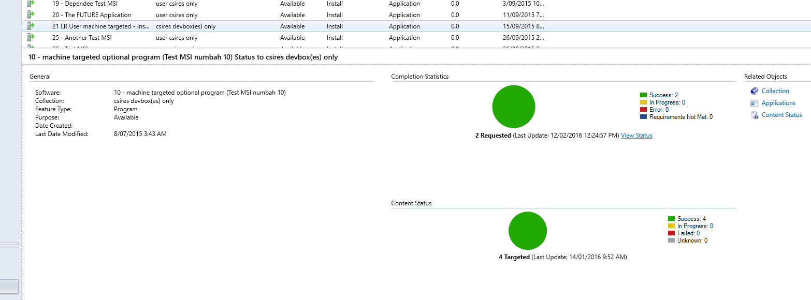
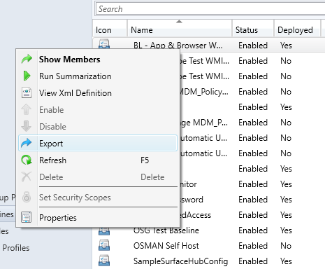

# Monitor the Windows Defender Advanced Threat Protection onboarding

- Windows 10 Insider Preview

[Some information relates to pre-released product which may be substantially modified before it's commercially released. Microsoft makes no warranties, express or implied, with respect to the information provided here.]

You can monitor the onboarding of the Windows Defender ATP service to ensure your endpoints are correctly configured and are sending telemetry reports.

You might need to monitor the onboarding if the package did not configure the registry correctly, or the reporting client did not start or execute correctly.

Monitoring can be done directly on the portal, or by using System Center Configuration Manager (SCCM).

## Monitor with the portal

1.  Go to the [Windows Defender ATP portal](https://seville.windows.com).

2.  Click **Machines view**.

3.  Verify that endpoints are appearing.

> **Note**&nbsp;&nbsp;It can take several days for endpoints to start showing on the **Machines view**. This includes the time it takes for the policies to be distributed to the endpoint, the time it takes before the user logs on, and the time it takes for the endpoint to start reporting.

## Monitor with System Center Configuration Manager 

Monitoring with SCCM consists of two parts: 

1. Confirming the configuration package has been correctly deployed and is running (or has successfully run) on the endpoints in your network.

[[[2. Checking that the endpoints are compliant with the Windows Defender ATP service (this ensures the endpoint can complete the onboarding process and can continue to report data to the service).]]

**To confirm the configuration package has been correctly deployed:**

1. In the SCCM console, click **Monitoring** at the bottom of the navigation pane.

2. Click **Overview** and then **Deployments**.

3. Click on the deployment with the package name. What is the name of the deployment, will it always be the same for every user/installation? - it's chosen by the user

4. Review the status indicators under **Completion Statistics** and **Content Status**.

If there are failed deployments (endpoints with **Error**, **Requirements Not Met**, or **Failed statuses**), you may need to  troubleshoot the endpoints. See the [Troubleshoot Windows Defender Advanced Threat Protection onboarding issues](troubleshoot-onboarding-windows-advanced-threat-protection.md) topic for more information.

Naama: Is this a correct process for idendtifying/resolving issues? YES!

[[**To check that your endpoints are compliant:**

1. Get the *compliance.cab* file from the SCCM configuration package .zip file (*WindowsATPOnboardingPackage.zip*) that you downloaded during the service onboarding wizard. You can also get the package from the [Windows Defender ATP portal](https://seville.windows.com):

  1. Click **Client onboarding** on the **Navigation pane**.
  2. Select **SCCM**, click **Download package** and save the .zip file. Iaan: Need to confirm the UI for this
  3. Extract the *compliance.cab* file from the package.

2. In the SCCM console, click **Assets and Compliance** at the bottom of the navigation pane.

3. Click **Overview** and then **Compliance Settings**. 

4. In the main area of the SCCM console, click **Configuration Baselines** and import the provided cab. Iaan: Need to confirm that 'import' is available/ UI is correct 
 
5. Right-click the imported baseline and deploy to a predefined device collection. Naama: Is this 'export' as in the screenshot, or is that showing something else? 
 
    
  
  Iaan: Need to confirm this is what it looks like

6. In the SCCM console, click **Monitoring** at the bottom of the navigation pane. 

7. Click **Overview** and then **Deployments**. 

8. Click the deployment with the package name Naama: What is the name of the deployment, will it always be the same for every user/installation?

Naama: How does one know if there is an issue?

If there are non-compliant endpoints (endpoints with ?????), you may need to troubleshoot the endpoints. See the [Troubleshoot Windows Defender ATP onboarding issues](troubleshoot-onboarding-windows-advanced-threat-protection.md) topic for more information.

Naama: Is this a correct process for resolving issues?]]]

## Related topics
- [Windows Defender ATP service onboarding](service-onboarding-windows-advanced-threat-protection.md)
- [Configure Windows Defender ATP endpoints](configure-endpoints-windows-advanced-threat-protection.md)
- [Additional Windows Defender ATP configuration settings](additional-configuration-windows-advanced-threat-protection.md)
- [Troubleshoot Windows Defender Advanced Threat Protection onboarding issues](troubleshoot-onboarding-windows-advanced-threat-protection.md)
