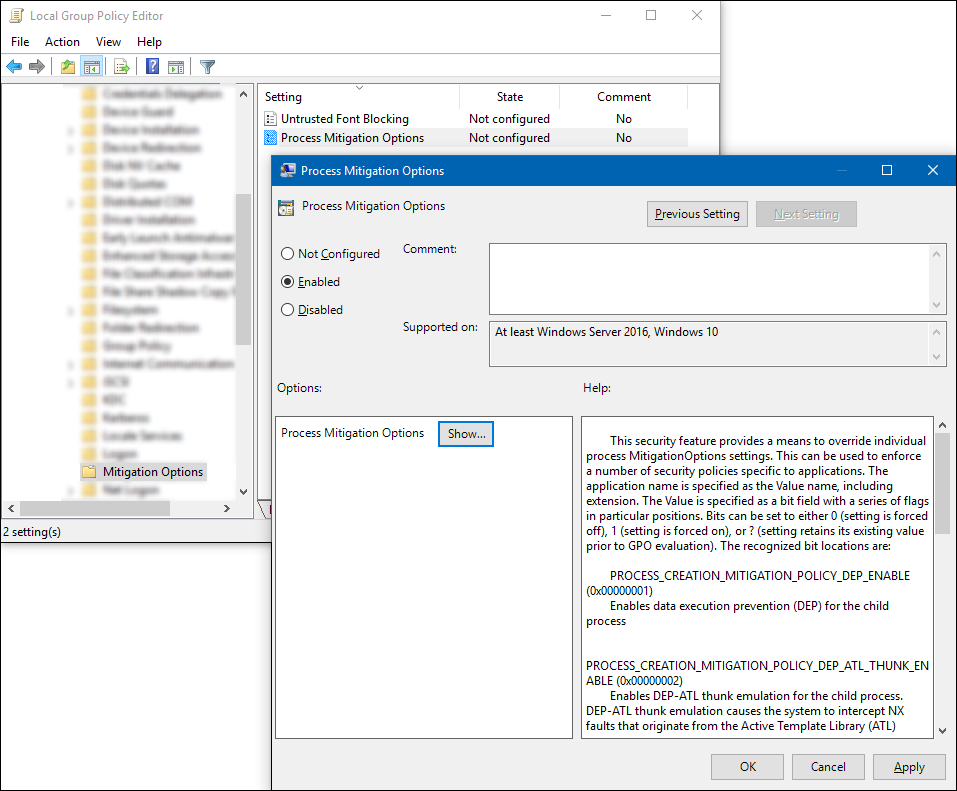

---
title: Override Process Mitigation Options to help enforce app-related security policies (Windows 10)
description: How to use Group Policy to override individual Process Mitigation Options settings and to help enforce specific app-related security policies.
keywords: Process Mitigation Options, Mitigation Options, Group Policy Mitigation Options
ms.prod: w10
ms.mktglfcycl: deploy
ms.pagetype: security
ms.sitesec: library
---

# Override Process Mitigation Options to help enforce app-related security policies

**Applies to:**

-   Windows 10, version 1607
-   Windows Server 2016

Use Group Policy to override individual Process Mitigation Options settings and help to enforce specific app-related security policies.

**To modify Process Mitigation Options**

1. Open your Group Policy editor and go to the **Administrative Templates\System\Mitigation Options\Process Mitigation Options** setting.

    

2. Click **Enabled**, and then in the **Options** area, click **Show** to open the **Show Contents** box, where you’ll be able to add your apps and the appropriate bit flag values, as shown in the [Setting the bit field](#setting-the-bit-field) and [Example](#example) sections of this topic.

    **Important** For each app you want to include, you must include:
    
    - **Value name.** The app file name, including the extension. For example, iexplore.exe.
    - **Value.** A bit field with a series of bit flags in particular positions. Bits can be set to 0 (where the setting is forced off), 1 (where the setting is forced on), or ? (where the setting retains the previous, existing value).
    
        **Note** Setting bit flags in positions not specified here to anything other than ? might cause undefined behavior.

    

## Setting the bit field
Here’s a visual representation of the bit flag locations for the various Process Mitigation Options settings:

Where the bit flags are read from right to left and are defined as:

|Flag |Bit location |Setting |Details |
|-----|--------------|--------|--------|
|A |0 |PROCESS_CREATION_MITIGATION_ POLICY_DEP_ENABLE (0x00000001) |Turns on Data Execution Prevention (DEP) for child processes. |
|B |1 |PROCESS_CREATION_MITIGATION_ POLICY_DEP_ATL_THUNK_ENABLE (0x00000002) |Turns on DEP-ATL thunk emulation for child processes. DEP-ATL thunk emulation lets the system intercept non-executable (NX) faults that originate from the Active Template Library (ATL) thunk layer, and then emulate and handle the instructions so the process can continue to run. |
|C |2 |PROCESS_CREATION_MITIGATION_ POLICY_SEHOP_ENABLE (0x00000004) |Turns on Structured Exception Handler Overwrite Protection (SEHOP) for child processes. SEHOP helps to block exploits that use the Structured Exception Handler (SEH) overwrite technique. |
|D |8 |PROCESS_CREATION_MITIGATION_ POLICY_FORCE_RELOCATE_IMAGES_ALWAYS_ON (0x00000100) |Uses the force Address Space Layout Randomization (ASLR) setting to act as though an image base collision happened at load time, forcibly rebasing images that aren’t dynamic base compatible. Images without the base relocation section won’t be loaded if relocations are required. |
|E |15 |PROCESS_CREATION_MITIGATION_ POLICY_BOTTOM_UP_ASLR_ALWAYS_ON (0x00010000) |Turns on the bottom-up randomization policy, which includes stack randomization options and causes a random location to be used as the lowest user address. |
|F |16 |PROCESS_CREATION_MITIGATION_ POLICY_BOTTOM_UP_ASLR_ALWAYS_OFF (0x00020000) |Turns off the bottom-up randomization policy, which includes stack randomization options and causes a random location to be used as the lowest user address. |
    
## Example
If you want to turn on the **PROCESS_CREATION_MITIGATION_POLICY_DEP_ENABLE** and **PROCESS_CREATION_MITIGATION_POLICY_FORCE_RELOCATE_IMAGES_ALWAYS_ON** settings, turn off the **PROCESS_CREATION_MITIGATION_POLICY_BOTTOM_UP_ASLR_ALWAYS_OFF** setting, and leave everything else as the default values, you’d want to type a value of `???????????????0???????1???????1`.

