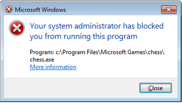

# Plan for AppLocker policy management

**Applies to**
-   Windows 10

This topic for describes the decisions you need to make to establish the processes for managing and maintaining AppLocker policies.

## Policy management

Before you begin the deployment process, consider how the AppLocker rules will be managed. Developing a process for managing AppLocker rules helps assure that AppLocker continues to effectively control how applications are allowed to run in your organization.

### Application and user support policy

Developing a process for managing AppLocker rules helps assure that AppLocker continues to effectively control how applications are allowed to run in your organization. Considerations include:

-   What type of end-user support is provided for blocked applications?
-   How are new rules added to the policy?
-   How are existing rules updated?
-   Are events forwarded for review?

**Help desk support**

If your organization has an established help desk support department in place, consider the following when deploying AppLocker policies:

-   What documentation does your support department require for new policy deployments?
-   What are the critical processes in each business group both in work flow and timing that will be affected by application control policies and how could they affect your support department's workload?
-   Who are the contacts in the support department?
-   How will the support department resolve application control issues between the end user and those who maintain the AppLocker rules?

**End-user support**

Because AppLocker is preventing unapproved apps from running, it is important that your organization carefully plan how to provide end-user support. Considerations include:

-   Do you want to use an intranet site as a first line of support for users who have tried to run a blocked app?
-   How do you want to support exceptions to the policy? Will you allow users to run a script to temporarily allow access to a blocked app?

**Using an intranet site**

AppLocker can be configured to display the default message but with a custom URL. You can use this URL to redirect users to a support site that contains information about why the user received the error and which applications are allowed. If you do not display a custom URL for the message when an app is blocked, the default URL is used.

The following image shows an example of the error message for a blocked app. You can use the **Set a support web link** policy setting to customize the **More information** link.

For steps to display a custom URL for the message, see [Display a custom URL message when users try to run a blocked app](display-a-custom-url-message-when-users-try-to-run-a-blocked-application.md).

**AppLocker event management**

Each time that a process requests permission to run, AppLocker creates an event in the AppLocker event log. The event details which file tried to run, the attributes of that file, the user that initiated the request, and the rule GUID that was used to make the AppLocker execution decision. The 
AppLocker event log is located in the following path: **Applications and Services Logs\\Microsoft\\Windows\\AppLocker**. The AppLocker log includes three logs:

1.  **EXE and DLL**. Contains events for all files affected by the executable and DLL rule collections (.exe, .com, .dll, and .ocx).
2.  **MSI and Script**. Contains events for all files affected by the Windows Installer and script rule collections (.msi, .msp, .ps1, .bat, .cmd, .vbs, and .js).
3.  **Packaged app-Deployment** or **Packaged app-Execution**, contains events for all Universal Windows apps affected by the packaged app and packed app installer rule collection (.appx).

Collecting these events in a central location can help you maintain your AppLocker policy and troubleshoot rule configuration problems. Event collection technologies such as those available in Windows allow administrators to subscribe to specific event channels and have the events from source computers aggregated into a forwarded event log on a Windows Server operating system collector. For more info about setting up an event subscription, see [Configure Computers to Collect and Forward Events](http://go.microsoft.com/fwlink/p/?LinkId=145012).

### Policy maintenance

As new apps are deployed or existing apps are updated by the software publisher, you will need to make revisions to your rule collections to ensure that the policy is current.

You can edit an AppLocker policy by adding, changing, or removing rules. However, you cannot specify a version for the policy by importing additional rules. To ensure version control when modifying an AppLocker policy, use Group Policy management software that allows you to create versions of Group Policy Objects (GPOs). An example of this type of software is the Advanced Group Policy Management feature from the Microsoft Desktop Optimization Pack. For more info about Advanced Group Policy Management, see [Advanced Group Policy Management Overview](http://go.microsoft.com/fwlink/p/?LinkId=145013) (http://go.microsoft.com/fwlink/p/?LinkId=145013).

>**Caution:**  You should not edit an AppLocker rule collection while it is being enforced in Group Policy. Because AppLocker controls what files are allowed to run, making changes to a live policy can create unexpected behavior.
 
**New version of a supported app**

When a new version of an app is deployed in the organization, you need to determine whether to continue to support the previous version of that app. To add the new version, you might only need to create a new rule for each file that is associated with the app. If you are using publisher conditions and the version is not specified, then the existing rule or rules might be sufficient to allow the updated file to run. You must ensure, however, that the updated app has not altered the file names or added files to support new functionality. If so, then you must modify the existing rules or create new rules. To continue to reuse a publisher-based rule without a specific file version, you must also ensure that the file's digital signature is still identical to the previous version—the publisher, product name, and file name (if configured in your rule) must all match for the rule to be correctly applied.

To determine whether a file has been modified during an app update, review the publisher's release details provided with the update package. You can also review the publisher's web page to retrieve this information. Each file can also be inspected to determine the version.

For files that are allowed or denied with file hash conditions, you must retrieve the new file hash. To add support for a new version and maintain support for the older version, you can either create a new file hash rule for the new version or edit the existing rule and add the new file hash to the list of conditions.

For files with path conditions, you should verify that the installation path has not changed from what is stated in the rule. If the path has changed, you need to update the rule before installing the new version of the app

**Recently deployed app**

To support a new app, you must add one or more rules to the existing AppLocker policy.

**App is no longer supported**

If your organization has determined that it will no longer support an application that has AppLocker rules associated with it, the easiest way to prevent users from running the app is to delete these rules.

**App is blocked but should be allowed**

A file could be blocked for three reasons:

-   The most common reason is that no rule exists to allow the app to run.
-   There may be an existing rule that was created for the file that is too restrictive.
-   A deny rule, which cannot be overridden, is explicitly blocking the file.

Before editing the rule collection, first determine what rule is preventing the file from running. You can troubleshoot the problem by using the **Test-AppLockerPolicy** Windows PowerShell cmdlet. For more info about troubleshooting an AppLocker policy, see [Testing and Updating an AppLocker Policy](http://go.microsoft.com/fwlink/p/?LinkId=160269) (http://go.microsoft.com/fwlink/p/?LinkId=160269).

## Next steps

After deciding how your organization will manage your AppLocker policy, record your findings.

-   **End-user support policy.** Document the process that you will use for handling calls from users who have attempted to run a blocked app, and ensure that support personnel have clear escalation steps so that the administrator can update the AppLocker policy, if necessary.
-   **Event processing.** Document whether events will be collected in a central location called a store, how that store will be archived, and whether the events will be processed for analysis.
-   **Policy maintenance.** Detail how rules will be added to the policy and in which GPO the rules are defined.

For information and steps how to document your processes, see [Document your application control management processes](document-your-application-control-management-processes.md).
