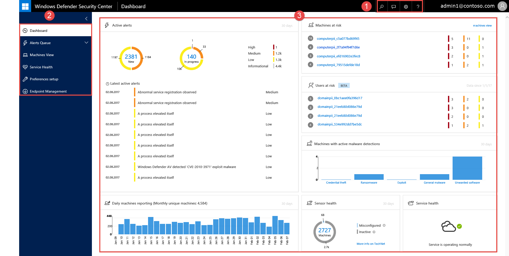

# Windows Defender Advanced Threat Protection portal overview

**Applies to:**

- Windows 10 Enterprise
- Windows 10 Education
- Windows 10 Pro
- Windows 10 Pro Education
- Windows Defender Advanced Threat Protection (Windows Defender ATP)

Enterprise security teams can use the Windows Defender ATP portal to monitor and assist in responding to alerts of potential advanced persistent threat (APT) activity or data breaches.

You can use the [Windows Defender ATP portal](https://securitycenter.windows.com/) to:
- View, sort, and triage alerts from your endpoints
- Search for more information on observed indicators such as files and IP Addresses
- Change Windows Defender ATP settings, including time zone and alert suppression rules

## Windows Defender ATP portal
When you open the portal, you’ll see the main areas of the application:

 

- (1) Search, Feedback, Settings, Help and support
- (2) Navigation pane
- (3) Main portal

> [!NOTE]
> Malware related detections will only appear if your endpoints are using [Windows Defender](https://technet.microsoft.com/library/mt622091(v=vs.85).aspx) as the default real-time protection antimalware product.

You can navigate through the portal using the menu options available in all sections. Refer to the following table for a description of each section.

Area | Description
:---|:---
(1) Search bar, Feedback, Settings, Help and support | **Search** - Provides access to the search bar where you can search for file, IP, machine, URL, and user. Displays the Search box: the drop-down list allows you to select the entity type and then enter the search query text.    **Feedback** -Access the feedback button to provide comments about the portal.   **Settings** - Gives you access to the configuration settings where you can set time zones, alert suppression rules, and license information.   **Help and support** - Gives you access to the Windows Defender ATP guide, Microsoft support, and Premier support.
(2) Navigation pane | Use the navigation pane to move between the **Dashboard**, **Alerts queue**, **Machines view**, **Service health**, **Preferences setup**, and **Enpoint Management**.
**Dashboard**	| Provides clickable tiles that open detailed information on various alerts that have been detected in your organization.
**Alerts queue** | Enables you to view separate queues of new, in progress, and resolved alerts.
**Machines view**| Displays the list of machines that are onboarded to Windows Defender ATP, some information about them, and the corresponding number of alerts.
**Service health** | Provides information on the current status of the Window Defender ATP service. You'll be able to verify that the service status is healthy or if there are current issues.
**Preferences setup**|	Shows the settings you selected during onboarding and lets you update your industry preferences and retention policy period. You can also set email notifications, activate the preview experience, and enable or turn off advanced features.
**Endpoint Management**|	Allows you to download the onboarding configuration package. It provides access to endpoint offboarding.
(3) Main portal| Main area where you will see the different views such as the Dashboard, Alerts queue, and Machines view.

## Windows Defender ATP icons
The following table provides information on the icons used all throughout the portal:

Icon | Description
:---|:---
| Alert – Indication of an activity correlated with advanced attacks.
| Detection – Indication of a malware threat detection.
| Active threat – Threats actively executing at the time of detection.
| Remediated – Threat removed from the machine
| Not remediated – Threat not removed from the machine.
 | Indicates events that triggered an alert in the **Alert process tree**.

## Related topic
[Use the Windows Defender Advanced Threat Protection portal](use-windows-defender-advanced-threat-protection.md)
