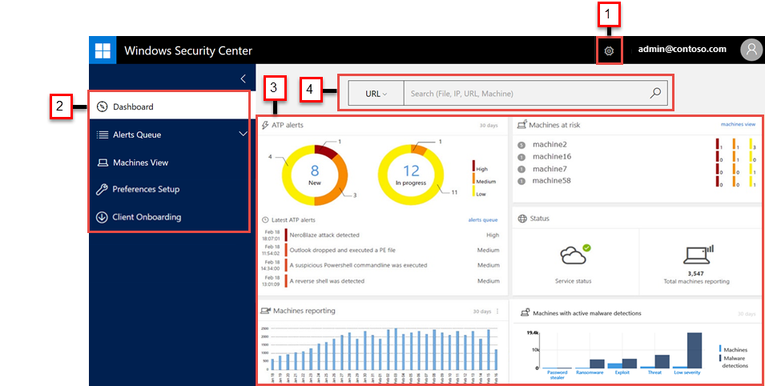

# Windows Defender Advanced Threat Protection portal overview

**Applies to:**

- Windows 10 Enterprise
- Windows 10 Enterprise for Education
- Windows 10 Pro
- Windows 10 Pro Education
- Windows Defender Advanced Threat Protection (Windows Defender ATP)

Enterprise security teams can use the Windows Defender ATP portal to monitor and assist in responding to alerts of potential advanced persistent threat (APT) activity or data breaches.

You can use the [Windows Defender ATP portal](https://securitycenter.windows.com/) to:
- View, sort, and triage alerts from your endpoints
- Search for more information on observed indicators such as files and IP Addresses
- Change Windows Defender ATP settings, including time zone and alert suppression rules

## Windows Defender ATP portal
When you open the portal, you’ll see the main areas of the application:
- (1) Settings
- (2) Navigation pane
- (3) Main portal
- (4) Search bar

 

> [!NOTE]
> Malware related detections will only appear if your endpoints are using [Windows Defender](https://technet.microsoft.com/en-us/library/mt622091(v=vs.85).aspx) as the default real-time protection antimalware product.

You can navigate through the portal using the menu options available in all sections. Refer to the following table for a description of each section.

Area | Description
:---|:---
(1) Settings | Provides access to configuration settings such as time zone, alert suppression rules, and license information.
(2) Navigation pane | Use the navigation pane to move between the **Dashboard**, **Alerts queue**, **Machines view**, **Preferences setup**, and **Enpoint Management**.
**Dashboard**	| Provides clickable tiles that open detailed information on various alerts that have been detected in your organization.
**Alerts queue** | Enables you to view separate queues of new, in progress, and resolved alerts.
**Machines view**| Displays the list of machines that are onboarded to Windows Defender ATP, some information about them, and the corresponding number of alerts.
**Preferences setup**|	Shows the settings you selected and lets you update your industry preferences and retention policy period.
**Enpoint Management**|	Allows you to download the onboarding configuration package.
(3) Main portal| Main area where you will see the different views such as the Dashboard, Alerts queue, and Machines view.
(4) Search | Search for machines, files, external IP Addresses, or domains across endpoints. The drop-down combo box allows you to select the entity type.

## Windows Defender ATP icons
The following table provides information on the icons used all throughout the portal:

Icon | Description
:---|:---
| Alert – Indication of an activity correlated with advanced attacks.
| Detection – Indication of a malware threat detection.
| Active threat – Threats actively executing at the time of detection.
| Remediated – Threat removed from the machine
| Not remediated – Threat not removed from the machine.

### Related topic
[Use the Windows Defender Advanced Threat Protection portal](use-windows-defender-advanced-threat-protection.md)
