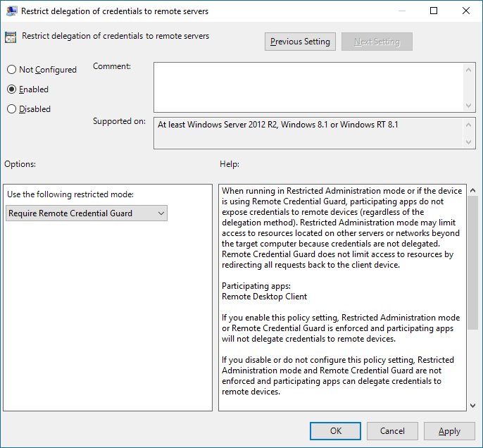

#  Protect Remote Desktop credentials with Remote Credential Guard

**Applies to**
-   Windows 10
-   Windows Server 2016 Technical Preview

Introduced in Windows 10, version 1607, Remote Credential Guard helps you protect your credentials over a Remote Desktop connection by redirecting the Kerberos requests back to the device that's requesting the connection. If the target device is compromised, your credentials are not exposed because both credential and credential derivatives are never sent to the target device.

## How it works

Do we want to include a technical overview like we did with [Credential Guard](https://technet.microsoft.com/en-us/itpro/windows/keep-secure/credential-guard#how-it-works)?

## Hardware and software requirements

The devices must meet the following requirements in order to use Remote Credential Guard:

- They must use Kerberos authentication.
- They must be running at least Windows 10, version 1607 or Windows Server 2016 Technical Preview.
- You are using the Remote Desktop classic Windows app. The Remote Desktop Universal Windows Platform app won't work.

## Turn on Remote Credential Guard

You must turn on Remote Credential Guard on the target device by using the registry.

1. Open Registry Editor.
2. Enable Remote Credential Guard:
    - Go to HKEY_LOCAL_MACHINE\System\CurrentControlSet\Control\Lsa.
    - Add a new DWORD value named **LsaDisableRestrictedAdmin**. Set the value of this registry setting to 0 to turn on Remote Credential Guard.
3. Close Registry Editor.

## Using Remote Credential Guard

You can use Remote Credential Guard on the client device by setting a Group Policy or by using a parameter with Remote Desktop Connection. 

### Turn on Remote Credential Guard by using Group Policy

1. From the Group Policy Management Console, go to **Computer Configuration** -> **Administrative Templates** -> **System** -> **Credentials Delegation**.
2. Double-click **Restrict delegation of credentials to remote servers**.
3. In the Use the following restricted mode box:
    - If you want to require Remote Credential Guard, choose **Require Credential Guard**.
    - If you want to allow Remote Credential Guard choose **Prefer Remote Credential Guard**.
4. Click **OK**.

    

5. Close the Group Policy Management Console.

### Use Remote Credential Guard with a parameter to Remote Desktop Connection 

If you don't use Group Policy in your organization, you can add the remoteGuard parameter when you start Remote Desktop Connection to turn on Remote Credential Guard for that connection.

<pre>
mstsc.exe /remoteGuard /v:<em>target device</em>
</pre>

## Considerations when using Remote Credential Guard

- Remote Credential Guard does not support Kerberos Armoring (FAST), especially in cases where the resources require that a user must come from a specified device. If an authentication policies is deployed to limit access to a resource, it will not provide access to such file shares and other resources. The Remote Desktop connection itself should succeed though.

- Remote Credential Guard must be turned off if you need to connect to a device that is joined to Azure Active Directory.

- If a user is connecting to the remote server and that user is an adminstrator on that remove server, the user can get single-sign-on access, but they can also install software or copy tools that can listen on specific ports.

- Remote Desktop Credential Guard only works with the RDP protocol.

- No credentials or credentials are sent to the target device, but the target device still acquires the Kerberos Service Tickets on its own.