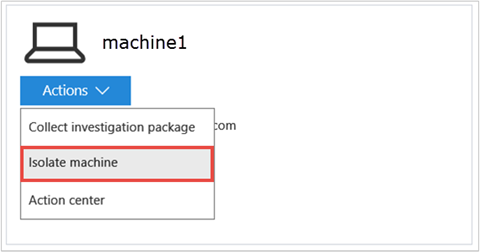
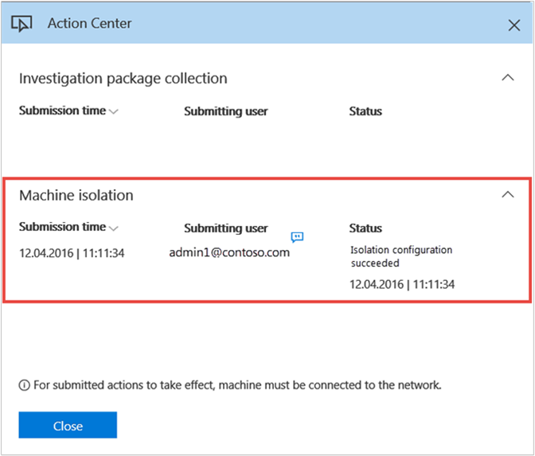
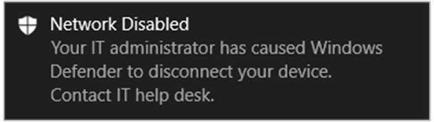
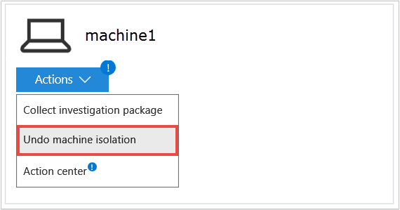
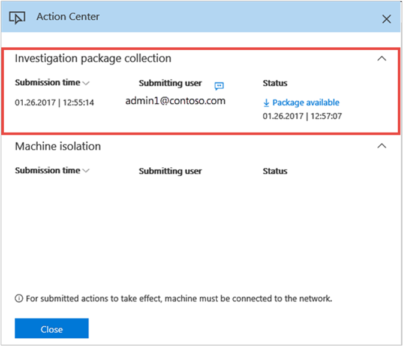
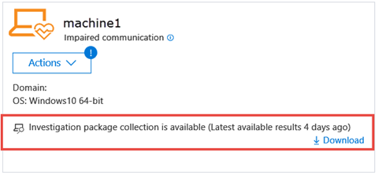
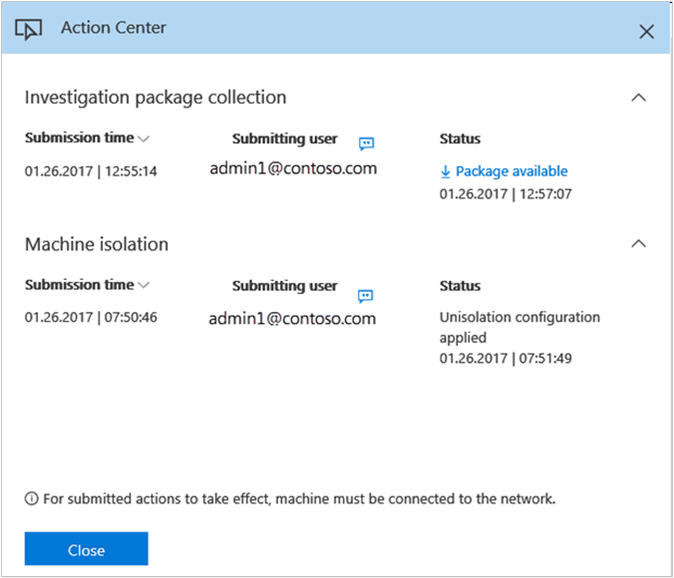

# Take response actions on a machine

**Applies to:**

- Windows 10 Enterprise
- Windows 10 Education
- Windows 10 Pro
- Windows 10 Pro Education
- Windows Defender Advanced Threat Protection (Windows Defender ATP)

[Some information relates to pre-released product, which may be substantially modified before it's commercially released. Microsoft makes no warranties, express or implied, with respect to the information provided here.]

Quickly respond to detected attacks by isolating machines or collecting an investigation package. After taking action on machines, you can check activity details on the Action center.

>[!NOTE]
> These response actions are only available for machines on Windows 10, version  1703.

## Isolate machines from the network
Depending on the severity of the attack and the sensitivity of the machine, you might want to isolate the machine from the network. This action can help prevent the attacker from controlling the compromised machine and performing further activities such as data exfiltration and lateral movement.

This machine isolation feature disconnects the compromised machine from the network while retaining connectivity to the Windows Defender ATP service, which continues to monitor the machine.

>[!NOTE]
>You’ll be able to reconnect the machine back to the network at any time.

1.	Select the machine that you want to isolate. You can select or search for a machine from any of the following views:

  -	**Dashboard** - Select the machine name from the Top machines with active alerts section.
  -	**Alerts queue** - Select the machine name beside the machine icon from the alerts queue.
  -	**Machines view** - Select the machine name from the list of machines.
  -	**Search box** - Select Machine from the drop-down menu and enter the machine name.

2.	Open the **Actions** menu and select **Isolate machine**.

  

3. Type a comment (optional) and select **Yes** to take action on the machine.
  >[!NOTE]
  >The machine will remain connected to the Windows Defender ATP service even if it is isolated from the network.

  The Action center shows the submission information:
  

  -	**Submission time** - Shows when the isolation action was submitted.
  -	**Submitting user** - Shows who submitted the action on the machine. You can view the comments provided by the user by selecting the information icon.
  -	**Status** - Indicates any pending actions or the results of completed actions.

When the isolation configuration is applied, there will be a new event in the machine timeline.

**Notification on machine user**: 
When a machine is being isolated, the following notification is displayed to inform the user that the machine is being isolated from the network:

## Undo machine isolation
Depending on the severity of the attack and the state of the machine you can choose to release the machine isolation after you have verified that the compromised machine has been remediated.

1.	Select a machine that was previously isolated.

2.	Open the **Actions** menu and select **Undo machine isolation**.

  

3.	Type a comment (optional) and select **Yes** to take action on the file. The machine will be reconnected to the network.

## Collect investigation package from machines
As part of the investigation or response process, you can collect an investigation package from a machine. By collecting the investigation package, you can identify the current state of the machine and further understand the tools and techniques used by the attacker.

You can download the package (Zip file) and investigate the events that occurred on a machine.

The package contains the following folders:

Folder | Description
:---|:---
Autoruns | Contains a set of files that each represent the content of the registry of a known auto start entry point (ASEP) to help identify attacker’s persistency on the machine.    NOTE: If the registry key is not found, the file will contain the following message: “ERROR: The system was unable to find the specified registry key or value.”
Installed programs | This .CSV file contains the list of installed programs that can help identify what is currently installed on the machine. For more information, see [Win32_Product class](https://go.microsoft.com/fwlink/?linkid=841509).
Network connections | This folder contains a set of data points related to the connectivity information which can help in identifying connectivity to suspicious URLs, attacker’s command and control (C&C) infrastructure, any lateral movement, or remote connections.   -	ActiveNetworkConnections.txt – Displays protocol statistics and current TCP/IP network connections. Provides the ability to look for suspicious connectivity made by a process.    - Arp.txt – Displays the current address resolution protocol (ARP) cache tables for all interfaces.    ARP cache can reveal additional hosts on a network that have been compromised or suspicious systems on the network that night have been used to run an internal attack.   -	Dnscache.txt - Displays the contents of the DNS client resolver cache, which includes both entries preloaded from the local Hosts file and any recently obtained resource records for name queries resolved by the computer. This can help in identifying suspicious connections.    - Ipconfig.txt – Displays the full TCP/IP configuration for all adapters. Adapters can represent physical interfaces, such as installed network adapters, or logical interfaces, such as dial-up connections.
Prefetch files | Windows Prefetch files are designed to speed up the application startup process. It can be used to track all the files recently used in the system and find traces for applications that might have been deleted but can still be found in the prefetch file list.    - Prefetch folder –  Contains a copy of the prefetch files from `%SystemRoot%\Prefetch`. NOTE: It is suggested to download a prefetch file viewer to view the prefetch files.    - PrefetchFilesList.txt – Contains the list of all the copied files which can be used to track if there were any copy failures to the prefetch folder.
Processes | Contains a .CSV file listing the running processes which provides the ability to identify current processes running on the machine. This can be useful when identifying a suspicious process and its state.
Scheduled tasks | Contains a .CSV file listing the scheduled tasks which can be used to identify routines performed automatically on a chosen machine to look for suspicious code which was set to run automatically.
Security event log | Contains the security event log which contains records of login or logout activity, or other security-related events specified by the system's audit policy.   NOTE: Open the event log file using Event viewer.
Services | Contains the services.txt file which lists services and their states.
Windows Server Message Block (SMB) sessions | Lists shared access to files, printers, and serial ports and miscellaneous communications between nodes on a network. This can help identify data exfiltration or lateral movement.    Contains files for SMBInboundSessions and SMBOutboundSession.    NOTE: If the file contains the following message: “ERROR: The system was unable to find the specified registry key or value.”, it means that there were no SMB sessions of this type (inbound or outbound).
Temp Directories | Contains a set of text files that lists the files located in %Temp% for every user in the system.    This can help to track suspicious files that an attacker may have dropped on the system.    NOTE: If the file contains the following message: “The system cannot find the path specified”, it means that there is no temp directory for this user, and might be because the user didn’t log in to the system.
Users and Groups | Provides a list of files that each represent a group and its members.
CollectionSummaryReport.xls | This file is a summary of the investigation package collection, it contains the list of data points, the command used to extract the data, the execution status, and the error code in case of failure. You can use this report to track if the package includes all the expected data and identify if there were any errors.

1.	Select the machine that you want to investigate. You can select or search for a machine from any of the following views:

  -	**Dashboard** - Select the machine name from the Top machines with active alerts section.
  -	**Alerts queue** - Select the machine name beside the machine icon from the alerts queue.
  -	**Machines view** - Select the heading of the machine name from the machines view.
  -	**Search box** - Select Machine from the drop-down menu and enter the machine name.

2.	Open the **Actions** menu and select **Collect investigation package**.

    The Action center shows the submission information:
    

    - **Submission time** - Shows when the action was submitted.
    -	**Submitting user** - Shows who submitted the action on the file. You can view the comments provided by the user by selecting the information icon.
    -	**Status** - Indicates if the package was successfully collected from the network. When the collection is complete, you can download the package.

3.	Select **Package available** to download the package.  
    When the package is available a new event will be added to the machine timeline. 
    You can download the package from the machine page, or the Action center.

    

    You can also search for historical packages in the machine timeline.

## Check activity details in Action center
The **Action center** provides information on actions that were taken on a machine or file. You’ll be able to view if a machine was isolated and if an investigation package is available from a machine. All related details are also shown, for example, submission time, submitting user, and if the action succeeded or failed.

## Related topics
- [Take response actions on a file](respond-file-alerts-windows-defender-advanced-threat-protection.md)
